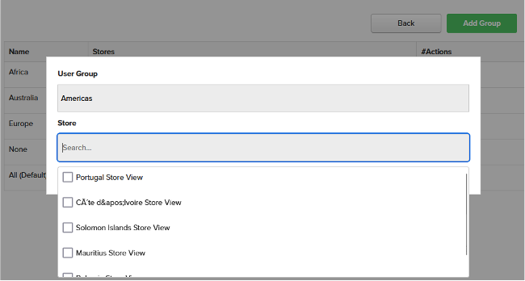
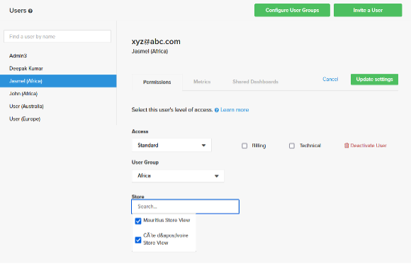

# Gestion avancée des utilisateurs

La fonctionnalité [!DNL Advanced User Management] offre des contrôles de visibilité des données améliorés et permet le filtrage logique des données en fonction des groupes d’utilisateurs (régions organisationnelles). Il vous permet d’adapter la visibilité des données en fonction des groupes d’utilisateurs et d’éliminer la nécessité de créer une réplique des tableaux de bord existants pour répondre aux exigences de création de rapports spécifiques à une région chaque fois que l’entreprise se développe vers une nouvelle région.

[!DNL Advanced User Management] simplifie le partage des tableaux de bord et la visibilité des données tout en garantissant la sécurité et l’évolutivité des grandes entreprises. La possibilité de configurer des groupes d’utilisateurs, des rôles et des autorisations fait de Commerce Intelligence un outil puissant pour les exigences au niveau de l’entreprise.

Lorsque [!DNL Advanced User Management] est activé, seuls les utilisateurs administrateurs ont accès aux éléments suivants :

- Mesures
- Visual Report Builder
- Rapports SQL
- Résumé des e-mails
- Exportations brutes

## Matrice des fonctionnalités

[!DNL Advanced User Management] a un impact sur plusieurs fonctionnalités de Commerce Intelligence. Le tableau suivant décrit les fonctionnalités, les autorisations et leur disponibilité pour divers rôles en fonction de la fonctionnalité activée ou désactivée.

<table><thead>
  <tr>
    <th colspan="3" rowspan="2">Fonctionnalités de Commerce Intelligence</th>
    <th colspan="6">Fonctionnalités de gestion avancée des utilisateurs (AUM)</th>
  </tr>
  <tr>
    <th colspan="3">Handicapé</th>
    <th colspan="3">Activé</th>
  </tr></thead>
<tbody>
  <tr>
    <td>Groupe de fonctionnalités</td>
    <td>Fonctionnalité</td>
    <td>Autorisations</td>
    <td>Admin</td>
    <td>Standard</td>
    <td>Lecture seule</td>
    <td>Admin</td>
    <td>Standard</td>
    <td>Lecture seule</td>
  </tr>
  <tr>
    <td rowspan="7">Gérer les utilisateurs (accessible à tous les administrateurs et ayant un impact sur tous les rôles)</td>
    <td>Configurer les groupes d’utilisateurs</td>
    <td></td>
    <td></td>
    <td></td>
    <td></td>
    <td>✓</td>
    <td></td>
    <td></td>
  </tr>
  <tr>
    <td>Inviter un utilisateur</td>
    <td></td>
    <td>✓</td>
    <td></td>
    <td></td>
    <td>✓</td>
    <td></td>
    <td></td>
  </tr>
  <tr>
    <td>Onglet Autorisations - Mappage des rôles</td>
    <td></td>
    <td>✓</td>
    <td></td>
    <td></td>
    <td>✓</td>
    <td></td>
    <td></td>
  </tr>
  <tr>
    <td>Onglet Autorisations - Mappage de groupes d’utilisateurs (AUM)</td>
    <td></td>
    <td></td>
    <td></td>
    <td></td>
    <td>✓</td>
    <td></td>
    <td></td>
  </tr>
  <tr>
    <td>Onglet Autorisations - Stocke le mappage du sous-ensemble (AUM)</td>
    <td></td>
    <td></td>
    <td></td>
    <td></td>
    <td>✓</td>
    <td></td>
    <td></td>
  </tr>
  <tr>
    <td>Onglet Mesures</td>
    <td></td>
    <td>✓</td>
    <td></td>
    <td></td>
    <td>✓</td>
    <td></td>
    <td></td>
  </tr>
  <tr>
    <td>Onglet Tableaux de bord partagés</td>
    <td></td>
    <td>✓</td>
    <td></td>
    <td></td>
    <td>✓</td>
    <td></td>
    <td></td>
  </tr>
  <tr>
    <td rowspan="2">Report Builder</td>
    <td>Visual Report Builder</td>
    <td></td>
    <td>✓</td>
    <td>✓</td>
    <td></td>
    <td>✓</td>
    <td></td>
    <td></td>
  </tr>
  <tr>
    <td>SQL REPORT BUILDER</td>
    <td></td>
    <td>✓</td>
    <td></td>
    <td></td>
    <td>✓</td>
    <td></td>
    <td></td>
  </tr>
  <tr>
    <td rowspan="2">Résumé des e-mails</td>
    <td>Créer des résumés d’e-mails sans partitionnement des données</td>
    <td></td>
    <td>✓</td>
    <td>✓</td>
    <td></td>
    <td>✓</td>
    <td></td>
    <td></td>
  </tr>
  <tr>
    <td>Créer des résumés d’e-mails avec partitionnement des données (AUM)</td>
    <td></td>
    <td></td>
    <td></td>
    <td></td>
    <td>✓</td>
    <td></td>
    <td></td>
  </tr>
  <tr>
    <td rowspan="4">Tableaux de bord  - Partager</td>
    <td>Partager le tableau de bord avec des utilisateurs sur plusieurs rôles</td>
    <td></td>
    <td>✓</td>
    <td>✓</td>
    <td></td>
    <td></td>
    <td></td>
    <td></td>
  </tr>
  <tr>
    <td>Partager le tableau de bord avec les groupes d’utilisateurs et les administrateurs (AUM)</td>
    <td></td>
    <td></td>
    <td></td>
    <td></td>
    <td>✓</td>
    <td></td>
    <td></td>
  </tr>
  <tr>
    <td rowspan="2">Partager le tableau de bord - Autorisations</td>
    <td>Modifier</td>
    <td>✓</td>
    <td>✓</td>
    <td></td>
    <td></td>
    <td></td>
    <td></td>
  </tr>
  <tr>
    <td>Vue</td>
    <td>✓</td>
    <td>✓</td>
    <td></td>
    <td>✓</td>
    <td></td>
    <td></td>
  </tr>
  <tr>
    <td rowspan="18">Tableaux de bord - Affichage (ouvrez le tableau de bord partagé avec les autorisations données)</td>
    <td rowspan="2">Partager un tableau de bord partagé</td>
    <td>Modifier</td>
    <td>✓</td>
    <td>✓</td>
    <td></td>
    <td></td>
    <td></td>
    <td></td>
  </tr>
  <tr>
    <td>Vue</td>
    <td></td>
    <td></td>
    <td></td>
    <td></td>
    <td></td>
    <td></td>
  </tr>
  <tr>
    <td rowspan="2">Filtre de date (sans indicateur de fonctionnalité MODIFIER LES OPTIONS D’HEURE)</td>
    <td>Modifier</td>
    <td>✓</td>
    <td>✓</td>
    <td>✓</td>
    <td></td>
    <td></td>
    <td></td>
  </tr>
  <tr>
    <td>Vue</td>
    <td></td>
    <td></td>
    <td></td>
    <td>✓</td>
    <td></td>
    <td></td>
  </tr>
  <tr>
    <td rowspan="2">Filtre de date (avec l’indicateur de fonctionnalité MODIFIER LES OPTIONS D’HEURE)</td>
    <td>Modifier</td>
    <td>✓</td>
    <td>✓</td>
    <td>✓</td>
    <td></td>
    <td></td>
    <td></td>
  </tr>
  <tr>
    <td>Vue</td>
    <td>✓</td>
    <td>✓</td>
    <td></td>
    <td>✓</td>
    <td>✓</td>
    <td>✓</td>
  </tr>
  <tr>
    <td rowspan="2">Filtre de magasin (sans indicateur de fonctionnalité MODIFIER LES OPTIONS DE TEMPS)</td>
    <td>Modifier</td>
    <td>✓</td>
    <td>✓</td>
    <td>✓</td>
    <td></td>
    <td></td>
    <td></td>
  </tr>
  <tr>
    <td>Vue</td>
    <td>✓</td>
    <td>✓</td>
    <td></td>
    <td>✓</td>
    <td>✓</td>
    <td></td>
  </tr>
  <tr>
    <td rowspan="2">Filtre de magasin (avec l’indicateur de fonctionnalité MODIFIER LES OPTIONS DE TEMPS)</td>
    <td>Modifier</td>
    <td>✓</td>
    <td>✓</td>
    <td>✓</td>
    <td></td>
    <td></td>
    <td></td>
  </tr>
  <tr>
    <td>Vue</td>
    <td>✓</td>
    <td>✓</td>
    <td></td>
    <td>✓</td>
    <td>✓</td>
    <td></td>
  </tr>
  <tr>
    <td rowspan="2">Données du tableau de bord : filtrez les données des rapports en fonction du mappage de groupe d’utilisateurs (AUM).</td>
    <td>Modifier</td>
    <td></td>
    <td></td>
    <td></td>
    <td></td>
    <td></td>
    <td></td>
  </tr>
  <tr>
    <td>Vue</td>
    <td></td>
    <td></td>
    <td></td>
    <td>✓</td>
    <td>✓</td>
    <td>✓</td>
  </tr>
  <tr>
    <td rowspan="2">Rapport - Modifier</td>
    <td>Modifier</td>
    <td>✓</td>
    <td>✓</td>
    <td></td>
    <td>✓</td>
    <td></td>
    <td></td>
  </tr>
  <tr>
    <td>Vue</td>
    <td></td>
    <td></td>
    <td></td>
    <td>✓</td>
    <td></td>
    <td></td>
  </tr>
  <tr>
    <td rowspan="2">Exportation de rapports (CSV, XLSX)</td>
    <td>Modifier</td>
    <td>✓</td>
    <td>✓</td>
    <td>✓</td>
    <td>✓</td>
    <td></td>
    <td></td>
  </tr>
  <tr>
    <td>Vue</td>
    <td>✓</td>
    <td>✓</td>
    <td>✓</td>
    <td>✓</td>
    <td>✓</td>
    <td>✓</td>
  </tr>
  <tr>
    <td rowspan="2">Rapport - Exportation brute</td>
    <td>Modifier</td>
    <td>✓</td>
    <td>✓</td>
    <td></td>
    <td>✓</td>
    <td></td>
    <td></td>
  </tr>
  <tr>
    <td>Vue</td>
    <td>✓</td>
    <td>✓</td>
    <td></td>
    <td></td>
    <td></td>
    <td></td>
  </tr>
</tbody></table>

## Contrôle d&#39;administration

Les utilisateurs administrateurs peuvent gérer les tâches suivantes :

- Configuration de groupes d’utilisateurs
- Attribuer un rôle et un groupe d’utilisateurs à des utilisateurs individuels
- Partagez des tableaux de bord avec des groupes d’utilisateurs ou d’autres administrateurs avec des autorisations au niveau des tableaux de bord
- Planification de résumés d’e-mails avec filtrage des données au niveau du groupe d’utilisateurs

### Configuration des groupes d’utilisateurs

Les groupes d’utilisateurs sont des regroupements logiques de régions mappées à des filtres de magasin spécifiques (par exemple, des groupes d’utilisateurs créés en fonction du nom de continents, de pays et de régions).

Pour configurer des groupes d’utilisateurs :

1. Accédez à [!UICONTROL **Gérer les utilisateurs**] > [!UICONTROL **User Groups]** pour afficher les groupes d’utilisateurs existants.

   

1. [!UICONTROL **Ajouter un groupe**] permet aux administrateurs de créer un groupe d’utilisateurs :

   - Saisissez le nom du groupe (par exemple, « Amériques »).

   - Sélectionnez les magasins ou les filtres appropriés pour le groupe d’utilisateurs.

   - Enregistrez la configuration.

     

1. Les administrateurs peuvent :

   - Modifiez les groupes d’utilisateurs pour mettre à jour les mappages de magasin ou renommez-les pour plus de clarté.

   - Supprimez les groupes d’utilisateurs lorsqu’ils ne sont plus nécessaires. Les administrateurs doivent réaffecter manuellement les utilisateurs existants mappés au groupe d’utilisateurs supprimé.

1. Groupes par défaut :

   - [!UICONTROL **None]** : groupe de secours pour les utilisateurs qui ne sont pas encore mappés à un groupe spécifique. Ces utilisateurs ne verront aucune donnée tant qu’ils ne seront pas affectés à un groupe approprié.

   - [!UICONTROL **All**] : permet un accès illimité à toutes les données (généralement réservées aux utilisateurs administrateurs).

### Affectation d’utilisateurs à des groupes d’utilisateurs

Les administrateurs peuvent mapper les nouveaux utilisateurs aux groupes pertinents pendant leur intégration à l’aide de [!UICONTROL **Inviter un utilisateur**]. Les utilisateurs existants peuvent être remis en correspondance avec des groupes d’utilisateurs en fonction des besoins de l’entreprise.

>[!TIP]
>
>- Jusqu’à ce qu’un utilisateur [!UICONTROL **Standard**] ou [!UICONTROL **Lecture seule**] soit affecté à un groupe d’utilisateurs approprié, vous pouvez en toute sécurité l’affecter à [!UICONTROL **Aucun**] pour vous assurer qu’il n’accède pas par erreur à des données de tableau de bord.
>
>- Lors de l’attribution d’autorisations à un utilisateur, en fonction des besoins de l’entreprise, il est possible de restreindre des magasins spécifiques au sein d’un groupe pour un contrôle amélioré.

Les utilisateurs administrateurs sont toujours mappés par défaut aux magasins [!UICONTROL **All**], ce qui leur permet d’afficher les tableaux de bord avec la vue complète du magasin.

### Partage de tableaux de bord

[!DNL Advanced User Management] offre des options puissantes pour partager des tableaux de bord tout en préservant la sécurité des données.

- Les administrateurs peuvent partager des tableaux de bord avec les groupes d’utilisateurs ainsi qu’avec d’autres utilisateurs administrateurs afin de collaborer. Cela permet une gestion centralisée des tableaux de bord et simplifie la gestion pour les grandes organisations.

  

- Les autorisations de partage de tableaux de bord incluent :

   - [!UICONTROL **Modifier**] : disponible uniquement pour les utilisateurs administrateurs qui souhaitent modifier des tableaux de bord, filtrer des données, modifier des rapports ou exporter des données.

   - [!UICONTROL **Vue**] : disponible pour les utilisateurs et utilisatrices de tous les rôles avec (certaines restrictions).

   - [!UICONTROL **Aucune**] : révoque l’accès au tableau de bord pour certains groupes d’utilisateurs ou administrateurs.

  >[!NOTE]
  >
  >Reportez-vous à la [matrice des fonctionnalités](#feature-matrix) pour en savoir plus sur l’utilisation des différentes fonctionnalités de Commerce Intelligence en fonction des autorisations des règles et des tableaux de bord afin de comprendre les différentes combinaisons.

#### Vues du tableau de bord

Les utilisateurs administrateurs peuvent afficher les données du tableau de bord avec un accès à tous les magasins.

Cependant, les utilisateurs peuvent afficher les données du tableau de bord filtrées en fonction des magasins qui leur sont mappés lors de la configuration des utilisateurs.

>[!TIP]
>
>Les administrateurs peuvent activer les filtres de date pour les tableaux de bord partagés, ce qui permet aux utilisateurs d’afficher des données sur différentes périodes au lieu de la période par défaut définie lors de la création du rapport. Cette fonctionnalité peut être activée ou désactivée en fonction des besoins de l’entreprise.

### Planifier des résumés d’e-mails

[!DNL Advanced User Management] étend les fonctionnalités de filtrage des données aux résumés d’e-mails. Selon l’audience, les utilisateurs administrateurs peuvent spécifier les groupes d’utilisateurs pour lesquels les rapports sélectionnés doivent être filtrés.

