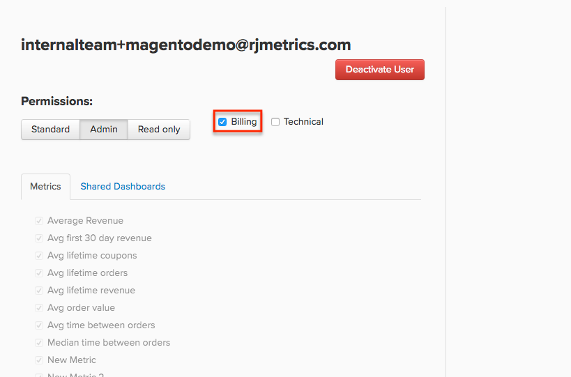

# Gestion des autorisations utilisateur

[!DNL Adobe Commerce Intelligence] est conçu pour être une source unique de vérité pour l’ensemble de votre organisation. Chaque utilisateur possède son propre jeu de tableaux de bord qu’il peut [partager avec d’autres utilisateurs](../../data-user/dashboards/share-dashboard-with-users.md).

## Niveaux d’autorisation des utilisateurs

En [!DNL Commerce Intelligence], trois niveaux d’autorisation généraux s’appliquent aux utilisateurs et utilisatrices, et sont sélectionnés lors de la création d’un compte :

* `Admin`
* `Standard`
* `Read-Only`

Ces autorisations permettent aux utilisateurs d’effectuer certaines actions ou d’accéder à des parties spécifiques de [!DNL Commerce Intelligence]. Voici un tableau de ce que chaque niveau d’autorisation peut faire dans [!DNL Commerce Intelligence] :

|   | `Admin` | `Standard` | `Read Only` |
| -----|-----|-----|----|
| **Créer/gérer des utilisateurs** | ✔ |   |   |
| **Créer des résumés d’e-mail** | ✔ | ✔ |   |
| **Créer/modifier/partager des tableaux de bord** | ✔ | ✔ |   |
| **Afficher les tableaux de bord** | ✔ | ✔ | ✔ |
| **Créer/modifier/supprimer des rapports visuels** | ✔ | ✔* |   |
| **Créer/modifier/supprimer des rapports SQL** | ✔ |  |   |
| **Cloner des tableaux de bord** | ✔ |   |   |
| **Ajouter/gérer des intégrations** | ✔ |   |   |
| **Accéder au gestionnaire Data Warehouse** | ✔ |   |   |
| **Synchroniser/désynchroniser les tables et les colonnes** | ✔ |   |   |
| **Créer/modifier des mesures** | ✔ |   |   |
| **Créer/modifier des jeux de filtres** | ✔ |   |   |
| **Créer/modifier des colonnes calculées** | ✔ |   |   |
| **Créer une liste de rapports dépendants** | ✔ |   |   |
| **Accéder au résumé du système** | ✔ |   |   |
| **Accéder aux paramètres de fuseau horaire** | ✔ |   |   |
| **Accéder à la facturation** | ✔ | ✔** |   |
| **Contactez l’assistance** | ✔ | ✔ | ✔ |

{style="table-layout:auto"}

>[!NOTE]
>
>_Vous pouvez limiter l’accès d’un utilisateur **[!UICONTROL Standard]**&#x200B;[ à des mesures spécifiques](../../administrator/user-management/restrict-metric-access.md)._
>
>**[!UICONTROL Standard] _les utilisateurs peuvent accéder à la facturation avec un paramètre d’autorisation supplémentaire._
>
>Les utilisateurs **[!UICONTROL Read-Only]** peuvent uniquement _afficher_ les tableaux de bord qui ont été partagés avec eux ; ils ne peuvent rien créer ni modifier dans [!DNL Commerce Intelligence], pas plus qu’ils ne peuvent rechercher et ajouter de nouveaux tableaux de bord à leur compte. Adobe vous recommande de partager un ensemble spécifique de tableaux de bord avec **[!UICONTROL Read-Only]** utilisateurs que vous ou un autre membre de votre équipe conservez. Ne clonez pas un ensemble de tableaux de bord pour eux.

## Autorisations supplémentaires : Facturation et technique {#billingtech}

Outre les niveaux d’autorisation généraux, il existe également deux autres désignations d’utilisateur : `Billing` et `Technical`. Ces désignations doivent être utilisées avec les niveaux d’autorisation généraux.

### Facturation

`Billing` utilisateurs ont accès à la page de facturation et peuvent modifier les informations de paiement. En outre, Adobe peut également contacter cette personne pour toute question sur la facturation.

`Admin` utilisateurs et utilisatrices ont accès par défaut à l’onglet `Billing` , mais `Standard` utilisateurs et utilisatrices peuvent également y accéder si la case à cocher `Billing` est sélectionnée sur leur profil.

<!--{: width="550" height="363"}-->

### Technique

`Technical` utilisateurs ne disposent d’aucune autorisation spécifique qui leur soit spécifique. Ce paramètre marque simplement un contact technique au sein de votre organisation. Adobe peut contacter ces utilisateurs pour toute question technique.

`Admin` utilisateurs peuvent ajouter de nouveaux utilisateurs à leur compte en cliquant sur **[!UICONTROL Account Settings]** > **[!UICONTROL Create Users]** et en suivant les invites. Une fois l’utilisateur créé dans [!DNL Commerce Intelligence], la personne chanceuse que vous invitez recevra par e-mail des instructions sur la façon de terminer le processus de configuration du compte.

À tout moment, `Admins` pouvez afficher tous les utilisateurs de leur compte en cliquant sur **[!UICONTROL Account Settings]** > **[!UICONTROL Manage Users]**. Cette page affiche les autorisations de l’utilisateur et les mesures et tableaux de bord auxquels il peut accéder.
