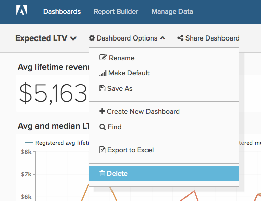

# Nettoyer votre compte [!DNL Adobe Commerce Intelligence]

Que vous travailliez avec [!DNL Commerce Intelligence] depuis six mois ou six ans, il est essentiel que vous teniez un compte bien ordonné pour que votre entreprise puisse tirer le meilleur parti de la plateforme. Au fil du temps, il est naturel qu’il y ait des utilisateurs, des tableaux de bord, des rapports, des mesures et des colonnes dont on n’a plus besoin. Peut-être avez-vous créé un rapport à usage unique et l’avez-vous oublié, ou un utilisateur qui a quitté votre entreprise n’a jamais vu son compte désactivé.

Grâce à la [dénomination claire et normalisée de tous les éléments](../best-practices/naming-elements.md)) de votre compte [!DNL Commerce Intelligence], les étapes d’audit de compte ci-dessous vous aident à réduire l’encombrement et les analyses inutiles pour vos utilisateurs et utilisatrices. Un autre avantage est [&#x200B; cycles de mise à jour potentiellement plus rapides &#x200B;](../best-practices/reduce-update-cycle-time.md).

## Étape 1 : Identifier Les Utilisateurs Non Actifs

La première étape du nettoyage de votre compte consiste à désactiver les comptes de vos utilisateurs non actifs, tels que les personnes qui ont quitté l’entreprise ou qui n’utilisent plus [!DNL Commerce Intelligence] dans leurs rôles actuels.

Pour ce faire, cliquez sur le nom de votre société dans la barre de navigation supérieure droite, puis sélectionnez **[!UICONTROL Manage Users]**. Sélectionnez ensuite l’utilisateur à désactiver, puis cliquez sur **[!UICONTROL Deactivate User]**.

>[!NOTE]
>
>Pour ce faire, vous avez besoin des autorisations [Administrateur](../administrator/user-management/user-management.md).

>[!WARNING]
>
>La désactivation d’un utilisateur supprime les graphiques, les tableaux de bord et les autres ressources créés par cet utilisateur. Si vous souhaitez conserver ces ressources, contactez l’équipe d’[!DNL Commerce Intelligence] [assistance technique](../guide-overview.md#Submitting-a-Support-Ticket) avant de désactiver l’utilisateur. L’assistance peut vous aider à transférer ces ressources à un autre utilisateur.

### Réactiver un utilisateur

Pour réactiver un utilisateur, réinvitez-le en recréant son compte avec la même adresse e-mail que celle désactivée. Son accès et les données qu’il possédait sont restaurés lors de la connexion.

## Étape 2 : supprimer les tableaux de bord et rapports inutilisés

L’étape suivante de l’audit de votre compte consiste à supprimer tous les tableaux de bord et rapports inutilisés.

>[!NOTE]
>
>Pour ce faire, vous avez besoin de `Admin` ou `Standard` [autorisations utilisateur](../administrator/user-management/user-management.md).

Chaque utilisateur disposant d’un accès `Admin` ou `Standard` peut créer des rapports et des tableaux de bord. Pour cette raison, toutes les personnes disposant de ces autorisations doivent suivre les étapes ci-dessous pour identifier et supprimer les rapports inutilisés.

### Vérifier vos tableaux de bord et rapports

Avant de supprimer quoi que ce soit, vous devez examiner vos rapports et tableaux de bord afin d’évaluer ce qui est utilisé. Bien que vous puissiez utiliser la fonctionnalité de **[!UICONTROL find unused reports]** décrite ci-dessous, toute révision initiale rend vos efforts de nettoyage beaucoup plus productifs.

### Suppression de tableaux de bord et de rapports

Une fois que vous avez accédé à vos tableaux de bord et rapports, vous pouvez commencer à nettoyer votre compte.

**Pour supprimer un rapport d’un tableau de bord**

1. Recherchez le rapport à supprimer dans le tableau de bord.
1. Sélectionnez **[!UICONTROL Options]** dans le coin supérieur droit du rapport.
1. Cliquez sur **[!UICONTROL Remove From Dashboard]**.

**Pour supprimer un tableau de bord entier**

1. Sélectionnez **[!UICONTROL Manage Data]**, puis **[!UICONTROL Dashboards**].
1. Cliquez sur le tableau de bord à supprimer.
1. Cliquez sur **[!UICONTROL Delete Dashboard]**.

Vous pouvez également sélectionner **[!UICONTROL Dashboard Options]**, puis **[!UICONTROL Delete]** dans le tableau de bord lui-même.

>[!NOTE]
>
>La suppression d’un tableau de bord n’entraîne pas la suppression des rapports qu’il contient. Vous devez donc effectuer une étape supplémentaire pour supprimer les rapports.

**Pour Supprimer Les Rapports Inutilisés**

1. Sélectionnez **[!UICONTROL Manage Data]**, puis **[!UICONTROL Reports]**.
1. Cochez la case **Afficher uniquement les rapports inutilisés** située sous la liste des mesures. Cela crée une liste des rapports qui ne sont pas utilisés dans un tableau de bord ou un résumé d’e-mail.
1. Sélectionnez les rapports à supprimer. Vous pouvez tout sélectionner en cochant la case située au-dessus de la liste des rapports.
1. Cliquez sur **[!UICONTROL Delete Selected]**.

Voici un aperçu du processus de suppression de rapports inutilisé :

## Étape 3 : Supprimer les mesures inutilisées

Après avoir nettoyé votre liste d’utilisateurs, vos tableaux de bord et vos rapports, vous pouvez passer à l’audit de votre liste de mesures. Cela vous permet d’identifier tout ce qui peut être obsolète (par exemple, une nouvelle mesure a été créée avec une définition différente) ou non utilisé.

1. Pour générer une liste de rapports dépendants pour une mesure, accédez à **[!DNL Manage Data]**, puis sélectionnez Cliquer sur **[!UICONTROL Metrics]**.
1. Cliquez sur **[!UICONTROL Edit]** en regard d’une mesure.
1. Au bas de la page, vous voyez une section appelée **[!UICONTROL Dependent Charts]**. Cliquez sur le lien pour générer une liste de rapports dépendants pour cette mesure.
1. Une fois la vérification terminée, [!DNL Commerce Intelligence] affiche une liste de tableaux de bord, de rapports et d’utilisateurs utilisant cette mesure.

Si vous décidez que la mesure n’est plus nécessaire, revenez à la page **[!UICONTROL Metrics]** en cliquant sur **[!UICONTROL Back to Metric List]** pour trouver la mesure à supprimer. Cliquez sur **[!UICONTROL Delete]**.

## Étape 4 : Évaluation Des Colonnes Synchronisées

La dernière étape consiste à évaluer les colonnes en cours de synchronisation dans votre Data Warehouse. Non seulement la désynchronisation des colonnes peut désencombrer votre compte, mais elle peut également potentiellement réduire le temps de mise à jour.

Si vous souhaitez poursuivre dans cette voie, contactez [!DNL Commerce Intelligence]’assistance [&#128279;](../guide-overview.md#Submitting-a-Support-Ticket). L’équipe d’assistance peut créer un rapport qui comprend toutes les colonnes qui ne sont utilisées dans aucun tableau de bord pour un utilisateur et qui ne sont pas utilisées dans les résumés d’e-mails, à l’exclusion des rapports SQL. Vous pouvez ensuite utiliser ce rapport comme guide de sélection des colonnes à désynchroniser via le gestionnaire Data Warehouse.

>[!NOTE]
>
>Vous pourrez toujours recommencer à synchroniser ces colonnes à l’avenir. La désynchronisation d’une colonne supprime toutes les données de votre Data Warehouse. Cela signifie uniquement que les valeurs nouvelles ou mises à jour ne sont pas recherchées dans cette colonne pendant le cycle de mise à jour.

**Pour désynchroniser une colonne (ou plusieurs colonnes)**

1. Allez à **[!DNL Manage Data]**, puis **[!UICONTROL Data Warehouse]**.
1. Dans la liste **[!UICONTROL Synced Tables]**, accédez au tableau contenant la colonne.
1. Cochez une ou plusieurs cases en regard d’une ou de plusieurs colonnes à désynchroniser.

   >[!NOTE]
   >
   >Vous ne pouvez pas désynchroniser une colonne de clé de Principal sans supprimer l’intégralité du tableau.

1. Cliquez sur **[!UICONTROL Remove]** pour désynchroniser une ou plusieurs colonnes.

Voici un aperçu de l’ensemble du processus :

## Conclusion

Votre compte [!DNL Commerce Intelligence] devrait maintenant être plus propre et plus facile à parcourir pour vous et votre équipe.
