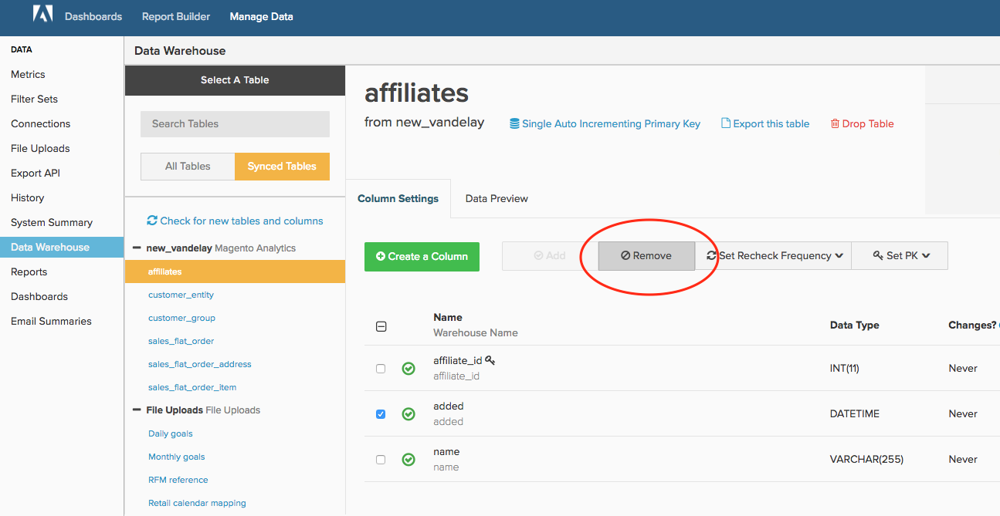

# Nettoyez votre [!DNL MBI] Compte

Si vous avez été avec [!DNL MBI] pendant six mois ou six ans, la maintenance d’un compte ordonné est essentielle pour que votre entreprise tire le meilleur parti de la plateforme. Au fil du temps, il est naturel que des utilisateurs, des tableaux de bord, des rapports, des mesures et des colonnes ne soient plus nécessaires. Peut-être avez-vous créé un rapport à usage unique et l’avez-vous oublié ou un utilisateur qui a quitté votre société n’a jamais eu son compte désactivé.

Avec [noms normalisés et clairs pour tous les éléments](../best-practices/naming-elements.md)) de votre [!DNL MBI] , les étapes de contrôle du compte ci-dessous vous aident à réduire les analyses encombrantes et inutiles pour vos utilisateurs. Un avantage supplémentaire inclut [cycles de mise à jour potentiellement plus rapides](../best-practices/reduce-update-cycle-time.md).

## Étape 1 : Identification de vos utilisateurs non Principaux

La première étape du nettoyage de votre compte consiste à désactiver les comptes de vos utilisateurs non principaux, tels que les personnes qui ont quitté l’entreprise ou qui n’utilisent plus [!DNL MBI] dans leurs rôles actuels.

Pour ce faire, cliquez sur le nom de votre société dans le coin supérieur droit de la barre de navigation supérieure, puis sélectionnez **[!UICONTROL Manage Users]**. Sélectionnez ensuite l’utilisateur à désactiver, puis cliquez sur **[!UICONTROL Deactivate User]**.

>[!NOTE]
>
>Vous avez besoin de [Autorisations d’administrateur](../administrator/user-management/user-management.md) pour le faire.

>[!WARNING]
>
>La désactivation d’un utilisateur supprime les graphiques, les tableaux de bord et autres ressources créés par cet utilisateur. Si vous souhaitez conserver ces ressources, contactez le [!DNL MBI] [support](../guide-overview.md) avant de désactiver l’utilisateur. L’assistance peut vous aider à transférer ces ressources à un autre utilisateur.

### Réactivation d’un utilisateur

Pour réactiver un utilisateur, réinvitez-le en recréant son compte avec la même adresse électronique que celle qui a été désactivée. De plus, son accès et les données qu’il possède sont restaurés lors de la connexion.

## Étape 2 : Suppression des tableaux de bord et des rapports inutilisés

L’étape suivante du contrôle de votre compte consiste à supprimer les tableaux de bord et les rapports inutilisés.

>[!NOTE]
>
>Vous avez besoin de `Admin` ou `Standard` [permissions utilisateur](../administrator/user-management/user-management.md) pour le faire.

Chaque utilisateur avec `Admin` ou `Standard` peut créer des rapports et des tableaux de bord. Pour cette raison, toute personne disposant de ces autorisations doit suivre les étapes ci-dessous pour identifier et supprimer les rapports inutilisés.

### Vérification des tableaux de bord et des rapports

Avant de supprimer quoi que ce soit, vous devez consulter vos rapports et tableaux de bord pour évaluer l’utilisation actuelle. Lorsque vous pouvez utiliser la variable **[!UICONTROL find unused reports]** fonctionnalité décrite ci-dessous, toute révision initiale rend vos efforts de nettoyage beaucoup plus productifs.

### Suppression de tableaux de bord et de rapports

Après avoir accédé à vos tableaux de bord et rapports, vous pouvez commencer à nettoyer votre compte.

**Pour supprimer un rapport d’un tableau de bord**

1. Localisez le rapport à supprimer dans le tableau de bord.
1. Sélectionner **[!UICONTROL Options]** dans le coin supérieur droit du rapport.
1. Cliquez sur **[!UICONTROL Remove From Dashboard]**.

**Pour supprimer un tableau de bord entier**

1. Sélectionner **[!UICONTROL Manage Data]**, puis **[!UICONTROL Dashboards**].
1. Cliquez sur le tableau de bord que vous souhaitez supprimer.
1. Cliquez sur **[!UICONTROL Delete Dashboard]**.

Vous pouvez également sélectionner **[!UICONTROL Dashboard Options]**, puis **[!UICONTROL Delete]** depuis le tableau de bord lui-même.

>[!NOTE]
>
>La suppression d’un tableau de bord ne supprime pas les rapports qu’il contient. Vous devez donc effectuer une nouvelle étape pour supprimer les rapports.

**Pour supprimer les rapports inutilisés**

1. Sélectionner **[!UICONTROL Manage Data]**, puis **[!UICONTROL Reports]**.
1. Vérifiez les **Afficher uniquement les rapports inutilisés** située sous la liste des mesures. Cette opération crée une liste des rapports qui ne sont pas utilisés dans un tableau de bord ou un résumé d’email.
1. Sélectionnez les rapports à supprimer. Vous pouvez tout sélectionner en cochant la case située au-dessus de la liste des rapports.
1. Cliquez sur **[!UICONTROL Delete Selected]**.

Voici un aperçu du processus de suppression des rapports inutilisés :

## Étape 3 : Supprimer les mesures inutilisées

Après avoir nettoyé la liste des utilisateurs, les tableaux de bord et les rapports, vous pouvez passer au contrôle de votre liste de mesures. Cela vous permet d’identifier tout élément qui pourrait être obsolète (par exemple, une nouvelle mesure a été créée avec une définition différente) ou qui n’a pas été utilisé.

1. Pour générer une liste des rapports dépendants pour une mesure, accédez à **[!DNL Manage Data]**, puis cliquez sur Cliquez sur **[!UICONTROL Metrics]**.
1. Cliquez sur **[!UICONTROL Edit]** en regard d’une mesure.
1. Au bas de la page, une section appelée **[!UICONTROL Dependent Charts]**. Cliquez sur le lien pour générer une liste de rapports dépendants pour cette mesure.
1. Une fois la vérification terminée par le système, [!DNL MBI] affiche une liste des tableaux de bord, des rapports et des utilisateurs qui utilisent cette mesure.

Si vous décidez que la mesure n’est plus nécessaire, revenez à la **[!UICONTROL Metrics]** en cliquant sur **[!UICONTROL Back to Metric List]** pour rechercher la mesure à supprimer. Cliquez sur **[!UICONTROL Delete]**.

## Étape 4 : Évaluation des colonnes synchronisées

La dernière étape consiste à évaluer les colonnes en cours de synchronisation dans votre Data Warehouse. Non seulement la désynchronisation des colonnes peut désencombrer votre compte, mais elle peut aussi potentiellement réduire le temps de mise à jour.

Si vous souhaitez poursuivre, contactez [!DNL MBI] [Assistance](../guide-overview.md). L’équipe d’assistance peut créer un rapport qui inclut toutes les colonnes qui ne sont utilisées dans aucun tableau de bord pour aucun utilisateur et qui ne sont pas utilisées dans les résumés d’emails, à l’exception des rapports SQL. Vous pouvez ensuite utiliser ce rapport comme guide pour sélectionner les colonnes à désynchroniser via le Gestionnaire de Data Warehouse.

>[!NOTE]
>
>Vous pourrez toujours recommencer à synchroniser ces colonnes à l’avenir. La désynchronisation d’une colonne supprime toutes les données de votre Data Warehouse ; cela signifie uniquement que cette colonne n&#39;est pas contrôlée pour les nouvelles valeurs ou les valeurs mises à jour pendant le cycle de mise à jour.

**Pour désynchroniser une colonne (ou ses colonnes)**

1. Accédez à **[!DNL Manage Data]**, puis **[!UICONTROL Data Warehouse]**.
1. Dans le **[!UICONTROL Synced Tables]** , accédez au tableau contenant la colonne .
1. Cochez une ou plusieurs cases en regard d’une ou de plusieurs colonnes que vous souhaitez désynchroniser.
   >[!NOTE]
   >
   >Vous ne pouvez pas désynchroniser une colonne Clé Principal sans déposer le tableau entier.

1. Cliquez sur **[!UICONTROL Remove]** pour désynchroniser une ou plusieurs colonnes.

Voici un aperçu de l’ensemble du processus :

## Remplissage

C&#39;est tout ! Votre [!DNL MBI] Votre compte devrait maintenant être plus ordonné et plus facile à parcourir pour vous et votre équipe.
