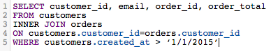

# Optimisation des requêtes SQL

Le [!DNL SQL Report Builder] vous permet d’exécuter et de modifier vos requêtes quand vous le souhaitez. Cette fonctionnalité est utile si vous devez mettre à jour une requête immédiatement, au lieu d’attendre la fin d’un cycle de mise à jour avant de corriger une colonne ou un rapport.

Avant l’exécution d’une requête, [[!DNL Commerce Intelligence] estime son coût](https://experienceleague.adobe.com/docs/commerce-knowledge-base/kb/troubleshooting/miscellaneous/sql-queries-explain-cost-errors.html?lang=fr). Le coût prend en compte la durée et le nombre de ressources nécessaires pour exécuter une requête. Si ce coût est jugé trop élevé ou si le nombre de lignes renvoyées dépasse les limites [!DNL Commerce Intelligence], la requête échoue. Pour interroger votre [Data Warehouse](../data-analyst/data-warehouse-mgr/tour-dwm.md), ce qui garantit que vous écrivez les requêtes les plus rationalisées possible, Adobe recommande ce qui suit.

## Utilisation de SELECT ou Sélection de toutes les colonnes

La sélection de toutes les colonnes ne permet pas d’obtenir une requête rapide et facile à exécuter. L&#39;exécution des requêtes qui utilisent `SELECT *` peut prendre un certain temps, en particulier si votre tableau comporte de nombreuses colonnes.

C’est pourquoi Adobe vous recommande d’éviter d’utiliser `SELECT *` dans la mesure du possible et de n’inclure que les colonnes dont vous avez besoin :

| **Au lieu de cela...** | **Essayez ceci !** |
|-----|-----|
|  |  |

{style="table-layout:auto"}

## Utilisation de jointures externes complètes

Les jointures externes sélectionnent l&#39;intégralité des deux tables jointes, ce qui augmente le coût de calcul de la requête. Cela signifie que l’exécution de votre requête prend plus de temps et est plus susceptible d’échouer, car le renvoi des résultats peut prendre plus de temps que la limite d’exécution.

Au lieu d&#39;utiliser ce type de jointure, pensez à utiliser une jointure interne ou gauche. Les jointures internes ne renvoient des résultats que lorsqu&#39;il existe une correspondance en colonnes entre les tableaux (par exemple, `order_id` existe à la fois dans un tableau `customers` type et dans un tableau `orders`). Les jointures à gauche renvoient tous les résultats du premier tableau à gauche ainsi que les résultats correspondants du deuxième tableau à droite.

Découvrez comment réécrire une requête FULL OUTER JOIN :

| **Au lieu de cela...** | **Essayez ceci !** |
|-----|-----|
|  |  |

{style="table-layout:auto"}

Ces requêtes sont identiques en tous points, à l&#39;exception du type de JOIN qu&#39;elles utilisent.

## Utilisation de plusieurs jointures

Bien que vous puissiez inclure plusieurs jointures dans votre requête, n’oubliez pas que cela peut augmenter le coût de la requête. Pour éviter d’atteindre le seuil de coût, Adobe recommande d’éviter autant que possible les jointures multiples.

## Utilisation de filtres

Utilisez des filtres chaque fois que possible. Les clauses `WHERE` et `HAVING` filtrent vos résultats et ne vous donnent que les données que vous voulez vraiment.

## Utilisation de filtres dans les clauses JOIN

Si vous utilisez un filtre lors de la jointure, veillez à l&#39;appliquer aux deux tables de la jointure. Même si elle est redondante, cela réduit le coût de calcul de la requête et réduit le temps d’exécution.

| **Au lieu de cela...** | **Essayez ceci !** |
|-----|-----|
|  |  |

{style="table-layout:auto"}

## Utilisation d’opérateurs

Lorsque vous écrivez des requêtes, pensez à utiliser les opérateurs « les moins chers » possibles. Chaque requête comporte un coût de calcul, qui est déterminé par les fonctions, les opérateurs et les filtres qui la composent. Certains opérateurs nécessitent moins d&#39;effort de calcul, ce qui les rend moins chers que d&#39;autres opérateurs.

Les opérateurs de comparaison (>, &lt;, =, etc.) sont les moins chers, suivis de [LIKE. SEMBLABLES AUX opérateurs POSIX](https://www.postgresql.org/docs/9.5/functions-matching.html) qui sont les opérateurs les plus chers.

## Utilisation d’EXISTS et d’IN

L’utilisation de `EXISTS` au lieu de `IN` dépend du type de résultats que vous essayez de renvoyer. Si une seule valeur vous intéresse, utilisez la clause `EXISTS` au lieu de `IN`. `IN` est utilisé avec des listes de valeurs séparées par des virgules, ce qui augmente le coût de calcul de la requête.

Lorsque `IN` requêtes sont exécutées, le système doit d&#39;abord traiter la sous-requête (l&#39;instruction `IN`), puis la requête entière en fonction de la relation spécifiée dans l&#39;instruction `IN`. La requête `EXISTS` est beaucoup plus efficace, car il n’est pas nécessaire de l’exécuter plusieurs fois : une valeur true/false est renvoyée lors de la vérification de la relation spécifiée dans la requête.

En d’autres termes, le système n’a pas à traiter autant de données lors de l’utilisation de `EXISTS`.

| **Au lieu de cela...** | **Essayez ceci !** |
|-----|-----|
|  |  |

{style="table-layout:auto"}

## Utilisation de ORDER BY

La fonction `ORDER BY` est coûteuse en SQL et peut augmenter considérablement le coût d’une requête. Si vous recevez un message d’erreur indiquant que le coût du module EXPLAIN de votre requête est trop élevé, essayez d’éliminer tous les `ORDER BY` de votre requête, sauf si nécessaire.

Cela ne veut pas dire que le `ORDER BY` ne peut pas être utilisé, mais simplement qu’il ne doit l’être que lorsque cela est nécessaire.

## Utilisation de GROUP BY et ORDER BY

Il peut y avoir quelques situations où cette approche n’est pas conforme à ce que vous essayez de faire. En règle générale, si vous utilisez un `GROUP BY` et un `ORDER BY`, vous devez placer les colonnes des deux clauses dans le même ordre. Par exemple :

| **Au lieu de cela...** | **Essayez ceci !** |
|-----|-----|
|  |  |

{style="table-layout:auto"}

## Conclusion

La meilleure façon d’apprendre à écrire du code SQL - et de le faire efficacement - est par essais et erreurs. Pour trouver ce qui vous convient le mieux, essayez de recréer quelques rapports en utilisant uniquement l’éditeur SQL.
