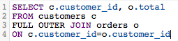

# Optimisation des requêtes SQL

Le [!DNL SQL Report Builder] vous permet d’interroger et d’itérer sur ces requêtes à un moment donné. Cela s’avère utile lorsque vous devez modifier une requête sans avoir à attendre la fin d’un cycle de mise à jour avant de réaliser une colonne ou un rapport que vous avez créé qui doit être mis à jour.

Avant l&#39;exécution d&#39;une requête, [[!DNL Commerce Intelligence] estime son coût](https://experienceleague.adobe.com/docs/commerce-knowledge-base/kb/troubleshooting/miscellaneous/sql-queries-explain-cost-errors.html?lang=fr). Le coût prend en compte le temps et le nombre de ressources nécessaires à l’exécution d’une requête. Si ce coût est considéré comme trop élevé ou si le nombre de lignes renvoyées dépasse les limites de [!DNL Commerce Intelligence], la requête échoue. Pour interroger votre [Data Warehouse](../data-analyst/data-warehouse-mgr/tour-dwm.md), ce qui vous permet d’écrire les requêtes les plus simples possible, Adobe recommande ce qui suit.

## Utilisation de l’option SELECT (Sélectionner) ou Sélectionner toutes les colonnes

La sélection de toutes les colonnes ne permet pas d’effectuer une requête opportune et facilement exécutée. Les requêtes qui utilisent `SELECT *` peuvent prendre un certain temps à s’exécuter, en particulier si votre table comporte de nombreuses colonnes.

Pour cette raison, Adobe vous recommande d’éviter d’utiliser `SELECT *` dans la mesure du possible et d’inclure uniquement les colonnes dont vous avez besoin :

| **Au lieu de cela...** | **Essayez ceci !** |
|-----|-----|
|  |  |

{style="table-layout:auto"}

## Utilisation de jointures externes complètes

Les jointures externes sélectionnent l&#39;intégralité des deux tables jointes, ce qui augmente le coût de calcul de la requête. Cela signifie que l’exécution de votre requête prend plus de temps et est plus susceptible d’échouer, car le renvoi des résultats peut prendre plus de temps que la limite d’exécution.

Au lieu d’utiliser ce type de jointure, pensez à utiliser une jointure interne ou de gauche. Les jointures internes ne renvoient des résultats que lorsqu’il existe une correspondance de colonnes entre les tables (par exemple, il existe `order_id` dans une table `customers` et `orders` standard). Les jointures à gauche renvoient tous les résultats du tableau de gauche (premier) avec les résultats correspondants dans le tableau de droite (deuxième).

Découvrez comment réécrire une requête FULL OUTER JOIN :

| **Au lieu de cela...** | **Essayez ceci !** |
|-----|-----|
|  |  |

{style="table-layout:auto"}

Ces requêtes sont identiques dans tous les cas, à l’exception du type JOIN qu’elles utilisent.

## Utilisation de plusieurs jointures

Bien que vous puissiez inclure plusieurs jointures dans votre requête, n’oubliez pas que cela peut entraîner la hausse des coûts de la requête. Pour éviter d’atteindre le seuil de coût, Adobe recommande d’éviter, si possible, plusieurs jointures.

## Utilisation des filtres

Utilisez des filtres chaque fois que possible. Les clauses `WHERE` et `HAVING` filtrent vos résultats et ne vous donnent que les données que vous souhaitez.

## Utilisation de filtres dans les clauses JOIN

Si vous utilisez un filtre lors de l&#39;exécution d&#39;une jointure, veillez à l&#39;appliquer aux deux tableaux de la jointure. Même s’il est redondant, cela réduit le coût de calcul de la requête et réduit le temps d’exécution.

| **Au lieu de cela...** | **Essayez ceci !** |
|-----|-----|
|  |  |

{style="table-layout:auto"}

## Utilisation d’opérateurs

Lorsque vous écrivez des requêtes, pensez à utiliser les opérateurs &quot;moins chers&quot; possibles. Chaque requête a un coût de calcul, qui est déterminé par les fonctions, opérateurs et filtres qui composent la requête. Certains opérateurs nécessitent moins d&#39;effort de calcul, ce qui les rend moins coûteux que d&#39;autres.

Les opérateurs de comparaison (>, &lt;, =, etc.) sont les moins chers, suivis par [LIKE. SEMBLABLES AUX opérateurs ET POSIX](https://www.postgresql.org/docs/9.5/functions-matching.html) qui sont les opérateurs les plus chers.

## Utilisation d’EXISTS contre IN

L’utilisation de `EXISTS` par rapport à `IN` dépend du type de résultats que vous essayez de renvoyer. Si une seule valeur vous intéresse, utilisez la clause `EXISTS` au lieu de `IN`. `IN` est utilisé avec des listes de valeurs séparées par des virgules, ce qui augmente le coût de calcul de la requête.

Lorsque des requêtes `IN` sont exécutées, le système doit d’abord traiter la sous-requête (l’instruction `IN`), puis la requête complète en fonction de la relation spécifiée dans l’instruction `IN`. `EXISTS` est beaucoup plus efficace car la requête n’a pas à être exécutée plusieurs fois : une valeur true/false est renvoyée lors de la vérification de la relation spécifiée dans la requête.

Pour le dire simplement : le système n&#39;a pas à traiter autant lors de l&#39;utilisation de `EXISTS`.

| **Au lieu de cela...** | **Essayez ceci !** |
|-----|-----|
|  |  |

{style="table-layout:auto"}

## Utilisation de ORDER BY

`ORDER BY` est une fonction coûteuse en SQL et peut augmenter considérablement le coût d’une requête. Si vous recevez un message d’erreur indiquant que le coût EXPLAIN de votre requête est trop élevé, essayez d’éliminer tout `ORDER BY` de votre requête, sauf si nécessaire.

Cela ne veut pas dire que `ORDER BY` ne peut pas être utilisé, juste qu&#39;il ne doit l&#39;être que lorsque cela est nécessaire.

## Utilisation de GROUP BY et ORDER BY

Il peut y avoir certaines situations où cette approche ne se conforme pas à ce que vous essayez de faire. La règle générale est que si vous utilisez un `GROUP BY` et un `ORDER BY`, vous devez placer les colonnes des deux clauses dans le même ordre. Par exemple :

| **Au lieu de cela...** | **Essayez ceci !** |
|-----|-----|
|  |  |

{style="table-layout:auto"}

## Remplissage

La meilleure façon d&#39;apprendre à écrire du SQL - et de le faire efficacement - est par tâtonnements successifs. Pour trouver ce qui vous convient le mieux, essayez de recréer quelques rapports en utilisant uniquement l&#39;éditeur SQL.
