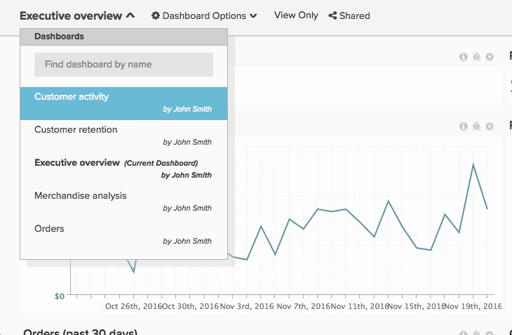

# Partager un tableau de bord

Le partage de tableaux de bord signifie que vous et votre équipe possédez les mêmes informations à tout moment, ce qui permet la collaboration et la discussion. Voici quelques recommandations pour partager des tableaux de bord et préserver l’intégrité de votre compte [!DNL Adobe Commerce Intelligence].

## Éviter les tableaux de bord en double

Parfois, vous pouvez trouver plusieurs tableaux de bord portant le même nom, généralement parce que d’autres utilisateurs ont créé et partagé des tableaux de bord similaires avec vous. Ces tableaux de bord peuvent être des doublons d’une copie primaire. Dans ce cas, Adobe recommande à un utilisateur de partager la copie principale du tableau de bord, puis de supprimer tous les tableaux de bord en double.

Pour afficher le propriétaire d’un tableau de bord, cliquez sur la liste déroulante Tableau de bord dans le coin supérieur gauche. Tous les tableaux de bord qui n’ont pas de nom sous eux vous appartiennent.

Pour supprimer tous les tableaux de bord en double :

1. Synchronisez avec votre équipe et identifiez la personne qui doit gérer le tableau de bord.
1. [Annulez votre partage](../data-user/dashboards/leave-dashboard.md) à partir de tous les tableaux de bord similaires, à l’exception de celui partagé par l’utilisateur principal.
1. Si vous disposez d’une copie du tableau de bord, [&#x200B; la supprimer](../data-user/dashboards/deleting-dashboard.md).
1. Demander aux autres de supprimer leur version du tableau de bord.

## Créer un ensemble de tableaux de bord de base

Lorsque de nouveaux utilisateurs sont créés, ils ne possèdent aucun tableau de bord ni graphique. Cependant, ils verront une liste des tableaux de bord les plus populaires dans votre organisation (avec les droits Afficher ou Modifier pour l’ensemble de l’équipe) lors de la première connexion. Assurez-vous que les tableaux de bord figurent toujours dans cette liste afin que de nouveaux utilisateurs puissent être inclus.

## Partager des tableaux de bord avec de nouveaux utilisateurs

Les nouveaux utilisateurs peuvent également bénéficier de l’accès à certains tableaux de bord qui ne sont pas partagés à l’échelle de l’organisation. Dans ces cas, Adobe recommande aux propriétaires de tableaux de bord [de partager les tableaux de bord pertinents](../data-user/dashboards/share-dashboard-with-users.md) avec les nouveaux utilisateurs lors de la création de leurs comptes.

## Être sélectif avec les autorisations de modification

Les autorisations `Edit` donnent aux utilisateurs et utilisatrices beaucoup de pouvoir. Mais la grande puissance s&#39;accompagne de grandes responsabilités. Pour éviter toute modification accidentelle de vos graphiques et tableaux de bord, Adobe vous recommande de choisir les personnes à qui vous donnez `Edit` autorisations.

## Annotation De Graphiques

Le partage d’un tableau de bord permet simplement aux utilisateurs d’accéder aux mêmes informations. Pour s’assurer que les informations sont comprises, Adobe recommande d’utiliser la fonctionnalité de notes de graphique pour partager des connaissances et des nuances sur un point de données spécifique ou pour transmettre l’objectif d’une analyse.
