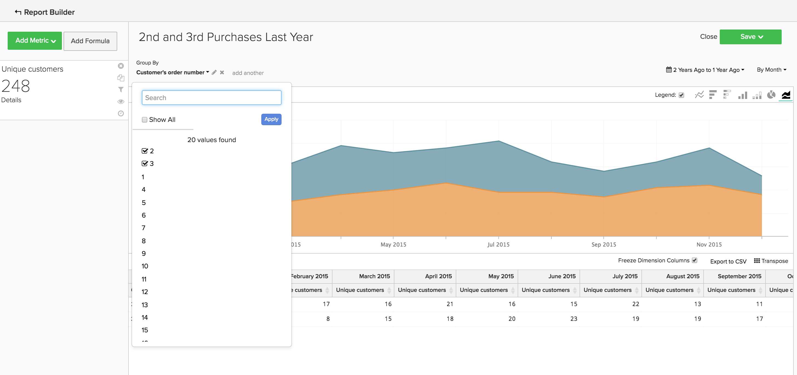
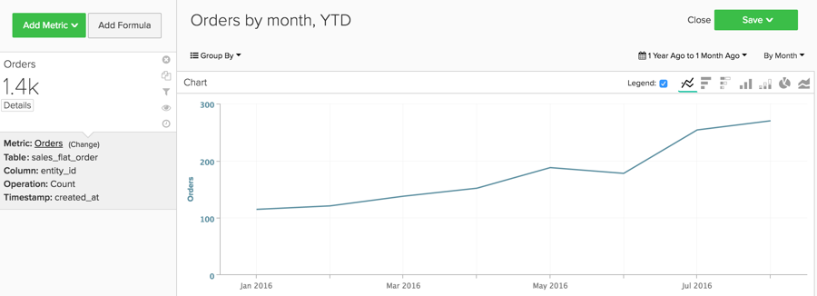

# Analyses de base

Une fois que vous connaissez le [!DNL Adobe Commerce Intelligence] et avoir une compréhension de base de l’outil, vous allez commencer à créer des rapports. Une des questions les plus courantes que vous avez est : &quot;Que dois-je regarder ?&quot;

Les informations ci-dessous décrivent certaines des mesures et rapports courants qui peuvent vous être utiles. Certains de ces rapports existent dans votre compte. Dès lors, veillez à consulter les mesures et rapports qui existent dans votre compte afin d’éviter de créer des doublons.

## Tableaux et colonnes à comprendre

Lors de la création d’une mesure, vous devez connaître quatre éléments d’information :

1. Le tableau dans lequel se trouvent les données,
1. L’action spécifique que vous souhaitez effectuer,
1. La colonne sur laquelle vous souhaitez effectuer cette action, et
1. Horodatage que vous souhaitez utiliser pour le suivi de ces données.

Les noms des tables utilisées dans ces exemples sont très probablement légèrement différents des noms des colonnes et des tables de votre base de données, car chaque base de données est unique. Référencez les définitions ci-dessous si vous avez besoin d’aide pour identifier une table ou une colonne correspondante dans votre base de données.

## Table des clients

Ce tableau contient des informations clés sur chaque client, telles qu’un ID de client unique, une adresse électronique, etc. Les exemples ci-dessous utilisent **[!UICONTROL customer_entity]** comme nom d’un exemple de table client.

Si certains de ces calculs n’existent pas actuellement dans votre base de données, tout utilisateur administrateur de votre compte peut les créer. Vous souhaitez également vous assurer que ces dimensions sont regroupables pour toutes les mesures applicables.

**Dimensions**

* **[!UICONTROL Entity_id]**: un identifiant unique pour chaque client. Il peut également s’agir d’un numéro de client unique ou d’une adresse électronique du client. Il doit servir de clé de référence à la table de votre commande.
* **[!UICONTROL Created_at]**: date à laquelle le compte du client a été créé et ajouté à votre base de données.
* **[!UICONTROL Customer's lifetime revenue]**: le total des recettes de la durée de vie générées par un client.
* **[!UICONTROL Customer's first 30-day revenue]**: montant total des recettes générées par un client au cours de ses 30 premiers jours.
* **[!UICONTROL Customer's lifetime number of orders]**: nombre de commandes passées par un client au cours de sa vie.
* **[!UICONTROL Customer's lifetime number of coupons]**: nombre total de coupons utilisés par un client au cours de sa durée de vie.
* **[!UICONTROL Customer's first order date]**: date de la première commande d’un client. Cela peut différer de la date created_at si un client n’a pas passé de commande au moment de sa création.

**Acceptez-vous les commandes des invités ?**

*Si tel est le cas, ce tableau peut ne pas contenir tous vos clients. Contactez le [équipe d&#39;assistance](https://experienceleague.adobe.com/docs/commerce-knowledge-base/kb/troubleshooting/miscellaneous/mbi-service-policies.html) pour vous assurer que vos analyses client comprennent tous les clients.*

*Vous ne savez pas si vous acceptez les commandes des invités ? Voir [cette rubrique](../data-warehouse-mgr/guest-orders.md) pour en savoir plus !*

## Table des commandes

Dans ce tableau, chaque ligne représente un ordre. Les colonnes de ce tableau contiennent des informations de base sur chaque commande, telles que l’identifiant de la commande, la date de création, l’état, l’identifiant du client qui a passé la commande, etc. Les exemples ci-dessous utilisent **[!UICONTROL sales_flat_order]** comme nom d’une table d’exemples de commandes.

**Dimensions**

* **[!UICONTROL Customer_id]**: identifiant unique du client qui a passé la commande. Cette opération est souvent utilisée pour déplacer des informations entre les tables du client et des commandes. Dans ces exemples, vous vous attendez à ce que le paramètre customer_id de la variable **[!UICONTROL sales_flat_order]** pour s’aligner sur la variable **[!UICONTROL entitiy_id]** sur le **[!UICONTROL customer_entity]** table.
* **[!UICONTROL Created_at]**: date à laquelle la commande a été créée ou placée.
* **[!UICONTROL Customer_email]**: adresse électronique du client qui a passé la commande. Il peut également s’agir de l’identifiant unique du client.
* **[!UICONTROL Customer's lifetime number of orders]**: une copie de la colonne portant le même nom sur votre `Customers` table.
* **[!UICONTROL Customer's order number]**: numéro de commande séquentiel du client associé à la commande. Par exemple, si la ligne que vous observez est la première commande d’un client, cette colonne est &quot;1&quot; ; mais, s’il s’agissait de la 15e commande du client, cette colonne indique &quot;15&quot; pour cette commande. Si cette dimension n’existe pas sur votre `Customers` , demandez au [équipe d&#39;assistance](https://experienceleague.adobe.com/docs/commerce-knowledge-base/kb/troubleshooting/miscellaneous/mbi-service-policies.html) pour vous aider à le construire.
* **[!UICONTROL Customer's order number (previous-current)]**: concaténation de deux valeurs dans la variable **[!UICONTROL Customer's order number]** colonne . Il est utilisé dans un exemple de rapport ci-dessous pour afficher le temps écoulé entre deux commandes. Par exemple, l’intervalle entre la date de première commande d’un client et sa date de deuxième commande est représenté sous la forme &quot;1-2&quot; avec ce calcul.
* **[!UICONTROL Coupon_code]**: indique les bons utilisés pour chaque commande.
* **[!UICONTROL Seconds since previous order]**: durée (en secondes) entre les commandes d’un client.

## Tableau des éléments de commande

Dans ce tableau, chaque ligne représente un article vendu. Ce tableau contient des informations sur les articles vendus dans chaque commande, telles que le numéro de référence de la commande, le numéro du produit, la quantité, etc. Les exemples ci-dessous utilisent `sales_flat_order_item` comme nom d’un exemple de tableau d’éléments de commande.

**Dimensions**

* **[!UICONTROL Item_id]**: identifiant unique de chaque ligne du tableau.
* **[!UICONTROL Order_id]**: la clé de référence de votre `Orders` qui vous indique les articles achetés dans la même commande. Si une commande contient plusieurs éléments, cette valeur est répétée.
* **[!UICONTROL Product_id]**: si vous souhaitez des informations sur le produit spécifique acheté (par exemple, sa couleur, sa taille, etc.), utilisez cette colonne pour extraire ces informations de votre table de produits.
* **[!UICONTROL Order's created_at]**: l’horodatage de la commande qui a été placée, généralement copié dans votre `order line items` du tableau `Orders` table.
* **[!UICONTROL Order's coupon_code]**: similaire au `Order's created_at` , cette colonne est copiée depuis votre table des commandes.

## Table des abonnements

Ce tableau permet de gérer vos informations d’abonnement, telles que l’ID d’abonnement, l’adresse électronique de l’abonné, la date de début de l’abonnement, etc.

**Dimensions**

* **[!UICONTROL Customer_id]**: identifiant unique du client qui a passé la commande. Il s’agit d’une méthode courante pour créer un chemin entre la table Clients et la table Commandes. Dans ces exemples, vous vous attendez à ce que le paramètre customer_id de la variable **sales_plat_order** pour s’aligner sur la variable `entitiy_id` sur le `customer_entity` table.
* **[!UICONTROL Start date]**: date à laquelle l’abonnement d’un client a commencé.

## Tableau des dépenses marketing

Lorsque vous analysez vos dépenses marketing, vous pouvez inclure [!DNL Facebook], [!DNL Google AdWords]ou d’autres sources dans vos analyses. Si vous disposez de plusieurs sources de dépenses marketing, contactez le [Équipe Managed Services](https://business.adobe.com/products/magento/fully-managed-service.html) pour obtenir de l’aide sur la configuration d’un tableau consolidé pour vos campagnes marketing.

**Dimensions**

* **[!UICONTROL Spend]**: total des dépenses publicitaires. Dans [!DNL Facebook], il s’agit de la colonne des dépenses dans la variable `facebook_ads_insights_####` table. Pour [!DNL Google AdWords], il s’agirait de la fonction `adCost` dans la colonne `campaigns####` table.
* La variable `####` qui est annexé à chacun de ces tableaux correspond à l’identifiant de compte spécifique de votre [!DNL Facebook] ou [!DNL Google AdWords] compte .
* **[!UICONTROL Clicks]**: nombre total de clics. Dans [!DNL Facebook], il s’agit de la colonne clics dans la variable `facebook_ads_insights_####` table. Dans [!DNL Google AdWords], il s’agit de la colonne adClicks dans la variable `campaigns####` table.
* **[!UICONTROL Impressions]**: nombre total d’impressions. Dans [!DNL Facebook], il s’agit des impressions de la variable `facebook_ads_insights_####` table. Dans [!DNL Google AdWords], il s’agit des impressions de la `campaigns####` table.
* **[!UICONTROL Campaign]**: nombre total de clics. Dans [!DNL Facebook], il s’agit de la colonne campaign_name de la variable `facebook_ads_insights_####` table. Dans [!DNL Google AdWords], il s’agit de la colonne de l’opération dans la variable `campaigns####` table.
* **[!UICONTROL Date]**: l’heure et la date auxquelles l’activité (dépenses, clics ou impressions) s’est produite pour une campagne spécifique. Dans [!DNL Facebook], il s’agirait de la fonction `date_start` dans la colonne `facebook_ads_insights_####` table. Dans [!DNL Google AdWords], il s’agit de la colonne de date dans la variable `campaigns####` table.
* **[!UICONTROL Customer's first order's source]**: source de la commande issue de la première commande d’un client. Tout d’abord, vérifiez si une colonne est nommée `customer's first order's source` dans votre compte. Si vous ne voyez pas cette colonne, vous pouvez créer la colonne de votre choix en suivant ces instructions.
* **[!UICONTROL Customer's first order's medium]**: support de la commande issue de la première commande d’un client. Tout d’abord, vérifiez si une colonne est nommée `customer's first order's source` dans votre compte. Si vous ne voyez pas cette colonne, vous pouvez créer la colonne de votre choix en suivant ces instructions.
* **[!UICONTROL Customer's first order's campaign]**: campagne de la commande issue de la première commande d’un client. Tout d’abord, vérifiez si une colonne est nommée `customer's first order's source` dans votre compte. Si vous ne voyez pas cette colonne, vous pouvez créer la colonne de votre choix en suivant ces instructions.

## Rapports et mesures courants

Voici quelques exemples courants de rapports et de mesures que vous trouverez utiles :

* [Customer Analytics](#customeranalytics)
* [Analyses de commande](#orderanalytics)
* [Analyses des dépenses marketing](#mktgspendanalytics)

## Customer Analytics {#customeranalytics}

### Nouveaux utilisateurs

* **Description**: nombre total d’utilisateurs nouvellement acquis sur une période donnée. `New Users` est différent de `Unique Customers`, car `New Users` comporte l’horodatage de création d’un compte avec votre service (cela ne signifie pas qu’il a nécessairement passé une commande) pendant que la variable `Unique Customers` ont passé au moins une commande.
* **Définition de mesure**: cette mesure effectue une **Count** de `entity_id` de `customer_entity` tableau trié par `created_at`.
* **Exemple de rapport**: nombre de nouveaux utilisateurs créés le mois dernier
   * **[!UICONTROL Metric]**: `New Users`
   * **[!UICONTROL Time Range]**: `Last Month`
   * **[!UICONTROL Time Interval]**: `By Day`

<!--{: width="929"}-->

### Clients uniques

* **Description**: comptage du nombre total de clients distincts sur une période donnée. Différent de `New Users`, car il effectue uniquement le suivi des clients qui ont passé au moins une commande. Le rapport d’un client distinct effectue uniquement le suivi d’un client une fois dans un intervalle de temps donné. Si vous définissez l’intervalle sur `By Day` et qu’un client effectue plusieurs achats ce jour-là, il n’est comptabilisé qu’une seule fois. Si vous souhaitez afficher le nombre total d’achats en général, reportez-vous à la section `Number of Orders`.
* **Définition de mesure**: cette mesure effectue une **Comptage distinct** de `customer_id` de `sales_flat_order` tableau trié par `created_at`.
* **Exemple de rapport**: clients distincts par semaine au cours des 90 derniers jours
   * **[!UICONTROL Metric]**: `Distinct Customers`
   * **[!UICONTROL Time Range]**: `Moving range > Last 90 Days`
   * **[!UICONTROL Time Interval]**: `By Day`

<!--{: width="929"}-->

### Nouveaux abonnés

* **Description**: comptage du nombre total de nouveaux abonnés acquis sur une période donnée.
* **Définition de mesure**: cette mesure effectue une **Comptage distinct** de `customer_id` de `subscriptions` tableau trié par `start_date`.
* **Exemple de rapport**: Nouveaux abonnés cette année par mois
   * **[!UICONTROL Metric]**: `New Subscribers`
   * **[!UICONTROL Time Range]**: `1 Year Ago to 0 Days Ago`
   * **[!UICONTROL Time Interval]**: `By Month`

<!--{: width="929"}-->

### Clients réguliers

* **Description**: nombre total de clients qui ont passé plusieurs commandes sur une période. Dans un rapport de clients réguliers, vous pouvez utiliser la variable `Distinct Customers` et la variable `Customer's Order Number` de votre `orders` table.
* **Mesure utilisée**: `Distinct Customers`
* **Exemple de rapport**: Nombre de 2e et 3e achats effectués l’année dernière
   * **[!UICONTROL Metric]**: `Distinct Customers`
   * **[!UICONTROL Time Range]**: `Moving Range > Last Year`
   * **[!UICONTROL Time Interval]**: `By Month`
   * **[!UICONTROL Group By]**: `Customer's Order Number`, puis sélectionnez `2` et `3`

  

* **Exemple de rapport 2**: nombre de clients réguliers les dernières années
   * **[!UICONTROL Metric]**: `Distinct Customers`
   * **[!UICONTROL Filters]**: `Customer's Order Number Greater Than 1`
   * **[!UICONTROL Time Range]**: `Moving range > Last Year`
   * **[!UICONTROL Time Interval]**: `By Month`

  <!--{: width="929"}-->

### Clients principaux par nombre de commandes au cours de la durée de vie

* **Description**: liste des principaux clients selon leur nombre total de commandes. Vous obtenez ainsi une liste directe de vos acheteurs les plus fréquents.
* **Mesure utilisée**: `Orders`
* **Exemple de rapport**: les 25 premiers clients par nombre de commandes total
   * **[!UICONTROL Metric]**: `Orders`
   * **[!UICONTROL Time Range]**: `All Time`
   * **[!UICONTROL Time Interval]**: `None`
   * **[!UICONTROL Group By]**: `customer_email`
   * **[!UICONTROL Show Top/Bottom]**: 25 premiers triés par commandes

  <!--{: width="929"}-->

### Meilleurs clients par chiffre d’affaires sur la durée de vie

* **Description**: liste des principaux clients en fonction des recettes sur la durée de vie.
* **Mesure utilisée**: `Average Lifetime Revenue`
* **Exemple de rapport**: les 25 premiers clients par chiffre d’affaires sur la durée de vie
   * **[!UICONTROL Metric]**: `Average Lifetime Revenue`
   * **[!UICONTROL Time Range]**: `All time`
   * **[!UICONTROL Time Interval]**: `None`
   * **[!UICONTROL Group By]**: `customer_email`
   * **[!UICONTROL Show Top Bottom]**: 25 premiers triés par recettes sur la durée de vie

  <!--{: width="929"}-->

### Chiffre d’affaires moyen par cohorte

* **Description**: effectuez le suivi de [revenu moyen sur la durée de vie des cohortes distinctes](../dev-reports/lifetime-rev-cohort-analysis.md) Nombre d’utilisateurs au fil du temps pour identifier les cohortes les plus performantes. Les cohortes sont regroupées par date courante, comme la date de première commande ou la date de création.
* **Mesure utilisée**: `Revenue`
* **Exemple de rapport**: recettes sur la durée de vie moyenne des clients par cohorte
   * **[!UICONTROL Metric]**: `Revenue`
   * **[!UICONTROL Cohort Date]**: `Customer's first order date`
   * **[!UICONTROL Time Interval]**: `Month`
   * **[!UICONTROL Time Period]**: déplacement d’un ensemble de cohortes des huit cohortes les plus récentes avec au moins quatre mois de données
   * **[!UICONTROL Duration]**: `12 Month(s)`
   * **[!UICONTROL Table]**: `Customer_entity`
   * **[!UICONTROL Perspective]**: Valeur moyenne cumulée par membre de cohorte

  <!--{: width="929"}-->

### Clients par utilisation des coupons

* **Description**: nombre de clients acquis qui ont utilisé un code de coupon/réduction. Cela peut vous aider à obtenir une vue claire de vos demandeurs de réduction par rapport aux acheteurs à prix plein.
* **Mesure utilisée**: `New Users`
* **Exemple de rapport**: clients Bon et non-bons par mois
   * **[!UICONTROL Metric A]**: `Non coupon customers`
   * **[!UICONTROL Metric]**: `New Users`
   * **[!UICONTROL Filters]**: nombre de commandes de durée de vie du client supérieur à 0 et nombre de bons de durée de vie du client égal à 0
   * **[!UICONTROL Metric B]**: `Coupon customers`
   * **[!UICONTROL Metric]**: `New Users`
   * **[!UICONTROL Filters]**: nombre de commandes de durée de vie des clients supérieures à 0 et nombre de bons de durée de vie des clients supérieurs à 0
   * **[!UICONTROL Time range]**: `All Time`
   * **[!UICONTROL Time interval]**: `By Month`

  <!--{: width="929"}-->

* **Exemple de rapport 2**: pourcentage de clients Bon et non-bons par mois
   * **[!UICONTROL Metric A]**: `Non coupon customers` (masquer la mesure)
      * **[!UICONTROL Metric]**: `New Users`
      * **[!UICONTROL Filters]**: `Customer's Lifetime Number of Orders Greater Than 0` et `Customer's Lifetime Number of Coupons Equal to 0`
   * **[!UICONTROL Metric B]**: `Coupon customers`
      * **[!UICONTROL Metric]**: `New Users`
      * **[!UICONTROL Filters]**: `Customers Lifetime Number of Orders Greater Than 0` et `Customer's Lifetime Number of Coupons Greater Than 0`
   * **[!UICONTROL Time Range]**: `All Time`
   * **[!UICONTROL Time Interval]**: `By Month`
   * **[!UICONTROL Formula]**: `B/(A+B)`

>[!NOTE]
>
> **Masquer toutes les mesures**

<!--{: width="929"}-->

### Chiffre d’affaires moyen des 30 premiers jours

* **Description**: moyenne du montant des recettes généré par les clients au cours de leurs 30 premiers jours en tant que client.
* **Description de mesure**: cette mesure effectue une **Moyenne** de `Customer's First 30 Day Revenue` de `customer_entity` tableau trié par `created_at`.
* **Description du rapport**: moyenne sur tout le temps des 30 premiers jours de recettes client
* **[!UICONTROL Metric]**: `Average First 30 Day Revenue`
* **[!UICONTROL Time Range]**: `All Time`
* **[!UICONTROL Time Interval]**: `None`

<!--{: width="929"}-->

### Chiffre d’affaires moyen des clients

* **Description**: montant moyen des recettes générées par vos clients au cours de leur vie.
* **Description de mesure**: cette mesure effectue une **Moyenne** de `Customer's Lifetime Revenue` sur la `customer_entity` en fonction de la variable `created_at`.
* **Description du rapport**: moyenne sur tout le temps des recettes de durée de vie du client
   * **[!UICONTROL Metric]**: `Average Customer Lifetime Revenue`
   * **[!UICONTROL Time Range]**: `All Time`
   * **[!UICONTROL Time Interval]**: `None`

<!--{: width="929"}-->

## Analyse des commandes {#orderanalytics}

### Recettes

* **Description**: la mesure des recettes affiche le total des recettes générées sur une période donnée.
* Cette mesure effectue une **sum** de `grand_total` de `sales_flat_order` tableau trié par `created_at`.
* **Exemple de rapport**: Recettes par mois, YTD
   * **[!UICONTROL Metric]**: `Revenue`
   * **[!UICONTROL Time Range]**: `1 Year Ago to 1 Month Ago`
   * **Intervalle temporel**: `By Month`

>[!TIP]
>
>Assurez-vous que le calcul de votre mesure des recettes est cohérent avec la définition dont vous discutez en interne. Par exemple, vous pouvez comptabiliser les recettes provenant des commandes expédiées, convertir les devises de différentes régions ou exclure les taxes. Vous pouvez également utiliser [Visionneuses de filtres](../../data-user/reports/ess-manage-data-filters.md) pour garantir la cohérence de toutes les mesures créées sur le même tableau.

<!--{: width="929"}-->

### Commandes

* **Description**: nombre total de commandes sur une période donnée. Un rapport Commandes effectue le suivi des modifications du volume des commandes provoquées par les nouvelles offres de produits, les promotions ou tout autre élément susceptible d’augmenter (ou de diminuer) le volume des transactions. Vous voudrez peut-être souvent segmenter cette mesure en fonction de certaines variables pour répondre à vos questions.
* **Définition de mesure**: cette mesure effectue une **Count** de `entity_id` de `sales_flat_order` tableau trié par `created_at`.
* **Exemple de rapport**: commandes par mois, YTD
   * **[!UICONTROL Metric]**: `number of orders`
   * **[!UICONTROL Time Range]**: `1 Year Ago to 1 Month Ago`
   * **[!UICONTROL Time Interval]**: `By Month`

>[!TIP]
>
>Tout comme la mesure des recettes, vous devriez avoir [Visionneuses de filtres](../../data-user/reports/ess-manage-data-filters.md) pour exclure les commandes incomplètes, de test ou renvoyées.

<!--{: width="929"}-->

### Produits commandés

* **Description**: la mesure Produits commandés indique la quantité d’articles vendus sur une période spécifique.
* **Définition de mesure**: cette mesure effectue une **sum** de `qty_ordered` de `sales_flat_order_item` tableau trié par `created_at`.
* **Exemple de rapport**: articles vendus par mois, JJ
   * **[!UICONTROL Metric]**: `Products ordered`
   * **[!UICONTROL Time Range]**: `1 Year Ago to 1 Month Ago`
   * **[!UICONTROL Time Interval]**: `By Month`

  <!--{: width="929"}-->

* Combinez cette mesure à la mesure du nombre de commandes pour calculer le nombre d’articles par commande. Ajoutez ensuite des codes de coupon au rapport afin de déterminer l’impact de vos promotions sur la taille du panier, ou segmentez-les par nouvelles commandes par rapport aux commandes répétées, afin de mieux comprendre le comportement de vos clients.
* **Exemple de rapport**: produits par commande : première commande ou commandes répétées
   * **[!UICONTROL Metric A]**: produits commandés : première commande
      * **[!UICONTROL Metric]**: `Products ordered`
      * **[!UICONTROL Filter]**: `Customer's order number = 1`
   * **[!UICONTROL Metric B]**: commandes : premier ordre
      * **[!UICONTROL Metric]**: `Orders`
      * **[!UICONTROL Filter]**: `Customer's order number = 1`
   * **[!UICONTROL Metric C]**: produits commandés : commandes répétées
      * **[!UICONTROL Metric]**: `Products ordered`
      * **[!UICONTROL Filter]**: `Customer's order number > 1`
   * **[!UICONTROL Metric D]**: commandes : commandes répétées
      * **[!UICONTROL Metric]**: `Orders`
      * **[!UICONTROL Filter]**: `Customer's order number > 1`
   * **[!UICONTROL Time Range]**: `1 Year Ago to 1 Month Ago`
   * **[!UICONTROL Time Interval]**: `By Week`
   * **[!UICONTROL Formula 1]**: `A/B`
   * **[!UICONTROL Formula 2]**: `C/D`

>[!NOTE]
>
>Décochez la case `Multiple Y-Axes box` et `Hide` toutes les mesures

<!--{: width="929"}-->

### Valeur de commande moyenne

* **Description**: suit la valeur moyenne des commandes passées sur une période. Utilisez cette mesure pour déterminer rapidement la manière dont la valeur de commande moyenne (AOV) a fluctué en raison de vos efforts marketing, de votre offre de produits et/ou d’autres changements survenus dans votre entreprise.
* **Définition de mesure**: cette mesure effectue une **average** de `grand_total` de `sales_flat_order` tableau trié par `created_at`.
* **Exemple de rapport**: AOV par rapport à l’année précédente, YTD
   * **[!UICONTROL Metric]**: `Average order value`
   * **[!UICONTROL Time Range]**: `1 Year Ago to 1 Month Ago`
   * **[!UICONTROL Time Interval]**: `By Month`
   * **[!UICONTROL Perspective]**: `Amount Change vs Previous Year`

  <!--{: width="929"}-->

### Produits les plus achetés avec des bons

* **Description**: ce rapport fournit des informations sur les produits vendus lorsque vous proposez des promotions ou des bons.
* **Mesure utilisée**: produits commandés
* **Exemple de rapport**: produits les plus achetés avec des bons
   * **[!UICONTROL Metric]**: `Products ordered`
   * **[!UICONTROL Filter]**: `Order's coupon_code Is Not \[NULL\]`
   * **[!UICONTROL Time Range]**: `All-Time`
   * **[!UICONTROL Time Interval]**: `None`
   * **[!UICONTROL Group By**]: `name` (ou `SKU`, ou tout autre identifiant de produit)
   * **[!UICONTROL Show top/bottom]**: les 25 premiers triés par produits commandés

  <!--{: width="929"}-->

### Durée entre les commandes

* **Description**: testez vos hypothèses et attentes concernant les cycles d’achat de vos clients avec un **durée entre les commandes** qui examine la moyenne (ou la médiane !) durée entre les achats. Dans le graphique ci-dessous, vous pouvez constater que vos meilleurs clients - ceux qui passent plus de trois commandes - effectuent leur deuxième achat en moins de six mois. Les clients qui n’ont pas passé de quatrième commande attendent 14 mois avant d’effectuer un deuxième achat.
* **Définition de mesure**: cette mesure effectue une **average** de `Time since previous order` de `sales_flat_order` ordonné par `created_at`.
* **Exemple de rapport**:
   * **Mesure 1**: ≤ 3 commandes
      * **[!UICONTROL Metric]**: `Average time between orders`
      * **[!UICONTROL Filter]**: `Customer's lifetime number of orders ≤ 3`
   * **Mesure 2**: > 3 commandes
      * **[!UICONTROL Metric]**: `Average time between orders`
      * **[!UICONTROL Filter]**: `Customer's lifetime number of orders > 3`
   * **[!UICONTROL Time Range]**: `All-Time`
   * **[!UICONTROL Time Interval]**: `None`
   * **[!UICONTROL Group By]**:` Customer's order number (previous-current)`

>[!NOTE]
>
>Décochez la case `Multiple Y-Axes` de la boîte.

<!--{: width="929"}-->

## Analyse des dépenses marketing {#mktgspendanalytics}

### Dépenses publicitaires

* **Description**: vous pouvez analyser vos dépenses marketing sur plusieurs périodes et intervalles, par campagnes ou ensembles de publicités, ou sur d’autres segments.
* **Définition de mesure**: cette mesure effectue une Somme sur la colonne des dépenses dans la variable `Marketing Spend` tableau trié par la variable `date` colonne .
* **Exemple de rapport**: dépenses publicitaires par campagne
   * **[!UICONTROL Metric]**: `Ad spend`
   * **[!UICONTROL Time Range]**: `All-Time`
   * **[!UICONTROL Time Interval]**: `None`
   * **[!UICONTROL Group By]**: `campaign`

<!--{: width="929"}-->

### Impressions publicitaires et clics publicitaires

* **Description**: en plus d’analyser les dépenses publicitaires, vous pouvez analyser vos impressions publicitaires et vos clics publicitaires.
* **Définition de mesure**: cette mesure exécute une Somme sur la colonne des impressions (ou clics) dans la variable `Marketing Spend` tableau trié par colonne de date.
* **Exemple de rapport**: ajoutez des impressions et des clics publicitaires par jour.
   * **[!UICONTROL Metric A]**: `Ad impressions`
   * **[!UICONTROL Metric B]**: `Ad clicks`
   * **[!UICONTROL Time Range]**: `1 Year Ago to 3 Months Ago`
   * **[!UICONTROL Time Interval]**: `By Day`

  <!--{: width="929"}-->

### Taux de clics (CTR)

* **Description**: à l’aide des mesures d’impressions et de clics publicitaires que vous avez créées ci-dessus, vous pouvez analyser votre taux de clics publicitaires en fonction des différentes campagnes au fil du temps.
* **Exemple de rapport**: CTR par campagne
   * **[!UICONTROL Metric A]**: `Ad impressions`
   * **[!UICONTROL Metric B]**: `Ad clicks`
   * **[!UICONTROL Time Range]**:`All-Time`
   * **[!UICONTROL Time Interval]**: `None`
   * **[!UICONTROL Formula]**: `B/A`
   * Sélectionnez la variable `%` .
   * **[!UICONTROL Group By]**: `campaign`

>[!NOTE]
>
>Vous pouvez **title** la formule sous la forme `CTR`, et **masquer** toutes les mesures.

<!--{: width="929"}-->

### Coût par clic (CPC)

* **Description**: à l’aide des mesures de dépenses publicitaires et de clics publicitaires que vous avez créées ci-dessus, vous pouvez analyser le coût par clic selon différentes campagnes au fil du temps.
* **Exemple de rapport**: CPC par opération
   * **[!UICONTROL Metric A]**: `Ad spend`
   * **[!UICONTROL Metric B]**: `Ad clicks`
   * **[!UICONTROL Time Range]**: `All-Time`
   * **[!UICONTROL Time Interval]**: `None`
   * **[!UICONTROL Formula]**: `A/B`
   * Sélectionnez la variable `currency` option
   * **[!UICONTROL Group By]**: `campaign`

>[!NOTE]
>
>Vous pouvez **title** la formule sous la forme `CPC`, et **masquer** toutes les mesures.

<!--{: width="929"}-->

### Clients par source d’acquisition

* **Description**: si vous effectuez le suivi de la source, du support et de la campagne d’une commande à l’aide de [!DNL Google eCommerce], vous pouvez analyser vos clients en fonction de leur source d’acquisition. Cela vous permet d’identifier les sources marketing qui acquièrent des clients et de répondre à des questions telles que &quot;La plupart de vos clients passent-ils leurs premières commandes ? [!DNL Google], [!DNL Facebook]ou une autre source ?&quot;
* **Exemple de rapport**: clients par source d’acquisition
   * **[!UICONTROL Metric Used]**: `New Customers`
   * **[!UICONTROL Time Range]**: `All-Time`
   * **[!UICONTROL Time Interval]**: `By Month`
   * **[!UICONTROL Group By]**: `Customer's first order's source`

>[!NOTE]
>
>Consulter [cet article](../analysis/most-value-source-channel.md) pour plus d’exemples de rapports utilisant la source d’acquisition.

<!--{: width="929"}-->

### Clients par moyen d’acquisition et campagne d’acquisition

* **Description**: tout comme pour l’analyse des clients par source d’acquisition, vous pouvez également analyser vos clients en fonction du support et de la campagne de leur première commande. Cela peut vous aider à répondre à des questions telles que &quot;Quelles campagnes attirent de nouveaux clients ?&quot;
* **Exemple de rapport**: clients par campagne d’acquisition avec support payant
   * **[!UICONTROL Metric Used]**: `New customers`
   * **[!UICONTROL Filter]**: `Customer's first order's medium IN ppc`
   * **[!UICONTROL Time Range]**: `All-Time`
   * **[!UICONTROL Time Interval]**: `None`
   * **[!UICONTROL Group By]**: `Customer's first order's campaign`

>[!NOTE]
>
>Pour le filtre de votre `New Customers` vous pouvez ajouter d’autres médias considérés comme &quot;payants&quot; pour votre entreprise, tels que les emails ou le référencement payant.

<!--{: width="929"}-->

### Coût d’acquisition client (CAC) ou coût par acquisition (CPA)

* **Description**: pour analyser le coût d&#39;une opération, vous pouvez attribuer tous les coûts aux seuls clients que vous avez acquis au travers de l&#39;opération.
* **Exemple de rapport**: CAC par campagne
   * **[!UICONTROL Metric A]**: `New customers`
   * **[!UICONTROL Filter]**: `Customer's first order's medium IN ppc`
   * **[!UICONTROL Metric B]**: `Ad Spend`
   * **[!UICONTROL Time Range]**: `All-Time`
   * **[!UICONTROL Time Interval]**: `None`
   * **[!UICONTROL Formula]**: `B/A`
   * Sélectionnez la variable `currency` option
   * **[!UICONTROL Group By]**:
      * Pour la mesure `A`, sélectionnez `Customer's first order's campaign`
      * Pour la mesure `B`, sélectionnez `campaign`

  

>[!NOTE]
>
>Vous pouvez **title** la formule sous la forme `CTR`, et **masquer** toutes les mesures. En outre, extrayez [cet article](../analysis/roi-ad-camp.md) pour plus d’informations.

### Valeur de durée de vie par source d’acquisition, moyenne et campagne

* **Description**: vous pouvez analyser, tout en analysant le nombre de clients acquis par chaque campagne, le chiffre d’affaires moyen sur la durée de vie de ces clients. Vous pouvez ainsi identifier :
   * Si certaines campagnes attirent un grand volume de clients, mais que ces clients ont une faible valeur de durée de vie.
   * Si certaines campagnes attirent un faible volume de clients, mais que ces clients ont une valeur de durée de vie élevée.
* **Exemple de rapport**: ajoutez d’abord la variable `New customers` mesure. Ajoutez ensuite le `Average lifetime revenue` mesure. Sélectionnez la période souhaitée et choisissez la `interval` as `None`. Enfin, sélectionnez l’option `group by` option comme`Customer's first order's campaign`.
   * **[!UICONTROL Metric A]**: `New Customers`
   * **[!UICONTROL Filter A]**: `Customer's first order's source` LIKE &#39;%google%&#39;
   * **[!UICONTROL Filter B]**: `Customer's first order's medium IN ppc`
   * **[!UICONTROL Metric B]**: `Average lifetime revenue`
   * **[!UICONTROL Filter A]**: `Customer's first order's source` LIKE &#39;%google%&#39;
   * **[!UICONTROL Filter B]**: `Customer's first order's medium IN ppc`
   * **[!UICONTROL Time Range]**: `All-Time`
   * **[!UICONTROL Time Interval]**: `None`
   * **[!UICONTROL Group By]**: `Customer's first order's campaign`

>[!NOTE]
>
>Pour les deux filtres, vous pouvez ajouter tout autre média qui est considéré comme étant &quot;payant&quot; pour votre entreprise (par exemple, le CPC ou le référencement payant). Vous pouvez également ajouter toutes les autres sources que vous souhaitez analyser, telles que Facebook. Consulter [cet article](../analysis/roi-ad-camp.md) pour plus d’informations sur CAC, LTV et le retour sur investissement.

<!--{: width="929"}-->

### Retour sur investissement (ROI)

* **Description**: pour calculer le ROI par opération, une méthode consiste à analyser toutes les commandes passées au cours de l’opération. Cependant, une autre méthode consiste à analyser la valeur de durée de vie des clients acquis par le biais d’une campagne. Pour analyser le ROI, il est important que les noms des campagnes soient cohérents entre vos données de dépenses et vos données transactionnelles. Si vous créez le rapport suivant et qu’il n’existe aucune valeur de ROI en raison de noms de campagne incohérents, vous devrez peut-être consulter la section [Balisage UTM](../../best-practices/utm-tagging-google.md) vous avez mis en oeuvre .
* **Exemple de rapport**: ROI par campagne
   * **[!UICONTROL Metric A]**: `New Customers`
   * **[!UICONTROL Filter A]**: `Customer's first order's source` LIKE &#39;%google%&#39;
   * **[!UICONTROL Filter B]**: `Customer's first order's medium IN ppc`
   * **[!UICONTROL Metric B]**: `Average lifetime revenue`
   * **[!UICONTROL Filter A]**: `Customer's first order's source` LIKE &#39;%google%&#39;
   * **[!UICONTROL Filter B]**: `Customer's first order's medium IN ppc`
   * **[!UICONTROL Metric C]**: `Ad spend`
   * **[!UICONTROL Time Range]**: `All-Time`
   * **[!UICONTROL Time Interval]**: `None`
   * **[!UICONTROL Formula]**: `(B-(C/A))/(C/A)`
   * Sélectionnez la variable `% `option
   * **[!UICONTROL Group By]**:
      * Pour la mesure `A` et `B`, sélectionnez `Customer's first order's campaign`
      * Pour la mesure `C`, sélectionnez `campaign`

>[!NOTE]
>
>Vous pouvez appeler la formule &quot;ROI&quot; et masquer toutes les mesures. Vous pouvez, en outre, ajuster les filtres dans les mesures afin d’analyser d’autres sources et supports. En outre, extrayez [cette rubrique](../analysis/roi-ad-camp.md) pour plus d’informations sur CAC, LTV et le retour sur investissement.

<!--{: width="929"}-->

<!--{: width="929"}-->
