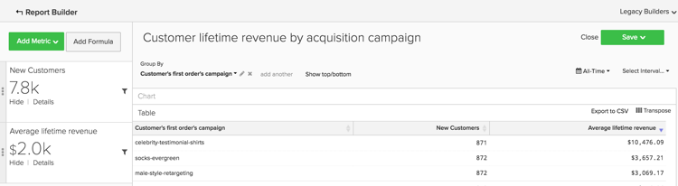

# Analyses de base

Une fois que vous connaissez la plateforme [!DNL Adobe Commerce Intelligence] et que vous avez une compréhension de base de l’outil, vous allez vouloir commencer à créer des rapports. L’une des questions les plus fréquentes que vous vous posez peut-être est : « Que dois-je regarder ? »

Les informations ci-dessous présentent quelques-unes des mesures et rapports courants que vous pourriez trouver utiles. Certains de ces rapports existent déjà dans votre compte. Veillez donc à consulter les mesures et rapports existants dans votre compte pour éviter de créer des doublons.

## Tableaux et colonnes à comprendre

Lors de la création d’une mesure, vous devez connaître quatre informations :

1. Le tableau sur lequel les données résident,
1. L’action spécifique que vous souhaitez effectuer,
1. La colonne sur laquelle vous souhaitez effectuer cette action, et
1. Date et heure à utiliser pour le suivi de ces données.

Il est probable que les noms des tables utilisées dans ces exemples soient légèrement différents de ceux des colonnes et des tables de votre base de données, car chaque base de données est unique. Référencez les définitions ci-dessous si vous avez besoin d&#39;aide pour identifier une table ou une colonne correspondante dans votre base de données.

## Table des clients

Ce tableau contient les informations clés de chaque client, telles qu’un ID client unique, une adresse e-mail, etc. Les exemples ci-dessous utilisent **[!UICONTROL customer_entity]** comme nom d’un exemple de tableau des clients.

Si certains de ces calculs n’existent pas actuellement dans votre base de données, n’importe quel administrateur de votre compte peut les créer. En outre, vous devez vous assurer que ces dimensions sont regroupables pour toutes les mesures applicables.

**Dimensions**

* **[!UICONTROL Entity_id]** : identifiant unique de chaque client. Il peut également s’agir d’un numéro de client unique ou d’une adresse e-mail du client. Cela doit servir de clé de référence pour le tableau de votre commande.
* **[!UICONTROL Created_at]** : date à laquelle le compte du client a été créé et ajouté à votre base de données.
* **[!UICONTROL Customer's lifetime revenue]** : revenu total sur la durée de vie généré par un client.
* **[!UICONTROL Customer's first 30-day revenue]** : montant total du chiffre d’affaires généré par un client au cours de ses 30 premiers jours.
* **[!UICONTROL Customer's lifetime number of orders]** : nombre de commandes passées par un client au cours de sa durée de vie.
* **[!UICONTROL Customer's lifetime number of coupons]** : nombre total de coupons utilisés par un client au cours de sa durée de vie.
* **[!UICONTROL Customer's first order date]** : date de la première commande d’un client. Elle peut être différente de la date created_at si un client n&#39;a pas passé de commande au moment de sa création.

**Acceptez-vous les commandes d&#39;invités ?**

*Si tel est le cas, ce tableau peut ne pas contenir tous vos clients. Contactez l’[équipe d’assistance](https://experienceleague.adobe.com/docs/commerce-knowledge-base/kb/troubleshooting/miscellaneous/mbi-service-policies.html?lang=fr) pour vous assurer que vos analyses client incluent tous les clients.*

*Vous n&#39;êtes pas sûr d&#39;accepter les commandes de clients ? Consultez [cette rubrique](../data-warehouse-mgr/guest-orders.md) pour en savoir plus !*

## Table Commandes

Dans ce tableau, chaque ligne représente un ordre. Les colonnes de ce tableau contiennent des informations de base sur chaque commande, telles que l’identifiant de la commande, la date de création, le statut, l’identifiant du client qui a passé la commande, etc. Les exemples ci-dessous utilisent **[!UICONTROL sales_flat_order]** comme nom d&#39;un tableau d&#39;exemples de commandes.

**Dimensions**

* **[!UICONTROL Customer_id]** : identifiant unique du client qui a passé la commande. Il est souvent utilisé pour déplacer des informations entre les tables des clients et des commandes. Dans ces exemples, vous prévoyez que customer_id sur la table **[!UICONTROL sales_flat_order]** s’aligne sur le **[!UICONTROL entitiy_id]** sur la table **[!UICONTROL customer_entity]**.
* **[!UICONTROL Created_at]** : date à laquelle la commande a été créée ou passée.
* **[!UICONTROL Customer_email]** : adresse électronique du client qui a passé la commande. Il peut également s’agir de l’identifiant unique du client.
* **[!UICONTROL Customer's lifetime number of orders]** : une copie de la colonne portant le même nom dans votre tableau `Customers`.
* **[!UICONTROL Customer's order number]** : numéro de commande séquentiel du client associé à la commande. Par exemple, si la ligne que vous consultez correspond à la première commande d’un client, cette colonne contient la mention « 1 ». Toutefois, s’il s’agit de la 15e commande du client, cette colonne contient la mention « 15 » pour cette commande. Si cette dimension n’existe pas sur votre table de `Customers`, demandez de l’aide à la création auprès de l’équipe [support technique](https://experienceleague.adobe.com/docs/commerce-knowledge-base/kb/troubleshooting/miscellaneous/mbi-service-policies.html?lang=fr).
* **[!UICONTROL Customer's order number (previous-current)]** : concaténation de deux valeurs dans la colonne **[!UICONTROL Customer's order number]**. Elle est utilisée dans un exemple de rapport ci-dessous pour afficher le temps écoulé entre deux commandes. Par exemple, la durée entre la date de première commande d’un client et sa date de deuxième commande est représentée sous la forme « 1-2 » avec ce calcul.
* **[!UICONTROL Coupon_code]** : indique les coupons utilisés pour chaque commande.
* **[!UICONTROL Seconds since previous order]** : délai (en secondes) entre les commandes d’un client ou d’une cliente.

## Table Éléments de commande

Dans ce tableau, chaque ligne représente un article vendu. Cette table contient des informations sur les articles vendus dans chaque commande, telles que le numéro de référence de commande, le numéro de produit, la quantité, etc. Les exemples ci-dessous utilisent `sales_flat_order_item` comme nom d’un exemple de tableau d’éléments de commande.

**Dimensions**

* **[!UICONTROL Item_id]** : identifiant unique de chaque ligne du tableau.
* **[!UICONTROL Order_id]** : clé de référence de votre table `Orders` qui indique quels articles ont été achetés dans la même commande. Si une commande contient plusieurs éléments, cette valeur est répétée.
* **[!UICONTROL Product_id]** : si vous souhaitez obtenir des informations sur le produit spécifique acheté (par exemple, la couleur, la taille, etc.), utilisez cette colonne pour extraire ces informations de votre tableau produits.
* **[!UICONTROL Order's created_at]** : date et heure auxquelles la commande a été passée, généralement copiée dans votre table `order line items` à partir de la table `Orders`.
* **[!UICONTROL Order's coupon_code]** : comme pour la dimension `Order's created_at`, cette colonne est copiée à partir de la table des commandes.

## Tableau des abonnements

Cette table permet de gérer les informations relatives à votre abonnement, telles que l’ID d’abonnement, l’adresse e-mail de l’abonné, la date de début de l’abonnement, etc.

**Dimensions**

* **[!UICONTROL Customer_id]** : identifiant unique du client qui a passé la commande. Il s’agit d’une méthode courante pour créer un chemin d’accès entre la table Clients et la table Commandes. Dans ces exemples, vous prévoyez que le customer_id de la table **sales_flat_order** s’aligne sur le `entitiy_id` de la table `customer_entity`.
* **[!UICONTROL Start date]** : date de début de l’abonnement d’un client.

## Tableau des dépenses marketing

Lors de l’analyse de vos dépenses marketing, vous pouvez inclure des [!DNL Facebook], des [!DNL Google AdWords] ou d’autres sources dans vos analyses. Si vous disposez de plusieurs sources de dépenses marketing, contactez l’équipe [Managed Services](https://business.adobe.com/products/magento/fully-managed-service.html) pour obtenir de l’aide sur la configuration d’un tableau consolidé pour vos campagnes marketing.

**Dimensions**

* **[!UICONTROL Spend]** : dépenses publicitaires totales. En [!DNL Facebook], il s’agit de la colonne des dépenses dans le tableau `facebook_ads_insights_####`. Par [!DNL Google AdWords], il s’agit de la colonne `adCost` dans le tableau `campaigns####`.
* Le `####` ajouté à chacune de ces tables se rapporte à l’identifiant de compte spécifique à votre compte [!DNL Facebook] ou [!DNL Google AdWords].
* **[!UICONTROL Clicks]** : nombre total de clics. En [!DNL Facebook], il s’agit de la colonne clics du tableau `facebook_ads_insights_####`. En [!DNL Google AdWords], il s’agit de la colonne adClicks du tableau `campaigns####` .
* **[!UICONTROL Impressions]** : nombre total d’impressions. En [!DNL Facebook], il s’agit des impressions du tableau `facebook_ads_insights_####`. En [!DNL Google AdWords], ce serait les impressions du tableau `campaigns####`.
* **[!UICONTROL Campaign]** : nombre total de clics. En [!DNL Facebook], il s’agit de la colonne nom_campagne dans la table `facebook_ads_insights_####`. En [!DNL Google AdWords], il s’agit de la colonne de la campagne dans le tableau `campaigns####`.
* **[!UICONTROL Date]** : la date et l’heure auxquelles l’activité (dépenses, clics ou impressions) s’est produite pour une campagne particulière. En [!DNL Facebook], il s’agit de la colonne `date_start` dans le tableau `facebook_ads_insights_####`. En [!DNL Google AdWords], il s’agit de la colonne de date du tableau `campaigns####`.
* **[!UICONTROL Customer's first order's source]** : origine de la commande à partir de la première commande d’un client. Tout d’abord, vérifiez si votre compte comporte une colonne nommée `customer's first order's source`. Si cette colonne n’apparaît pas, vous pouvez la créer à l’aide des instructions suivantes.
* **[!UICONTROL Customer's first order's medium]** : support de la commande à partir de la première commande d’un client. Tout d’abord, vérifiez si votre compte comporte une colonne nommée `customer's first order's source`. Si cette colonne n’apparaît pas, vous pouvez la créer à l’aide des instructions suivantes.
* **[!UICONTROL Customer's first order's campaign]** : campagne de la commande à partir de la première commande d’un client. Tout d’abord, vérifiez si votre compte comporte une colonne nommée `customer's first order's source`. Si cette colonne n’apparaît pas, vous pouvez la créer à l’aide des instructions suivantes.

## Rapports et mesures courants

Voici quelques exemples courants de rapports et de mesures que vous pouvez trouver utiles :

* [Customer Analytics](#customeranalytics)
* [Analyse des commandes](#orderanalytics)
* [Analyse des dépenses marketing](#mktgspendanalytics)

## Analyse des clients {#customeranalytics}

### Nouveaux utilisateurs

* **Description** : nombre total d’utilisateurs nouvellement acquis sur une période donnée. `New Users` est différent de `Unique Customers`, car `New Users` possède la date et l’heure de création d’un compte avec votre service (cela ne signifie pas nécessairement qu’ils ont passé une commande) alors que `Unique Customers` avez passé au moins une commande.
* **Définition de mesure** : cette mesure effectue un **Nombre** de `entity_id` à partir `customer_entity` tableau trié par `created_at`.
* **Exemple de rapport** : nombre de nouveaux utilisateurs créés le mois dernier
   * **[!UICONTROL Metric]** : `New Users`
   * **[!UICONTROL Time Range]** : `Last Month`
   * **[!UICONTROL Time Interval]** : `By Day`

<!--{: width="929"}-->

### Clients uniques

* **Description** : nombre total de clients et clientes distincts sur une période donnée. Cette opération est différente de `New Users`, car elle ne suit que les clients qui ont passé au moins une commande. Le rapport d’un client distinct ne suit un client qu’une seule fois dans un intervalle de temps donné. Si vous définissez l’intervalle de temps sur `By Day` et qu’un client effectue plusieurs achats ce jour-là, il n’est comptabilisé qu’une seule fois. Si vous souhaitez afficher le nombre total d’achats en général, regardez `Number of Orders`.
* **Définition de mesure** : cette mesure effectue un **Comptage distinct** de `customer_id` à partir `sales_flat_order` tableau trié par `created_at`.
* **Exemple de rapport** : clients distincts par semaine au cours des 90 derniers jours
   * **[!UICONTROL Metric]** : `Distinct Customers`
   * **[!UICONTROL Time Range]** : `Moving range > Last 90 Days`
   * **[!UICONTROL Time Interval]** : `By Day`

<!--{: width="929"}-->

### Nouveaux abonnés

* **Description** : nombre total de nouveaux abonnés acquis au cours d’une période donnée.
* **Définition de mesure** : cette mesure effectue un **Comptage distinct** de `customer_id` à partir `subscriptions` tableau trié par `start_date`.
* **Exemple de rapport** : nouveaux abonnés cette année, par mois
   * **[!UICONTROL Metric]** : `New Subscribers`
   * **[!UICONTROL Time Range]** : `1 Year Ago to 0 Days Ago`
   * **[!UICONTROL Time Interval]** : `By Month`

<!--{: width="929"}-->

### Clients réguliers

* **Description** : nombre total de clients qui ont passé plusieurs commandes au cours d&#39;une période donnée. Dans un rapport de clients réguliers, vous pouvez utiliser la mesure `Distinct Customers` et la dimension `Customer's Order Number` de votre tableau de `orders`.
* **Mesure utilisée** : `Distinct Customers`
* **Exemple de rapport** : nombre de 2e et 3e achats effectués l’année dernière
   * **[!UICONTROL Metric]** : `Distinct Customers`
   * **[!UICONTROL Time Range]** : `Moving Range > Last Year`
   * **[!UICONTROL Time Interval]** : `By Month`
   * **[!UICONTROL Group By]** : `Customer's Order Number`, puis sélectionnez `2` et `3`

  

* **Exemple de rapport 2** : nombre de clients réguliers l’année dernière
   * **[!UICONTROL Metric]** : `Distinct Customers`
   * **[!UICONTROL Filters]** : `Customer's Order Number Greater Than 1`
   * **[!UICONTROL Time Range]** : `Moving range > Last Year`
   * **[!UICONTROL Time Interval]** : `By Month`

  <!--{: width="929"}-->

### Principaux clients par nombre de commandes sur la durée de vie

* **Description** : liste des principaux clients en fonction de leur nombre total de commandes. Vous obtenez ainsi une liste directe de vos acheteurs les plus fréquents.
* **Mesure utilisée** : `Orders`
* **Exemple de rapport** : 25 premiers clients par nombre de commandes sur la durée de vie
   * **[!UICONTROL Metric]** : `Orders`
   * **[!UICONTROL Time Range]** : `All Time`
   * **[!UICONTROL Time Interval]** : `None`
   * **[!UICONTROL Group By]** : `customer_email`
   * **[!UICONTROL Show Top/Bottom]** : Top 25 des classements par commandes

  <!--{: width="929"}-->

### Principaux clients par chiffre d’affaires de durée de vie

* **Description** : liste des principaux clients en fonction du chiffre d’affaires cumulé au cours de la vie.
* **Mesure utilisée** : `Average Lifetime Revenue`
* **Exemple de rapport** : 25 premiers clients par chiffre d’affaires de durée de vie
   * **[!UICONTROL Metric]** : `Average Lifetime Revenue`
   * **[!UICONTROL Time Range]** : `All time`
   * **[!UICONTROL Time Interval]** : `None`
   * **[!UICONTROL Group By]** : `customer_email`
   * **[!UICONTROL Show Top Bottom]** : les 25 premiers par chiffre d&#39;affaires cumulé

  <!--{: width="929"}-->

### Chiffre d’affaires moyen au cours de la vie par cohorte

* **Description** : suivez le [chiffre d’affaires moyen au cours de la durée de vie de cohortes distinctes](../dev-reports/lifetime-rev-cohort-analysis.md) des utilisateurs au fil du temps pour identifier les cohortes les plus performantes. Les cohortes sont regroupées par une date commune, telle que la date de première commande ou la date de création.
* **Mesure utilisée** : `Revenue`
* **Exemple de rapport** : Chiffre d’affaires moyen sur la durée de vie du client par cohorte
   * **[!UICONTROL Metric]** : `Revenue`
   * **[!UICONTROL Cohort Date]** : `Customer's first order date`
   * **[!UICONTROL Time Interval]** : `Month`
   * **[!UICONTROL Time Period]** : ensemble mobile de cohortes des huit dernières cohortes avec au moins quatre mois de données
   * **[!UICONTROL Duration]** : `12 Month(s)`
   * **[!UICONTROL Table]** : `Customer_entity`
   * **[!UICONTROL Perspective]** : Valeur Moyenne Cumulée Par Membre De Cohorte

  <!--{: width="929"}-->

### Clients par utilisation de coupon

* **Description** : nombre de clients acquis qui ont utilisé un code de coupon/remise. Cela peut vous aider à obtenir une vue claire de vos demandeurs de remise par rapport aux acheteurs à prix plein.
* **Mesure utilisée** : `New Users`
* **Exemple de rapport** : clients avec et sans coupon par mois
   * **[!UICONTROL Metric A]** : `Non coupon customers`
   * **[!UICONTROL Metric]** : `New Users`
   * **[!UICONTROL Filters]** : nombre de commandes de durée de vie du client supérieur à 0 et nombre de coupons de durée de vie du client égal à 0.
   * **[!UICONTROL Metric B]** : `Coupon customers`
   * **[!UICONTROL Metric]** : `New Users`
   * **[!UICONTROL Filters]** : nombre de commandes de durée de vie des clients supérieur à 0 et nombre de coupons de durée de vie des clients supérieur à 0
   * **[!UICONTROL Time range]** : `All Time`
   * **[!UICONTROL Time interval]** : `By Month`

  <!--{: width="929"}-->

* **Exemple de rapport 2** : Pourcentage de clients avec et sans coupon par mois
   * **[!UICONTROL Metric A]** : `Non coupon customers` (masquer la mesure)
      * **[!UICONTROL Metric]** : `New Users`
      * **[!UICONTROL Filters]** : `Customer's Lifetime Number of Orders Greater Than 0` et `Customer's Lifetime Number of Coupons Equal to 0`
   * **[!UICONTROL Metric B]** : `Coupon customers`
      * **[!UICONTROL Metric]** : `New Users`
      * **[!UICONTROL Filters]** : `Customers Lifetime Number of Orders Greater Than 0` et `Customer's Lifetime Number of Coupons Greater Than 0`
   * **[!UICONTROL Time Range]** : `All Time`
   * **[!UICONTROL Time Interval]** : `By Month`
   * **[!UICONTROL Formula]** : `B/(A+B)`

>[!NOTE]
>
> **Masquer toutes les mesures**

<!--{: width="929"}-->

### Chiffre d’affaires moyen sur les 30 premiers jours

* **Description** : moyenne du montant du chiffre d’affaires généré par les clients au cours de leurs 30 premiers jours en tant que client.
* **Description de la mesure** : cette mesure effectue une **Moyenne** de `Customer's First 30 Day Revenue` à partir `customer_entity` tableau trié par `created_at`.
* **Description du rapport** : moyenne historique du premier chiffre d’affaires sur 30 jours du client
   * **[!UICONTROL Metric]** : `Average First 30 Day Revenue`
   * **[!UICONTROL Time Range]** : `All Time`
   * **[!UICONTROL Time Interval]** : `None`

<!--{: width="929"}-->

### Chiffre d’affaires moyen du client sur la durée de vie

* **Description** : montant moyen des revenus générés par vos clients au cours de leur durée de vie.
* **Description de la mesure** : cette mesure effectue une **Moyenne** de la colonne `Customer's Lifetime Revenue` dans le tableau `customer_entity` en fonction de la `created_at`.
* **Description du rapport** : Moyenne historique du chiffre d&#39;affaires du client sur toute sa durée de vie
   * **[!UICONTROL Metric]** : `Average Customer Lifetime Revenue`
   * **[!UICONTROL Time Range]** : `All Time`
   * **[!UICONTROL Time Interval]** : `None`

<!--{: width="929"}-->

## Analyse des commandes {#orderanalytics}

### Chiffre d’affaires

* **Description** : la mesure des revenus affiche le revenu total gagné sur une période sélectionnée.
* Cette mesure effectue une **somme** de `grand_total` à partir `sales_flat_order` tableau trié par `created_at`.
* **Exemple de rapport** : Chiffre d’affaires par mois, Cumul annuel
   * **[!UICONTROL Metric]** : `Revenue`
   * **[!UICONTROL Time Range]** : `1 Year Ago to 1 Month Ago`
   * **Intervalle de temps** : `By Month`

>[!TIP]
>
>Assurez-vous que le calcul de votre mesure de chiffre d’affaires est cohérent avec la définition dont vous discutez en interne. Par exemple, vous pouvez vouloir comptabiliser les recettes provenant de commandes qui ont été expédiées, convertir des devises de différentes régions ou exclure la taxe. Vous pouvez également utiliser des [jeux de filtres](../../data-user/reports/ess-manage-data-filters.md) pour garantir la cohérence de toutes les mesures créées sur la même table.

<!--{: width="929"}-->

### Commandes

* **Description** : nombre total de commandes sur une période donnée. Un rapport Commandes effectue le suivi des modifications du volume de commande provoquées par de nouvelles offres de produits, des promotions ou toute autre chose susceptible d’augmenter (ou de réduire) le volume des transactions. Vous pouvez souvent segmenter cette mesure en fonction de certaines variables pour répondre à vos questions.
* **Définition de la mesure** : cette mesure effectue un **Nombre** de `entity_id` à partir `sales_flat_order` tableau trié par `created_at`.
* **Exemple de rapport** : Commandes par mois, cumulé sur l&#39;exercice en cours
   * **[!UICONTROL Metric]** : `number of orders`
   * **[!UICONTROL Time Range]** : `1 Year Ago to 1 Month Ago`
   * **[!UICONTROL Time Interval]** : `By Month`

>[!TIP]
>
>Tout comme la mesure du chiffre d’affaires, vous devez avoir [Ensembles de filtres](../../data-user/reports/ess-manage-data-filters.md) en place pour exclure les commandes incomplètes, de test ou renvoyées.

<!--{: width="929"}-->

### Produits commandés

* **Description** : la mesure Produits commandés indique la quantité d’articles vendus sur une période spécifique.
* **Définition de la mesure** : cette mesure effectue une **somme** de `qty_ordered` à partir `sales_flat_order_item` tableau trié par `created_at`.
* **Exemple de rapport** : articles vendus par mois, cumulé sur l&#39;exercice en cours
   * **[!UICONTROL Metric]** : `Products ordered`
   * **[!UICONTROL Time Range]** : `1 Year Ago to 1 Month Ago`
   * **[!UICONTROL Time Interval]** : `By Month`

  <!--{: width="929"}-->

* Combinez cette mesure avec votre mesure Nombre de commandes pour calculer le nombre d’articles par commande. Ensuite, ajoutez des codes de coupon au rapport pour déterminer l’impact de vos promotions sur la taille du panier ou segmentez les commandes nouvelles par rapport aux commandes répétées afin de mieux comprendre le comportement de vos clients.
* **Exemple de rapport** : Produits par commande : première commande ou commandes répétées
   * **[!UICONTROL Metric A]** : Produits commandés : première commande
      * **[!UICONTROL Metric]** : `Products ordered`
      * **[!UICONTROL Filter]** : `Customer's order number = 1`
   * **[!UICONTROL Metric B]** : Commandes : première commande
      * **[!UICONTROL Metric]** : `Orders`
      * **[!UICONTROL Filter]** : `Customer's order number = 1`
   * **[!UICONTROL Metric C]** : Produits commandés : commandes répétées
      * **[!UICONTROL Metric]** : `Products ordered`
      * **[!UICONTROL Filter]** : `Customer's order number > 1`
   * **[!UICONTROL Metric D]** : commandes : commandes répétées
      * **[!UICONTROL Metric]** : `Orders`
      * **[!UICONTROL Filter]** : `Customer's order number > 1`
   * **[!UICONTROL Time Range]** : `1 Year Ago to 1 Month Ago`
   * **[!UICONTROL Time Interval]** : `By Week`
   * **[!UICONTROL Formula 1]** : `A/B`
   * **[!UICONTROL Formula 2]** : `C/D`

>[!NOTE]
>
>Décocher la `Multiple Y-Axes box` et `Hide` toutes les mesures

<!--{: width="929"}-->

### Valeur de commande moyenne

* **Description** : suivez la valeur moyenne des commandes passées sur une période. Utilisez cette mesure pour déterminer rapidement comment votre valeur de commande moyenne (AOV) a fluctué en raison de vos efforts de marketing, de votre offre de produits et/ou d’autres changements dans votre entreprise.
* **Définition de la mesure** : cette mesure effectue une **moyenne** de `grand_total` à partir `sales_flat_order` tableau trié par `created_at`.
* **Exemple de rapport** : AOV par rapport à l’année précédente, YTD
   * **[!UICONTROL Metric]** : `Average order value`
   * **[!UICONTROL Time Range]** : `1 Year Ago to 1 Month Ago`
   * **[!UICONTROL Time Interval]** : `By Month`
   * **[!UICONTROL Perspective]** : `Amount Change vs Previous Year`

  <!--{: width="929"}-->

### Produits les plus achetés avec des coupons

* **Description** : ce rapport fournit insight dans lequel les produits sont vendus lorsque vous proposez des promotions ou des coupons.
* **Mesure utilisée** : Produits commandés
* **Exemple de rapport** : produits les plus achetés avec des coupons
   * **[!UICONTROL Metric]** : `Products ordered`
   * **[!UICONTROL Filter]** : `Order's coupon_code Is Not \[NULL\]`
   * **[!UICONTROL Time Range]** : `All-Time`
   * **[!UICONTROL Time Interval]** : `None`
   * **[!UICONTROL Group By**] : `name` (ou `SKU`, ou tout autre identifiant de produit)
   * **[!UICONTROL Show top/bottom]** : Top 25 triés par Produits commandés

  <!--{: width="929"}-->

### Durée entre les commandes

* **Description** : testez vos hypothèses et vos attentes concernant les cycles d’achat de vos clients avec une analyse **délai entre les commandes** qui examine le délai moyen (ou médian !) entre les achats. Dans le graphique ci-dessous, vous pouvez constater que vos meilleurs clients, ceux qui passent plus de trois commandes, effectuent leur deuxième achat en moins de six mois. Les clients qui n&#39;ont pas passé une quatrième commande attendent 14 mois avant d&#39;effectuer un deuxième achat.
* **Définition de la mesure** : cette mesure effectue une **moyenne** de `Time since previous order` à partir des `sales_flat_order` triées par `created_at`.
* **Exemple de rapport** :
   * **Mesure 1** : ≤ 3 commandes
      * **[!UICONTROL Metric]** : `Average time between orders`
      * **[!UICONTROL Filter]** : `Customer's lifetime number of orders ≤ 3`
   * **Mesure 2**: > 3 commandes
      * **[!UICONTROL Metric]** : `Average time between orders`
      * **[!UICONTROL Filter]** : `Customer's lifetime number of orders > 3`
   * **[!UICONTROL Time Range]** : `All-Time`
   * **[!UICONTROL Time Interval]** : `None`
   * **[!UICONTROL Group By]**:` Customer's order number (previous-current)`

>[!NOTE]
>
>Décochez la case `Multiple Y-Axes` .

<!--{: width="929"}-->

## Analyse des dépenses marketing {#mktgspendanalytics}

### Dépenses publicitaires

* **Description** : vous pouvez analyser vos dépenses marketing sur différentes périodes et intervalles, par campagnes ou ensembles publicitaires, ou d’autres segmentations.
* **Définition de mesure** : cette mesure effectue une Somme sur la colonne Dépenses du tableau `Marketing Spend` trié par la colonne `date`.
* **Exemple de rapport** : dépenses publicitaires par campagne
   * **[!UICONTROL Metric]** : `Ad spend`
   * **[!UICONTROL Time Range]** : `All-Time`
   * **[!UICONTROL Time Interval]** : `None`
   * **[!UICONTROL Group By]** : `campaign`

<!--{: width="929"}-->

### Impressions et clics publicitaires

* **Description** : en plus d’analyser les dépenses publicitaires, vous pouvez analyser vos impressions et clics publicitaires.
* **Définition de la mesure** : cette mesure effectue une Somme sur la colonne des impressions (ou clics) du tableau `Marketing Spend` trié par la colonne de date.
* **Exemple de rapport** : ajouter des impressions et des clics publicitaires par jour
   * **[!UICONTROL Metric A]** : `Ad impressions`
   * **[!UICONTROL Metric B]** : `Ad clicks`
   * **[!UICONTROL Time Range]** : `1 Year Ago to 3 Months Ago`
   * **[!UICONTROL Time Interval]** : `By Day`

  <!--{: width="929"}-->

### Taux de clic publicitaire (CTR)

* **Description** : à l’aide des mesures d’impressions et de clics publicitaires que vous avez créées ci-dessus, vous pouvez analyser votre taux de clics par différentes campagnes au fil du temps.
* **Exemple de rapport** : Taux de clics par campagne
   * **[!UICONTROL Metric A]** : `Ad impressions`
   * **[!UICONTROL Metric B]** : `Ad clicks`
   * **[!UICONTROL Time Range]**:`All-Time`
   * **[!UICONTROL Time Interval]** : `None`
   * **[!UICONTROL Formula]** : `B/A`
   * Sélectionnez l’option `%` .
   * **[!UICONTROL Group By]** : `campaign`

>[!NOTE]
>
>Vous pouvez **titre** la formule comme `CTR` et **masquer** toutes les mesures.

<!--{: width="929"}-->

### Coût par clic (CPC)

* **Description** : à l’aide des mesures de dépenses publicitaires et de clics publicitaires que vous avez créées ci-dessus, vous pouvez analyser votre coût par clic par différentes campagnes au fil du temps.
* **Exemple de rapport** : CPC par campagne
   * **[!UICONTROL Metric A]** : `Ad spend`
   * **[!UICONTROL Metric B]** : `Ad clicks`
   * **[!UICONTROL Time Range]** : `All-Time`
   * **[!UICONTROL Time Interval]** : `None`
   * **[!UICONTROL Formula]** : `A/B`
   * Sélectionnez l’option `currency` .
   * **[!UICONTROL Group By]** : `campaign`

>[!NOTE]
>
>Vous pouvez **titre** la formule comme `CPC` et **masquer** toutes les mesures.

<!--{: width="929"}-->

### Clients par source d&#39;acquisition

* **Description** : si vous suivez l’origine, le support et la campagne d’une commande à l’aide de [!DNL Google eCommerce], vous pouvez analyser vos clients par leur source d’acquisition. Cela vous permet d’identifier les sources marketing qui acquièrent des clients et de répondre à des questions du type « La plupart de vos clients passent-ils leurs premières commandes par le biais de [!DNL Google], [!DNL Facebook] ou d’une autre source ? »
* **Exemple de rapport** : Clients par origine d&#39;acquisition
   * **[!UICONTROL Metric Used]** : `New Customers`
   * **[!UICONTROL Time Range]** : `All-Time`
   * **[!UICONTROL Time Interval]** : `By Month`
   * **[!UICONTROL Group By]** : `Customer's first order's source`

>[!NOTE]
>
>Consultez [cet article](../analysis/most-value-source-channel.md) pour plus d’exemples de rapports utilisant une source d’acquisition.

<!--{: width="929"}-->

### Clients par support d’acquisition et campagne d’acquisition

* **Description** : comme pour l’analyse des clients par source d’acquisition, vous pouvez également analyser vos clients par le support et la campagne de leur première commande. Cela peut vous aider à répondre à des questions du type « Quelles campagnes attirent de nouveaux clients ? »
* **Exemple de rapport** : Clients par campagne d’acquisition avec support payant
   * **[!UICONTROL Metric Used]** : `New customers`
   * **[!UICONTROL Filter]** : `Customer's first order's medium IN ppc`
   * **[!UICONTROL Time Range]** : `All-Time`
   * **[!UICONTROL Time Interval]** : `None`
   * **[!UICONTROL Group By]** : `Customer's first order's campaign`

>[!NOTE]
>
>Pour le filtre de votre mesure `New Customers`, vous pouvez ajouter tout autre média considéré comme un média « payant » pour votre entreprise, tel que cpc ou référencement payant.

<!--{: width="929"}-->

### Coût d’acquisition client (CAC) ou coût par acquisition (CPA)

* **Description** : une façon d’analyser le coût d’une campagne consiste à attribuer tous les coûts aux seuls clients que vous avez acquis par le biais de la campagne.
* **Exemple de rapport** : CAC par campagne
   * **[!UICONTROL Metric A]** : `New customers`
   * **[!UICONTROL Filter]** : `Customer's first order's medium IN ppc`
   * **[!UICONTROL Metric B]** : `Ad Spend`
   * **[!UICONTROL Time Range]** : `All-Time`
   * **[!UICONTROL Time Interval]** : `None`
   * **[!UICONTROL Formula]** : `B/A`
   * Sélectionnez l’option `currency` .
   * **[!UICONTROL Group By]** :
      * Pour les `A` de mesures, sélectionnez `Customer's first order's campaign`
      * Pour les `B` de mesures, sélectionnez `campaign`

  

>[!NOTE]
>
>Vous pouvez **titre** la formule comme `CTR` et **masquer** toutes les mesures. Consultez également [cet article](../analysis/roi-ad-camp.md) pour plus d’informations.

### Valeur de durée de vie par source d’acquisition, support et campagne

* **Description** : en plus d’analyser le nombre de clients acquis par chaque campagne, vous pouvez analyser le chiffre d’affaires moyen de ces clients sur toute leur durée de vie. Vous pouvez ainsi identifier :
   * Si certaines campagnes attirent un grand volume de clients, mais que ces clients ont une valeur de durée de vie faible.
   * Si certaines campagnes attirent un faible volume de clients, mais que ces clients ont une valeur de durée de vie élevée.
* **Exemple de rapport** : ajoutez d’abord la mesure `New customers`. Ajoutez ensuite la mesure `Average lifetime revenue` . Sélectionnez la période souhaitée et choisissez la `interval` comme `None`. Enfin, sélectionnez l’option `group by` en tant que `Customer's first order's campaign`.
   * **[!UICONTROL Metric A]** : `New Customers`
   * **[!UICONTROL Filter A]** : `Customer's first order's source` COMME &#39;%google%&#39;
   * **[!UICONTROL Filter B]** : `Customer's first order's medium IN ppc`
   * **[!UICONTROL Metric B]** : `Average lifetime revenue`
   * **[!UICONTROL Filter A]** : `Customer's first order's source` COMME &#39;%google%&#39;
   * **[!UICONTROL Filter B]** : `Customer's first order's medium IN ppc`
   * **[!UICONTROL Time Range]** : `All-Time`
   * **[!UICONTROL Time Interval]** : `None`
   * **[!UICONTROL Group By]** : `Customer's first order's campaign`

>[!NOTE]
>
>Pour les deux filtres, vous pouvez ajouter d’autres supports considérés comme des supports « payants » pour votre entreprise (tels que cpc ou référencement payant). Vous pouvez également ajouter d’autres sources que vous souhaitez analyser, telles que Facebook. Consultez [cet article](../analysis/roi-ad-camp.md) pour plus de détails sur les CAC, le LTV et le RSI.

<!--{: width="929"}-->

### Retour sur investissement (ROI)

* **Description** : pour calculer le retour sur investissement par campagne, analysez toutes les commandes passées par le biais de la campagne. Cependant, une autre méthode analyse la valeur de durée de vie des clients acquise par le biais d’une campagne. Pour analyser le retour sur investissement, il est important que les noms des campagnes soient cohérents entre vos données de dépenses et vos données transactionnelles. Si vous créez le rapport suivant et qu’il n’existe aucune valeur de retour sur investissement en raison de noms de campagne incompatibles, vous devrez peut-être vérifier le balisage [UTM](../../best-practices/utm-tagging-google.md) que vous avez implémenté.
* **Exemple de rapport** : RSI par campagne
   * **[!UICONTROL Metric A]** : `New Customers`
   * **[!UICONTROL Filter A]** : `Customer's first order's source` COMME &#39;%google%&#39;
   * **[!UICONTROL Filter B]** : `Customer's first order's medium IN ppc`
   * **[!UICONTROL Metric B]** : `Average lifetime revenue`
   * **[!UICONTROL Filter A]** : `Customer's first order's source` COMME &#39;%google%&#39;
   * **[!UICONTROL Filter B]** : `Customer's first order's medium IN ppc`
   * **[!UICONTROL Metric C]** : `Ad spend`
   * **[!UICONTROL Time Range]** : `All-Time`
   * **[!UICONTROL Time Interval]** : `None`
   * **[!UICONTROL Formula]** : `(B-(C/A))/(C/A)`
   * Sélectionnez l’option `% `
   * **[!UICONTROL Group By]** :
      * Pour les `A` de mesures et les `B`, sélectionnez `Customer's first order's campaign`
      * Pour les `C` de mesures, sélectionnez `campaign`

>[!NOTE]
>
>Vous pouvez donner au calcul le titre « RSI » et masquer toutes les mesures. En outre, vous pouvez ajuster les filtres dans les mesures pour analyser les sources et supports alternatifs. Consultez également [cette rubrique](../analysis/roi-ad-camp.md) pour plus de détails sur les CAC, le LTV et le RSI.

<!--{: width="929"}-->

<!--{: width="929"}-->
