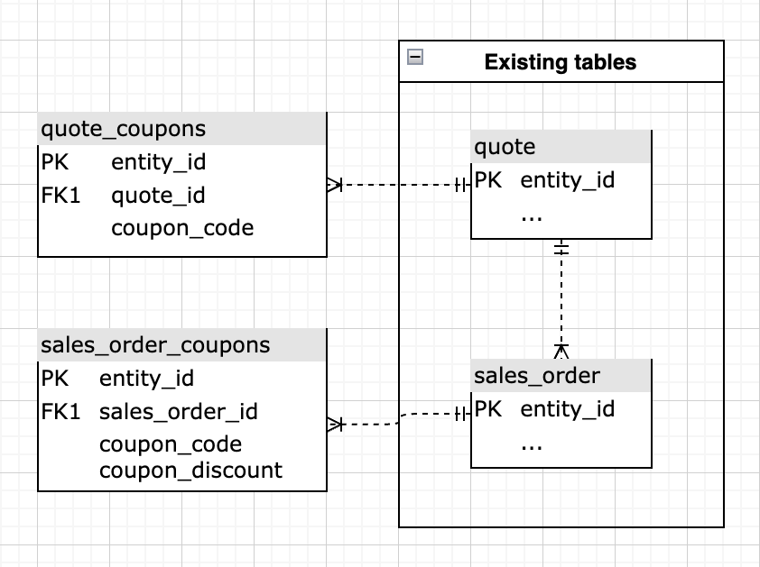

# Analyse du code de coupon de base

Comprendre la performance des coupons de votre entreprise est un moyen intéressant de segmenter vos commandes et de mieux comprendre les habitudes des clients.

Cette rubrique décrit les étapes requises pour créer cette analyse afin de comprendre les performances des clients dotés de coupons, de voir les tendances et de suivre l’utilisation du code de coupon individuel.

<!--{: width="807" height="471"}-->

## Prise en main

Tout d’abord, une note sur la façon dont les codes de coupon sont suivis. Si un client a appliqué un coupon à une commande, trois choses se produisent :

* Une remise est reflétée dans le montant `base_grand_total` (votre mesure `Revenue` dans Commerce Intelligence)
* Le code de coupon est stocké dans le champ `coupon_code` . Si ce champ est NULL (vide), aucun coupon n&#39;est associé à la commande.
* Le montant actualisé est stocké dans `base_discount_amount`. Selon votre configuration, cette valeur peut sembler négative ou positive.

Depuis Commerce version 2.4.7, un client peut appliquer plusieurs codes de coupon à une commande. Dans ce cas :

* Tous les codes de coupon appliqués sont stockés dans le champ `coupon_code` de `sales_order_coupons`. Le premier code de coupon appliqué est également stocké dans le champ `coupon_code` de `sales_order`. Si ce champ est NULL (vide), aucun coupon n&#39;est associé à la commande.

## Création d’une mesure

La première étape consiste à créer une mesure en procédant comme suit :

* Accédez à **[!UICONTROL Manage Data > Metrics > Create New Metric]**.

* Sélectionnez le `sales_order`.
* Cette mesure effectue une **Somme** sur la colonne **base_discount_amount**, triée par **created_at**.
   * [!UICONTROL Filters] :
      * Ajouter le `Orders we count` (jeu de filtres enregistré)
      * Ajoutez le code suivant :
         * `coupon_code`**N’EST PAS**`[NULL]`
      * Attribuez un nom à la mesure, par exemple `Coupon discount amount`.

## Création de votre tableau de bord

* Une fois la mesure créée :
   * Accédez à **.[!UICONTROL Dashboards > Dashboard Options > Create New Dashboard]
   * Attribuez un nom tel que `_Coupon Analysis_` au tableau de bord.

* C’est là que vous créez et ajoutez tous les rapports.

## Création de rapports

* **Nouveaux rapports :**

>[!NOTE]
>
>La ** de chaque rapport est répertoriée comme [!UICONTROL Time Period]. `All-time` N’hésitez pas à modifier ce paramètre en fonction de vos besoins d’analyse. Adobe recommande que tous les rapports de ce tableau de bord couvrent la même période, par exemple `All time`, `Year-to-date` ou `Last 365 days`.

* **Commandes avec coupons**
   * 
     [!UICONTROL Metric]: `Orders`
      * Ajouter un filtre :
         * [`A`] `coupon_code` **N’EST PAS** `[NULL]`

   * [!UICONTROL Time period] : `All time`
   * 
     [!UICONTROL Intervalle]: `None`
   * [!UICONTROL Chart type]:`Number (scalar)`

* **Commandes sans coupons**
   * 
     [!UICONTROL Metric]: `Orders`
      * Ajouter un filtre :
         * [`A`] `coupon_code` **IS** `[NULL]`

   * [!UICONTROL Time period] : `All time`
   * 
     [!UICONTROL Intervalle]: `None`
   * [!UICONTROL Chart type]:`Number (scalar)`

* **Chiffre d’affaires net des commandes avec coupons**
   * 
     [!UICONTROL Metric]: `Revenue`
      * Ajouter un filtre :
         * [`A`] `coupon_code` **N’EST PAS** `[NULL]`

   * [!UICONTROL Time period] : `All time`
   * 
     [!UICONTROL Intervalle]: `None`
   * [!UICONTROL Chart type] : `Number (scalar)`

* **Remises sur coupons**
   * [!UICONTROL Metric] : `Coupon discount amount`
   * [!UICONTROL Time period] : `All time`
   * 
     [!UICONTROL Intervalle]: `None`
   * [!UICONTROL Chart type] : `Number (scalar)`

* **Chiffre d’affaires moyen sur la durée de vie : coupon acquis par les clients**
   * [!UICONTROL Metric] : `Avg lifetime revenue`
      * Ajouter un filtre :
         * [`A`] `Customer's first order's coupon_code` **N’EST PAS** `[NULL]`

   * [!UICONTROL Time period] : `All time`
   * 
     [!UICONTROL Intervalle]: `None`
   * [!UICONTROL Chart type] : `Number (scalar)`

* **Chiffre d’affaires moyen sur la durée de vie : clients acquis sans coupon**
   * [!UICONTROL Metric] : `Avg lifetime revenue`
      * Ajouter un filtre :
         * [A] `Customer's first order's coupon_code` **IS**`[NULL]`

   * [!UICONTROL Time period] : `All time`
   * 
     [!UICONTROL Intervalle]: `None`
   * [!UICONTROL Chart type] : `Number (scalar)`

* **Informations sur l’utilisation des coupons (premières commandes)**
   * `1` de mesure : `Orders`
      * Ajouter un filtre :
         * [`A`] `coupon_code` **NON**`[NULL]`
         * [`B`] `Customer's order number` **égal à** `1`

   * `2` de mesure : `Revenue`
      * Ajouter un filtre :
         * [`A`] `coupon_code` **NON**`[NULL]`
         * [`B`] `Customer's order number` **égal à** `1`

      * Renommer : `Net revenue`

   * `3` de mesure : `Coupon discount amount`
      * Ajouter un filtre :
         * [`A`] `coupon_code` **NON**`[NULL]`
         * [`B`] `Customer's order number` **égal à** `1`

   * Créer une formule : `Gross revenue`
      * [!UICONTROL Formula] : `(B – C)`
      * 
        [!UICONTROL Format]: `Currency`

   * Créer une formule : **% de remise**
      * Formule : `(C / (B - C))`
      * 
        [!UICONTROL Format]: `Percentage`

   * Créer une formule : `Average order discount`
      * [!UICONTROL Formula] : `(C / A)`
      * 
        [!UICONTROL Format]: `Percentage`

   * [!UICONTROL Time period] : `All time`
   * 
     [!UICONTROL Intervalle]: `None`
   * 
     [!UICONTROL Type de graphique]: `Table`

* **Chiffre d’affaires moyen sur la durée de vie par coupon de première commande**
   * [!UICONTROL Metric]:**Chiffre d’affaires moyen sur la durée de vie**
      * Ajouter un filtre :
         * [`A`] `coupon_code` **EST**`[NULL]`

   * [!UICONTROL Time period] : `All time`
   * 
     [!UICONTROL Intervalle]: `None`
   * [!UICONTROL Chart type] : `Number (scalar)`

* **Informations sur l’utilisation des coupons (premières commandes)**
   * [!UICONTROL Metric] : `Avg lifetime revenue`
      * Ajouter un filtre :
         * [`A`] `Customer's first order's coupon_code` **N’EST PAS** `[NULL]`

   * [!UICONTROL Time period] : `All time`
   * 
     [!UICONTROL Intervalle]: `None`
   * [!UICONTROL Group by] : `Customer's first order's coupon_code`
   * 
     [!UICONTROL Type de graphique]: **Column**

* **Nouveaux clients par acquisition de coupon/hors coupon**
   * `1` de mesure : `New customers`
      * Ajouter un filtre :
         * [`A`] `Customer's first order's coupon_code` **N’EST PAS** `[NULL]`

      * [!UICONTROL Rename] : `Coupon acquisition customer`

   * `2` de mesure : `New customers`
      * Ajouter un filtre :
         * [`A`] `coupon_code` **EST**`[NULL]`

      * [!UICONTROL Rename] : `Non-coupon acquisition customer`

   * [!UICONTROL Time period] : `All time`
   * [!UICONTROL Interval] : `By Month`
   * [!UICONTROL Chart type] : `Stacked Column`

Une fois les rapports créés, reportez-vous à l’image en haut de cette rubrique pour savoir comment organiser les rapports sur votre tableau de bord.

>[!NOTE]
>
>Depuis Adobe Commerce 2.4.7, les clients peuvent utiliser les tables **quote_coupons** et **sales_order_coupons** pour obtenir des informations sur la manière dont les clients utilisent plusieurs coupons.

