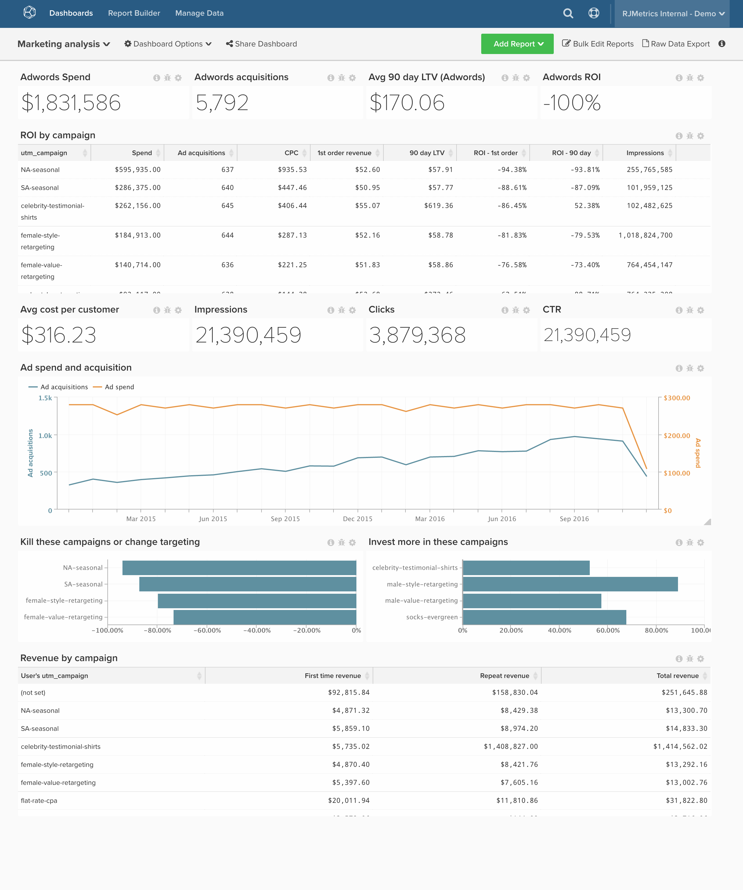

# Retour sur investissement marketing

>[!NOTE]
>
>Cette rubrique contient des instructions pour les clients qui utilisent l’architecture d’origine et la nouvelle architecture. Vous passez à la [nouvelle architecture](../../administrator/account-management/new-architecture.md) si la section « Vues Data Warehouse » est disponible après avoir sélectionné « Gérer les données » dans la barre d’outils principale.

Si vous dépensez de l&#39;argent dans la publicité en ligne, vous voulez suivre le rendement de ces dépenses et prendre des décisions fondées sur des données pour d&#39;autres investissements. Cette rubrique explique comment configurer un tableau de bord qui effectue le suivi de votre analyse des canaux, y compris le retour sur investissement global et par campagne.

Avant de commencer, vous devez connecter vos comptes [[!DNL [Facebook Ads]]](../importing-data/integrations/facebook-ads.md), [[!DNL [Adwords]]](../importing-data/integrations/google-adwords.md) et [[!DNL [Google Ecommerce]]](../importing-data/integrations/google-ecommerce.md) et importer des données supplémentaires sur les dépenses publicitaires en ligne. Cette analyse contient [colonnes calculées avancées](../data-warehouse-mgr/adv-calc-columns.md).

## Tables consolidées

**Architecture originale :** pour rassembler vos dépenses à partir de diverses sources, telles que les [!DNL Facebook Ads] ou les [!DNL Google Adwords], Adobe recommande de créer un **tableau consolidé** de toutes vos dépenses publicitaires. Vous avez besoin d’un analyste pour effectuer cette étape. Si ce n’est pas le cas, [envoyez une demande d’assistance](../../guide-overview.md#Submitting-a-Support-Ticket) à l’`[MARKETING ROI ANALYSIS]` concernée et un analyste crée cette table.

**Nouvelle architecture :** vous pouvez suivre l’exemple dans [cette rubrique Bibliothèque d’analyses](../../data-analyst/data-warehouse-mgr/create-dw-views.md). Dans la nouvelle architecture, les tableaux consolidés sont désormais appelés Vues Data Warehouse.

## Colonnes calculées

Colonnes à créer

* **`Consolidated Digital Ad Spend`** table
* **`Campaign name`** est créé par un analyste Adobe dans le cadre de votre ticket **[ANALYSE DU RSI MARKETING]**

**Architectures originales et nouvelles :**

* **`sales_flat_order`** table
  * **`Order's GA campaign`**
    * Sélectionnez une définition : `Joined Column`
    * [!UICONTROL Create Path]:
    * &#x200B;
      [!UICONTROL Many]&#x200B;: `sales_flat_order.increment_id`
    * &#x200B;
      [!UICONTROL One]&#x200B;: `ecommerce####.transaction_id`

    * Sélectionner un [!UICONTROL table] : `ecommerce####`
    * Sélectionner un [!UICONTROL column] : `campaign`
    * [!UICONTROL Path]&#x200B;: `sales_flat_order.increment_id = ecommerce#####.transactionID`

  * **`Order's GA medium`**
    * Sélectionner une définition : Colonne jointe
    * Sélectionner un [!UICONTROL table] : `ecommerce####`
    * Sélectionner un [!UICONTROL column] : `medium`
    * [!UICONTROL Path] : sales_flat_order.increment_id = ecommerce#####.transactionId

  * **`Order's GA source`**
    * Sélectionner une définition : Colonne jointe
    * Sélectionner un [!UICONTROL table] : `ecommerce####`
    * Sélectionner un [!UICONTROL column] : `source`
    * [!UICONTROL Path] : sales_flat_order.increment_id = ecommerce#####.transactionId
      ^

* **`customer_entity`** table
* **`Customer's first order GA campaign`**
  * Sélectionnez une définition : `Max`
  * Sélectionner un [!UICONTROL table] : `sales_flat_order`
  * Sélectionner un [!UICONTROL column] : `Order's GA campaign`
  * [!UICONTROL Path]&#x200B;: `sales_flat_order.customer_id = customer_entity.entity_id`
  * [!UICONTROL Filter]:
    * `Orders we count`
    * `Customer's order number = 1`

* **`Customer's first order GA source`**
  * Sélectionnez une définition : `Max`
  * Sélectionner un [!UICONTROL table] : `sales_flat_order`
  * Sélectionner un [!UICONTROL column] : `Order's GA source`
  * [!UICONTROL Path] : sales_flat_order.customer_id = customer_entity.entity_id
  * [!UICONTROL Filter]:
    * `Orders we count`
    * `Customer's order number = 1`

* **`Customer's first order GA medium`**
  * Sélectionnez une définition : `Max`
  * Sélectionner un [!UICONTROL table] : `sales_flat_order`
  * Sélectionner un [!UICONTROL column] : `Order's GA medium`
  * [!UICONTROL Path]&#x200B;: `sales_flat_order.customer_id = customer_entity.entity_id`
  * [!UICONTROL Filter]:
    * `Orders we count`
    * `Customer's order number = 1`

* **`sales_flat_order`** table
* **`Customer's first order GA campaign`**
  * Sélectionnez une définition : `Joined Column`
  * Sélectionner un [!UICONTROL table] : `customer_entity`
  * Sélectionner un [!UICONTROL column] : `Customer's first order GA campaign`
  * [!UICONTROL Path]&#x200B;: `sales_flat_order.customer_id = customer_entity.entity_id`

* **`Customer's first order GA source`**
  * Sélectionner une définition : Colonne jointe
  * Sélectionner un [!UICONTROL table] : `customer_entity`
  * Sélectionner un [!UICONTROL column] : `Customer's first order GA source`
  * [!UICONTROL Path]&#x200B;: `sales_flat_order.customer_id = customer_entity.entity_id`

* **`Customer's first order GA medium`**
  * Sélectionnez une définition : `Joined Column`
  * Sélectionner un [!UICONTROL table] : `customer_entity`
  * Sélectionner un [!UICONTROL column] : `Customer's first order GA medium`
  * [!UICONTROL Path]&#x200B;: `sales_flat_order.customer_id = customer_entity.entity_id`

## Mesures

* **Dépenses publicitaires**
* Dans le tableau **`Consolidated Digital Ad Spend`**
* Cette mesure effectue une **Somme**
* Dans la colonne **`adCost`**
* Classé par l’horodatage **`date`**

* **Impressions publicitaires**
* Dans le tableau **`Consolidated Digital Ad Spend`**
* Cette mesure effectue une **Somme**
* Dans la colonne **`Impressions`**
* Classé par l’horodatage **`Month`**

* **Clics publicitaires**
* Dans le tableau **`Consolidated Digital Ad Spend`**
* Cette mesure effectue une **Somme**
* Dans la colonne **`adClicks`**
* Classé par l’horodatage **`Month`**

>[!NOTE]
>
>Veillez à [ajouter toutes les nouvelles colonnes en tant que dimensions aux mesures](../../data-analyst/data-warehouse-mgr/manage-data-dimensions-metrics.md) avant de créer de nouveaux rapports.

## Rapports

* **Dépenses publicitaires (tout le temps)**
  * [!UICONTROL Metric] : dépenses publicitaires

* `A` de mesure : dépenses publicitaires
* [!UICONTROL Time period]&#x200B;: `All time`
* &#x200B;
  [!UICONTROL Intervalle]&#x200B;: `None`
* &#x200B;
  [!UICONTROL Chart Type]&#x200B;: `Scalar`

* **Ajouter des acquisitions de clients (à tout moment)**
  * [!UICONTROL Metric]&#x200B;: `New customers`
  * [!UICONTROL Filters]:
    * `User's first order's source LIKE %google%`
    * `User's first order's source LIKE %facebook%`
    * `User's first order's source LIKE %fb%`
    * `User's first order's medium IN cpc, ppc`
    * Logique de filtre : ([`A`] OU [`B`] OU [`C`]) ET [`D`]

* `A` de mesure : `Ad customer acquisitions`
* [!UICONTROL Time period]&#x200B;: `All time`
* &#x200B;
  [!UICONTROL Intervalle]&#x200B;: `None`
* &#x200B;
  [!UICONTROL Chart Type]&#x200B;: `Scalar`

* **Ajouter un retour sur investissement**
  * [!UICONTROL Metric] : dépenses publicitaires

  * [!UICONTROL Metric]&#x200B;: `New customers`
  * [!UICONTROL Filters]:
    * `User's first order's source LIKE %google%`
    * `User's first order's source LIKE %facebook%`
    * `User's first order's source LIKE %fb%`
    * `User's first order's medium IN cpc, ppc`
    * Logique de filtre : ([`A`] OU [`B`] OU [`C`]) ET [`D`]

  * [!UICONTROL Metric] : revenu moyen sur la durée de vie
  * [!UICONTROL Filters]:
    * `User's first order's source LIKE %google%`
    * `User's first order's source LIKE %facebook%`
    * `User's first order's source LIKE %fb%`
    * `User's first order's medium IN cpc, ppc`
    * Logique de filtre : ([`A`] OU [`B`] OU [`C`]) ET [`D`]

  * [!UICONTROL Formula]&#x200B;: `((C - (A / B)) / (A / B))`
  * &#x200B;
    [!UICONTROL Format]&#x200B;: `Percentage`

* `A` de mesure : `Ad Spend (hide)`
* `B` de mesure : `Ad customer acquisitions (hide)`
* `C` de mesure : `Average LTV (hide)`
* [!UICONTROL Formula]&#x200B;: `Ads ROI`
* [!UICONTROL Time period]&#x200B;: `All time`
* &#x200B;
  [!UICONTROL Intervalle]&#x200B;: `None`
* &#x200B;
  [!UICONTROL Chart Type]&#x200B;: `Scalar`

* **Commandes par support ga**
  * &#x200B;
    [!UICONTROL Metric]&#x200B;: `Orders`

* `A` de mesure : `Orders`
* [!UICONTROL Time period]&#x200B;: `All time`
* [!UICONTROL Interval]&#x200B;: `By Month`
* [!UICONTROL Group by]&#x200B;: `Order's medium`
* &#x200B;
  [!UICONTROL Chart Type]&#x200B;: `Area`

* **Retour sur investissement publicitaire par campagne**
  * [!UICONTROL Metric]&#x200B;: `Ad Spend`

  * [!UICONTROL Metric]&#x200B;:`New customers`
  * [!UICONTROL Filters]:
    * `User's first order's source LIKE %google%`
    * `User's first order's source LIKE %facebook%`
    * `User's first order's source LIKE %fb%`
    * `User's first order's medium IN cpc, ppc`
    * Logique de filtre : ([`A`] OU [`B`] OU [`C`]) ET [`D`]

  * [!UICONTROL Metric] : revenu moyen sur la durée de vie
  * [!UICONTROL Filters]:
    * `User's first order's source LIKE %google%`
    * `User's first order's source LIKE %facebook%`
    * `User's first order's source LIKE %fb%`
    * `User's first order's medium IN cpc, ppc`
    * Logique de filtre : ([`A`] OU [`B`] OU [`C`]) ET [`D`]

  * [!UICONTROL Metric] : nombre moyen de commandes au cours de la durée de vie
  * [!UICONTROL Filters]:
    * `User's first order's source LIKE %google%`
    * `User's first order's source LIKE %facebook%`
    * `User's first order's source LIKE %fb%`
    * `User's first order's medium IN cpc, ppc`
    * Logique de filtre : ([`A`] OU [`B`] OU [`C`]) ET [`D`]

  * [!UICONTROL Formula]&#x200B;: `(A / B)`
  * &#x200B;
    [!UICONTROL Format]&#x200B;: `Currency`

  * [!UICONTROL Formula]&#x200B;: `(C - (A / B))`
  * &#x200B;
    [!UICONTROL Format]&#x200B;: `Currency`

  * [!UICONTROL Formula]&#x200B;: `((C - (A / B)) / (A / B))`
  * &#x200B;
    [!UICONTROL Format]&#x200B;: `Percentage`

  * [!UICONTROL Metric]&#x200B;: `Ad Clicks`

  * [!UICONTROL Metric]&#x200B;: `Ad Impressions`

  * [!UICONTROL Formula]&#x200B;: `(H / I)`
  * &#x200B;
    [!UICONTROL Format]&#x200B;: `Percentage`

  * [!UICONTROL Formula]&#x200B;: `(A / H)`
  * &#x200B;
    [!UICONTROL Format]&#x200B;: `Currency`

* `A` de mesure : `Ad Spend` (masquer)
* `B` de mesure : `Ad customer acquisitions`
* `C` de mesure : `Average LTV`
* `D` de mesure : `Average lifetime # of orders`
* &#x200B;
  [!UICONTROL Formule]&#x200B;: `CAC`
* [!UICONTROL Formula]&#x200B;: `Avg return`
* [!UICONTROL Formula]&#x200B;: `Ads ROI`
* `H` de mesure : `adClicks`
* `I` de mesure : `Impressions`
* &#x200B;
  [!UICONTROL Formule]&#x200B;: `CTR`
* &#x200B;
  [!UICONTROL Formule]&#x200B;: `CPC`
* [!UICONTROL Time period]&#x200B;: `All time`
* &#x200B;
  [!UICONTROL Intervalle]&#x200B;: `None`
* &#x200B;
  [!UICONTROL Regrouper par]: `campaign` (Utiliser la campagne « Première commande du client » pour les mesures du tableau des dépenses non publicitaires)
* &#x200B;
  [!UICONTROL Chart Type]&#x200B;: `Table`

Si vous avez des questions lors de la création de cette analyse ou si vous souhaitez simplement contacter l’équipe des services professionnels, [contactez l’assistance &#x200B;](https://experienceleague.adobe.com/en/docs/commerce-knowledge-base/kb/troubleshooting/miscellaneous/mbi-service-policies).

### Connexe

* [Bonnes pratiques relatives au balisage UTM dans  [!DNL Google Analytics]](../../best-practices/utm-tagging-google.md)
* [Comment fonctionne  [!DNL Google Analytics] ’attribution UTM ?](../analysis/utm-attributes.md)
