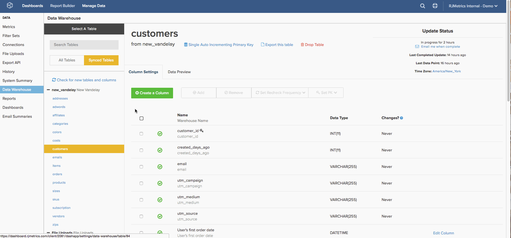

# Créer des dimensions [!DNL Google ECommerce]

>[!NOTE]
>
>Nécessite des [autorisations d’administrateur](../../administrator/user-management/user-management.md).

Maintenant que vous avez terminé [connexion de votre compte[!DNL Google ECommerce] &#x200B;](../../data-analyst/importing-data/integrations/google-ecommerce.md), que pouvez-vous faire avec ces données dans [!DNL Commerce Intelligence] ? Cette rubrique vous guide tout au long de la création de dimensions qui lient vos données eCommerce à vos données de commande et de client.

Les dimensions couvertes vous permettent de créer des analyses qui [répondent à des questions essentielles sur vos canaux et campagnes marketing](../../data-analyst/analysis/most-value-source-channel.md). Quel pourcentage du chiffre d’affaires provient de chaque source ? Comment la valeur à vie [!DNL Facebook] clients acquis se compare-t-elle à celle des clients [!DNL Google] ?

## Conditions préalables et présentation

Pour créer les dimensions dans cette rubrique, vous avez besoin d’un tableau [!DNL Google ECommerce], d’un tableau `orders` et d’un tableau `customers`. Ces tableaux doivent être [synchronisés avec votre Data Warehouse](../../data-analyst/data-warehouse-mgr/tour-dwm.md) avant que les dimensions puissent être créées. Les tableaux synchronisés s’affichent dans la section `Synced Tables` du `Data Warehouse Manager`.

Voici un aperçu rapide de la synchronisation des tableaux et des colonnes si vous avez besoin d’un rafraîchissement :

Après avoir créé une jointure de la table `orders` à la table [!DNL Google eCommerce], vous créez les trois premières dimensions dans la liste ci-dessous. Utilisez ensuite ces dimensions pour créer trois dimensions utilisateur/client dans le tableau `customers`. Pour terminer, joignez ces colonnes à la table `orders`.

Voici les dimensions couvertes :

* **Table des commandes**

* Source de [!DNL Google Analytics] de la commande
* Support de [!DNL Google Analytics] de la commande
* Campagne [!DNL Google Analytics]A de la commande
* Source de [!DNL Google Analytics] de la première commande du client
* Support de [!DNL Google Analytics] de la première commande du client
* Campagne de [!DNL Google Analytics] de la première commande du client

* **Table Clients**

* Source de [!DNL Google Analytics] de la première commande du client
* Support de [!DNL Google Analytics] de la première commande du client
* Campagne de [!DNL Google Analytics] de la première commande du client

## Création des dimensions

Pour créer des dimensions, ouvrez le [Gestionnaire Data Warehouse](../data-warehouse-mgr/tour-dwm.md) en cliquant sur **[!UICONTROL Data]** > **[!UICONTROL Data Warehouse]**.

### Table des commandes, première session

Cet exemple crée la dimension **Source [!DNL Google Analytics] Order**.

1. Dans la liste des tables du Data Warehouse, cliquez sur la table (dans ce cas, `orders`) qui contient les informations relatives à votre commande.
1. Cliquez sur **[!UICONTROL Create a Column]**.
1. Nommez la colonne.
1. Sélectionnez `Joined Column` dans le [menu déroulant de définition](../data-warehouse-mgr/calc-column-types.md). Cet exemple fonctionne avec une relation [un-à-un](../data-warehouse-mgr/table-relationships.md), qui fait correspondre la colonne `eCommerce.transactionID` à exactement une ligne du tableau `orders`.
1. Vous devez ensuite définir le chemin d’accès ou la manière dont le tableau et la colonne utilisés sont connectés. Cliquez sur la liste déroulante `Select a table and column` .
1. Le chemin d’accès dont vous avez besoin n’est pas disponible. Vous devez donc en créer un nouveau. Cliquez sur **[!UICONTROL Create new Path]**.
1. Dans la fenêtre qui s’affiche, définissez le côté `Many` sur `orders.order\_id` ou la colonne de la table `orders` contenant l’ID de commande.
1. Sur le côté `One`, recherchez le tableau `Google ECommerce`, puis définissez la colonne sur `transactionID`.

   

1. Cliquez sur **[!UICONTROL Save]** pour créer le chemin d’accès.
1. Une fois le chemin ajouté, cliquez à nouveau sur la liste déroulante **[!UICONTROL Select table and column]** .
1. Recherchez le tableau `ECommerce`, puis cliquez sur la colonne `Source`. Les commandes sont alors liées aux informations de la source.
1. Une fois de retour dans le schéma du tableau, cliquez de nouveau sur **[!UICONTROL Save]** pour créer la dimension.

Voici un aperçu de l’ensemble du processus :

Ensuite, essayez de créer **le support [!DNL Google Analytics] de l’ordre** et `campaign`. Peu de modifications ont été apportées à ces dimensions. Réessayez. Mais si vous vous retrouvez coincé, vous pouvez consulter [la fin de cet article](#stuck) pour voir ce qui est différent.

### Table des clients {#customers}

Cet exemple crée la dimension **source de [!DNL Google Analytics] de la première commande du client**.

1. Dans la liste des tables du Data Warehouse, cliquez sur la table (dans ce cas, `customers`) qui contient vos informations client.
1. Cliquez sur **[!UICONTROL Create a Column]**.
1. Nommez la colonne.
1. Pour cet exemple, sélectionnez la définition de `is MAX` dans le menu déroulant [définition](../../data-analyst/data-warehouse-mgr/calc-column-types.md). La définition de `is MIN` peut également fonctionner si elle est appliquée à une colonne de texte avec une seule valeur possible. Le plus important est de s’assurer que des filtres appropriés sont définis, ce que vous ferez ultérieurement.
1. Cliquez sur la liste déroulante **[!UICONTROL Select a table and column]** et sélectionnez le tableau `orders`, puis la colonne `Order's [!DNL Google Analytics] source` .
1. Cliquez sur **[!UICONTROL Save]**.
1. Une fois de retour dans le schéma du tableau, cliquez sur la liste déroulante `Options` puis `Filters`.
1. Cliquez sur **[!UICONTROL Add Filter Set]** puis sélectionnez le jeu de `Orders we count`. Vous souhaitez uniquement inclure les commandes incluses dans le jeu de filtres que vous comptez. Il est donc important que ce jeu de filtres soit sélectionné.
1. Cliquez sur **[!UICONTROL Add Filter]**. Vous souhaitez rechercher la source de [!DNL Google Analytics] de la première commande du client. Vous devez donc ajouter un filtre :

   _orders.Customer&#39;s order number = 1

   _
1. Cliquez sur **[!UICONTROL Save]** pour créer la dimension.

Ensuite, essayez de créer **le support de [!DNL Google Analytics] de la première commande du client** et `campaign`. Peu de modifications ont été apportées à ces dimensions. Réessayez. Mais si vous vous retrouvez coincé, vous pouvez consulter [la fin de cet article](#stuck) pour voir ce qui est différent.

### Bonus : table Commandes, round 2

Vous pouvez arrêter ici si vous le souhaitez, mais cette section permet une analyse plus approfondie en apportant dans le tableau **les dimensions [!DNL Google Analytics] de la** première commande du client[&#x200B; que vous avez créées dans la &#x200B;](#customers)dernière section`orders`. La création des dimensions dans cette section vous permet d’analyser toutes les mesures créées sur votre tableau de `orders` (`Revenue`, `Number of orders`, `Distinct buyers`, etc.) à l’aide des attributs [!DNL Google Analytics] de la première commande d’un client.

Cet exemple montre comment joindre la dimension `Customer's first order's [!DNL Google Analytics] source` au tableau `orders`.

1. Dans la liste des tables du Data Warehouse, cliquez sur la table (dans ce cas, `orders`) qui contient les informations relatives à votre commande.
1. Cliquez sur **[!UICONTROL Create a Column]**.
1. Nommez la colonne.
1. Sélectionnez `Joined Column` dans la liste déroulante de définition. Cela permet de joindre les dimensions client que vous avez créées dans la section précédente au tableau `orders`.
1. Cliquez sur la liste déroulante **[!UICONTROL Select a table and column]** , puis sélectionnez le tableau `customers` et la colonne `Customer's first order's [!DNL Google Analytics] source` .
1. Si un chemin d’accès n’est pas automatiquement renseigné, sélectionnez celui qui connecte le mieux les tables de clients et de commandes.
1. Cliquez sur **[!UICONTROL Save]** pour créer la dimension.

Voici un aperçu de l’ensemble du processus :

Terminez en joignant les dimensions moyennes et `Customer's first order's` du `campaign` au tableau `orders`. Rejoignez les dimensions et, en cas de problème, consultez [la fin de l’article](#stuck) si vous avez besoin d’aide.

### Conclusion

Vous avez terminé de créer les dimensions , ce qui signifie que vous pouvez maintenant créer des analyses puissantes qui effectuent le suivi des performances de vos différents canaux et campagnes. N’oubliez pas que les **nouvelles colonnes ne seront pas disponibles avant la fin de la prochaine mise à jour**.

Certaines des dimensions les plus populaires sont abordées dans cette rubrique, mais le ciel est la limite - essayez de créer la vôtre ou n&#39;hésitez pas à nous envoyer un ping si vous souhaitez de l&#39;aide pour explorer d&#39;autres options. 

### Remarques supplémentaires

**`Orders`tableau #1** : lors de la création des dimensions `Order's [!DNL Google Analytics]` medium et `campaign`, la différence correspond aux colonnes sélectionnées à l&#39;étape 12. Dans cet exemple, la colonne était `Source`.

**`Customers`tableau** : lors de la création des dimensions `Customer's first order's [!DNL Google Analytics]` moyen et `campaign`, la différence correspond aux colonnes sélectionnées à l’étape 5. Dans cet exemple, la colonne était `Order's [!DNL Google Analytics]` source.

**`Orders`tableau #2** : lors de la jonction des colonnes `Customer's first order's [!DNL Google Analytics]` medium et `campaign` au tableau `orders`, la différence correspond aux colonnes sélectionnées à l&#39;étape 5. Dans cet exemple, la colonne était `Customer's first order's [!DNL Google Analytics]` source.
