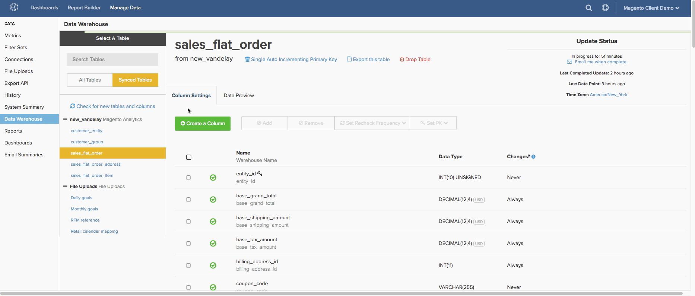

# Configuration des méthodes de réplication

`Replication` méthodes et [révérifications](../data-warehouse-mgr/cfg-data-rechecks.md) sont utilisées pour identifier les données nouvelles ou mises à jour dans les tables de votre base de données. Les définir correctement est essentiel pour garantir à la fois la précision des données et des temps de mise à jour optimisés. Cette rubrique porte sur les méthodes de réplication.

Lorsque de nouveaux tableaux sont synchronisés dans la variable [Gestionnaire de Data Warehouse](../data-warehouse-mgr/tour-dwm.md), une méthode de réplication est automatiquement sélectionnée pour le tableau. La présentation des différentes méthodes de réplication, de l’organisation des tables et du comportement des données tabulaires vous permet de choisir la meilleure méthode de réplication pour vos tables.

## Quelles sont les méthodes de réplication ?

`Replication` Les méthodes se divisent en trois groupes : `Incremental`, `Full Table`, et `Paused`.

[**[!UICONTROL Incremental Replication]**](#incremental) signifie que [!DNL Commerce Intelligence] réplique uniquement les données nouvelles ou mises à jour à chaque tentative de réplication. Comme ces méthodes réduisent considérablement la latence, Adobe recommande de l’utiliser si possible.

[**[!UICONTROL Full Table Replication]**](#fulltable) signifie que [!DNL Commerce Intelligence] réplique l’intégralité du contenu d’un tableau à chaque tentative de réplication. En raison de la quantité potentiellement importante de données à répliquer, ces méthodes peuvent augmenter la latence et les temps de mise à jour. Si un tableau contient des colonnes horodatées ou datetime, Adobe recommande d’utiliser plutôt une méthode incrémentielle .

**[!UICONTROL Paused]** indique que la réplication de la table est arrêtée ou suspendue. [!DNL Commerce Intelligence] ne vérifie pas les données nouvelles ou mises à jour lors d’un cycle de mise à jour ; cela signifie qu’aucune donnée n’est répliquée à partir d’une table qui a cette méthode comme méthode de réplication.

## Méthodes de réplication incrémentielle {#incremental}

### Modifié à (idéal)

La variable `Modified At` la méthode de réplication utilise une colonne datetime (qui est renseignée lorsqu’une ligne est créée, puis mise à jour lorsque les données changent) pour rechercher les données à répliquer. Cette méthode est conçue pour fonctionner avec des tables répondant aux critères suivants :

* contient un `datetime` colonne initialement renseignée lors de la création d’une ligne et mise à jour dès que la ligne est modifiée ;
* la valeur `datetime` n’a jamais la valeur nulle ;
* les lignes ne sont pas supprimées du tableau

En plus de ces critères, Adobe recommande de **indexation** la valeur `datetime` colonne utilisée pour `Modified At` réplication, car cela permet d’optimiser la vitesse de réplication.

Lorsque la mise à jour s’exécute, les données nouvelles ou modifiées sont identifiées en recherchant les lignes ayant une valeur dans la variable `datetime` qui s’est produite après la dernière mise à jour. Lorsque de nouvelles lignes sont découvertes, elles sont répliquées vers votre Data Warehouse. Si des lignes figurent dans la variable [Gestionnaire de Data Warehouse](../data-warehouse-mgr/tour-dwm.md), elles sont remplacées par les valeurs actuelles de la base de données.

Par exemple, un tableau peut avoir une colonne appelée `modified\_at` qui indique la dernière modification des données. Si la mise à jour la plus récente s’est déroulée le mardi à midi, la mise à jour recherche toutes les lignes comportant une `modified\_at` valeur supérieure à mardi à midi. Toutes les lignes découvertes qui ont été créées ou modifiées depuis midi le mardi sont répliquées vers le Data Warehouse.

**Le saviez-vous ?**
Même si votre base de données ne prend actuellement pas en charge un événement `Incremental` Méthode de réplication, vous pouvez être en mesure de [apporter des modifications à votre base de données ;](../../best-practices/mod-db-inc-replication.md) qui permettrait d’utiliser `Modified At` ou `Single Auto Incrementing PK`.

`Modified At` est non seulement la méthode de réplication la plus idéale, mais elle est également la plus rapide. Cette méthode produit non seulement des augmentations de vitesse perceptibles avec des jeux de données volumineux, mais elle ne nécessite pas non plus de configurer une option de nouveau contrôle. D’autres méthodes doivent itérer sur un tableau entier pour identifier les modifications, même si un petit sous-ensemble de données a changé. `Modified At` effectue une itération uniquement sur ce petit sous-ensemble.

### Incrémentation automatique unique par clé de Principal

`Auto Incrementing` est un comportement qui attribue de manière séquentielle des clés primaires aux lignes. Si un tableau est `Auto Incrementing` et la clé primaire la plus élevée de la table est 1 000, puis la valeur primaire suivante est 1 001 ou plus. Un tableau qui n’utilise pas `Auto Incrementing` Le comportement peut affecter une valeur de clé primaire inférieure à 1 000 ou passer à un nombre beaucoup plus grand, mais cette valeur n’est pas couramment utilisée.

Cette méthode est conçue pour répliquer de nouvelles données à partir de tableaux qui répondent aux critères suivants :

* `single-column primary key`; et
* `primary key` datatype est `integer`; et
* `auto incrementing` valeurs de clé primaire.

Lorsqu’un tableau utilise `Single Auto Incrementing Primary Key` réplication, de nouvelles données sont découvertes en recherchant des valeurs de clé primaire supérieures à la valeur la plus élevée actuelle dans votre Data Warehouse. Par exemple, si la valeur de clé primaire la plus élevée dans votre Data Warehouse est 500, lors de la prochaine mise à jour, il recherche des lignes dont les valeurs de clé primaire sont supérieures ou égales à 501.

### Ajouter une date

La variable `Add Date` fonctionne de la même manière que la fonction `Single Auto Incrementing Primary Key` . Au lieu d’utiliser un entier pour la clé primaire de la table, cette méthode utilise une variable `timestamped` pour rechercher de nouvelles lignes.

Lorsqu’un tableau utilise `Add Date` réplication, de nouvelles données sont découvertes en recherchant des valeurs horodatées supérieures à la dernière date synchronisée avec votre Data Warehouse. Par exemple, si une mise à jour s’est exécutée pour la dernière fois le 20/12/2015 09:00:00, toutes les lignes dont l’horodatage est supérieur à celui-ci seront marquées comme nouvelles données et répliquées.

>[!NOTE]
>
>Contrairement à la variable `Modified At` méthode, `Add Date` ne vérifie pas les lignes existantes à la recherche d’informations mises à jour ; elle se tourne uniquement vers les nouvelles lignes.

## Méthodes de réplication de table complète {#fulltable}

### Tableau complet

`Full table` la réplication actualise le tableau entier chaque fois que de nouvelles lignes sont détectées. Il s’agit de loin de la méthode de réplication la moins efficace, car toutes les données doivent être retraitées à chaque mise à jour, en supposant qu’il y ait de nouvelles lignes.

De nouvelles lignes sont détectées en interrogeant votre base de données au début du processus de synchronisation et en comptabilisant le nombre de lignes. Si votre base de données locale contient plus de lignes que [!DNL Commerce Intelligence], le tableau est alors actualisé. Si le nombre de lignes est identique ou si [!DNL Commerce Intelligence] contains *more* lignes de la base de données locale, puis le tableau est ignoré.

Cela soulève un point important : **`Full Table`la réplication est incompatible lorsque :**

* plus de lignes sont supprimées que créées dans votre tableau de base de données local entre les cycles de mise à jour suivants, ou
* les valeurs de colonne sont modifiées, mais aucune ligne supplémentaire n’est créée.

Dans l’un des scénarios ci-dessus, `Full Table` la réplication ne détecte aucune modification et vos données deviennent obsolètes. En raison de l’inefficacité de cette méthode de réplication, et des exigences mentionnées ci-dessus, `Full Table` la réplication n’est recommandée qu’en dernier recours.

### Lot de clé de Principal

Lorsqu’un tableau utilise `Primary Key Batch` (Lot PK), de nouvelles données sont découvertes en comptant les lignes à l’intérieur des plages, ou lots, de valeurs de clé primaire. Bien que vous pensiez généralement que cela est utilisé avec des entiers, même les valeurs de texte peuvent être triées de manière à permettre au système de définir des plages constantes.

Supposons, par exemple, qu’une mise à jour s’exécute et effectue un comptage des lignes pour la plage de clés comprise entre 1 et 100. Dans cette mise à jour, le système détecte et consigne 37 lignes. Lors de la prochaine mise à jour, un nombre de lignes est à nouveau effectué sur la plage 1-100 et détecte 41 lignes. En raison d’une différence de nombre de lignes par rapport à la dernière mise à jour, le système examine cette plage (ou lot) plus en détail.

Cette méthode est destinée à répliquer les données des tableaux qui répondent aux critères suivants :

* une colonne non entière ; ou
* clé composite (plusieurs colonnes comprenant la clé primaire) : notez que les colonnes utilisées dans une clé primaire composite ne peuvent jamais avoir de valeurs nulles ; ou
* des valeurs de clé primaire à une seule colonne, entiers, sans incrémentation automatique.

Cette méthode n’est pas idéale, car elle est incroyablement lente en raison de la quantité de traitement qui doit se produire pour examiner les lots et rechercher les modifications. Adobe recommande de ne pas utiliser cette méthode à moins qu’il ne soit pas possible d’apporter les modifications nécessaires pour prendre en charge les autres méthodes de réplication. Attendez-vous à ce que les temps de mise à jour augmentent si cette méthode doit être utilisée.

## Définition des méthodes de réplication

Les méthodes de réplication sont définies table par table. Pour définir une méthode de réplication pour un tableau, vous devez [`Admin`](../../administrator/user-management/user-management.md) pour accéder au Gestionnaire de Data Warehouse.

1. Une fois dans le Gestionnaire de Data Warehouse, sélectionnez le tableau dans la `Synced Tables` pour afficher le schéma de la table.
1. La méthode de réplication actuelle est répertoriée sous le nom de la table. Pour le modifier, cliquez sur le lien.
1. Dans la fenêtre contextuelle qui s’affiche, cliquez sur le bouton radio en regard de l’une des options suivantes : `Incremental` ou `Full Table` réplication pour sélectionner un type de réplication.
1. Cliquez ensuite sur le bouton **[!UICONTROL Replication Method]** pour sélectionner une méthode. Par exemple : `Paused` ou `Modified At`.

   >[!NOTE]
   >
   >**Certaines méthodes incrémentielles nécessitent que vous définissiez une`Replication Key`**. [!DNL Commerce Intelligence] utilisera cette clé pour déterminer où doit commencer le cycle de mise à jour suivant.
   >
   >Par exemple, si vous souhaitez utiliser la variable `modified at` pour votre `orders` , vous devez définir une `date column` comme clé de réplication. Plusieurs options pour les clés de réplication peuvent exister, mais vous pouvez sélectionner `created at`ou l’heure à laquelle la commande a été créée. Si le dernier cycle de mise à jour s&#39;est arrêté à 12/1/2015 00:10:00, le cycle suivant commencerait à répliquer les données avec une `created at` date supérieure à celle-ci.

1. Lorsque vous avez terminé, cliquez sur **[!UICONTROL Save]**.

Examinez l’ensemble du processus :

<!--{: width="801" height="341"}-->

## Remplissage

Pour terminer, vous avez assemblé ce tableau qui compare les différentes méthodes de réplication. Cette méthode est particulièrement pratique lorsque vous sélectionnez une méthode pour les tableaux dans votre Data Warehouse.

| **`Method`** | **`Syncing New Data`** | **`Processing Rechecks on Large Data Sets`** | **`Handle Composite Keys?`** | **`Handle Non-Integer PKs?`** | **`Handle Non-Sequential PK Population?`** | **`Handle Row Deletion?`** |
|-----|-----|-----|-----|-----|-----|-----|
| `Auto-Incrementing Primary Key` | Plus rapide | Lent | Non | Non | Non | Oui |
| `Primary Key Batch Monitoring` | Lent | Lent | Oui | Oui | Oui | Oui |
| `Modified At` | Plus rapide | Plus rapide | Oui | Oui | Oui | Non |

{style="table-layout:auto"}

## Documentation connexe

* [Comprendre les contrôles des données](../data-warehouse-mgr/cfg-data-rechecks.md)
* [Modification de la base de données pour la prise en charge ](../../best-practices/mod-db-inc-replication.md)
* [Optimisation de la base de données pour l’analyse](../../best-practices/opt-db-analysis.md)
* [Réduction des temps de mise à jour](../../best-practices/reduce-update-cycle-time.md)
