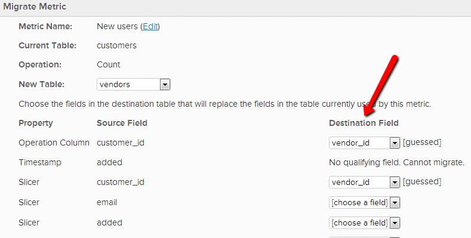

# Modification du tableau opérationnel d’une mesure

Dans certains cas, vous pouvez décider de modifier le tableau de données qu’une mesure utilise pour effectuer son opération. Par exemple, si vous disposez d’une nouvelle table d’utilisateurs, vous souhaitez migrer les mesures liées aux utilisateurs depuis la table `Users\_Old` pour utiliser la table `Users\_New` à la place.

1. Accédez à **[!UICONTROL Data]** > **[!UICONTROL Metrics]**
1. Cliquez sur **[!UICONTROL Edit]** en regard de la mesure pour laquelle vous souhaitez changer de tableau de `operational`.
1. Dans l’éditeur, cliquez sur **[!UICONTROL Change]**.

   
1. Sélectionnez la nouvelle table sur laquelle vous souhaitez baser cette mesure.
1. Faire correspondre les dimensions de données existantes aux dimensions correspondantes dans le nouveau tableau. Par exemple, si vous aviez une colonne intitulée `User's registration date`, il vous suffit de sélectionner la colonne qui, dans la nouvelle table, enregistre les mêmes données de date. (Voir l’étape suivante si le nouveau tableau ne comporte pas de colonnes correspondantes)

   

1. Si la nouvelle table ne contient pas de colonne correspondante, vous pouvez la **créer dans votre table de données** ou [contacter l’assistance](https://experienceleague.adobe.com/docs/commerce-knowledge-base/kb/troubleshooting/miscellaneous/mbi-service-policies.html) s’il s’agit d’une colonne de calcul ou d’une dimension créée par [!DNL Commerce Intelligence]. Vous pouvez également **supprimer la dimension de la mesure**. Pour supprimer une dimension dont vous n’avez plus besoin, revenez simplement à l’éditeur de la mesure et sélectionnez les dimensions à supprimer sous `Dimensions`.

   
