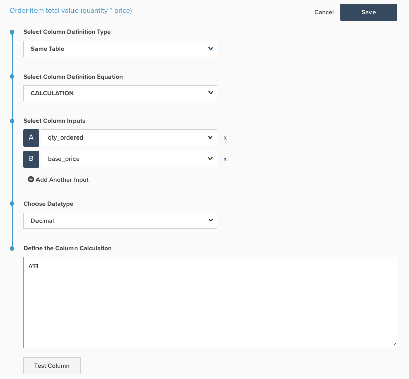

# Création d’une colonne calculée SQL

Cette rubrique décrit l&#39;objectif et les utilisations du type de colonne `Calculation`, qui peut être ajouté aux tableaux à l&#39;aide de [Data Warehouse Manager](../data-warehouse-mgr/tour-dwm.md). Vous trouverez ci-dessous des explications sur les calculs SQL, leur utilisation et le processus de création d’un calcul SQL, ainsi que deux exemples.

**Explication**

Par le passé, les colonnes considérées comme `advanced` ne pouvaient être créées que par un analyste de l’équipe du succès client, ici à [!DNL Adobe Commerce Intelligence]. Désormais, toute la puissance est entre les mains de l’utilisateur final et des colonnes avancées peuvent être créées sous la forme de colonnes `SQL Calculation` sur la nouvelle architecture [!DNL Commerce Intelligence].

Le type de colonne `Calculation`, désormais disponible sous forme d’option dans le gestionnaire Data Warehouse, est une même opération de table qui vous permet de transformer les colonnes d’une table à l’aide de la logique PostgreSQL. Vous trouverez sur le site web PostgreSQL `Calculation`ici[&#x200B; de la documentation sur les fonctions et opérateurs pouvant être utilisés dans le type de colonne &#x200B;](https://www.postgresql.org/docs/9.6/functions.html).

Les différentes colonnes pouvant être créées avec la colonne `Calculation` sont presque illimitées, mais la plupart des colonnes peuvent être créées à l’aide d’instructions IF-THEN et de l’arithmétique de base, qui est utilisée dans les exemples ci-dessous.

**Exemple 1 : est-ce la dernière commande du client ?**

La plupart des comptes ont une colonne appelée `Is customer's last order?` dans leur tableau `orders` pour effectuer des analyses sur les taux d’achat répétés et les clients résiliés. Si votre compte utilise la nouvelle architecture, cette colonne est créée à l’aide d’une colonne `Calculation` et est visible dans la capture d’écran ci-dessous :

La colonne `Is customer's last order?` utilise les entrées `Customer's lifetime number of orders` et `Customer's order number` alias `A` et `B`, respectivement.

Ligne par ligne, la signification de PostgreSQL est :

* casse : cela lance une série d’instructions If - Then
* lorsque `A` est null ou `B` est null, puis null : si l’une des entrées est vide, alors la sortie doit également être vide. Cela permet d’éviter les erreurs SQL
* Si `A=B` puis `Yes` : si `Customer's lifetime number of orders` est égal à `Customer's order number` pour cette ligne, renvoyez `Yes`. Ainsi, si un client a passé quatre commandes, la ligne correspondant à sa quatrième commande renvoie `Yes` pour `Is customer's last order?`
* else `No` : si aucune des autres instructions n’est remplie, renvoyez `No`
* end : met fin aux instructions If - Then

Les valeurs possibles qui peuvent être renvoyées par cette colonne (`NULL`, `Yes`, `No`) contiennent des caractères non numériques. Le type de données est donc String.

**Exemple 2 : Valeur totale de l&#39;article de commande (quantité * prix)**

De nombreux clients aiment analyser le chiffre d’affaires au niveau de l’article, en le découpant par champs tels que `product name` ou `category`. La plupart des bases de données ne vous donnent pas réellement les revenus d’un produit dans une commande ; elles fournissent plutôt la quantité vendue dans la commande et le prix de l’article.

Pour activer les analyses de chiffre d’affaires de produit, la plupart des comptes ont une colonne appelée `Order item total value (quantity * price)` dans leur table de `Orders Items`. Si votre compte utilise la nouvelle architecture, cette colonne est également créée à l’aide d’une colonne `Calculation` et est visible dans la capture d’écran ci-dessous :

Dans le schéma Commerce, la colonne `Order item total value (quantity * price)` utilise les entrées `qty ordered` et `base price` alias `A` et `B`, respectivement.

Les valeurs renvoyées par cette nouvelle colonne sont en dollars et en cents. Le type de données correct est donc `Decimal(10,2)`.

**mécanique**

Vous pouvez ajouter une nouvelle colonne `Calculation` à un tableau en accédant à **[!DNL Manage Data > Data Warehouse]** comme illustré ci-dessous :

À partir de là, vous pouvez créer une colonne `Calculation` en suivant les étapes ci-dessous :

1. Sélectionnez la table sur laquelle vous souhaitez ajouter la colonne `Calculation`.
1. Lorsque vous vous trouvez sur le bon tableau, cliquez sur **[!UICONTROL Create New Column]** en haut à droite de l’écran.
1. Dans la liste déroulante `Select a definition`, sélectionnez `Same Table`.
1. Sélectionnez `Calculation` comme `column definition equation`.
1. Saisissez le nom de la colonne.
1. Choisissez les colonnes `input` du tableau qui sont utilisées dans la logique de votre nouvelle colonne. Chaque colonne que vous ajoutez reçoit un alias de lettre, de sorte que la première colonne est `A`, la seconde est `B`, etc.
1. Dans la fenêtre, saisissez la logique PostgreSQL pour votre nouvelle colonne à l’aide des alias de lettre de vos entrées. Le calcul SQL doit être limité à une seule définition de colonne, incluant toute la logique entre les instructions SELECT et FROM d&#39;une requête SQL. Les mots-clés SQL utilisant l’une des lettres d’entrée doivent être en minuscules. Par exemple, lorsque vous utilisez l’instruction `CASE`, elle doit être écrite en minuscules - `case`. Le système suppose qu’une `A` majuscule fait référence à l’une des entrées.
1. Sélectionnez le type de données approprié.
   * `Integer` - Nombre entier
   * `Decimal(10,2)` - un nombre décimal avec 10 chiffres au total, dont 2 à droite de la décimale
   * `String` - Tout type de texte ou série de caractères utilisant des caractères non numériques
   * `Datetime` - format `yyyy-MM-dd hh:mm:ss`

1. Cliquez sur **[!UICONTROL test column]**. Cela génère une liste de cinq valeurs de test pour chacune de vos entrées et affiche le résultat de la logique de l’étape 6 pour chaque ensemble de valeurs de test. Si une partie du code SQL génère une erreur, le message d’erreur approprié est renvoyé. Les exemples de résultats ne peuvent être générés que si toutes les colonnes d’entrée sont des champs natifs. Si l’une des colonnes d’entrée est une colonne calculée, vous devez valider les résultats en ajoutant la colonne à une mesure et en l’affichant dans Visual Report Builder

1. Lorsque les résultats vous conviennent, cliquez sur **[!UICONTROL Save]**. La colonne permet d’utiliser .
