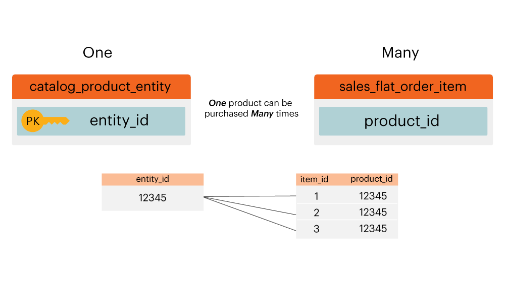

# Diagramme de relation d&#39;entité

Qu&#39;est-ce qu&#39;un **[!UICONTROL entity relationship (ER) diagram]** ? Un diagramme de [!UICONTROL ER] est une visualisation des tableaux au sein d’une base de données et de la manière dont ils sont liés les uns aux autres. Cette rubrique contient quelques diagrammes de [!UICONTROL ER] pour vous aider à visualiser la relation entre quelques tables de base de données Adobe Commerce courantes.

>[!NOTE]
>
>Tout au long de cette rubrique, vous verrez les mots **jointure**, **relation** et **chemin**. Ces mots sont tous utilisés pour décrire la façon dont deux tables sont connectées.

## Diagramme de [!UICONTROL ER] de Core Commerce

Ce diagramme de `ER` représente les relations entre les tables principales d’une base de données Commerce. En affichant plusieurs relations à la fois, vous pouvez voir comment les données sont liées entre de nombreuses tables.

Les sections ci-dessous contiennent `ER` diagrammes spécifiques à deux tableaux à la fois. Pour afficher un diagramme et la description qui l’accompagne, cliquez sur l’en-tête de cette section.

## `customer\_entity & sales\_flat\_order`

Un client peut passer plusieurs commandes. La relation entre ces deux tables est `customer\_entity.entity\_id = sales\_flat\_order.customer\_id`

>[!IMPORTANT]
>
>`customer\_entity.entity\_id` n’est pas égal à `sales\_flat\_order.entity\_id`. Le premier peut être considéré comme un `customer\_id` et le second comme un `order\_id.`

Dans [!DNL Commerce Intelligence], si le chemin d’accès entre ces deux tables n’existe pas, vous pouvez [créer le chemin d’accès](../data-warehouse-mgr/create-paths-calc-columns.md) dans l’onglet Data Warehouse . Lorsque vous êtes prêt à créer le chemin, il est défini comme suit :

## `sales\_flat\_order & sales\_flat\_order\_item`

Une commande peut contenir plusieurs éléments. La relation entre ces deux tables est `sales\_flat\_order.entity\_id = sales\_flat\_order\_item.order\_id`.

En [!DNL Commerce Intelligence], si le chemin d’accès entre ces deux tables n’existe pas, vous pouvez [créer le chemin d’accès](../data-warehouse-mgr/create-paths-calc-columns.md) dans l’onglet Data Warehouse . Lorsque vous êtes prêt à créer le chemin d’accès, définissez-le comme illustré ci-dessous.

## `catalog\_product\_entity & sales\_flat\_order\_item`

Un produit peut être acheté avec plusieurs articles. La relation entre ces deux tables est `catalog\_product\_entity.entity\_id = sales\_flat\_order\_item.product`.

Dans [!DNL Commerce Intelligence], si le chemin d’accès entre ces deux tables n’existe pas, vous pouvez [créer le chemin d’accès](../data-warehouse-mgr/create-paths-calc-columns.md) dans l’onglet Data Warehouse . Lorsque vous êtes prêt à créer le chemin d’accès, définissez-le comme illustré ci-dessous.

