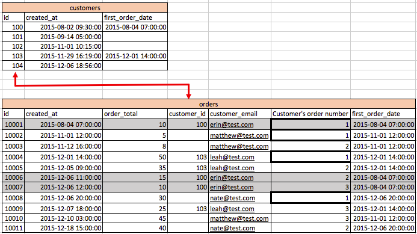

# Commandes d’invités

Lors de la révision de vos commandes, si vous constatez que de nombreuses valeurs de `customer\_id` sont nulles ou ne disposent pas d’une valeur à joindre à la table `customers`, cela indique que votre boutique autorise les commandes de clients. Cela signifie que votre tableau de `customers` n’inclut probablement pas tous vos clients.

Cette rubrique aborde l’impact des commandes des invités sur vos données et les options dont vous disposez pour tenir correctement compte des commandes des invités dans votre [!DNL Commerce Intelligence] Data Warehouse.

## Impact des commandes d’invités sur les données

Dans la base de données commerciale type, il existe une table `orders` qui se joint à une table `customers`. Chaque ligne du tableau `orders` comporte une colonne `customer\_id` qui est propre à une ligne du tableau `customers`.

* **Si tous les clients sont enregistrés** et que les commandes des invités ne sont pas autorisées, cela signifie que chaque enregistrement de la table `orders` a une valeur dans la colonne `customer\_id`. Par conséquent, chaque commande est rattachée à la table `customers`.

  

* **Si les commandes de produits invités sont autorisées**, cela signifie que certaines commandes n&#39;ont pas de valeur dans la colonne `customer\_id`. Seuls les clients enregistrés reçoivent une valeur pour la colonne `customer\_id` dans le tableau `orders`. Les clients qui ne sont pas enregistrés reçoivent une valeur `NULL` (ou vide) pour cette colonne. Par conséquent, tous les enregistrements de commande n&#39;ont pas d&#39;enregistrements correspondants dans la table `customers`.

  >[!NOTE]
  >
  >Pour identifier la personne unique qui a passé la commande, il doit y avoir un autre attribut utilisateur unique en plus des `customer\_id` associés à une commande. En règle générale, l’adresse e-mail du client est utilisée.

## Comment comptabiliser les commandes des invités dans la configuration de Data Warehouse

En règle générale, l’ingénieur des ventes qui implémente votre compte prend en compte les commandes des invités lors de la création des bases de votre Data Warehouse.

La méthode la plus optimale pour prendre en compte les commandes de produits invités consiste à baser toutes les mesures au niveau du client sur la table `orders`. Cette configuration utilise un ID de client unique que tous les clients possèdent, y compris les invités (normalement, l’adresse e-mail du client est utilisée). Cette option ignore les données d’enregistrement de la table `customers`. Avec cette option, seuls les clients qui ont effectué au moins un achat sont inclus dans les rapports au niveau du client. Les utilisateurs enregistrés qui n’ont pas encore effectué un seul achat ne sont pas inclus. Avec cette option, votre mesure de `New customer` est basée sur la date de première commande du client dans la table des `orders`.

Vous remarquerez peut-être que le filtre `Customers we count` défini dans ce type de configuration comporte un filtre pour les `Customer's order number = 1`.

Dans une situation sans commandes d’invités, chaque client existe sous la forme d’une ligne unique dans le tableau des clients (voir l’image 1). Une mesure telle que `New customers` peut simplement compter l’identifiant de cette table en fonction de `created\_at` date pour comprendre les nouveaux clients en fonction de la date d’enregistrement.

Dans une configuration de commandes client dans laquelle toutes les mesures client sont basées sur la table `orders` pour tenir compte des commandes client, vous devez vous assurer que vous êtes `not counting customers twice`. Si vous comptez l&#39;identifiant de la table des commandes, vous comptez chaque commande. Si, à la place, vous comptez l’identifiant sur la table `orders` et utilisez un filtre, `Customer's order number = 1`, vous allez compter chaque `only one time` client unique. Cela s’applique à toutes les mesures au niveau du client, telles que `Customer's lifetime revenue` ou `Customer's lifetime number of orders`.

Vous pouvez voir ci-dessus qu’il y a des `customer\_ids` nulles dans le tableau `orders`. Si vous utilisez l’`customer\_email` pour identifier les clients uniques, vous pouvez constater que `erin@test.com` a passé trois (3) commandes. Par conséquent, vous pouvez créer une mesure de `New customers` sur votre tableau de `orders` en fonction des conditions suivantes :

* `Operation table = orders`
* `Operation column = id`
* `Operation = count`
* `Timestamp = Customer's first order date`
* `Filter = Customer's we count (where Customer's order number = 1)`
