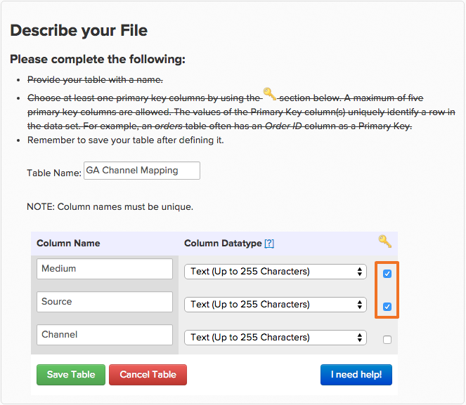

# [!DNL Google Analytics] à l’aide de sources d’acquisition

## Que sont les canaux ? {#channels}

La création de segments personnalisés pour voir comment le trafic est différent et observer les tendances est l’une des utilisations les plus puissantes de [!DNL Google Analytics]. Une classe de segments qui existe par défaut dans [!DNL Google Analytics] est `Channels`. Les canaux sont un ensemble de méthodes courantes par lesquelles les visiteurs accèdent à votre site.  [!DNL Google Analytics] trie automatiquement les nombreuses façons dont vous acquérez un utilisateur (qu’il s’agisse de liens de médias sociaux, de paiement par clic, d’e-mail ou de référence) et les regroupe dans un compartiment ou un canal.

## Pourquoi est-ce que je ne vois pas mon `channels` dans Commerce Intelligence ? {#nochannels}

`Channels` sont des compartiments de données simples et agrégés. Pour trier vos acquisitions par compartiments de canal, [!DNL Google] définit des règles et des définitions distinctes à l’aide de paramètres spécifiques : une combinaison d’acquisition [Source](https://support.google.com/analytics/answer/1033173?hl=en) (l’origine de votre trafic) et d’acquisition [Medium](https://support.google.com/analytics/answer/6099206?hl=en) (la catégorie générale de la source).

Bien que ces compartiments puissent vous aider à comprendre d’où provient votre trafic, ces données ne sont pas balisées par canal, mais par une combinaison de Source et de Medium. Étant donné que [!DNL Google] envoie des informations sur les canaux en tant que deux points de données distincts, les regroupements de canaux ne s’affichent pas automatiquement dans [!DNL Commerce Intelligence].

## Quels sont les groupements de canaux par défaut ? Comment sont-ils créés ?

Par défaut, [!DNL Google] configure huit canaux différents. Les règles qui déterminent le mode de création des canaux sont les suivantes.

| **Canal** | **Qu&#39;est-ce que c&#39;est ?** | **Comment est-il créé ?** |
|---|---|---|
| Direct | Toute personne qui accède directement à votre site. | Source = `Direct` AND Medium = `(not set); OR Medium = (none)` |
| Recherche organique | Trafic classé de manière organique dans les moteurs de recherche non rémunérés. | Medium = `organic` |
| Référent | Trafic provenant d’un lien externe qui n’est pas une recherche organique ou de sites web qui ne sont pas des réseaux sociaux. | Medium = `referral` |
| Recherche payante | Trafic qui comporte un code de suivi UTM dans lequel le support est &quot;cpc&quot;, &quot;ppc&quot; ou &quot;paidsearch&quot; ET est un réseau de distribution d’annonces qui ne correspond pas à &quot;Content&quot;. | Medium = `^(cpc|ppc|paidsearch)$`  ET réseau de distribution de publicités ≠ `Content` |
| Social | Trafic de référence provenant de l’un des [400 réseaux sociaux](https://www.annielytics.com/blog/analytics/sites-google-analytics-includes-in-social-reports/) environ et n’est pas balisé comme publicité. | Référence de Social Source = `Yes` OU Medium = `^(social|social-network|social-media|sm|social network|social media)$` |
| Email | Trafic des sessions balisées avec un support &quot;email&quot;. | Code de suivi UTM de Medium = `email` |
| Affichage | Trafic qui comporte un code de suivi UTM où le support est affiché ou cpm. Inclut également les interactions AdWords où le réseau de distribution d’annonces correspond à &quot;Contenu&quot; | Medium = `^(display|cpm|banner)$` OU Réseau de distribution de publicités = `Content` ET Format de publicité ≠ `Text` |
| Autre | Sessions provenant d’autres canaux publicitaires (à l’exclusion de la recherche payante) qui sont balisées avec un support de &quot;cpc&quot;, &quot;ppc&quot;, &quot;cpm&quot;, &quot;cpv&quot;, &quot;cpa&quot;, &quot;cpp&quot;, &quot;affilié&quot;. | Medium = `^(cpv|cpa|cpp|content-text)$` |

{style="table-layout:auto"}

## Comment puis-je recréer ces groupements de canaux dans mon Data Warehouse ? {#recreate}

Maintenant que vous savez que les canaux ne sont que des combinaisons de sources et de supports, il est facile de recréer ces regroupements en 3 étapes dans votre Data Warehouse.

1. **Activez votre [!DNL Google ECommerce]intégration**

   [Lorsque l’option est activée](../importing-data/integrations/google-ecommerce.md), assurez-vous de [synchroniser](../{{ site.baseurl }}/data-analyst/data-warehouse-mgr/tour-dwm.html#syncing) les champs **medium** et **source** dans votre Data Warehouse. Une fois cette étape terminée, les données d’acquisition de sources et moyennes seront introduites dans votre Data Warehouse.

1. **Chargement d’un mappage de groupements de canaux Google**

   Adobe Commerce crée un tableau avec les regroupements par défaut mappés en tant que fichier que vous pouvez [télécharger](../../assets/ga-channel-mapping.csv).

   Si vous êtes un professionnel [!DNL Google Analytics] et que vous avez créé vos propres canaux, vous souhaitez ajouter vos règles spécifiques à la table de mappage avant de charger le fichier dans [!DNL Commerce Intelligence].

   Apportez-le dans votre Data Warehouse en tant que [téléchargement de fichier](../importing-data/connecting-data/using-file-uploader.md).

   

1. **Établissement d’une relation entre [!DNL Google ECommerce] et le téléchargement de fichier de mappage**

   Pour établir une relation entre l’élément [!DNL Google ECommerce] et la table de mappage, [ envoyez une demande d’assistance](../../guide-overview.md#Submitting-a-Support-Ticket) à votre équipe d’analystes de données et référencez cette rubrique. L’analyste crée une nouvelle colonne calculée appelée **Channel** dans la table ECommerce. **Après un cycle de mise à jour complet**, cette colonne sera prête à être utilisée dans un `Filter` ou un `Group by`.

Vous disposez désormais de [!DNL Google Analytics Channel] groupements dans votre Data Warehouse, ce qui signifie que vous pouvez analyser vos données d’un nouveau point de vue :

Dans cet exemple, vous avez commencé par segmenter la mesure **Nombre de commandes** par **Canal**. Testez votre nouvelle colonne et voyez quelles tendances vous pouvez identifier dans vos données [!DNL Google Analytics Channel] !

## Documentation connexe

* [Utilisation du Report Builder](../../tutorials/using-visual-report-builder.md)
* [Données [!DNL Google ECommerce]attendues](../importing-data/integrations/google-ecommerce-data.md)
* [Construire des dimensions avec des données de commande et de client[!DNL Google ECommerce]](../data-warehouse-mgr/bldg-google-ecomm-dim.md)
* [Quelles sont vos sources et canaux d’acquisition les plus précieux ?](../analysis/most-value-source-channel.md)
