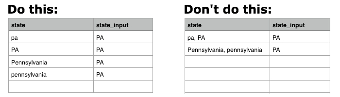

# Normalisation des données avec des tables de mappage

Imaginez que vous êtes en train de `Report Builder` un rapport `Revenue by State`. Tout se passe bien jusqu’à ce que vous essayiez d’ajouter un regroupement `billing state` à votre rapport et que vous voyiez ceci :

## Comment cela a-t-il pu arriver ?

Malheureusement, un manque de normalisation peut parfois entraîner des données désordonnées et des problèmes lors de la création de rapports. Dans cet exemple, il se peut qu’il n’y ait pas eu de menu déroulant ou de méthode normalisée permettant à vos clients de saisir leurs informations de statut de facturation. Cela conduit à différentes valeurs (`pa`, `PA`, `penna`, `pennsylvania` et `Pennsylvania`), toutes pour le même état, ce qui entraîne des résultats étranges dans le `Report Builder`.

Il est possible qu’une ressource technique vous aide à nettoyer les données ou à insérer les colonnes dont vous avez besoin directement dans votre base de données. Sinon, il existe une autre solution : **la table de mappage**. Une table de mappage vous permet de nettoyer et de normaliser rapidement et facilement toutes les données corrompues en mappant les données à une sortie unique.

>[!NOTE]
>
>Vous ne pouvez pas créer de table de mappage pour les tables consolidées sans l’aide de l’équipe d’assistance Adobe.

## Comment puis-je le créer ? {#how}

**Actualisation de la mise en forme des données :**

* Vérifiez que votre feuille de calcul comporte une ligne d&#39;en-tête.
* Évitez d’utiliser des virgules. Cela entraîne des problèmes lors du chargement du fichier.
* Utilisez le format de date standard `(YYYY-MM-DD HH:MM:SS)` pour les dates.
* Les pourcentages doivent être saisis sous forme de décimales.
* Assurez-vous que tous les zéros de début ou de fin sont correctement conservés.

Avant de vous lancer, Adobe vous recommande d’[ exporter les données brutes du tableau](../../tutorials/export-raw-data.md). Examiner d’abord les données brutes signifie que vous pouvez explorer toutes les combinaisons possibles pour les données à nettoyer, en vous assurant ainsi que le tableau de mappage couvre tout.

Pour créer une table de mappage, vous devez créer une feuille de calcul à deux colonnes qui suit les [ règles de formatage pour les chargements de fichiers](../../data-analyst/importing-data/connecting-data/using-file-uploader.md).

Dans la première colonne, saisissez les valeurs stockées dans votre base de données avec **une seule valeur par ligne**. Par exemple, `pa` et `PA` ne peuvent pas se trouver sur la même ligne : chaque entrée doit avoir sa propre ligne. Voir ci-dessous pour un exemple.

Dans la deuxième colonne, saisissez ce que ces valeurs **doivent être**. Pour poursuivre avec l’exemple d’état de facturation, si vous souhaitez que `pa`, `PA`, `Pennsylvania` et `pennsylvania` soient simplement `PA`, vous devez saisir `PA` dans cette colonne pour chaque valeur d’entrée.

## Que dois-je faire pour l[!DNL Commerce Intelligence]utiliser ? {#use}

Une fois la création de la table de mappage terminée, vous devez [charger le fichier](../../data-analyst/importing-data/connecting-data/using-file-uploader.md) dans [!DNL Commerce Intelligence] et [créer une colonne jointe](../../data-analyst/data-warehouse-mgr/calc-column-types.md) qui déplace le nouveau champ dans la table souhaitée. Vous pouvez le faire une fois le fichier synchronisé avec votre Data Warehouse.

Cet exemple montre comment déplacer la colonne que vous avez créée dans le tableau `mapping_state` (`state_input`) vers le tableau `customer_address` à l&#39;aide d&#39;une colonne jointe. Cela nous permet d’effectuer un regroupement en fonction de la colonne `state_input` propre dans vos rapports au lieu de la colonne `state`.

Pour créer la colonne `joined`, accédez à la table vers laquelle le champ sera déplacé dans le gestionnaire Data Warehouse. Dans cet exemple, il s’agit de la table `customer_address`.

1. Cliquez sur **[!UICONTROL Create a Column]**.
1. Sélectionnez `Joined Column` dans la liste déroulante `Definition` .
1. Attribuez à la colonne un nom qui la différencie de la colonne `state` de votre base de données. Nommez les `billing state (mapped)` de colonne afin de pouvoir déterminer la colonne à utiliser lors de la segmentation dans le Report Builder.
1. Le chemin d&#39;accès dont vous avez besoin pour connecter les tables n&#39;existe pas. Vous devez donc en créer un. Cliquez sur **[!UICONTROL Create new path]** dans la liste déroulante `Select a table and column` .

   Si vous ne savez pas quelle est la relation entre les tables ou comment définir correctement les clés primaire et étrangère, consultez [le tutoriel](../../data-analyst/data-warehouse-mgr/create-paths-calc-columns.md) pour obtenir de l’aide.

   * Sur le côté `Many`, sélectionnez la table vers laquelle vous déplacez le champ (à nouveau, pour nous, il est `customer_address`) et la colonne `Foreign Key`, ou colonne `state`, dans l’exemple.
   * Sur le côté `One`, sélectionnez le tableau `mapping` et la colonne `Primary key` . Dans ce cas, vous devez sélectionner la colonne `state_input` dans le tableau `mapping_state` .
   * Voici à quoi ressemble le chemin :

     

1. Lorsque vous avez terminé, cliquez sur **[!UICONTROL Save]** pour créer le chemin d’accès.
1. Le chemin d’accès peut ne pas être renseigné immédiatement après l’enregistrement. Si cela se produit, cliquez sur la zone de `Path` et sélectionnez le chemin d’accès que vous avez créé.
1. Cliquez sur **[!UICONTROL Save]** pour créer la colonne.

## Que dois-je faire maintenant ? {#wrapup}

Une fois le cycle de mise à jour terminé, vous pourrez utiliser votre nouvelle colonne jointe pour segmenter correctement vos données au lieu de la colonne désordonnée de votre base de données. Examinez vos options de regroupement maintenant - plus de stress :

Les tables de mappage sont pratiques si vous souhaitez nettoyer des données potentiellement désordonnées dans votre Data Warehouse. Cependant, les tables de mappage peuvent également être utilisées pour d’autres cas d’utilisation intéressants, comme la réplication de [votre [!DNL Google Analytics channels] dans [!DNL Commerce Intelligence]](../data-warehouse-mgr/rep-google-analytics-channels.md).

### Connexe

* [Compréhension et évaluation des relations entre les tables](../data-warehouse-mgr/table-relationships.md)
* [Création/suppression de chemins d’accès pour les colonnes calculées](../data-warehouse-mgr/create-paths-calc-columns.md)
