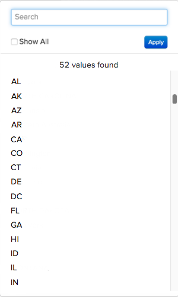

# Normalisation des données avec les tableaux de mappage

Imaginez que vous êtes dans le `Report Builder` création d’une `Revenue by State` rapport. Tout se passe bien jusqu’à ce que vous teniez d’ajouter une `billing state` regroupement à votre rapport et vous voyez ceci :

## Comment cela pourrait-il se produire ?

Malheureusement, un manque de normalisation peut parfois entraîner des problèmes de données et de têtes lors de la création de rapports. Dans cet exemple, il se peut qu’il n’y ait pas eu de menu déroulant ni de méthode normalisée permettant à vos clients de saisir les informations d’état de facturation. Cela entraîne diverses valeurs : `pa`, `PA`, `penna`, `pennsylvania`, et `Pennsylvania` - tous pour le même état, ce qui donne des résultats étranges dans la `Report Builder`.

Il est possible qu’une ressource technique vous aide à nettoyer les données ou à insérer les colonnes dont vous avez besoin directement dans votre base de données. Sinon, il existe une autre solution : **la table de mappage**. Un tableau de mappage vous permet de nettoyer et de normaliser rapidement et facilement les données désordonnées en mappant les données à une seule sortie.

>[!NOTE]
>
>Vous ne pouvez pas créer de tableau de mappage pour les tables consolidées sans l’aide de l’équipe d’assistance à l’Adobe.

## Comment puis-je le créer ? {#how}

**Actualisation de la mise en forme des données :**

* Assurez-vous que votre feuille de calcul comporte une rangée d’en-tête.
* Évitez d’utiliser des virgules ! Cela entraîne des problèmes lorsque vous téléchargez le fichier.
* Utiliser le format de date standard `(YYYY-MM-DD HH:MM:SS)` pour les dates.
* Les pourcentages doivent être renseignés en tant que décimales.
* Assurez-vous que tous les zéros de début ou de fin sont correctement conservés.

Avant de plonger, Adobe vous recommande de [export des données du tableau brut](../../tutorials/export-raw-data.md). En examinant d’abord les données brutes, vous pouvez explorer toutes les combinaisons possibles pour les données à nettoyer, ce qui garantit que le tableau de mappage couvre tout.

Pour créer un tableau de mappage, vous devez créer une feuille de calcul à deux colonnes qui suit le [règles de formatage pour les téléchargements de fichiers](../../data-analyst/importing-data/connecting-data/using-file-uploader.md).

Dans la première colonne, saisissez les valeurs stockées dans votre base avec **une seule valeur par ligne**. Par exemple : `pa` et `PA` ne peut pas se trouver sur la même ligne ; chaque entrée doit avoir sa propre ligne. Voir ci-dessous pour obtenir un exemple.

Dans la seconde colonne, saisissez les valeurs correspondantes. **should**. Si vous souhaitez poursuivre l’exemple d’état de facturation `pa`, `PA`, `Pennsylvania`, et `pennsylvania` être simplement `PA`, vous devez entrer `PA` dans cette colonne pour chaque valeur d’entrée.

## Que dois-je faire dans [!DNL Commerce Intelligence] pour l’utiliser ? {#use}

Une fois la création de la table de mappage terminée, vous devez [télécharger le fichier](../../data-analyst/importing-data/connecting-data/using-file-uploader.md) into [!DNL Commerce Intelligence] et [création d’une colonne jointe](../../data-analyst/data-warehouse-mgr/calc-column-types.md) qui relocalise le nouveau champ dans la table souhaitée. Vous pouvez effectuer cette opération une fois que le fichier a été synchronisé avec votre Data Warehouse.

Cet exemple déplace la colonne que vous avez créée sur le `mapping_state` tableau (`state_input`) au `customer_address` à l’aide d’une colonne jointe. Cela nous permet de regrouper en fonction du nettoyage `state_input` au lieu de la colonne `state` colonne .

Pour créer la variable `joined` , accédez au tableau vers lequel le champ sera déplacé dans le Gestionnaire de Data Warehouse. Dans cet exemple, il s’agit de la variable `customer_address` table.

1. Cliquez sur **[!UICONTROL Create a Column]**.
1. Sélectionner `Joined Column` de la `Definition` menu déroulant.
1. Attribuez à la colonne un nom qui la différencie du `state` dans votre base de données. Nommer la colonne `billing state (mapped)` vous pouvez ainsi déterminer la colonne à utiliser lors de la segmentation dans le créateur de rapports.
1. Le chemin dont vous avez besoin pour connecter les tables n’existe pas. Vous devez donc en créer une. Cliquez sur **[!UICONTROL Create new path]**  dans le `Select a table and column` menu déroulant.

   Si vous ne savez pas quelle est la relation de la table ou comment définir correctement les clés Principale et étrangère, extrayez-vous. [le tutoriel](../../data-analyst/data-warehouse-mgr/create-paths-calc-columns.md) pour de l&#39;aide.

   * Sur le `Many` côté, sélectionnez la table vers laquelle vous déplacez le champ (encore une fois, pour nous, il s&#39;agit de `customer_address`) et la variable `Foreign Key` ou `state` , dans l’exemple.
   * Sur le `One` côté , sélectionnez la variable `mapping` et le `Primary key` colonne . Dans ce cas, vous devez sélectionner la variable `state_input` de la colonne `mapping_state` table.
   * Voici à quoi ressemble le chemin :

     

1. Lorsque vous avez terminé, cliquez sur **[!UICONTROL Save]** pour créer le chemin.
1. Le chemin ne peut pas être renseigné immédiatement après l’enregistrement. Si cela se produit, cliquez sur la variable `Path` et sélectionnez le chemin que vous avez créé.
1. Cliquez sur **[!UICONTROL Save]** pour créer la colonne.

## Que dois-je faire maintenant ? {#wrapup}

Une fois le cycle de mise à jour terminé, vous pourrez utiliser la nouvelle colonne jointe pour segmenter correctement vos données au lieu de la colonne désordonnée de votre base de données. Examinez maintenant vos options de regroupement - ce n’est plus un problème de stress :

Les tableaux de mappage sont pratiques pour tout moment où vous souhaitez nettoyer certaines données potentiellement dangereuses dans votre Data Warehouse. Cependant, les tableaux de mappage peuvent également être utilisés pour d’autres cas pratiques, comme [en répliquant votre [!DNL Google Analytics channels] in [!DNL Commerce Intelligence]](../data-warehouse-mgr/rep-google-analytics-channels.md).

### Associé

* [Comprendre et évaluer les relations entre les tables](../data-warehouse-mgr/table-relationships.md)
* [Création/suppression de chemins pour les colonnes calculées](../data-warehouse-mgr/create-paths-calc-columns.md)
