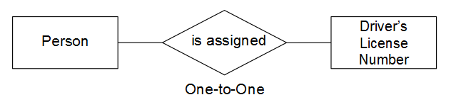

# Présentation et évaluation des relations entre les tables

Lors de l’évaluation de la relation entre deux tableaux donnés, vous devez comprendre le nombre d’occurrences possibles dans un tableau pouvant appartenir à une entité dans un autre, et vice versa. Par exemple, utilisez un `users` et un `orders` table. Dans ce cas, vous souhaitez connaître le nombre **commandes** une donnée **user** a placé et combien possible **utilisateurs** an **order** peut appartenir à .

La compréhension des relations est essentielle au maintien de l’intégrité des données, car elle affecte la précision de vos [colonnes calculées](../data-warehouse-mgr/creating-calculated-columns.md) et [dimensions](../data-warehouse-mgr/manage-data-dimensions-metrics.md). Pour en savoir plus, voir [types de relation](#types) et [comment évaluer les tableaux dans votre Data Warehouse.](#eval)

## Types de relation {#types}

Il existe trois types de relations entre deux tables :

* [&quot;un-à-un&quot;](#onetoone)
* [`un-à-plusieurs`](#onetomany)
* [`many-to-many`](#manytomany)

### `One-to-One` {#onetoone}

Dans un `one-to-one` relation, un enregistrement dans le tableau `B` appartient à un seul enregistrement dans le tableau `A`. Et un enregistrement dans Table `A` appartient à un seul enregistrement dans le tableau `B`.

Par exemple, dans la relation entre les personnes et les numéros de permis de conduire, une personne peut avoir un et un seul numéro de permis de conduire, et un numéro de permis de conduire appartient à une seule et même personne.

### `One-to-Many` {#onetomany}

Dans un `one-to-many` relation, un enregistrement dans le tableau `A` peut potentiellement appartenir à plusieurs enregistrements du tableau `B`. Pensez à la relation entre `orders` et `items` - une commande peut contenir de nombreux éléments, mais un élément appartient à une seule commande. Dans ce cas, la variable `orders` Le tableau est le côté unique et le `items` la table est le côté multiple.

### `Many-to-Many` {#manytomany}

Dans un `many-to-many` relation, un enregistrement dans le tableau `B` peut potentiellement appartenir à plusieurs enregistrements du tableau `A`. Et vice versa : un enregistrement dans le tableau `A` peut potentiellement appartenir à plusieurs enregistrements du tableau `B`.

Pensez à la relation entre **products** et **categories**: un produit peut appartenir à de nombreuses catégories et une catégorie peut contenir de nombreux produits.

## Évaluation de vos tables {#eval}

Compte tenu des types de relations existant entre les tables, vous pouvez apprendre à évaluer les tables dans votre entrepôt de données. Comme ces relations déterminent la définition de colonnes calculées à plusieurs tables, il est important de comprendre comment identifier les relations entre les tables et quel côté - `one` ou `many` - la table appartient à .

Vous pouvez utiliser deux méthodes pour évaluer les relations d’une paire de tables donnée dans votre Data Warehouse. La première méthode utilise une [cadre conceptuel](#concept) qui tiennent compte de la manière dont les entités du tableau interagissent les unes avec les autres. La deuxième méthode utilise la méthode [schéma de la table](#schema).

### Utilisation de la structure conceptuelle {#concept}

Cette méthode utilise un cadre conceptuel pour décrire comment les entités des deux tableaux peuvent interagir les unes avec les autres. Il est important de comprendre que ce cadre évalue ce qui est possible, compte tenu de la relation.

Par exemple, lorsque vous réfléchissez aux utilisateurs et aux commandes, tenez compte de tout ce qui est possible dans la relation. Un utilisateur enregistré peut passer aucune commande, une seule ou plusieurs commandes au cours de sa durée de vie. Si vous venez de lancer votre entreprise et qu’aucune commande n’a encore été passée, il est possible qu’un utilisateur donné puisse passer de nombreuses commandes au cours de sa vie et que les tables soient conçues pour répondre à ces besoins.

Pour utiliser cette méthode :

1. Identifiez l’entité décrite dans chaque tableau. **Conseil : c&#39;est généralement un nom**. Par exemple, la variable `user` et `orders` Les tableaux décrivent explicitement les utilisateurs et les commandes.
1. Identifiez le ou les verbes qui décrivent la manière dont ces entités interagissent. Par exemple, lorsque vous comparez des utilisateurs à des commandes, les utilisateurs &quot;placent&quot; des commandes. Dans l’autre sens, les commandes &quot;appartiennent&quot; aux utilisateurs.

Ce type de structure peut être appliqué à n’importe quelle association de tableaux dans votre Data Warehouse, ce qui vous permet d’identifier facilement le type de relation ainsi que la table d’un côté et celle d’un autre côté.

Une fois que vous avez identifié la terminologie qui décrit le mode d’interaction des deux tableaux, encadrez l’interaction dans les deux directions en considérant la relation entre une instance donnée de la première entité et la seconde. Voici quelques exemples de chaque relation :

### `One-to-One`

Une personne donnée peut avoir un seul numéro de permis de conduire. Un numéro de permis de conduire donné appartient à une seule et même personne.

Il s’agit d’une `one-to-one` où chaque tableau est un côté.

### `One-to-Many`

Une commande donnée peut contenir de nombreux éléments. Un élément donné appartient à une seule commande.

Il s’agit d’une `one-to-many` la relation dans laquelle la table des commandes est la seule et la table des éléments est la relation multiple.

### `Many-to-Many`

Un produit donné peut appartenir à plusieurs catégories. Une catégorie donnée peut contenir de nombreux produits.

Il s’agit d’une `many-to-many` où chaque table est un côté multiple.

### Utilisation du schéma du tableau {#schema}

La deuxième méthode utilise le schéma de la table. Le schéma définit les colonnes qui sont [`Primary`](http://en.wikipedia.org/wiki/Unique_key) et [`Foreign`](https://en.wikipedia.org/wiki/Foreign_key) clés. Vous pouvez utiliser ces clés pour lier des tableaux et déterminer des types de relations.

Une fois que vous avez identifié les colonnes qui relient deux tableaux, utilisez les types de colonnes pour évaluer la relation entre les tableaux. Voici quelques exemples :

### `One-to-one`

Si les tables sont liées à l’aide de la variable `primary key` des deux tables, la même entité unique est décrite dans chaque table et la relation est `one-to-one`.

Par exemple, un `users` peut capturer la plupart des attributs utilisateur (tels que le nom) lors d’une `user_source` capture les sources d’enregistrement des utilisateurs. Dans chaque tableau, une ligne représente un utilisateur.

### `One-to-many`

>[!NOTE]
>
>Acceptez-vous les commandes des invités ? Voir [Commandes d’invités](../data-warehouse-mgr/guest-orders.md) pour découvrir comment les commandes d’invités peuvent avoir un impact sur vos relations de table.

Lorsque des tables sont liées à l’aide d’une `Foreign key` pointant vers un `primary key`, cette configuration décrit une `one-to-many` relation. Le seul côté sera le tableau contenant le `primary key` et le côté multiple sera la table contenant le `foreign key`.

### `Many-to-many`

Si l’une des conditions suivantes est vraie, la relation est `many-to-many`:

* `Non-primary key` des colonnes sont utilisées pour lier deux tables.
   
* Partie d’un composite `primary key` est utilisé pour lier deux tables.

## Étapes suivantes

L’évaluation correcte des relations entre les tables est essentielle pour modéliser précisément vos données. Maintenant que vous comprenez comment les tables sont liées les unes aux autres, reportez-vous à la section [ce que vous pouvez faire avec le Gestionnaire de Data Warehouse](../data-warehouse-mgr/tour-dwm.md).
