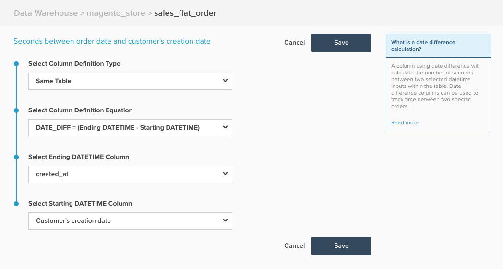

# Colonne calculée Différence de date

Cette rubrique décrit l’objectif et les utilisations de la colonne calculée `Date Difference` disponible dans la page **[!DNL Manage Data > Data Warehouse]**. Vous trouverez ci-dessous une explication de ce qu&#39;il fait, suivie d&#39;un exemple, et des mécanismes de sa création.

**Explication**

Le type de colonne `Date Difference` calcule la durée entre deux événements appartenant à un seul enregistrement, en fonction des horodatages de l’événement. La valeur brute calculée dans cette colonne est exprimée en secondes, mais elle est automatiquement convertie en minutes, heures, jours, etc., pour affichage dans les rapports. Cependant, lorsqu’il est utilisé comme filtre/groupe par , vous souhaitez utiliser la valeur en secondes.

Une colonne calculée `date difference` peut être utilisée pour créer une mesure qui calcule la durée moyenne ou médiane entre deux événements, comme la durée moyenne entre l’enregistrement du client et ses premières commandes.

**Exemple**

| **`id`** | **`timestamp_1`** | **`timestamp_2`** | **`Seconds between timestamp_2 and timestamp_1`** |
|--- |--- |--- |--- |
| `A` | 2015-01-01 00:00:00 | 2015-01-01 12:30:00 | 45000 |
| `B` | 2015-01-01 08:00:00 | 2015-01-01 10:00:00 | 7200 |

{style="table-layout:auto"}

Dans l’exemple ci-dessus, la colonne `Date Difference` est la colonne `Seconds between timestamp_2 and timestamp_1`. Il effectue le calcul `timestamp_2 minus timestamp_1`.

**Mécanique**

Les étapes suivantes décrivent comment créer une colonne `Date Difference`.

1. Accédez à la page **[!DNL Manage Data > Data Warehouse]**.
1. Accédez au tableau sur lequel vous souhaitez créer cette colonne.
1. Cliquez sur **[!UICONTROL Create a Column]** et configurez votre colonne comme suit :
   * Sélectionnez `Column Definition Type` > `Same Table`
   * Sélectionnez `Column Definition Equation` > `DATE_DIFF = (Ending DATETIME - Starting DATETIME)`
   * Sélectionnez la colonne `Ending DATETIME` > Choisissez le champ date et heure de fin, qui est généralement l’événement qui se produit plus tard.
   * Sélectionnez `Starting DATETIME` colonne** > Choisissez le champ datetime de début, qui est généralement l’événement qui se produit plus tôt.

1. Attribuez un nom à la colonne et cliquez sur **[!UICONTROL Save]**.
1. La colonne peut utiliser *immédiatement*.

Par exemple, l’exemple suivant est configuré pour calculer le `Seconds between order date and customer's creation date` :

