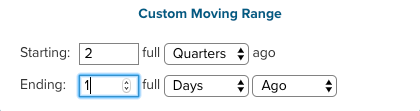

# Filtrage À L’Échelle Du Tableau De Bord

Grâce au filtrage à l’échelle du tableau de bord, vous pouvez apporter des modifications en bloc à tous les rapports sur un tableau de bord spécifique. Vous pouvez afficher rapidement la même analyse sur différentes périodes ou pour différents magasins. Vous pouvez facilement comparer les performances d’une année, d’un mois ou d’une semaine précédents par magasin. Vous pouvez mettre à jour un tableau de bord entier pour vous adapter à une nouvelle campagne lancée.

## Filtres de date

Pour modifier la période ou l’intervalle des rapports d’un tableau de bord, cliquez sur l’icône de calendrier dans le coin supérieur droit ().

Vous pouvez choisir d’afficher les données à l’aide d’un `Fixed Date Range` ou de différents `Moving Date Ranges` précalculés :

Les options de plage mobile `Last Full...` représentent la plage la plus récemment terminée, tandis que `This...` est la plage actuelle en cours. Par exemple, si nous sommes en juin, la `Last Full Month` est _du 1er au 31 mai_, tandis que `This Month` est _du 1er juin au moment présent_.

Ou créez votre propre `Custom Moving Range`\:

Choisissez de modifier également l’intervalle. Lorsque vous sélectionnez le bouton par défaut (), seule la période change :

Pour rétablir tous les rapports à leur période et intervalle initiaux, cliquez sur **[!UICONTROL Restore Defaults]** ou sur **[!UICONTROL Cancel]**.

Lorsque vous spécifiez un filtre de date pour un tableau de bord, ce filtre est appliqué uniquement à ce tableau de bord. Elle n’est pas appliquée lorsque vous accédez à d’autres tableaux de bord.

>[!NOTE]
>
>Actuellement, les `Cohort Reports` et les `SQL Reports` ne sont pas inclus lors de l’application des modifications au niveau du tableau de bord.

## Stocker les filtres

Pour analyser les performances d’un magasin spécifique, cliquez sur l’icône de magasins dans le coin supérieur droit (). Par défaut, `Store Filter` est défini sur `All Stores`, ce qui affiche les données de toutes les [&#x200B; vues de magasin](https://experienceleague.adobe.com/docs/commerce-admin/stores-sales/site-store/store-views.html) disponibles sur votre site Commerce.

>[!NOTE]
>
>Un filtre de magasin est activé ou désactivé pour l’ensemble d’un compte [!DNL Commerce Intelligence]. Si un tableau de bord contient des rapports qui ne sont pas affectés par le filtre (tels que des rapports qui ne sont pas créés sur des données [!DNL Adobe Commerce]), ces rapports ne sont pas mis à jour lorsque le filtre de magasin est appliqué. Vous pouvez [contacter l’assistance](https://experienceleague.adobe.com/docs/commerce-knowledge-base/kb/troubleshooting/miscellaneous/mbi-service-policies.html) si vous pensez qu’un rapport doit être mis à jour en fonction de la sélection de la boutique ou si vous pensez que le filtre de votre boutique de comptes est désactivé par erreur.

Lorsque vous sélectionnez un magasin dans la `Store Filter`, le filtre conserve votre sélection lorsque vous naviguez entre les tableaux de bord. La conservation de votre sélection vous permet d’afficher les données du magasin sélectionné partout jusqu’à ce que vous sélectionniez `All Stores`.

## Filtres pour les tableaux de bord partagés

Pour les tableaux de bord partagés, si un utilisateur configure le filtre de date, les autres utilisateurs ayant accès au tableau de bord verront le même filtre appliqué. Toutefois, le filtre de magasin ne s’applique pas dans ce cas. Si le propriétaire du tableau de bord configure le filtre de magasin et partage le tableau de bord, le filtre de magasin configuré n’est pas persistant pour un autre utilisateur. Un utilisateur doit disposer d’un [accès en modification](../../data-user/dashboards/share-dashboard-with-users.md) à un tableau de bord pour ajuster les filtres de celui-ci.
