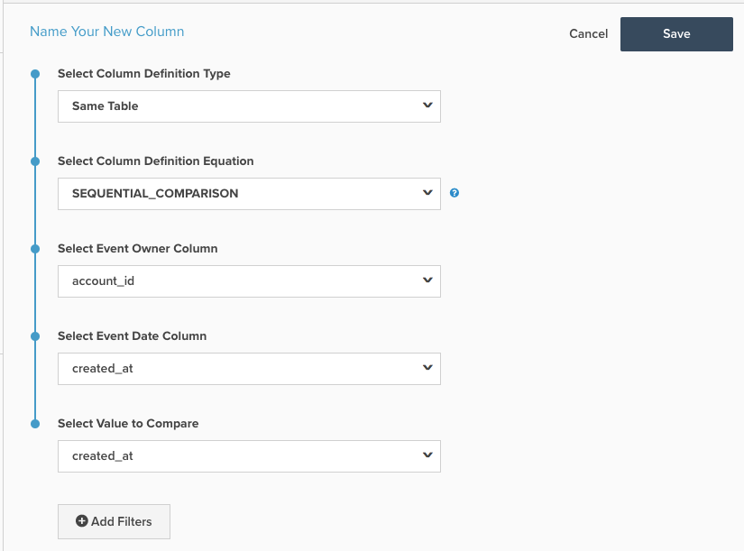

# Colonne calculée de comparaison séquentielle

Cette rubrique décrit l’objectif et les utilisations de la fonction `Sequential Comparison` colonne calculée disponible dans la **[!DNL Manage Data > Data Warehouse]** page. Vous trouverez ci-dessous une explication de ce qu&#39;il fait, suivie d&#39;un exemple et des mécanismes de sa création.

**Explication**

La variable `Sequential Comparison` type de colonne : permet de trouver la différence entre les événements consécutifs. Le type le plus courant de `Sequential Comparison` est la colonne `Seconds since previous order` colonne . Trois entrées sont nécessaires pour cette colonne :

1. `Event Owner`: cette entrée détermine l’entité pour laquelle les lignes sont regroupées. Par exemple, dans la variable `Seconds since previous order` , le propriétaire de l’événement est le client, car vous souhaitez trouver le nombre de secondes depuis la commande précédente du même client.
1. `Event Date`: cette entrée applique la séquence d’événements. Dans les cas de `Seconds since previous order`, la colonne contenant l’horodatage de l’ordre doit être la valeur `Event Date`. Cette entrée est toujours un horodatage.
1. `Value to Compare`: cette entrée est la valeur réelle à comparer. Elle soustrait la valeur de la ligne précédente de la valeur de la ligne actuelle. Par conséquent, une colonne qui recherche l’écart temporel entre les commandes successives d’un client est appelée `Seconds since previous order`. Cette entrée ne doit pas nécessairement être un horodatage. Un exemple non horodaté consiste à trouver la différence de valeur de commande entre les commandes successives d’un client.

**Exemple**

| **`event_id`** | **`owner_id`** | **`timestamp`** | **`Seconds since owner's previous event`** |
|--- |--- |--- |--- |
| **`1`** | A | 2015-01-01 00:00:00 | NULL |
| **`2`** | B | 2015-01-01 00:30:00 | NULL |
| **`3`** | A | 2015-01-01 02:00:00 | 7200 |
| **`4`** | A | 2015-01-02 13:00:00 | 126000 |
| **`5`** | B | 2015-01-03 13:00:00 | 217800 |

Dans l’exemple ci-dessus, `Seconds since owner's previous event` est la valeur `Sequential Comparison` colonne calculée. Pour le `owner_id = A`, il identifie d’abord une séquence en fonction de la variable `timestamp` , puis soustrait le de l’événement précédent `timestamp` de l’horodatage de l’événement actuel. Sur la troisième ligne du tableau, la deuxième ligne pour `owner_id A` - la valeur de `Seconds since owner's previous event` est le nombre de secondes entre &quot;2015-01-01 02:00&quot; et &quot;2015-01-01 00:00:00&#39;. Cette différence est égale à deux heures = 7 200 secondes.

Pour ce type de colonne calculé, la ligne correspondant au premier événement du propriétaire comporte une `NULL` .

**Mécanique**

Pour créer une **Numéro d’événement** column :

1. Accédez au **[!DNL Manage Data > Data Warehouse]** page.

1. Accédez au tableau sur lequel vous souhaitez créer cette colonne.

1. Cliquez sur **[!UICONTROL Create New Column]** dans le coin supérieur droit.

1. Sélectionner `Same Table` comme la propriété `Definition Type` (si les colonnes que vous souhaitez comparer ne se trouvent pas sur la même table, vous devrez peut-être les déplacer).

1. Sélectionner `SEQUENTIAL_COMPARISON` comme la propriété `Column Definition Equation`.

1. Choisissez les entrées, comme expliqué ci-dessus :
   - `Event Owner`
   - `Event Date`
   - `Value to Compare`

1. Vous pouvez également ajouter des filtres pour exclure les lignes de la prise en compte. Les lignes exclues ont une `NULL` pour cette colonne.

1. Attribuez un nom à la colonne en haut de la page, puis cliquez sur **[!UICONTROL Save]**.

1. La colonne peut être utilisée. *immédiatement*.

