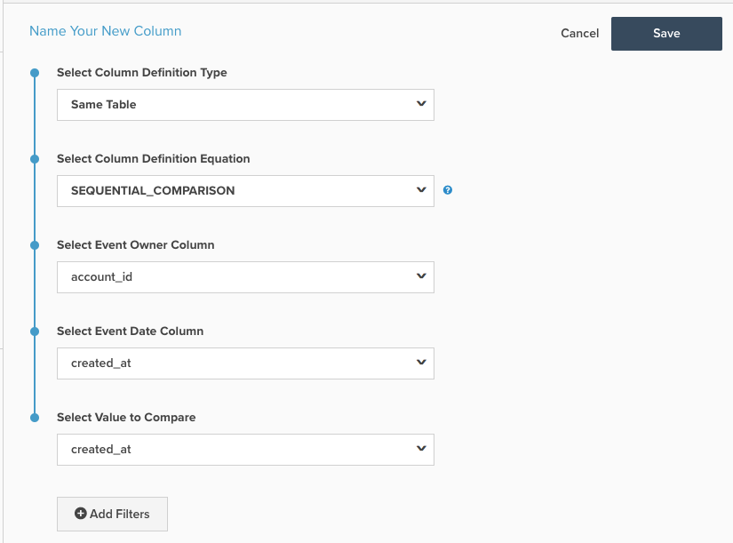

# Colonne calculée de comparaison séquentielle

Cette rubrique décrit l’objectif et les utilisations de la colonne calculée `Sequential Comparison` disponible dans la page **[!DNL Manage Data > Data Warehouse]**. Vous trouverez ci-dessous une explication de son fonctionnement, suivie d’un exemple et des mécanismes de sa création.

**Explication**

Le type de colonne `Sequential Comparison` : détecte la différence entre des événements consécutifs. Le type le plus courant de `Sequential Comparison` colonne est la colonne `Seconds since previous order`. Trois entrées sont nécessaires pour cette colonne :

1. `Event Owner` : cette entrée détermine l&#39;entité pour laquelle les lignes sont regroupées. Par exemple, dans la colonne `Seconds since previous order` , le propriétaire de l&#39;événement est le client, car vous souhaitez rechercher le nombre de secondes écoulées depuis la commande précédente du même client.
1. `Event Date` : cette entrée applique la séquence d’événements. Dans le cas de `Seconds since previous order`, la colonne contenant la date et l’heure de la commande doit être la `Event Date`. Cette entrée est toujours un horodatage.
1. `Value to Compare` : cette entrée est la valeur réelle à comparer. Il soustrait la valeur de la ligne précédente de la valeur de la ligne actuelle. Par conséquent, une colonne recherchant le décalage temporel entre les commandes successives d’un client est appelée `Seconds since previous order`. Il n’est pas nécessaire que cette entrée soit un horodatage. Un exemple autre qu’un horodatage consiste à rechercher la différence de valeur d’ordre entre les commandes successives d’un client.

**Exemple**

| **`event_id`** | **`owner_id`** | **`timestamp`** | **`Seconds since owner's previous event`** |
|--- |--- |--- |--- |
| **`1`** | A | 2015-01-01 00:00:00 | NULL |
| **`2`** | B | 2015-01-01 00:30:00 | NULL |
| **`3`** | A | 2015-01-01 02:00:00 | 7200 |
| **`4`** | A | 2015-01-02 13:00:00 | 126000 |
| **`5`** | B | 2015-01-03 13:00:00 | 217800 |

Dans l’exemple ci-dessus, `Seconds since owner's previous event` est la colonne calculée `Sequential Comparison`. Pour la `owner_id = A`, il identifie d’abord une séquence en fonction de la colonne `timestamp`, puis soustrait la `timestamp` de l’événement précédent de l’horodatage de l’événement actuel. Sur la troisième ligne du tableau (la deuxième ligne pour `owner_id A`), la valeur de `Seconds since owner's previous event` correspond au nombre de secondes entre « 2015-01-01 02 :00 » et « 2015-01-01 00:00:00 ». Cette différence équivaut à deux heures = 7 200 secondes.

Pour ce type de colonne calculée, la ligne correspondant au premier événement du propriétaire a une valeur `NULL`.

**mécanique**

Pour créer une colonne **Numéro d’événement** :

1. Accédez à la page **[!DNL Manage Data > Data Warehouse]**.

1. Accédez à la table sur laquelle vous souhaitez créer cette colonne.

1. Cliquez sur **[!UICONTROL Create New Column]** dans le coin supérieur droit.

1. Sélectionnez `Same Table` comme `Definition Type` (si les colonnes que vous souhaitez comparer ne se trouvent pas sur la même table, vous devrez peut-être les déplacer).

1. Sélectionnez `SEQUENTIAL_COMPARISON` comme `Column Definition Equation`.

1. Choisissez les entrées, comme expliqué ci-dessus :
   - `Event Owner`
   - `Event Date`
   - `Value to Compare`

1. Des filtres peuvent également être ajoutés pour exclure des lignes de la prise en compte. Les lignes exclues ont une valeur `NULL` pour cette colonne.

1. Attribuez un nom à la colonne en haut de la page et cliquez sur **[!UICONTROL Save]**.

1. La colonne peut être utilisée *immédiatement*.

