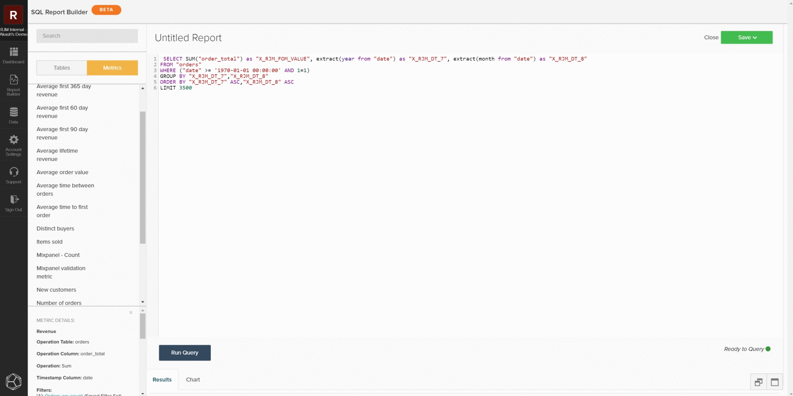

# [!DNL SQL Report Builder]

Le [!DNL SQL Report Builder] est principalement utilisé pour créer de nouveaux rapports et itérer sur des analyses, mais il peut également être utilisé pour auditer efficacement les données et les mesures. Les informations suivantes expliquent comment auditer les données et les mesures à l’aide du [!DNL SQL Report Builder] afin de comparer les résultats avec les données de votre base de données locale.

## Interrogation d’une mesure

Pour commencer, ouvrez le [!DNL SQL Report Builder] en accédant à **[!UICONTROL Report Builder > SQL Report Builder > Create Report]**. Vous pouvez utiliser la barre latérale dans l’éditeur de [!DNL SQL] pour insérer une mesure directement dans votre requête en pointant sur la mesure et en cliquant sur **[!UICONTROL Insert]**. Cette action ajoute la définition de requête de cette mesure à l’éditeur. La définition comprend les éléments suivants :

- Opération **métrique** en cours d’exécution, indiquée par `SUM()` dans l’exemple ci-dessous.
- Le **tableau sur lequel la mesure est créée** indiqué par la clause `FROM`.
- Tous les **filtres (et ensembles de filtres)** qui ont été ajoutés à la mesure, indiqués par la clause `WHERE` dans l’exemple ci-dessous.
- Composant de la **date et heure** (année, mois) sur lequel les données doivent être commandées, indiqué par la clause `ORDER BY` dans l’exemple ci-dessous.

Pour avoir une vue plus claire de la requête, vous pouvez reformater son affichage dans le champ de requête. Une fois prêt, sélectionnez `Run Query`. Les résultats sont renseignés sous la forme d’un tableau dans le panneau de rapport sous la requête.

## Restreindre la requête

Si vous tentez d’identifier une incohérence ou un ensemble de données spécifique, limitez la requête à un échantillon spécifique pour vérifier les performances de votre base de données locale. Vous pouvez le faire en modifiant la requête pour qu’elle corresponde aux restrictions souhaitées. Dans l’exemple suivant, vous limitez la requête pour inclure uniquement le chiffre d’affaires du 1er janvier 2013 ou ultérieur. Après avoir mis à jour la requête, sélectionnez à nouveau **[!UICONTROL Run Query]** pour mettre à jour les résultats.

## Enregistrement et exportation

Lorsque le rapport répond à vos besoins, attribuez-lui un nom distinct, cliquez sur **[!UICONTROL Save]**, puis sélectionnez le type de rapport à enregistrer et le tableau de bord. Lors de l’audit des mesures, Adobe recommande d’enregistrer le rapport en tant que `Table` et de l’enregistrer dans un tableau de bord de test.

Une fois le rapport enregistré, accédez à ce tableau de bord en sélectionnant `Go to Dashboard`. De là, vous pouvez exporter les données en recherchant le rapport et en sélectionnant **[!UICONTROL Options gear > Full `.csv`Exporter]** ou **[!UICONTROL Full Excel Export]**.

## Requêtes personnalisées

Vous pouvez également écrire des requêtes personnalisées et exporter les résultats pour les comparer à votre base de données locale. En suivant les [instructions pour l’optimisation des requêtes](../../best-practices/optimizing-your-sql-queries.md), écrivez une requête dans l’éditeur SQL. Vous pouvez utiliser les boutons situés en haut de la barre latérale pour basculer entre les listes de tableaux et de mesures disponibles dans le [!DNL SQL Report Builder] et les ajouter à votre requête. Lorsque votre requête personnalisée répond à vos besoins, vous pouvez enregistrer le rapport et exporter ces données à partir du tableau de bord.

>[!NOTE]
>
>Si vous constatez une incohérence après avoir vérifié vos données, reportez-vous à la rubrique de support [Contacter le support : incohérences des données](https://experienceleague.adobe.com/docs/commerce-knowledge-base/kb/troubleshooting/miscellaneous/mbi-data-discrepancies.html) pour plus d’informations sur les actions à entreprendre ensuite.
