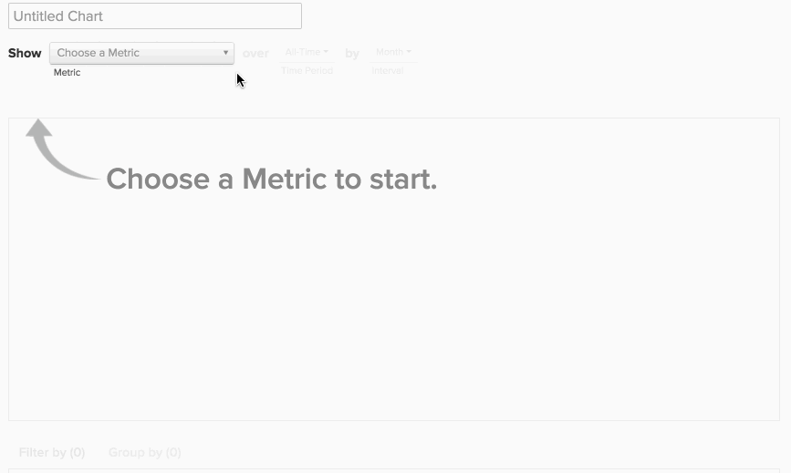

# Report Builder de cohorte

Avez-vous déjà voulu étudier le comportement des différents sous-ensembles de vos utilisateurs au fil du temps ? Par exemple, vous êtes-vous déjà demandé si les utilisateurs qui s’inscrivent lors d’une période de promotion ont des recettes de durée de vie moyenne plus élevées que ceux qui ne s’y inscrivent pas ? Si la réponse est `Yes`, puis la variable `Cohort Report Builder` est l&#39;outil parfait pour vous. [!DNL Adobe Commerce Intelligence] est optimisée pour effectuer cette analyse et la rendre pertinente pour votre entreprise.

## Qu’est-ce que l’analyse des cohortes ? {#what}

`Cohort` L’analyse peut être définie au sens large comme l’analyse de groupes d’utilisateurs partageant des caractéristiques similaires au cours de leur cycle de vie. Il vous permet d’identifier les tendances comportementales entre différents groupes d’utilisateurs.

Pour une introduction détaillée sur `cohort` analyse, révision [cette page](https://www.cohortanalysis.com/).

Dans votre [!DNL Commerce Intelligence] tableau de bord, il est facile de créer un utilisateur `cohorts` basé sur un `cohort` date et une mesure dans votre compte.

## Pourquoi l’analyse des cohortes est-elle importante ? {#important}

Comme mentionné ci-dessus, `cohort` l’analyse vous permet d’identifier les tendances comportementales entre différents groupes d’utilisateurs. Grâce à une solide compréhension du comportement de certains groupes, vous pouvez personnaliser vos décisions et vos dépenses afin d’optimiser vos ventes. Par exemple, prenez une durée de vie des recettes `cohort` analyse - bien que ce genre d’analyse soit bénéfique pour de nombreuses raisons, la première est de meilleures décisions d’acquisition client.

## Comment créer la mienne `cohort` analyse ?

### Nouvelle architecture

Voici les instructions d’utilisation de la variable `Cohort Report Builder` sur le [Nouvelle architecture](../../administrator/account-management/new-architecture.md).

1. Cliquez sur **[!UICONTROL Report Builder]** dans l’onglet de gauche ou **[!UICONTROL Add Report** > **Create Report]** dans n’importe quel tableau de bord.

1. Dans le `Report Builder` écran de sélection, cliquez sur **[!UICONTROL Create Report]** en regard de `Visual Report Builder` .

**Ajout d’une mesure**

Maintenant que vous êtes dans la `Report Builder`, ajoutez la mesure sur laquelle vous souhaitez effectuer l’analyse (exemple : `Revenue` ou `Orders`).

>[!NOTE]
>
>Native [!DNL Google Analytics] ne sont pas compatibles avec la variable `Cohort Report Builder`.

**Activez/désactivez l’affichage des mesures pour`Cohort`**

Une nouvelle fenêtre s’ouvre alors pour configurer les détails de la variable `Cohort` Rapport.

### Cinq spécifications sont nécessaires pour créer une `Cohort` rapport :

1. Comment regrouper les `cohorts`
1. Le `cohort` période
1. Le nombre de `cohorts` pour afficher
1. La quantité minimale de données pour chaque `cohort` must contain
1. Durée après `cohort` occurrence

#### 1. Regroupement `cohorts`

`Cohorts` sont regroupées par horodatage, comme **date d&#39;enregistrement** ou **date de première commande**.

>[!NOTE]
>
>Vous ne pouvez pas utiliser le même horodatage que celui utilisé pour la mesure pour la variable `cohort` date. Pour une analyse qui nécessite ce type de données, vous pouvez utiliser la variable `Standard report builder` au lieu de .

#### 2. `Cohort` période

Sélection de la période à grouper `cohorts` par. En d’autres termes, quelle partie de l’horodatage que vous avez sélectionnée ci-dessus est la plus importante ; la valeur `week`, `month`, `quarter`ou `year`? Votre rapport affiche les données dans l’intervalle que vous sélectionnez ici

#### 3. et 4. Définissez le nombre de `cohorts` pour afficher et combien de données chaque `cohort` must have

Ces paramètres vous aident à afficher uniquement les `cohorts` qui vous intéresse, et qui est pratique `Preview` La zone située au bas de la fenêtre vous indique exactement les cohortes affichées dans votre rapport.

Par défaut, la variable `cohort` n’est pas inclus, sauf si vous modifiez la quantité minimale de données requise pour chaque `cohort` to `0`. Dans ce cas, la variable `cohort` pour la période en cours comprend uniquement des données partielles.

#### 5. Période après `Cohort` Occurrence

Cette fonctionnalité vous permet de définir la période des données que vous affichez pour le sélectionné. `cohorts`. Par exemple, si vous souhaitez afficher 24 rapports mensuels `cohorts` basé sur `customer's first order date`, mais vous n’êtes intéressé que par les 3 premiers mois de données pour chaque `cohort`, vous pouvez définir la variable `number of cohorts to view` to `24` et le `time range after cohort occurrence` to `3`.

L’intervalle de cette valeur change en fonction de ce que vous avez sélectionné dans la variable `cohort time period` et la valeur est définie sur `12` par défaut ; la valeur ne change que si vous cliquez sur l’icône du calendrier pour la modifier.

#### Autres notes

* [!UICONTROL Filters]: appliqué à vos mesures reste intact lorsque vous passez d’une `Standard` et `Cohort` vues.

* Voir [`Perspectives`](#perspectives).

#### Exemple

Voici un exemple pour tout rassembler. Dans cet exemple, je veux vérifier le comportement de la commande après un événement `cohort`Premier achat de pour savoir si cette cohorte reviendra pour effectuer des achats répétés dans les six prochains mois.

### Architecture héritée

#### Architecture héritée {#personalinfo}

Vous trouverez ci-dessous des instructions spécifiques à la version héritée de la fonction `Cohort Report Builder`. Si vous souhaitez utiliser la nouvelle version, reportez-vous à la section [Nouvelle architecture](../../administrator/account-management/new-architecture.md) pour plus d’informations sur la migration vers une [!DNL Commerce Intelligence] Nouveau compte Architecture .

#### Comment créer la mienne `cohort` analyse ? {#create}

`Cohort` l&#39;analyse en action ! Vous pouvez constater ici que les recettes augmentent au fil du temps de manière cumulée et par utilisateur.

Cette section vous guide tout au long de la création de votre propre `cohort` analyse. Pour consulter des exemples (et des GIFs animés qui illustrent le processus), reportez-vous à la section [Section Exemples](#examples) de cette rubrique.

1. Cliquez sur **[!UICONTROL Report Builder]** dans l’onglet de gauche ou **[!UICONTROL Add Report** > **Create Report]** dans n’importe quel tableau de bord.

1. Dans le `Report Builder Selection` écran, cliquez sur **[!UICONTROL Create Report]** en regard de `Cohort Analysis` .

#### Ajout d’une mesure

Maintenant que vous êtes dans la `Cohort Report Builder`, ajoutez la mesure (exemple : `Revenue` ou `Number of orders`) sur laquelle vous souhaitez effectuer l’analyse.

>[!NOTE]
>
>Native [!DNL Google Analytics] ne sont pas compatibles avec la variable `Cohort Report Builder`.

#### Sélection de la date de cohorte {#date}

L’étape suivante consiste à spécifier la variable `cohort date`. Il s’agit de la date à laquelle vos utilisateurs sont regroupés. Par exemple, il peut s’agir de `User's first order date` ou `User's registration date`.

>[!NOTE]
>
>Vous ne pouvez pas utiliser la même date que celle à laquelle la mesure est créée (exemple : `created at`) en tant que `cohort date`.

#### Définition de l’intervalle et de la période

Définissez ensuite la variable `Interval` et `Time Period`.

`Interval`
Le `Interval` vous permet de définir la variable `length` de votre `cohorts`. Par exemple, si la variable est définie sur `Month`, votre rapport est mesuré en mois.

Vous pouvez modifier l’affichage de ces intervalles sur l’axe X à l’aide de la variable **Durée** .

`Time Period`
Utilisez la variable `Time Period` pour sélectionner un utilisateur spécifique `cohorts` à analyser. Vous pouvez afficher toutes les `cohort`, effectuez une sélection dans une liste, spécifiez une période ou définissez une période variable de `cohorts` à inclure. Par exemple, si vous avez utilisé la variable `Specific Cohorts` vous pouvez sélectionner des mois spécifiques à inclure dans l’analyse :

Si vous groupez `cohorts` par date d’enregistrement, puis sur avril, mai et juin dans la variable `Specific Cohorts` liste, tous les utilisateurs qui se sont inscrits dans ces mois seront inclus.

#### Définir l&#39;axe des X

Sous `duration`, vous pouvez définir les paramètres de l’axe X du graphique. C’est-à-dire le nombre de périodes représentées par chaque point de données et le nombre de points de données à inclure dans l’analyse.

#### En sélectionnant le `counting members` table

Si vous avez choisi de regrouper des utilisateurs par un `cohort date` qui a été joint à partir d’une autre table, vous pouvez voir une `counting members in the … table` .

Consultez un exemple pour comprendre ce paramètre. Supposons que vous ayez créé une cohorte de rapport dans une `Revenue` mesure par `Customer's registration date`. Vous vouliez également utiliser la perspective `Average value per cohort member` pour visualiser les recettes par acheteur au fil du temps. Pour trouver la valeur moyenne par acheteur, vous devez décider du nombre d&#39;acheteurs à diviser. S’agit-il du nombre de clients enregistrés dans votre `customers` ou est-ce le nombre d’acheteurs distincts dans votre `orders table` pour la même période ?

Ce paramètre répond à cette question. Comptage des membres dans la variable `customers` table inclut tous les clients (qu’ils aient effectué un achat ou non) en moyenne. Comptage des membres dans la variable `orders` comprend uniquement les clients qui ont effectué un achat.

#### Sélectionner une perspective {#perspective}

Après avoir défini la mesure et la manière dont vous souhaitez l’analyser, vous pouvez sélectionner la variable `perspective` vous voulez utiliser.

Juste au-dessus de la visualisation du rapport se trouve une liste déroulante de `perspective` paramètres.

Voir [Perspectives](#perspectives).

## Exemples d’analyse des cohortes {#examples}

Maintenant que vous avez décrit comment créer une `cohort` regardez quelques exemples.

### Je veux savoir comment mon utilisateur `cohorts` se développent au fil du temps.

Dans cet exemple, vous avez analysé la variable `Revenue` , regroupées par cohortes selon la `customer's first order date`, et sélectionnez les 8 plus récents `cohorts` (défini dans la variable `Time Period` ) à inclure dans l’analyse. Pour voir comment les cohortes ont augmenté au fil du temps, vous avez utilisé la variable `Cumulative Average Value per Cohort Member` `perspective`.

### Je veux savoir, en moyenne, combien de commandes un utilisateur effectue à différents moments de sa vie.

(../../assets/cohort2.gif)

Dans cet exemple, vous avez analysé la variable `Number of orders` , regroupées par cohortes selon la `customer's first order date`et incluaient les huit cohortes les plus récentes (définies dans la variable `Time Period` ) dans l’analyse. Pour afficher le nombre moyen de commandes pour chaque cohorte, vous avez modifié la variable `perspective` to `Average Value per Cohort Member`.

### Je veux comparer l’activité d’achat future d’un utilisateur à l’activité de son premier mois avec celle de l’entreprise.

## `Perspectives` {#perspectives}

`Standard`
Cela indique la contribution incrémentielle d’un groupe de cohortes donné à un moment donné de leur cycle de vie. (exemple : Le point &quot;Semaine 6&quot; affiche tous les points de données effectués par les utilisateurs au cours de leur sixième semaine.)

`Average Value per Cohort Member`
Cela divise le `Standard cohort` en (1) par le nombre d’utilisateurs dans chaque `cohort` groupe. Cela peut s’avérer utile pour comparer les performances des cohortes d’après les pommes, car tous les groupes de cohortes ne peuvent pas inclure le même nombre d’utilisateurs. Par exemple, le revenu moyen par utilisateur de la semaine 6 d’un certain `cohort`.

`Cumulative`
Ceci `perspective` montre les `cohort` analyse sur un `cumulative` base. En d’autres termes, il montre la contribution totale d’une cohorte donnée à ce jour à un moment donné de son cycle de vie. Par exemple, les recettes cumulées après six semaines d’utilisateurs provenant d’une certaine cohorte.

`Cumulative Average Value per Cohort Member`
Cela divise le `Cumulative` en (3) par le nombre d’utilisateurs dans chaque `cohort` groupe. Il indique la contribution de durée de vie moyenne (souvent les recettes de durée de vie moyenne) par `cohort` à chaque période dans la variable `cohort's` la vie. Par exemple, les recettes de durée de vie moyenne après six mois d’utilisateurs ayant rejoint le site en juin.

`Percent of First Value (show first value)`
Cela analyse l’agrégat `cohort` à un moment spécifique dans une `cohort's` cycle de vie en pourcentage de leur contribution au cours de la première période. Par exemple, les recettes du mois 6 divisées par les recettes du mois 1 des utilisateurs qui ont rejoint le mois de juin.

`Percent of First Value (hide first value)`
Il s’agit de la même chose que la variable `perspective` ci-dessus, sauf que la valeur de la première période de 100 % est masquée.

## Remplissage {#finish}

Le `Cohort Report Builder` est optimisé pour regrouper les utilisateurs selon un `cohort date`. Il peut être intéressant de regrouper les utilisateurs selon une activité ou un attribut similaire. Adobe recommande d’extraire [ce tutoriel sur les cohortes qualitatives](../dev-reports/create-qual-cohort-analysis.md) pour commencer.
