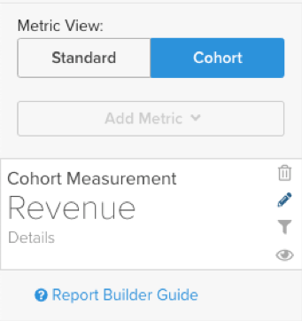

# [!DNL Cohort Report Builder] pour les cohortes non basées sur la date

Le [`Cohort Report Builder`](../dev-reports/cohort-rpt-bldr.md) est très utile pour aider les commerçants à étudier comment différents sous-ensembles d’utilisateurs se comportent au fil du temps. Auparavant, la `Cohort Report Builder` était optimisée pour regrouper les utilisateurs selon un `cohort date` commun (par exemple, l’ensemble de tous les clients qui ont effectué leur premier achat au cours d’un mois donné). La fonctionnalité `Non-Date Based Cohort` vous permet désormais de regrouper les utilisateurs par activité ou attribut similaire. Examinez quelques cas d’utilisation de cette fonctionnalité.

## Cas d’utilisation

Il ne s’agit pas d’une liste complète, mais voici quelques analyses potentielles qui peuvent être effectuées avec cette fonctionnalité.

* Examiner le chiffre d’affaires des clients acquis de [!DNL Google] par rapport à [!DNL Facebook]
* Analyser les clients dont le premier achat a été effectué aux États-Unis par rapport au Canada
* Observation du comportement des clients acquis à partir de diverses campagnes publicitaires

## Création de votre analyse

1. Cliquez sur **[!UICONTROL Report Builder]** dans l’onglet de gauche ou **[!UICONTROL Add Report** > **Create Report]** dans n’importe quel tableau de bord.

1. Dans l’écran `Report Builder Selection`, cliquez sur **[!UICONTROL Create Report]** en regard de l’option `Visual Report Builder` .

### Ajout d’une mesure

Maintenant que vous êtes dans la `Report Builder`, vous ajoutez la mesure sur laquelle vous souhaitez effectuer l’analyse (par exemple : `Revenue` ou `Orders`).

>[!NOTE]
>
>Les mesures de [!DNL Google Analytics] natives ne sont pas compatibles avec le `Cohort Report Builder`. L’objectif de cet exemple est d’examiner le chiffre d’affaires au fil du temps pour les clients de première commande qui ont été acquis par le biais de différentes sources de [!DNL Google Analytics].

### Activer/désactiver le `Metric View` en `Cohort`

Une nouvelle fenêtre s’ouvre, dans laquelle vous pouvez configurer les détails du rapport de cohorte.

Cinq spécifications sont nécessaires pour créer un rapport de cohorte :

1. Comment regrouper les cohortes
1. Sélection de cohortes
1. Date et heure de l’action
1. Cohorte de la première plage d’actions
1. Période après l’occurrence de la cohorte

<!--{: width="200" height="224"}-->

#### &#x200B;1. `cohorts` de regroupement

Les `Cohorts` sont regroupées selon une caractéristique de comportement, dans cet exemple `Customer's first order GA source`. Les options disponibles ici sont des colonnes déjà désignées comme `groupable` pour la mesure.

#### &#x200B;2. Sélection des cohortes

Vous pouvez afficher tous les résultats pour la caractéristique donnée. Comme cela peut entraîner de nombreuses `cohorts`, vous pouvez sélectionner les `cohorts` spécifiques (qui correspondent aux différentes valeurs disponibles pour les `Customer's first order GA source`) dont vous avez besoin.

<!--{: width="300" height="338"}-->

#### 3. `Action timestamp`

Vous pouvez ainsi choisir une colonne basée sur une date autre que la colonne sur laquelle la mesure est créée. Ci-dessous, vous allez sélectionner la période qui s’applique à la `action timestamp` donnée.

#### 4. `Cohort first action time range`

C’est là que vous sélectionnez la période qui contient le `cohorts action timestamp` (donc, les clients qui ont reçu la première commande de novembre 2017 à octobre 2018). Il peut s’agir d’une période mobile ou d’une période fixe.

#### 5. `Time range after cohort occurrence`

Voulez-vous voir les `cohorts` au fil du temps par mois, semaine ou année ? C’est ici que vous effectuez ces sélections. Sous cette section, vous sélectionnerez les `time range` après la `cohort action timestamp`. Par exemple, vous voyez ici 12 mois de données pour les clients qui ont passé la première commande au cours de la période d’action.

<!--{: width="400" height="557"}-->

>[!NOTE]
>
>Les [!UICONTROL Filters] appliquées à vos mesures restent intactes lorsque vous basculez entre les vues `Standard` et `Cohort`.

### Connexe

Voir [`Perspectives`](../../data-analyst/dev-reports/cohort-rpt-bldr.md).
