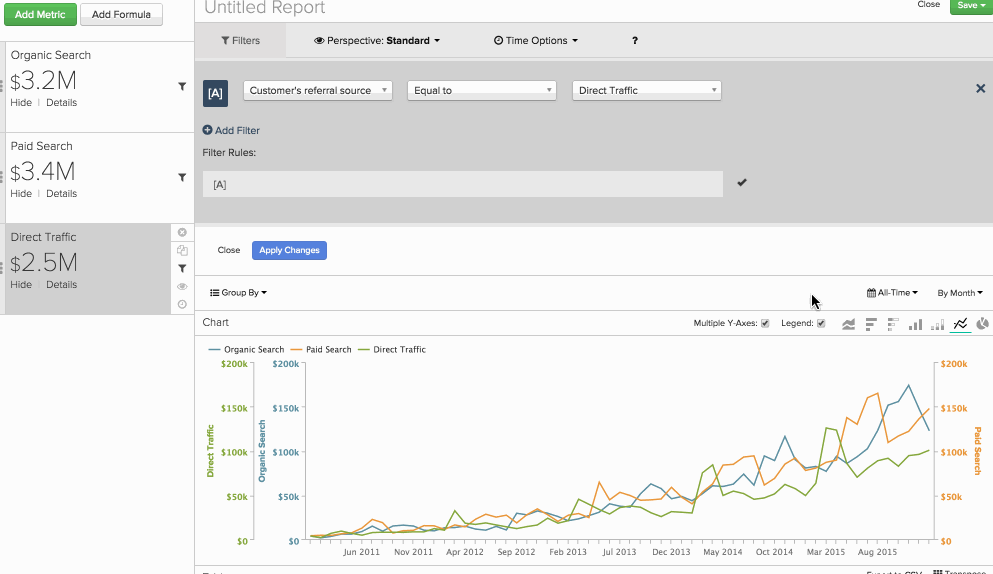

# Création d’un `Qualitative Cohort Analysis`

Savez-vous comment vos segments de clients [!DNL Google Adwords] augmentent leur LTV par rapport à ceux acquis à partir de la recherche organique ? Avez-vous déjà pensé à effectuer une analyse `cohort` sur différents segments de clients côte à côte dans le même rapport ? Si c’est le cas, un `qualitative cohort analysis` vous aidera à répondre à ces questions.

Cette rubrique aborde ce qu’est une cohorte qualitative, pourquoi vous pourriez être intéressé par la création de cette analyse et comment la créer dans [!DNL Commerce Intelligence].

## Qu&#39;est-ce qu&#39;`qualitative cohorts` ? {#whatare}

L’analyse des `Cohort` en général peut être définie de manière large comme l’analyse de groupes d’utilisateurs qui partagent des caractéristiques similaires tout au long de leur cycle de vie. Il vous permet d’identifier les tendances comportementales parmi différents groupes d’utilisateurs.

La plupart des analyses `cohort` dans [!DNL Commerce Intelligence] regroupent les utilisateurs par une date commune (par exemple, l’ensemble de tous les clients qui ont effectué leur premier achat au cours d’un mois donné). Un `qualitative cohort` est un peu différent : il s’agit d’un groupe d’utilisateurs et d’utilisatrices défini par une caractéristique qui n’est pas temporelle. Voici quelques exemples :

* Ensemble de tous les utilisateurs acquis à partir d’une campagne publicitaire
* Ensemble de tous les utilisateurs et utilisatrices dont le premier achat incluait un coupon (ou non).
* Ensemble de tous les utilisateurs et utilisatrices d’un certain âge.

## En quoi cela diffère-t-il du créateur de `cohort` normal ? {#different}

Le [`Cohort Analysis Builder`](../dev-reports/cohort-rpt-bldr.md) est optimisé pour regrouper des cohortes à l’aide d’une caractéristique temporelle. Idéal pour les analyses axées sur un segment spécifique d’utilisateurs et d’utilisatrices (par exemple, tous les utilisateurs et utilisatrices acquis(e)s par le biais d’une campagne de référencement payant). Dans le `Cohort Analysis Builder`, vous pouvez (1) concentrer l’attention sur ce groupe d’utilisateurs spécifique et (2) `cohort` sur une date (comme la date de leur première commande).

Cependant, si vous souhaitez analyser le comportement de cohorte de plusieurs segments d’utilisateurs et d’utilisatrices dans le même rapport de cohorte (recherche `paid` par rapport à recherche `organic` par rapport au trafic direct, peut-être ?), cette analyse plus avancée peut être construite dans le `Report Builder` .

## Quelles informations dois-je envoyer à l’assistance pour configurer mon analyse ? {#support}

La création d’un rapport `qualitative cohort` dans le `Report Builder` implique la création par l’équipe d’analystes d’Adobe de [colonnes calculées avancées](../data-warehouse-mgr/creating-calculated-columns.md) dans les tables nécessaires.

Pour les créer, envoyez un [ticket d’assistance](https://experienceleague.adobe.com/docs/commerce-knowledge-base/kb/troubleshooting/miscellaneous/mbi-service-policies.html?lang=fr) (et consultez cet article !). Voici ce que vous devez savoir :

* Le `metric` avec lequel vous souhaitez effectuer votre analyse des cohortes et le tableau qu’il utilise (exemple : `Revenue`, basé sur le tableau `orders`).

* Le `user segments` que vous souhaitez définir et l’emplacement de ces informations dans votre base de données (exemple : différentes valeurs de `User's referral source`, natives dans la table `users` et relocalisées dans la `orders`).

* `cohort date` que vous souhaitez que votre analyse utilise (par exemple : la date et l’heure `User's first order date`). Cet exemple nous permettrait d’examiner chaque segment et de poser des `How does a user's revenue grow in the months following their first order date?`.

* `time interval` sur laquelle vous souhaitez que l’analyse s’affiche (par exemple : `weeks`, `months` ou `quarters` après la `User's first order date`).

Une fois que l’équipe d’analystes d’Adobe a répondu à ce qui précède, vous disposez de quelques nouvelles colonnes calculées avancées pour créer votre rapport. Vous pouvez ensuite suivre les instructions ci-dessous pour ce faire.

## Créer l’analyse qualitative des cohortes {#create}

Tout d’abord, vous devez ajouter la mesure qui vous intéresse pour la cohorte, une fois pour chaque `cohort` que vous analysez. Dans cet exemple, vous souhaitez afficher les `Revenue` cumulées effectuées au cours des mois suivant la première commande d’un client, segmentées par la `User's referral source` . Cela signifie que, pour chaque segment, vous ajoutez une mesure de `Revenue` et un filtre pour le segment spécifique :

Deuxièmement, vous devez apporter deux modifications aux options temporelles du rapport :

1. Définissez la `time interval` sur `None`. Cela est dû au fait que vous effectuez un regroupement par intervalle de temps en tant que dimension au lieu d’utiliser les options de temps habituelles.

1. Définissez la `time range` sur la période que le rapport doit couvrir.

Dans cet exemple, vous regardez une vue `all time` de `Revenue`. Après cela, vous devriez vous retrouver avec une série de points :

Troisièmement, vous devez vous adapter pour configurer le `cohorts`. En fonction des `cohort date` et des `time interval` que vous avez spécifiés à l’équipe d’analystes d’Adobe, une dimension de votre compte effectue la datation `cohort`. Dans cet exemple, cette dimension personnalisée est appelée `Months between this order and customer's first order date`. En utilisant cette dimension, vous devez :

* `Group by` la dimension avec l’option `group by`

* Sélectionnez toutes les valeurs du `dimension` qui vous intéresse

* Avec le `Show top/bottom option` , sélectionnez les X mois qui vous intéressent le plus et triez-les selon la dimension `Months between this order and customer's first order date`

Désormais, vous pouvez voir une ligne pour chaque `cohort` que vous avez spécifiée. Consultez l’exemple maintenant : vous voyez les `Revenue` fournies par les utilisateurs de chaque source de référence, `grouped by` le nombre de mois écoulés entre leur première commande et toute commande ultérieure. L’exemple ajoute également un `Cumulative perspective` pour voir la croissance agrégée `cohorts'`. Consultez le tableau des résultats pour plus de granularité.

Qu&#39;est-ce que cela nous dit ? Dans ce cas, la source de recommandation spécifique `Paid search` est précieuse au cours du premier mois de la durée de vie des achats d&#39;un client, mais ne parvient pas à conserver sa base de clients avec un chiffre d&#39;affaires régulier. Alors que `Direct Traffic` commence à un montant inférieur, les revenus des mois suivants s&#39;accumulent en fait à un rythme similaire.

Quelle que soit la manière dont vous le concevez, l’analyse `cohort` est un outil puissant dans votre boîte à outils d’analyse. Ce type d’analyse peut fournir des informations intéressantes sur votre entreprise, ce qui n’est peut-être pas le cas des `time-based cohorts` traditionnels, ce qui vous permet de prendre de meilleures décisions basées sur les données.
