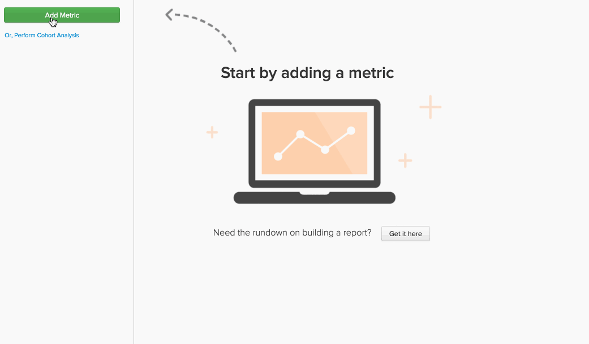

# Formules dans le `Report Builder`

Dans le [`Report Builder`](../../tutorials/using-visual-report-builder.md), vous pouvez créer des visualisations puissantes à l’aide des [mesures définies](../../data-user/reports/ess-manage-data-metrics.md) de votre compte . La combinaison de ces mesures dans une formule vous permet de glaner des informations supplémentaires à partir de vos données. Cette rubrique aborde la manière dont les formules peuvent être utilisées dans le `Report Builder`. N’hésitez pas à y accéder.

## Qu&#39;est-ce qu&#39;un `formula` ? {#what}

Dans l’`Report Builder`, une `formula` est simplement une combinaison d’une ou de plusieurs mesures basées sur une logique mathématique. Voici un exemple type :

Dans cet exemple, vous utilisez un `Number of orders metric (A)` et un `Distinct buyers metric (B)`, et l’objectif est de répondre à la question suivante : quel est le nombre moyen de commandes passées par mes acheteurs chaque mois ? Les paramètres de la formule sont les suivants :

* `Definition` : vous appliquez ici des mathématiques aux mesures d’entrée. Dans cet exemple, la division du nombre de commandes par le nombre d’acheteurs distincts nous indique le nombre moyen de commandes. La définition est donc (A/B).

* `Format` : votre formule renvoie-t-elle un nombre, une période ou un montant en devise ? À côté de la définition de la formule se trouve une liste déroulante que vous pouvez utiliser pour spécifier le format du retour. Dans ce cas, il s&#39;agit d&#39;un nombre.

* `Miscellaneous` : la date et l’heure, les regroupements, les perspectives et les filtres de la formule sont tous hérités par ses mesures d’entrée. Il n&#39;y a rien à faire ici !

## Comment puis-je utiliser `formulas` dans mes rapports ? {#how}

Maintenant que vous avez abordé les principes de base, regardez quelques exemples.

### Exemple : je veux savoir quel pourcentage de mon chiffre d’affaires peut être attribué aux premières commandes.

Dans cet exemple, vous avez utilisé les mesures `Revenue` et `Revenue (first time orders)`. En divisant la mesure `Revenue (first time orders)(B)` par le `Revenue metric (A)` et en définissant le format de retour sur `Percent`, vous pouvez trouver le pourcentage du chiffre d’affaires qui peut être attribué aux premières commandes.

### Exemple : Je veux connaître le chiffre d&#39;affaires moyen par commande lorsque je propose ou non une `promo code`.

Dans cet exemple, vous avez utilisé les mesures `Revenue` et `Number of orders`. La réponse à cette question implique deux étapes : diviser le `Revenue (A)` par le `Number of orders (B)` et définir le format de retour sur `Currency`. Ensuite, vous avez uniquement autorisé le résultat de la formule (`Avg. Revenue per order`) à afficher et à regrouper les résultats par `Promo code`.

### Exemple : je souhaite connaître la distribution des sources UTM de mes nouveaux clients.

Pour trouver la réponse à cette question, quelques étapes sont nécessaires :

1. Vous avez d’abord ajouté la mesure `New Customers`, puis regroupé les données par `utm_source - all`. Il s’agit de la mesure `A`, ou `New Customers (grouped)`.

1. Ensuite, vous avez dupliqué la mesure `New Customers (grouped)` et l’avez définie pour utiliser une dimension indépendante. Mesure `B` - `New customers (ungrouped)` - affiche le nombre total de nouveaux clients.

1. Après avoir masqué les deux mesures, définissez la définition de la formule sur `A/B`. Cette opération divise le `New customers (grouped)` par le `New Customers (ungrouped)`.

1. Ensuite, définissez le format des résultats sur `Percent`.

Dans cet exemple, vous avez utilisé la perspective `Stacked Columns` pour afficher les résultats par mois. Cela nous permet de comparer la distribution des nouveaux clients sur une base mensuelle.

## Conclusion {#wrapup}

Avez-vous remarqué dans les exemples ci-dessus que les `timestamp`, `groupings`, `perspectives` et `filters` de la formule sont hérités de ses mesures d’entrée ? N’oubliez pas que les formules peuvent être utilisées pour utiliser des options de temps `perspectives` et [ indépendantes](../../tutorials/time-options-visual-rpt-bldr.md){: target="_blank"} comme les mesures le peuvent.

Si vous avez d’autres questions sur l’utilisation des formules dans le `Report Builder`, [contactez l’assistance technique](https://experienceleague.adobe.com/docs/commerce-knowledge-base/kb/troubleshooting/miscellaneous/mbi-service-policies.html?lang=fr).
