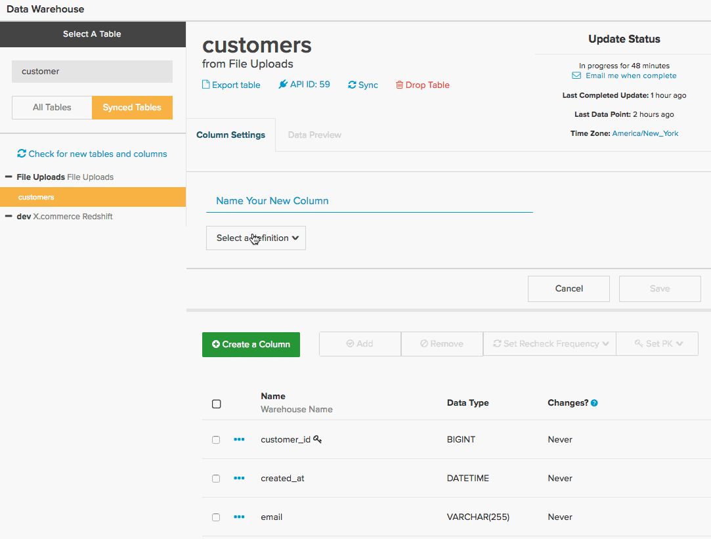

# Traduire des requêtes SQL dans Commerce Intelligence

Vous êtes-vous déjà demandé comment les requêtes SQL sont traduites en [colonnes calculées](../data-warehouse-mgr/creating-calculated-columns.md), [mesures](../../data-user/reports/ess-manage-data-metrics.md) et [rapports](../../tutorials/using-visual-report-builder.md) que vous utilisez dans [!DNL Commerce Intelligence] ? Si vous utilisez beaucoup de SQL, comprendre comment le langage SQL est traduit dans [!DNL Commerce Intelligence] vous permet de travailler plus intelligemment dans [Data Warehouse Manager](../data-warehouse-mgr/tour-dwm.md) et de tirer le meilleur parti de la plateforme [!DNL Commerce Intelligence].

À la fin de cette rubrique, vous trouverez une **matrice de traduction** pour les clauses de requête SQL et les éléments de [!DNL Commerce Intelligence].

Commencez par examiner une requête générale :

| | |
|--- |--- |
| `SELECT` |  |
| `a,` | `group by` du rapport |
| `SUM(b)` | `Aggregate function` (colonne) |
| `FROM c` | `Source` table |
| `WHERE` |  |
| `d IS NOT NULL` | `Filter` |
| `AND time < X`   `AND time >= Y` | `time frame` du rapport |
| `GROUP BY a` | `group by` du rapport |

Cet exemple couvre la plupart des cas de traduction, mais il existe quelques exceptions. Plongez-vous, en commençant par la manière dont la fonction `aggregate` est traduite.

## Fonctions d’agrégat

Les fonctions d’agrégat (par exemple, `count`, `sum`, `average`, `max` et `min`) dans les requêtes prennent la forme d’**agrégations de mesures** ou **agrégations de colonnes** dans les [!DNL Commerce Intelligence]. Le facteur de différenciation est de savoir si une jointure est nécessaire pour effectuer l&#39;agrégation.

Examinez un exemple pour chacun des éléments ci-dessus.

## Agrégations de mesures {#aggregate}

Une mesure est requise lors de l’agrégation des `within a single table`. Par exemple, la fonction d’agrégat `SUM(b)` de la requête ci-dessus serait probablement représentée par une mesure qui additionne les `B` de colonne. 

Examinez un exemple spécifique de la manière dont une mesure `Total Revenue` peut être définie dans [!DNL Commerce Intelligence]. Examinez la requête ci-dessous que vous tentez de traduire :

| | |
|--- |--- |
| `SELECT` |  |
| `SUM(order_total) as "Total Revenue"` | `Metric operation` (colonne) |
| `FROM orders` | `Metric source` table |
| `WHERE` |  |
| `email NOT LIKE '%@magento.com'` | `filter` de mesure |
| `AND created_at < X`  `AND created_at >= Y` | `timestamp` des mesures (et `time range` de création de rapports) |

Accédez au créateur de mesures en cliquant sur **[!UICONTROL Manage Data** > **&#x200B; Mesures &#x200B;**> **Créer une mesure]**. Vous devez d’abord sélectionner la table de `source` appropriée, qui est dans ce cas la table de `orders`. Ensuite, la mesure est configurée comme illustré ci-dessous :

## Agrégations de colonnes

Une colonne calculée est requise lors de l’agrégation d’une colonne jointe à partir d’un autre tableau. Ainsi, par exemple, vous pouvez avoir une colonne créée dans votre tableau de `customer` appelée `Customer LTV`, qui additionne la valeur totale de toutes les commandes associées à ce client dans le tableau de `orders`.

La requête pour cette agrégation peut ressembler à ce qui suit :

|  |  |
|--- |--- |
| `Select` | |
| `c.customer_id` | Propriétaire de l’agrégat |
| `SUM(o.order_total) as "Customer LTV"` | Opération d’agrégat (colonne) |
| `FROM customers c` | Table des propriétaires agrégée |
| `JOIN orders o` | Table source d&#39;agrégation |
| `ON c.customer_id = o.customer_id` | Chemin |
| `WHERE o.status = 'success'` | Filtre agrégé |

La configuration de cette fonctionnalité dans [!DNL Commerce Intelligence] nécessite l’utilisation de votre gestionnaire Data Warehouse, où vous créez un chemin d’accès entre votre `orders` et `customers` tableau, puis créez une colonne appelée `Customer LTV` dans le tableau de votre client.

Examinez comment établir un nouveau chemin entre le `customers` et le `orders`. L’objectif final est de créer une colonne agrégée dans le tableau `customers`. Par conséquent, accédez d’abord au tableau `customers` dans votre Data Warehouse, puis cliquez sur **[!UICONTROL Create a Column** > **&#x200B; Sélectionner une définition &#x200B;**> **SOMME]**.

Vous devez ensuite sélectionner la table source. S’il existe un chemin d’accès vers votre tableau `orders`, sélectionnez-le simplement dans la liste déroulante. Cependant, si vous créez un chemin, cliquez sur **[!UICONTROL Create new path]** et l’écran ci-dessous s’affiche :

Ici, vous devez examiner attentivement la relation entre les deux tables que vous tentez de joindre. Dans ce cas, des commandes potentiellement `Many` sont associées à `One` client. Par conséquent, la table `orders` est répertoriée du côté `Many`, tandis que la table `customers` est sélectionnée du côté `One`.

>[!NOTE]
>
>En [!DNL Commerce Intelligence], une `path` équivaut à une `Join` dans SQL.

Une fois le chemin enregistré, vous pouvez créer la colonne `Customer LTV`. Voir ci-dessous :

Maintenant que vous avez créé la nouvelle colonne `Customer LTV` dans votre tableau `customers`, vous êtes prêt à créer une [agrégation des mesures](#aggregate) à l’aide de cette colonne (par exemple, pour trouver le LTV moyen par client). Vous pouvez également `group by` ou `filter` par la colonne calculée dans un rapport à l’aide des mesures existantes créées sur le tableau `customers`.

>[!NOTE]
>
>Pour ce dernier, chaque fois que vous créez une colonne calculée, vous devez [ajouter la dimension aux mesures existantes](../data-warehouse-mgr/manage-data-dimensions-metrics.md) avant qu’elle ne soit disponible en tant que `filter` ou `group by`.

Voir [création de colonnes calculées](../data-warehouse-mgr/creating-calculated-columns.md) avec votre gestionnaire Data Warehouse.

## `Group By` des clauses

Les fonctions `Group By` dans les requêtes sont souvent représentées dans [!DNL Commerce Intelligence] sous la forme d’une colonne utilisée pour segmenter ou filtrer un rapport visuel. À titre d’exemple, revenons sur la requête `Total Revenue` que vous avez explorée précédemment, mais cette fois, segmentez les recettes par le `coupon\_code` afin de mieux comprendre quels coupons génèrent le plus de recettes.

Commencez par la requête ci-dessous :

| | |
|--- |--- |
| `SELECT coupon_code,` | `group by` du rapport |
| `SUM(order_total) as "Total Revenue"` | `Metric operation`(colonne) |
| `FROM orders` | `Metric source` table |
| `WHERE` |  |
| `email NOT LIKE '%@magento.com'` | `filter` de mesure |
| `AND created_at < '2016-12-01'`   `AND created_at >= '2016-09-01'` | `timestamp` des mesures (et `time range` de création de rapports) |
| `GROUP BY coupon_code` | `group by` du rapport |

>[!NOTE]
>
>La seule différence par rapport à la requête que vous avez démarrée précédemment est l’ajout du « coupon\_code » en tant que group by._

En utilisant la même mesure de `Total Revenue` que celle que vous avez créée précédemment, vous êtes maintenant prêt à créer votre rapport de chiffre d’affaires segmenté par code de coupon. Examinez le gif ci-dessous, qui montre comment configurer ce rapport visuel en examinant les données de septembre à novembre :

## Formules

Parfois, une requête peut impliquer plusieurs agrégations afin de calculer la relation entre des colonnes distinctes. Par exemple, vous pouvez calculer la valeur de commande moyenne dans une requête de l’une des deux façons suivantes :

* `AVG('order\_total')` OU
* `SUM('order\_total')/COUNT('order\_id')`

La première méthode implique la création d’une mesure qui effectue une moyenne sur la colonne `order\_total`. Cependant, la dernière méthode peut être créée directement dans le Report Builder en supposant que vous ayez déjà configuré les mesures pour calculer le `Total Revenue` et le `Number of orders`.

Prenez du recul et examinez la requête globale pour `Average order value` :

| | |
|--- |--- |
| `SELECT` |  |
| `SUM(order_total) as "Total Revenue"` | `operation` de mesure (colonne) |
| `COUNT(order_id) as "Number of orders"` | `operation` de mesure (colonne) |
| `SUM(order_total)/COUNT(order_id) as "Average order value"` | `operation` de mesure (colonne) / Opération de mesure (colonne) |
| `FROM orders` | Tableau de `source` des mesures |
| `WHERE` |  |
| `email NOT LIKE '%@magento.com'` | `filter` de mesure |
| `AND created_at < '2016-12-01'`  `AND created_at >= '2016-09-01'` | Horodatage des mesures (et période de création des rapports) |

Supposons maintenant que vous ayez déjà configuré des mesures pour calculer les `Total Revenue` et les `Number of orders`. Puisque ces mesures existent, vous pouvez simplement ouvrir le `Report Builder` et créer un calcul à la demande à l’aide de la fonction `Formula` :

## Conclusion

Si vous utilisez beaucoup de SQL, réfléchir à la manière dont les requêtes sont traduites en [!DNL Commerce Intelligence] vous permet de créer des colonnes calculées, des mesures et des rapports.

Pour une référence rapide, consultez le tableau ci-dessous. Elle montre l&#39;élément [!DNL Commerce Intelligence] équivalent d&#39;une clause SQL et la façon dont il peut être mappé à plusieurs éléments, selon la façon dont il est utilisé dans la requête.

## Éléments de Commerce Intelligence

| **`SQL Clause`** | **`Metric`** | **`Filter`** | **`Report group by`** | **`Report time frame`** | **`Path`** | **`Calculated column inputs`** | **`Source table`** |
|---|---|---|---|---|---|---|---|
| `SELECT` | X | - | X | - | - | X | - |
| `FROM` | - | - | - | - | - | - | X |
| `WHERE` | - | X | - | - | - | - | - |
| `WHERE` (avec éléments temporels) | - | - | - | X | - | - | - |
| `JOIN...ON` | - | X | - | - | X | X | - |
| `GROUP BY` | - | - | X | - | - | - | - |
