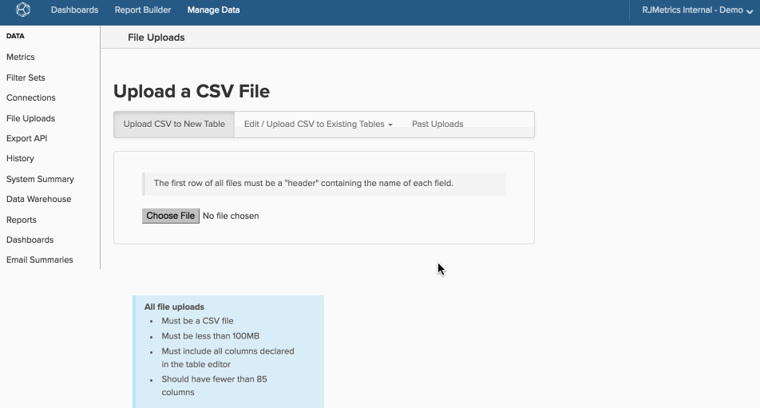

# Utilisation du téléchargement de fichier

>[!NOTE]
>
>Nécessite [Autorisations d’administrateur](../../../administrator/user-management/user-management.md).

[!DNL MBI] est puissant non seulement en raison de ses fonctionnalités de visualisation, mais également parce qu’il vous permet de placer toutes vos données dans un seul entrepôt de données. Même les données qui résident en dehors de vos bases de données et de vos intégrations peuvent être introduites dans [!DNL MBI] à l’aide de l’outil Téléchargement de fichier dans Data Warehouse Manager.

Prenons l’exemple des campagnes publicitaires. Si vous exécutez des campagnes en ligne et hors ligne, vous ne pouvez pas obtenir une vue d’ensemble si vous analysez uniquement les données d’une intégration en ligne. Le téléchargement d’une feuille de calcul avec les données de campagne hors ligne vous permet d’analyser les deux ensembles de données et de mieux comprendre les performances de votre campagne.

## Restrictions et exigences {#require}

1. **Le seul format pris en charge pour les chargements de fichiers est `CSV` ou`comma separated values`**. Si vous travaillez dans Excel, vous pouvez utiliser la fonction Enregistrer sous pour enregistrer le fichier dans `.csv` format.
1. **`CSV`Les fichiers doivent utiliser`UTF-8 encoding`**. La plupart du temps, ce ne sera pas un problème. Si vous rencontrez cette erreur lors du téléchargement d’un fichier, [Consultez cet article d’assistance](https://support.magento.com/hc/en-us/articles/360016730591).
1. **Les fichiers ne peuvent pas dépasser 100 Mo**. Si le fichier est plus volumineux, séparez le tableau en blocs et enregistrez-le sous forme de fichiers individuels. Vous pouvez ajouter les données après le chargement du fichier initial.
1. **Toutes les tables doivent avoir une`primary key`**. Votre tableau doit contenir au moins une colonne pouvant être utilisée comme `primary key`ou un identifiant unique pour chaque ligne du tableau. Toute colonne désignée comme `primary key` can *never* être nul. A `primary key` peut être aussi simple que l’ajout d’une colonne qui donne un nombre à chaque ligne ou peut être deux colonnes concaténées pour créer une colonne de valeurs uniques (par exemple, `campaign name` et `date`).

   Si une ou plusieurs colonnes sont désignées comme uniques, mais qu’il existe des doublons, les lignes en double ne sont pas importées.

## Formatage des données à charger {#formatting}

Avant de pouvoir transférer vos données dans [!DNL MBI], vérifiez qu’il est formaté selon les directives de cette section.

### Rangée d’en-tête {#header}

Pour vous assurer que les colonnes sont correctement étiquetées et importées, assurez-vous que la première ligne de votre feuille de calcul est un en-tête qui décrit les données de chaque colonne.

Les noms de colonne doivent être uniques et contenir uniquement des lettres, des chiffres, des espaces et les symboles suivants : `$ % # /`. Si un nom de colonne contient une virgule, il sera divisé en deux colonnes lors du chargement du fichier. En outre, nous recommandons que le fichier contienne moins de 85 colonnes afin d’optimiser la vitesse de mise à jour.

### Données avec virgules {#commas}

Parce que les fichiers doivent être dans `CSV` , l’utilisation de virgules peut entraîner des problèmes lors du transfert des données. `CSV` Les fichiers utilisent des virgules pour indiquer de nouvelles valeurs. Par conséquent, une colonne portant un nom comme `Campaigns`, `August` est lu en deux colonnes (`Campaigns` et `August`) au lieu d’un seul, en décalant toutes vos données sur une seule ligne. Dans la mesure du possible, nous vous recommandons d’éviter les virgules. Vous pouvez utiliser `Data Preview` pour vérifier si vos données s’affichent correctement une fois une mise à jour terminée.

### Dates

Tout jeu de données contenant des dates doit utiliser la variable [format de date standard](https://dev.mysql.com/doc/refman/5.7/en/datetime.html) `YYYY-MM-DD HH:MM:SS` ou `MM/DD/YYYY`.

### Caractères spéciaux

Certains caractères spéciaux ne sont pas acceptés. Par exemple, symbole de barre verticale `& # 1 2 4` est interprété comme la création d’une colonne et entraîne des erreurs lors du téléchargement d’un fichier.

### Nombre décimal

Les valeurs de devise doivent avoir le type de données `Decimal Number` sélectionnée, et ces colonnes seront automatiquement arrondies à deux décimales dans votre entrepôt de données. Si vous ne souhaitez pas arrondir vos nombres décimaux ou avoir un degré de précision supérieur à celui-ci, vous devez sélectionner la variable `Non-Currency Decimal Number` datatype.

### Pourcentages

Les pourcentages doivent être renseignés en tant que décimales. Par exemple :

| **Droite :** | **Erreur :** |
|-----|-----|
| `.05` | `5%` |
| `.23` | `23` |

{style=&quot;table-layout:auto&quot;}

### Valeurs avec zéros de début et/ou de fin {#zeroes}

Certaines valeurs de votre fichier, telles que les codes postaux et les identifiants, peuvent commencer ou se terminer par des zéros. Pour vous assurer que les zéros sont correctement conservés et chargés, vous pouvez modifier le type de mise en forme (par exemple : [du nombre au texte](https://support.office.com/en-US/article/format-numbers-as-text-583160db-936b-4e52-bdff-6f1863518ba4)) ou appliquer la mise en forme des nombres.

Utilisez `US ZIP codes` comme exemple de modification de la mise en forme des nombres. Dans [!DNL Excel], mettez en surbrillance la colonne contenant `ZIP codes` et [changer le format des nombres](https://support.office.com/en-za/article/Display-numbers-as-postal-codes-61b55c9f-6fe3-4e54-96ca-9e85c38a5a1d) to `ZIP code`. Vous pouvez également sélectionner un format de nombre personnalisé, et dans la variable `Type` fenêtre, entrer `00000`. Gardez à l’esprit que cette méthode peut présenter des problèmes si certains codes sont formatés comme `00000` et d’autres sont `00000-0000`.

Le `Type` peut être [formaté différemment en fonction des autres types de données](https://support.office.com/en-us/article/Keep-leading-zeros-in-number-codes-1bf7b935-36e1-4985-842f-5dfa51f85fe7?CorrelationId=e1d4c2d3-cd5d-4a14-999d-437800274a90&amp;ui=en-US&amp;rs=en-US&amp;ad=US), comme les identifiants. Si `ID` est composé de neuf chiffres, par exemple, la valeur `Type` pourrait être `000000000` ou `000-000-000`. Cela changerait. `123456` to `000-123-456`.

Pour [!DNL Google Docs] et [!DNL Apple Numbers] ressources, voir [Associé](#related) Liste en bas de cette page.

## Chargement de données {#uploading}

Maintenant que la feuille de calcul est correctement formatée et [!DNL MBI]convivial, nous allons l’ajouter à votre entrepôt de données.

1. Pour commencer, accédez à **[!UICONTROL Data** > **File Uploads]**.

1. Cliquez sur le bouton **[!UICONTROL Upload to New Table]** .

1. Cliquez sur **[!UICONTROL Choose File]** et sélectionnez le fichier. Cliquez sur **[!UICONTROL Open]** pour lancer le chargement.

   Une fois le transfert terminé, une liste des colonnes s’affiche. [!DNL MBI] dans votre fichier .

1. Vérifiez que les noms des colonnes et les types de données sont corrects. Plus précisément, vérifiez que les colonnes de dates sont lues comme des dates et non comme des nombres.

   >[!NOTE]
   >
   >Le `datatype` est extrêmement important, alors n’ignorez pas cette étape !

1. Sélectionnez la ou les colonnes qui constitueront le `primary key` pour le tableau à l’aide des cases à cocher situées sous l’icône de clé.

1. Nommez la table.

1. Cliquez sur **[!UICONTROL Save Table]**.

A *Succès !* s’affiche en haut de l’écran une fois votre tableau enregistré.

Si vous avez besoin d’un visuel, voici un aperçu de l’ensemble du processus :

Les tableaux téléchargés s’affichent sous **Téléchargements de fichiers** dans la liste des tableaux (dans les options Tous les tableaux et Tableaux synchronisés ) du Gestionnaire de Data Warehouse :

## Mettre à jour ou ajouter des données à une table existante {#appending}

Vous avez de nouvelles données à ajouter à un fichier que vous avez déjà chargé ? Aucun problème : vous pouvez facilement mettre à jour et ajouter des données dans [!DNL MBI].

1. Pour commencer, accédez à **[!UICONTROL Manage Data** > **File Uploads]**.

1. Cliquez sur le bouton **[!UICONTROL Edit/Upload `.csv`vers les tableaux existants]** .

1. Dans la liste déroulante, cliquez sur le nom de la table à mettre à jour ou à ajouter.

1. Utilisez la liste déroulante pour sélectionner l’option de gestion des lignes dupliquées :

   |  |  |
   |---|---|
   | `Overwrite old row with new row` | Les données existantes seront alors remplacées par de nouvelles données si une ligne possède la même clé Principale dans le tableau existant et le nouveau fichier. Il s’agit de la méthode à utiliser pour les colonnes dont les valeurs changent au fil du temps, par exemple, une colonne État. Les données existantes seront écrasées et mises à jour avec les nouvelles données. Les lignes avec des touches Principales qui ne figurent pas dans le tableau existant seront ajoutées en tant que nouvelles lignes. |
   | `Retain old row; discard new row` | De nouvelles données seront alors ignorées si une ligne possède la même clé Principale dans le tableau existant et dans le nouveau fichier. |
   | `Purge all existing rows first and ignore duplicate keys within the file` | Cela supprime toutes les données existantes et les remplace par les nouvelles données du fichier. Utilisez cette option uniquement si vous n&#39;avez pas besoin des données de la table existante. |

1. Cliquez sur **[!UICONTROL Choose File]** et sélectionnez le fichier.

1. Cliquez sur **[!UICONTROL Open]** pour lancer le chargement.

   Une fois le transfert terminé, [!DNL MBI] valide la structure de données dans le fichier. A *Succès !* s’affiche en haut de l’écran une fois votre tableau enregistré.

## Disponibilité des données {#availability}

Tout comme les colonnes calculées, les données issues des téléchargements de fichiers sont disponibles une fois le cycle de mise à jour suivant terminé. Si une mise à jour était en cours au cours du chargement du fichier, les données ne seront disponibles qu’après la prochaine mise à jour. Une fois le cycle de mise à jour terminé, vous pouvez accéder au `Data Preview` dans votre entrepôt de données pour vous assurer que le fichier a été transféré correctement et que les données s’affichent comme prévu.

## Remplissage {#wrapup}

Cet article ne traitait que des principes de base de l&#39;utilisation de l&#39;import de données, mais nous parions que vous souhaitiez effectuer quelque chose d&#39;un peu plus avancé. Consultez les articles connexes pour en savoir plus sur le formatage et l’importation de données financières, d’e-commerce, de dépenses publicitaires et d’autres types de données.

En outre, le transfert de fichiers n’est pas le seul moyen de transférer vos données dans [!DNL MBI]. Le [API Data Import](https://developer.adobe.com/commerce/services/reporting/import-api/) Les fonctions vous permettent de transférer des données arbitraires dans vos [!DNL MBI] entrepôt de données.

## Associé {#related}

* [Formatage et import de données financières](../../../best-practices/format-import-financial-data.md)
* [Importation de données de dépenses publicitaires hors ligne/autres](../connecting-data/import-offline-ad-data.md)
* [Valeur attendue[!DNL Google ECommerce] data](../integrations/google-ecommerce-data.md)

## Ressources tierces

* [Guide de formatage des données numériques](http://www.dummies.com/how-to/content/how-to-choose-a-number-format-in-your-numbers-spre.html)
* [[!DNL Google Docs] Guide de mise en forme des données](https://support.google.com/docs/answer/56470?hl=en)
