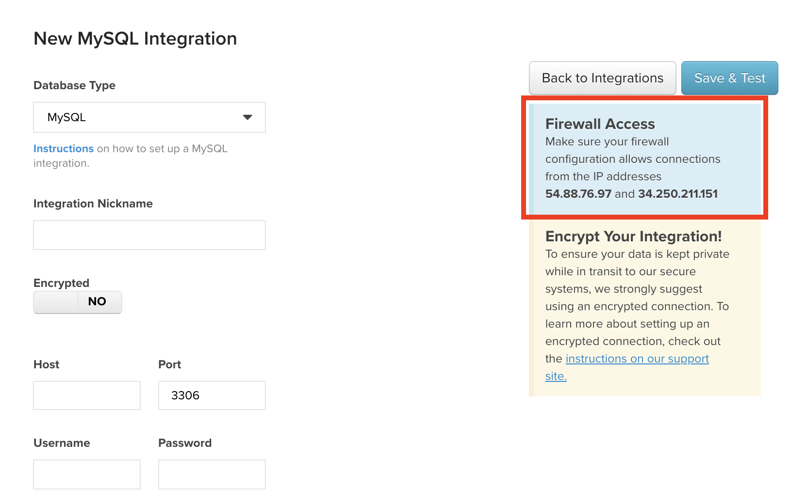

# Connexion à Amazon RDS

Amazon Relational Database Services (RDS) est un service de base de données géré qui s’exécute sur des moteurs de base de données que vous connaissez probablement déjà - [[!DNL MySQL]](../integrations/mysql-via-a-direct-connection.md), [[!DNL Microsoft SQL]](../integrations/microsoft-sql-server.md), et [[!DNL PostgreSQ]](../integrations/postgresql.md).

Les étapes de connexion de votre instance RDS varient légèrement selon le type de base de données que vous utilisez (utilisez les liens ci-dessus pour obtenir des instructions détaillées sur chaque base de données) et selon que vous utilisez ou non une connexion chiffrée (comme une [`SSH tunnel for MySQL`](../integrations/mysql-via-ssh-tunnel.md)), mais voici les principes de base :

## Autoriser [!DNL MBI] pour accéder à votre base de données

Sur la page des informations d’identification (**[!UICONTROL Manage Data** > **Integrations]**) pour chaque base de données, une boîte contenant les adresses IP que vous devez autoriser pour connecter RDS à MBI s’affiche : `54.88.76.97` et `34.250.211.151`. Voici un aperçu de la `MySQL credentials` , où nous avons mis en surbrillance la zone Adresse IP :

Pour [!DNL MBI] pour vous connecter correctement à votre instance RDS, vous devez ajouter ces adresses IP au groupe de sécurité de la base de données approprié via la console de gestion AWS. Ces adresses IP peuvent être ajoutées à un groupe existant ou vous pouvez en créer un nouveau. L’important est que le groupe soit autorisé à accéder à l’instance à laquelle vous souhaitez vous connecter. [!DNL MBI].

Lors de l’ajout de la variable [!DNL MBI] Adresses IP, veillez à ajouter une `/32` à la fin de l’adresse pour indiquer à Amazon qu’il s’agit d’une adresse IP exacte. Ne vous inquiétez pas : L’interface d’AWS indique clairement que cela est nécessaire.

## Créez un `Linux` user pour [!DNL MBI] {#linux}

>[!NOTE]
>
>Cette étape n’est nécessaire que si vous utilisez une connexion chiffrée. Pour obtenir des instructions sur la façon de procéder, reportez-vous à l’article de configuration de la base de données que vous utilisez (par exemple : MySQL). Le `Linux` l’utilisateur nous permettra de créer une `SSH tunnel`, qui est la méthode la plus sûre pour envoyer des données sur Internet.

## Création d’un utilisateur de base de données pour MBI

Il s’agit de la partie du processus dans laquelle les étapes varient en fonction de la base de données que vous utilisez. L&#39;idée est la même, cependant : vous allez créer un utilisateur pour [!DNL MBI] qui sera utilisé pour accéder à votre base de données. Instructions pour créer une base de données [!DNL MBI] Vous trouverez l’utilisateur dans l’article de configuration de la base de données que vous utilisez.

## Entrer les informations de connexion dans MBI

Après avoir accordé [!DNL MBI] l&#39;accès à votre instance et la création d&#39;un utilisateur pour nous, la dernière chose à faire est d&#39;entrer les informations de connexion dans [!DNL MBI].

Pages d’informations d’identification pour `MySQL`, `Microsoft SQL`, et `PostgreSQL` sont accessibles via le `Integrations` page (**[!UICONTROL Manage Data** > **Integrations]**) en cliquant sur **[!UICONTROL Add Integration]**. Lorsque la liste des intégrations s’affiche, cliquez sur l’icône correspondant à la base de données que vous utilisez pour accéder à la page des informations d’identification. Si vous n’avez actuellement pas accès à l’intégration dont vous avez besoin, contactez votre équipe de compte d’Adobe.

Pour terminer la création de la connexion, nous aurons besoin des informations suivantes :

* Adresse publique de votre instance RDS : Vous pouvez le trouver dans la console de gestion d’AWS.
* Le port utilisé par votre instance de base de données : Certaines bases de données ont un port par défaut, qui renseigne automatiquement la variable `Port` champ . Ces informations sont également disponibles dans la documentation de configuration de la base de données.
* Nom d’utilisateur et mot de passe de l’utilisateur pour lequel vous avez créé [!DNL MBI].

Si vous utilisez une connexion chiffrée, modifiez la variable `Encrypted` basculez la page des informations d’identification de la base de données sur `Yes`. Un formulaire supplémentaire s’affiche alors pour configurer le chiffrement :

C&#39;est tout ce qu&#39;il y a à ça ! La connexion à votre instance RDS est terminée.
