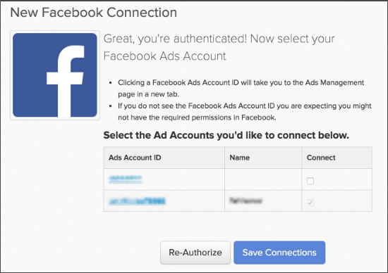

# Connexion [!DNL Facebook Ads]

>[!NOTE]
>
>Nécessite des [autorisations d’administrateur](../../../administrator/user-management/user-management.md).

Vous avez fait vos recherches, vous avez créé vos publicités, vous avez lancé votre campagne sur [!DNL Facebook]. Il est maintenant temps d&#39;analyser vos données sur les dépenses publicitaires et de voir si votre argent est dépensé efficacement. À l’aide de vos données de dépenses publicitaires, vous pouvez [mesurer le retour sur investissement de la campagne en associant votre coût publicitaire et la valeur client à vie (CLV)](../../../data-analyst/analysis/roi-ad-camp.md) des utilisateurs acquis à partir de vos campagnes.

La connexion de vos données [!DNL Facebook Ad] à [!DNL Commerce Intelligence] est un processus simple en trois étapes :

1. [Ajoutez [!DNL Facebook] en tant que source de données dans  [!DNL Commerce Intelligence]](#stepone)
1. [Autoriser l [!DNL Commerce Intelligence] accès à vos  [!DNL Facebook Ads] &#x200B;](#steptwo)
1. [Sélectionner [!DNL Facebook Ads] Comptes pour extraire les données](#stepthree)

## Ajoutez [!DNL Facebook] comme source de données dans [!DNL Commerce Intelligence] {#stepone}

1. Pour ajouter l’intégration [!DNL Facebook] à votre compte [!DNL Commerce Intelligence], accédez à la page `Connections` sous **[!UICONTROL Manage Data** > **Integrations]**.
1. Cliquez sur **[!UICONTROL Add Integration]**, situé à droite.
1. Cliquez sur l’icône [!DNL Facebook] . La page d’autorisation de [!DNL Facebook] s’affiche.
1. Cliquez sur **[!UICONTROL Authorize]**.

## Autoriser [!DNL Commerce Intelligence] accès à vos données [!DNL Facebook Ads] {#steptwo}

Après avoir cliqué sur **[!DNL Facebook Authorize]**, une petite fenêtre pop-up s’affiche :

Vous suivez une série d’étapes pour [!DNL Commerce Intelligence] permettre d’accéder aux données de votre profil public, de vos [!DNL Facebook Ads] et de vos statistiques connexes. Cliquez sur **[!UICONTROL OK]** sur ces étapes pour continuer.

## Sélectionner les comptes [!DNL Facebook Ads] pour extraire les données {#stepthree}

1. Une fois l’authentification terminée, vous serez invité à sélectionner les comptes [!DNL Facebook Ads] desquels vous souhaitez extraire des données. Sélectionnez les comptes souhaités en cochant la case dans la colonne `Connect` .

   

1. Cliquez sur **[!UICONTROL Save Connections]**.

   Si la connexion est réussie, un *Connexion réussie !* message s’affiche en haut de la page.

## Quelle est la prochaine étape ? {#next}

Assurez-vous du suivi des campagnes [!DNL Facebook] dans [!DNL Google Analytics]. Cela permet de s’assurer que le champ `utm\_campaign` dans [!DNL Google Analytics] est correctement renseigné pour vos campagnes [!DNL Facebook].

## Connexe

* [Réauthentification des intégrations](https://experienceleague.adobe.com/docs/commerce-knowledge-base/kb/how-to/mbi-reauthenticating-integrations.html?lang=fr)
* [Connecter votre  [!DNL Google Adwords] &#x200B;](../integrations/google-ecommerce.md)
* [Suivre la source de référence de commande via  [!DNL Google eCommerce]](../integrations/google-ecommerce.md)
* [Suivre la source de référence des utilisateurs dans votre base de données](../../analysis/google-track-user-acq.md)
* [Effectuez le suivi des données relatives aux appareils, aux navigateurs et aux systèmes d’exploitation dans votre base de données](../../analysis/track-usr-dev-browser.md)
* [Découvrez vos sources et canaux d’acquisition les plus précieux.](../../analysis/most-value-source-channel.md)
* [Augmenter le retour sur investissement de vos campagnes publicitaires](../../analysis/roi-ad-camp.md)
* [Comment fonctionne  [!DNL Google Analytics] ’attribution UTM ?](../../analysis/utm-attributes.md)
