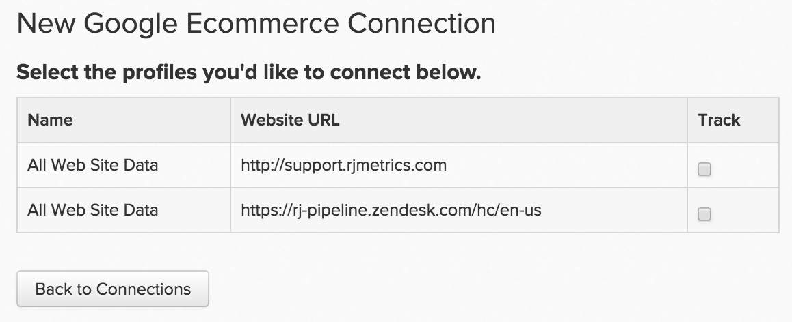

# Connexion [!DNL Google ECommerce]

>[!NOTE]
>
>Nécessite des [autorisations d’administrateur](../../../administrator/user-management/user-management.md).

Logo 

Vous avez un flux constant de trafic et de commandes, ce qui signifie que vous atteignez et acquérez efficacement des clients. Mais quels sont vos canaux de référence les plus précieux ? Quelle est la valeur moyenne sur la durée de vie des clients acquis d&#39;une source par rapport à une autre ? En connectant vos données de source de référence de commande de [!DNL Google ECommerce] à [!DNL Commerce Intelligence], vous pouvez créer des analyses qui vous aident à identifier vos [canaux marketing les plus précieux](../../../data-analyst/analysis/most-value-source-channel.md).

Commencez par saisir vos informations d’identification [!DNL Google ECommerce] dans [!DNL Commerce Intelligence] :

1. Accédez à la page `Connections` sous **[!UICONTROL Admin** > **Connections]**.

1. Cliquez sur **[!UICONTROL Add a New Source]**, situé sur le côté droit de l’écran, au-dessus du tableau `Data Sources`.

1. Cliquez sur l’icône [!DNL Google ECommerce] . La page des informations d’identification de [!DNL Google ECommerce] s’ouvre.

1. Saisissez vos informations d’identification [!DNL Google Analytics]. Une fois le processus d’autorisation terminé, vous êtes redirigé vers [!DNL Commerce Intelligence].

1. Une liste des identifiants de profil s’affiche. Vérifiez les profils auxquels vous souhaitez vous connecter [!DNL Commerce Intelligence].

   Si vous disposez de plusieurs profils et que vous avez besoin d’aide pour savoir lequel, reportez-vous à la section **Connexion de plusieurs profils de [!DNL Google Analytics] ci-dessous.

   <!--{: width="500"}-->

1. Les modifications sont enregistrées automatiquement. Cliquez donc sur **[!UICONTROL Back to Connections]** lorsque vous avez terminé.

## Connexion de plusieurs profils [!DNL Google Analytics] à [!DNL Commerce Intelligence]

Plusieurs sites web peuvent être connectés à un seul compte [!DNL Google Analytics], identifié par son propre identifiant de profil [!DNL Google Analytics]. Dans ce cas, vous avez la possibilité d’inclure tous vos identifiants de profil dans [!DNL Commerce Intelligence]. Vérifiez les identifiants de profil que vous souhaitez inclure lors de l’étape de sélection du profil.

Pour identifier l’identifiant de profil [!DNL Google Analytics] d’un site web particulier :

1. Connectez-vous à [!DNL Google Analytics].
1. Accédez au tableau de bord de [!DNL Google Analytics] du site web concerné.
1. Examinez l’URL : l’identifiant de profil correspond aux huit chiffres suivant `p` à la fin de la ligne.

   `www.google.com/analytics/web/#home/a11345062w43527078p**XXXXXXXX**/`

## Déconnexion de [!DNL Google ECommerce] de [!DNL Commerce Intelligence] {#disconnect}

1. Consultez votre page [!DNL Google Analytics] [paramètres du compte](https://www.google.com/account/about/?hl=en).
1. Dans la section `Security` , cliquez sur **[!UICONTROL edit]** en regard de `Authorizing` applications et sites.
1. Cliquez sur **[!UICONTROL revoke access]** en regard de [!DNL Commerce Intelligence].

## Connexe :

* [Données  [!DNL Google ECommerce] ](../integrations/google-ecommerce-data.md)
* [Réauthentification des intégrations](https://experienceleague.adobe.com/docs/commerce-knowledge-base/kb/how-to/mbi-reauthenticating-integrations.html)
* [Configuration [!DNL Google ECommerce] suivi](https://support.google.com/analytics/answer/1009612?hl=en)
* [Découvrez vos sources et canaux d’acquisition les plus précieux.](../../analysis/most-value-source-channel.md)
* [Augmenter le retour sur investissement de vos campagnes publicitaires](../../analysis/roi-ad-camp.md)
