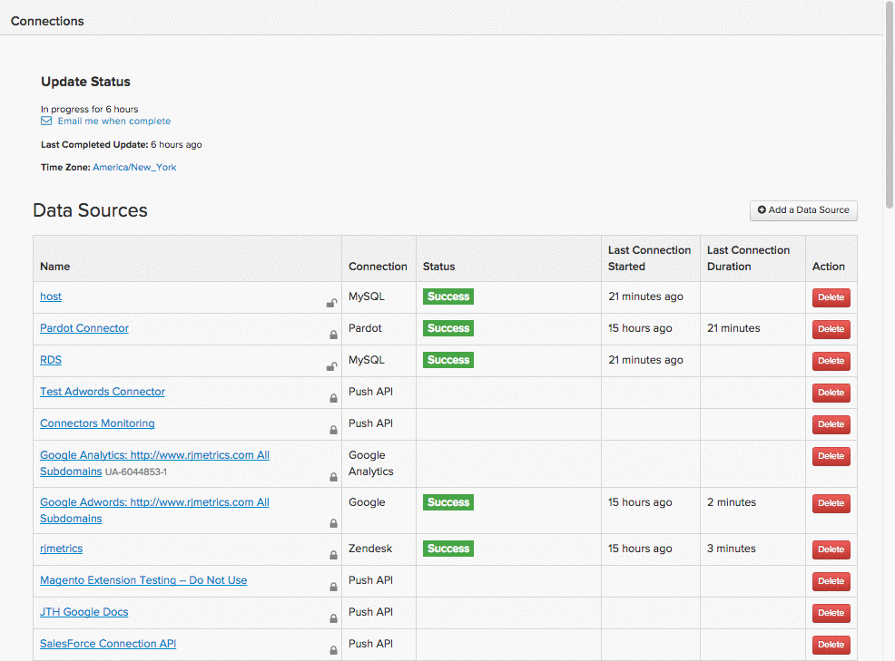

# Connexion de [!DNL MongoDB] via le tunnel SSH

Pour connecter votre base de données [!DNL MongoDB] à [!DNL Commerce Intelligence] via un tunnel SSH, vous devez effectuer les opérations suivantes :

1. [Récupération de la clé  [!DNL Commerce Intelligence] &#x200B;](#retrieve)
1. [Autoriser l’accès à l’adresse  [!DNL Commerce Intelligence] &#x200B;](#allowlist)
1. [Création d’un utilisateur Linux pour Commerce Intelligence](#linux)
1. [Création d [!DNL MongoDB] un utilisateur pour Commerce Intelligence](#mongodb)
1. [Saisissez les informations de connexion et d’utilisateur dans  [!DNL Commerce Intelligence]](#finish)

>[!NOTE]
>
>En raison de la nature technique de cette configuration, Adobe vous recommande de consulter un développeur ou une développeuse pour vous aider si vous ne l’avez pas déjà fait.

## Récupération de la clé publique [!DNL Commerce Intelligence] {#retrieve}

Le `public key` est utilisé pour autoriser l’utilisateur [!DNL Commerce Intelligence] `Linux`. La section suivante vous guide tout au long de la création de l’utilisateur et de l’importation des clés.

1. Accédez à **[!UICONTROL Data** > **Connections]** et cliquez sur **[!UICONTROL Add New Data Source]**.
1. Cliquez sur l’icône [!DNL MONGODB] .
1. Une fois la page des informations d’identification [!DNL MongoDB] ouverte, définissez le bouton `Encrypted` sur `Yes`. Le formulaire de configuration SSH s’affiche.
1. Le `public key` se trouve sous ce formulaire.

Laissez cette page ouverte tout au long du tutoriel. Vous en aurez besoin dans la section suivante et à la fin.

Si vous êtes un peu perdu, voici comment naviguer dans [!DNL Commerce Intelligence] pour récupérer la clé :

<!--{:.zoom}-->

## Autoriser l&#39;accès à l&#39;adresse IP [!DNL Commerce Intelligence] {#allowlist}

Pour que la connexion soit établie, vous devez configurer votre pare-feu afin d’autoriser l’accès à partir de vos adresses IP. Ils sont `54.88.76.97` et `34.250.211.151`, mais ils se trouvent également sur la page des informations d’identification [!DNL MongoDB] :


## Création d’un utilisateur `Linux` pour [!DNL Commerce Intelligence] {#linux}

>[!IMPORTANT]
>
>Si le fichier `sshd_config` associé au serveur n’est pas défini sur l’option par défaut, seuls certains utilisateurs ont accès au serveur, ce qui empêche une connexion réussie à [!DNL Commerce Intelligence]. Dans ce cas, il est nécessaire d’exécuter une commande telle que `AllowUsers` pour permettre à l’utilisateur `rjmetric` d’accéder au serveur.

Il peut s’agir d’une machine de production ou secondaire, à condition qu’elle contienne des données en temps réel (ou fréquemment mises à jour). Vous pouvez restreindre cet utilisateur comme vous le souhaitez, à condition qu’il conserve le droit de se connecter au serveur [!DNL MongoDB].

Pour ajouter le nouvel utilisateur, exécutez les commandes suivantes en tant que root sur votre serveur `Linux` :

```bash
    adduser rjmetric -p
    mkdir /home/rjmetric
    mkdir /home/rjmetric/.ssh
```

Vous vous souvenez de la `public key` que vous avez récupérée dans la première section ? Pour vous assurer que l&#39;utilisateur a accès à la base de données, vous devez importer la clé dans `authorized_keys`. Copiez la clé complète dans le fichier `authorized_keys` comme suit :

```bash
    touch /home/rjmetric/.ssh/authorized_keys
    "< PASTE KEY HERE >" >> /home/rjmetric/.ssh/authorized_keys
```

Pour terminer la création de l’utilisateur, modifiez les autorisations sur le répertoire /home/rimetric pour autoriser l’accès via SSH :

```bash
    chown -R rjmetric:rjmetric /home/rjmetric
    chmod -R 700 /home/rjmetric/.ssh
```

## Création d’un utilisateur [!DNL Commerce Intelligence] [!DNL MongoDB] {#mongodb}

[!DNL MongoDB] serveurs disposent de deux modes d’exécution : [l’un avec l’option « auth »](#auth) `(mongod -- auth)` et l’autre sans, [qui est le mode par défaut](#default). Les étapes de création d’un utilisateur [!DNL MongoDB] varient en fonction du mode utilisé par votre serveur. Veillez à vérifier le mode avant de continuer.

### Si le serveur utilise l’option `Auth` : {#auth}

Lors de la connexion à plusieurs bases de données, vous pouvez ajouter l’utilisateur en vous connectant à [!DNL MongoDB] en tant qu’utilisateur administrateur et en exécutant les commandes suivantes.

>[!NOTE]
>
>Pour afficher toutes les bases de données disponibles, l&#39;utilisateur [!DNL Commerce Intelligence] doit disposer des autorisations nécessaires pour exécuter `listDatabases.`

Cette commande accorde à l&#39;utilisateur [!DNL Commerce Intelligence] l&#39;accès `to all databases` :

```bash
    use admin
    db.createUser('rjmetric', '< secure password here >', true)
```

Utilisez cette commande pour accorder à l&#39;utilisateur [!DNL Commerce Intelligence] l&#39;accès `to a single database` :

```bash
    use < database name >
    db.createUser('rjmetric', '< secure password here >', true)
```

La réponse imprimée ressemble à ceci :

```bash
    {
    "id": ObjectId("< some object id here >"),
    "user": "rjmetric",
    "readOnly": true,
    "pwd": "< some hash here >"
    }
```

### Si le serveur utilise l’option par défaut {#default}

Si votre serveur n’utilise pas le mode `auth`, votre serveur [!DNL MongoDB] est accessible même sans nom d’utilisateur ni mot de passe. Cependant, vous devez vous assurer que le fichier `mongodb.conf` `(/etc/mongodb.conf)` contient les lignes suivantes : si ce n’est pas le cas, redémarrez votre serveur après les avoir ajoutés.

```bash
    bind_ip = 127.0.0.1
    noauth = true
```

Pour lier votre serveur [!DNL MongoDB] à une adresse différente, ajustez le nom d’hôte de la base de données à l’étape suivante en conséquence.

## Saisie des informations de connexion et d’utilisateur dans [!DNL Commerce Intelligence] {#finish}

Pour conclure, vous devez saisir les informations de connexion et d’utilisateur dans [!DNL Commerce Intelligence]. Avez-vous laissé la page des informations d’identification [!DNL MongoDB] ouverte ? Dans le cas contraire, accédez à **[!UICONTROL Data > Connections]** et cliquez sur **[!UICONTROL Add New Data Source]**, puis sur l’icône [!DNL MongoDB] . N’oubliez pas de remplacer le bouton (bascule) `Encrypted` par `Yes`.

Saisissez les informations suivantes dans cette page, en commençant par la section `Database Connection` :

* `Host`: `127.0.0.1`
* `Username` : nom d’utilisateur [!DNL Commerce Intelligence] [!DNL MongoDB] (doit être `rjmetric`)
* `Password` : mot de passe de l’[!DNL MongoDB] [!DNL Commerce Intelligence]
* `Port` : port de MongoDB sur votre serveur (`27017` par défaut)
* `Database Name` (facultatif) : si vous n&#39;avez autorisé l&#39;accès qu&#39;à une seule base de données, indiquez son nom ici.

Dans la section `SSH Connection` :

* `Remote Address` : adresse IP ou nom d’hôte du serveur sur lequel vous allez effectuer le SSH
* `Username` : nom d’utilisateur [!DNL Commerce Intelligence] Linux (SSH) (doit être rjmetric)
* `SSH Port` : port SSH sur votre serveur (22 par défaut)

Lorsque vous avez terminé, cliquez sur **[!UICONTROL Save & Test]** pour terminer la configuration.

>[!NOTE]
>
>Pour l’inscription de la clé de l’hôte SSH, l’actualisation, les messages d’erreur et le dépannage, consultez [Vérification de la clé de l’hôte SSH](ssh-host-key-verification.md).

## Connexe {#related}

* [Vérification de la clé hôte SSH](ssh-host-key-verification.md)
* [Réauthentification des intégrations](https://experienceleague.adobe.com/docs/commerce-knowledge-base/kb/how-to/mbi-reauthenticating-integrations.html)
