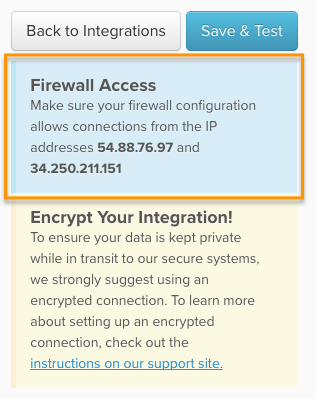

# Connexion [!DNL MySQL] via une connexion directe

## Dans cette rubrique

* [Autoriser l’accès au [!DNL Commerce Intelligence] Adresse IP](#allowlist)
* [Créez un [!DNL MySQL] user pour [!DNL Commerce Intelligence]](#steptwo)
* [Saisissez les informations de connexion dans [!DNL Commerce Intelligence]](#stepthree)

## Accéder à

* [[!DNL MySQL] via ](../integrations/mysql-via-ssh-tunnel.md)
* [[!DNL MySQL] via [!DNL cPanel]](../integrations/mysql-via-cpanel.md)

>[!NOTE]
>
>[!DNL Adobe] recommande d’utiliser [SSH](../integrations/mysql-via-ssh-tunnel.md) ou une autre forme de cryptage pour sécuriser vos données ! Si cette option n’est pas disponible, vous pouvez toujours vous connecter directement. [!DNL Commerce Intelligence] à votre base de données en suivant les instructions de cette rubrique.

Cette rubrique vous guide tout au long des étapes nécessaires pour connecter directement votre [!DNL MySQL] vers la base de données [!DNL Commerce Intelligence]. Ces paramètres peuvent également être utilisés avec [!DNL Adobe Commerce] ou toute autre base de données eCommerce utilisant MySQL.

## Autoriser l’accès au [!DNL Commerce Intelligence] Adresses IP {#allowlist}

Pour que la connexion soit établie, vous devez configurer votre pare-feu pour autoriser l’accès à partir de vos adresses IP. Ils sont `54.88.76.97` et `34.250.211.151`, mais il est également activé sur la variable [!DNL MySQL] page des informations d’identification :



## Créez un [!DNL MySQL] user pour [!DNL Commerce Intelligence]

La méthode la plus simple pour créer une `MySQL` user pour [!DNL Commerce Intelligence] doit exécuter la requête suivante lorsque vous êtes connecté à `MySQL` avec `GRANT` des privilèges. Remplacer `Commerce Intelligence IP Address` avec la propriété [!DNL Commerce Intelligence] Adresse IP et remplacement `secure password` avec un mot de passe sécurisé de votre choix :

```sql
    GRANT SELECT ON *.* TO 'magentobi'@'<Commerce Intelligence IP address>' IDENTIFIED BY '<secure password>';
```

Pour empêcher cet utilisateur d’accéder aux données de bases de données, de tableaux ou de colonnes spécifiques, vous pouvez exécuter `GRANT` requêtes qui permettent uniquement d’accéder aux données que vous autorisez.

**Exécutez à nouveau la requête GRANT pour toutes les adresses IP requises à l’aide du même utilisateur et du même mot de passe.**

## Saisie des informations de connexion dans Commerce Intelligence

Pour terminer, vous devez saisir les informations de connexion et d’utilisateur dans [!DNL Commerce Intelligence]. Avez-vous quitté le [!DNL MySQL] la page des informations d’identification s’ouvre ? Dans le cas contraire, accédez à **[!UICONTROL Data** > **Connections]** et cliquez sur **[!UICONTROL Add New Data Source]**, puis cliquez sur le bouton [!DNL MySQL] Icône N’oubliez pas de modifier la variable `Encrypted` bascule vers `Yes`.

Renseignez les informations suivantes dans cette page, en commençant par le `Database Connection` section :

* `Connection Nickname`: saisissez un nom pour l’intégration (par exemple, Boutique e-commerce).
* `Username`: nom d’utilisateur de la variable [!DNL Commerce Intelligence] [!DNL MySQL] user
* `Password`: mot de passe de la variable [!DNL Commerce Intelligence] [!DNL MySQL] user
* `Port`: port de MySQL sur votre serveur (`3306` par défaut)
* `Host`: par défaut, il s’agit de localhost. En général, il s’agit de la valeur de l’adresse de liaison pour votre [!DNL MySQL] server, qui est, par défaut, `127.0.0.1 (localhost)`, mais peut également être une adresse réseau locale (par exemple, `192.168.0.1`) ou l’adresse IP publique de votre serveur.

  La valeur se trouve dans votre `my.cnf` (situé à l’emplacement `/etc/my.cnf`) sous la ligne qui indique : `\[mysqld\]`. Si la ligne d’adresse de liaison est commentée dans ce fichier, votre serveur est sécurisé suite à des tentatives de connexion externes.

Lorsque vous avez terminé, cliquez sur **[!UICONTROL Save & Test]** pour terminer la configuration.

## Documentation connexe

* [Réauthentification des intégrations](https://experienceleague.adobe.com/docs/commerce-knowledge-base/kb/how-to/mbi-reauthenticating-integrations.html)
