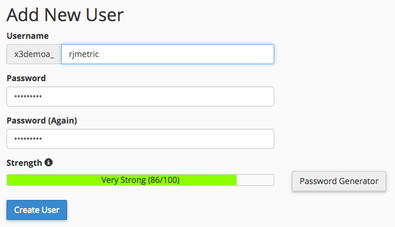

# Connexion de [!DNL MySQL] via [!DNL cPanel]

* [Créez un utilisateur  [!DNL Commerce Intelligence] [!DNL MySQL] dans  [!DNL cPanel]](#cpanel)
* [Saisissez les informations de connexion et d’utilisateur dans  [!DNL Commerce Intelligence]](#finish)

## Atteindre

* [[!DNL MySQL] via un tunnel SSH](../integrations/mysql-via-ssh-tunnel.md)
* [[!DNL MySQL] via une connexion directe](../integrations/mysql-via-a-direct-connection.md)

>[!IMPORTANT]
>
>[!DNL Adobe] vous recommande d’utiliser SSH ou une autre forme de chiffrement pour sécuriser vos données ! Si cette option n&#39;est pas disponible, vous pouvez tout de même [!DNL Commerce Intelligence] connecter directement à votre base de données à l&#39;aide des instructions de cette rubrique.

Cette rubrique vous guide tout au long de la connexion directe de votre base de données [!DNL MySQL] aux [!DNL Commerce Intelligence] à l’aide de [!DNL cPanel]. Ce processus peut également être utilisé pour connecter [!DNL Adobe Commerce] et toute autre base de données eCommerce basée sur MySQL à [!DNL Commerce Intelligence].

1. Création d’un utilisateur [!DNL Commerce Intelligence] [!DNL MySQL] dans [!DNL cPanel]
1. Saisir les informations de connexion et d’utilisateur dans [!DNL Commerce Intelligence]

Commencez.

## Création d’un utilisateur [!DNL Commerce Intelligence] [!DNL MySQL] dans [!DNL cPanel] {#cpanel}

1. Connectez-vous à [!DNL cPanel] via votre fournisseur d’hébergement.
1. Cliquez sur **[!UICONTROL [!DNL MySQL] Databases]**, dans la section `Database`.
1. Faites défiler l’écran jusqu’à la section `Add New User` et créez un utilisateur ou une utilisatrice pour [!DNL Commerce Intelligence] :

   

1. Cliquez sur **[!UICONTROL Create User]**.
1. Maintenant que vous avez créé l’utilisateur, vous devez l’associer à une base de données. Revenez à la section `Add New User` - voir les paramètres de `Add User to Database?` C’est ce dont vous avez besoin.
1. Dans la liste déroulante `User` de cette section, sélectionnez l’utilisateur que vous avez créé.
1. Dans le menu déroulant `Database` de cette section, sélectionnez la base de données à laquelle vous souhaitez vous [!DNL Commerce Intelligence].
1. Cliquez sur **[!UICONTROL Add]**.
1. Lorsque la liste de contrôle des privilèges s’affiche, cochez la case en regard de `SELECT` - c’est tout ce dont [!DNL Commerce Intelligence] avez besoin pour vous connecter à votre base de données.

## Saisie des informations de connexion et d’utilisateur dans [!DNL Commerce Intelligence] {#finish}

Pour conclure, vous devez saisir les informations de connexion et d’utilisateur dans [!DNL Commerce Intelligence]. Avez-vous laissé la page des informations d’identification [!DNL MySQL] ouverte ? Dans le cas contraire, accédez à **[!UICONTROL Manage Data** > **Connections]** et cliquez sur **[!UICONTROL Add New Data Source]**, puis sur l’icône [!DNL MySQL] .

Renseignez les informations suivantes sur cette page dans la section `Database Connection` :

* `Username` : nom d’utilisateur de l’utilisateur [!DNL Commerce Intelligence] [!DNL MySQL]
* `Password` : mot de passe de l’utilisateur [!DNL Commerce Intelligence] [!DNL MySQL]
* `Port` : port de MySQL sur votre serveur (`3306` par défaut)
* `Host` : adresse publique du serveur `MySQL` auquel [!DNL Commerce Intelligence] se connecte. Il s’agit généralement de l’URL que vous utilisez pour vous connecter à `[!DNL cPanel]`.

Si vous utilisez un [`SSH tunnel`](../integrations/mysql-via-ssh-tunnel.md), vous devez saisir les informations de chiffrement. Définissez le bouton (bascule) `Encrypted` sur `Yes` pour afficher le formulaire.

* `Connection Type` : définissez ce paramètre sur `SSH Tunnel`
* `Remote Address` : adresse IP ou nom d’hôte du serveur [!DNL Commerce Intelligence] empruntera le tunnel dans
* `Username` : nom d’utilisateur de l’utilisateur [!DNL Commerce Intelligence] `SSH (Linux)`, consultez [instructions](../../../data-analyst/importing-data/integrations/mysql-via-ssh-tunnel.md) pour savoir comment procéder si ce n’est pas déjà fait)
* `SSH Port` : port SSH sur votre serveur (`22` par défaut)

Lorsque vous avez terminé, cliquez sur **[!UICONTROL Save & Test]** pour terminer la configuration.

## Connexe :

* [Réauthentification des intégrations](https://experienceleague.adobe.com/docs/commerce-knowledge-base/kb/how-to/mbi-reauthenticating-integrations.html?lang=fr)
