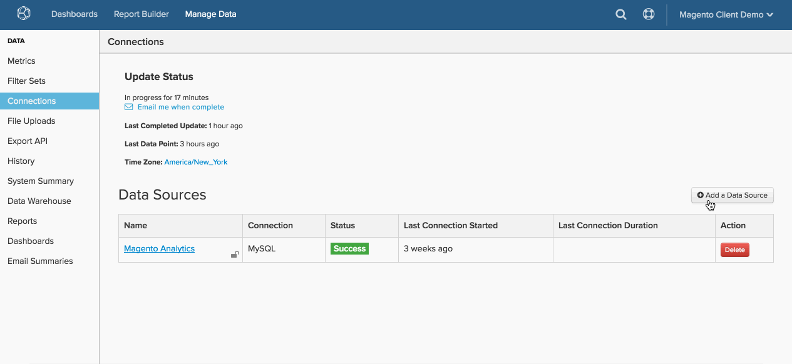

# Connexion de [!DNL MySQL] via [!DNL SSH Tunnel]

* [Récupération de la clé  [!DNL Commerce Intelligence] ](#retrieve)
* [Autoriser l’accès à l’adresse  [!DNL Commerce Intelligence] ](#allowlist)
* [Créez un utilisateur Linux pour  [!DNL Commerce Intelligence]](#linux)
* [Créez un  [!DNL MySQL]  pour  [!DNL Commerce Intelligence]](#mysql)
* [Saisissez les informations de connexion et d’utilisateur dans  [!DNL Commerce Intelligence]](#finish)

## ACCÉDER À

* [[!DNL MySQL] via `direct connection`](../integrations/mysql-via-a-direct-connection.md)
* [[!DNL MySQL] via  [!DNL cPanel]](../integrations/mysql-via-cpanel.md)

Pour connecter votre base de données [!DNL MySQL] à [!DNL Commerce Intelligence] via un `SSH tunnel`, procédez comme suit :

1. Récupérer le `public key` [!DNL Commerce Intelligence]
1. Autoriser l&#39;accès au `IP address` [!DNL Commerce Intelligence]
1. Créer un utilisateur `Linux` pour [!DNL Commerce Intelligence]
1. Créer un utilisateur `MySQL` pour [!DNL Commerce Intelligence]
1. Saisissez les informations de connexion et d’utilisateur dans [!DNL Commerce Intelligence]


## Récupération de la clé publique [!DNL Commerce Intelligence] {#retrieve}

Le `public key` est utilisé pour autoriser l’utilisateur [!DNL Commerce Intelligence] `Linux`. Dans la section suivante, vous allez créer l’utilisateur et importer la clé.

1. Accédez à **[!UICONTROL Manage Data** > **Connections]** et cliquez sur **[!UICONTROL Add New Data Source]**.
1. Cliquez sur l’icône `MySQL` .
1. Une fois la page `MySQL credentials` ouverte, définissez le bouton `Encrypted` sur `Yes`. Le formulaire de configuration SSH s’affiche.
1. Le `public key` se trouve sous ce formulaire.

Laissez cette page ouverte tout au long du tutoriel. Vous en aurez besoin dans la section suivante et à la fin.

Voici comment naviguer dans [!DNL Commerce Intelligence] pour récupérer la clé :

<!--{: width="770"}-->

## Autoriser l&#39;accès à l&#39;adresse IP [!DNL Commerce Intelligence] {#allowlist}

Pour que la connexion soit établie, vous devez configurer votre pare-feu afin d’autoriser l’accès à partir de vos adresses IP. Ils sont `54.88.76.97` et `34.250.211.151`, mais ils sont également sur la page `MySQL credentials`. Voir la case bleue dans le GIF ci-dessus.

## Création d’un utilisateur [!DNL Linux] pour [!DNL Commerce Intelligence] {#linux}

Il peut s’agir d’une machine de production ou secondaire, à condition qu’elle contienne des données en temps réel (ou fréquemment mises à jour). Vous pouvez [restreindre cet utilisateur](../../../administrator/account-management/restrict-db-access.md) comme bon vous semble, à condition qu&#39;il conserve le droit de se connecter au serveur `MySQL`.

1. Pour ajouter le nouvel utilisateur, exécutez les commandes suivantes en tant que root sur votre serveur [!DNL Linux] :

```bash
        adduser rjmetric -p<password>
        mkdir /home/rjmetric
        mkdir /home/rjmetric/.ssh
```

1. Vous vous souvenez de la `public key` que vous avez récupérée dans la première section ? Pour vous assurer que l&#39;utilisateur a accès à la base de données, vous devez importer la clé dans `authorized\_keys`.

   Copiez la clé complète dans le fichier `authorized\_keys` comme suit :

```bash
        touch /home/rjmetric/.ssh/authorized_keys
        "<PASTE KEY HERE>" >> /home/rjmetric/.ssh/authorized_keys
```

1. Pour terminer la création de l’utilisateur, modifiez les autorisations sur le répertoire `/home/rjmetric` pour autoriser l’accès via `SSH` :

```bash
        chown -R rjmetric:rjmetric /home/rjmetric
        chmod -R 700 /home/rjmetric/.ssh
        chmod 400 /home/rjmetric/.ssh/authorized_keys
```

>[!IMPORTANT]
>
>Si le fichier `sshd\_config` associé au serveur n’est pas défini sur l’option par défaut, seuls certains utilisateurs ont accès au serveur, ce qui empêche une connexion réussie à [!DNL Commerce Intelligence]. Dans ce cas, il est nécessaire d’exécuter une commande telle que `AllowUsers` pour permettre à l’utilisateur `rjmetric` d’accéder au serveur.

## Création d’un utilisateur [!DNL MySQL] pour [!DNL Commerce Intelligence] {#mysql}

Votre organisation peut nécessiter un processus différent, mais la méthode la plus simple pour créer cet utilisateur consiste à exécuter la requête suivante lorsqu’il est connecté à [!DNL MySQL] en tant qu’utilisateur disposant du droit d’accorder des privilèges :

```sql
    GRANT SELECT ON *.* TO 'rjmetric'@'localhost' IDENTIFIED BY '<secure password here>';
```

Remplacez `secure password here` par un mot de passe sécurisé, qui peut être différent du mot de passe `SSH`.

Pour empêcher cet utilisateur d&#39;accéder aux données de bases de données, tables ou colonnes spécifiques, vous pouvez exécuter des requêtes GRANT qui autorisent uniquement l&#39;accès aux données que vous autorisez.

## Saisie des informations de connexion et d’utilisateur dans [!DNL Commerce Intelligence] {#finish}

Pour conclure, vous devez saisir les informations de connexion et d’utilisateur dans [!DNL Commerce Intelligence]. Avez-vous laissé la page `MySQL credentials` ouverte ? Dans le cas contraire, accédez à **[!UICONTROL Data** > **Connections]** et cliquez sur **[!UICONTROL Add New Data Source]**, puis sur l’icône [!DNL MySQL] . N’oubliez pas de définir le bouton (bascule) `Encrypted` sur `Yes`.

Saisissez les informations suivantes dans cette page, en commençant par la section `Database Connection` :

* `Username` : nom d’utilisateur de l’utilisateur [!DNL Commerce Intelligence] [!DNL MySQL]
* `Password` : mot de passe de l’utilisateur [!DNL Commerce Intelligence] [!DNL MySQL]
* `Port` : port [!DNL MySQL] sur votre serveur (3306 par défaut)
* `Host` Par défaut, il s’agit de localhost. En règle générale, il s’agit de la valeur bind-address de votre serveur [!DNL MySQL], qui est `127.0.0.1 (localhost)` par défaut, mais il peut également s’agir d’une adresse réseau locale (par exemple, `192.168.0.1`) ou de l’adresse IP publique de votre serveur.

  La valeur se trouve dans votre fichier `my.cnf` (situé à l’adresse `/etc/my.cnf`) sous la ligne qui lit `\[mysqld\]`. Si la ligne bind-address est commentée dans ce fichier, votre serveur est protégé contre les tentatives de connexion externes.

Dans la section `SSH Connection` :

* `Remote Address` : adresse IP ou nom d’hôte du serveur [!DNL Commerce Intelligence] empruntera le tunnel dans
* `Username` : nom d’utilisateur de [!DNL Commerce Intelligence] SSH ([!DNL Linux])
* `SSH Port` : port SSH sur votre serveur (22 par défaut)

Lorsque vous avez terminé, cliquez sur **[!UICONTROL Save & Test]** pour terminer la configuration.

>[!NOTE]
>
>Pour l’inscription de la clé de l’hôte SSH, l’actualisation, les messages d’erreur et le dépannage, consultez [Vérification de la clé de l’hôte SSH](ssh-host-key-verification.md).

## Connexe {#related}

* [Vérification de la clé hôte SSH](ssh-host-key-verification.md)
* [Réauthentification des intégrations](https://experienceleague.adobe.com/docs/commerce-knowledge-base/kb/how-to/mbi-reauthenticating-integrations.html)
