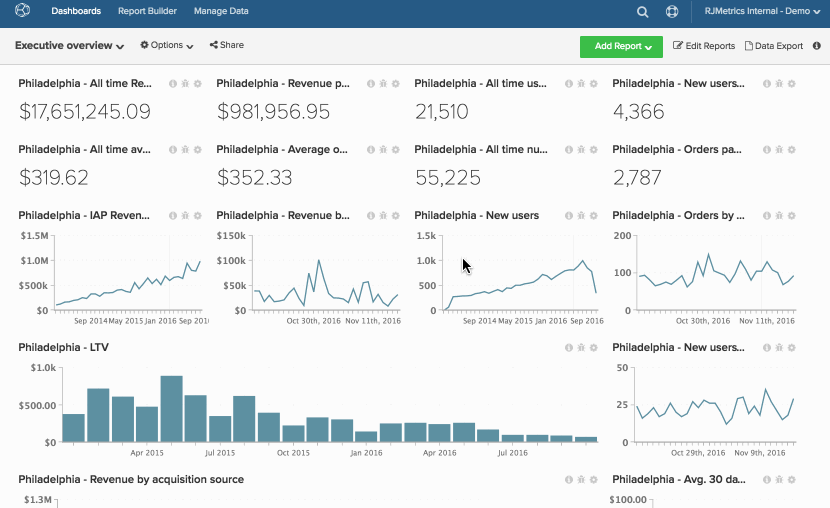

# Clonage d’un tableau de bord

Le clonage d’un tableau de bord permet de copier tous les rapports d’un tableau de bord dans un nouveau tableau de bord.

Cela s’avère utile si vous souhaitez recréer un ensemble existant de graphiques, mais modifier la perspective (par exemple, une vue de données différente, un marché différent, un site web ou un magasin différent). Après avoir dupliqué le tableau de bord, vous pouvez modifier chacun des nouveaux graphiques pour modifier sa mesure, sa vue de données, son filtre ou son regroupement.

1. Pour cloner un tableau de bord, cliquez sur **[!UICONTROL Options]** en haut de l’écran.

1. Dans la liste déroulante , cliquez sur **[!UICONTROL Save As]**.

1. A l’invite, saisissez le `New Dashboard Name`. Adobe recommande des noms qui vous indiquent, en un coup d’œil, les informations contenues dans le tableau de bord.

   Par exemple, vous clonez un tableau de bord nommé `Customer Activity`. Ce tableau de bord contenait des informations sur l’activité des clients pour votre emplacement à Philadelphie. Vous devez maintenant créer un tableau de bord pour votre nouvel emplacement à New York. Ce tableau de bord peut être nommé `New York City - Customer Activity`.

1. Utilisez les champs `Chart Title Find` et `Chart Title Replace` pour rechercher tous les graphiques avec des `Philadelphia` dans le titre et remplacez-les par des `New York City`.

   Si vous ne saisissez aucune valeur dans ces champs, un `(2)` est automatiquement ajouté à la fin de tous les titres de graphique dans le nouveau tableau de bord.

1. Cliquez sur **[!UICONTROL Save]** pour cloner le tableau de bord.

Exemple :

