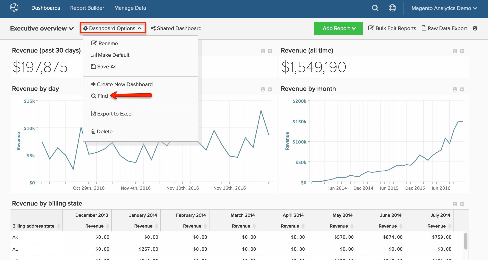

# Recherche d’un tableau de bord

Cette rubrique vous explique comment utiliser la variable [[!DNL Global Search] fonctionnalité](#global) pour rechercher des tableaux de bord et comment les rechercher [Tableaux de bord détenus par d’autres utilisateurs](#other).

## Recherche globale {#global}

Le [!DNL Global Search] vous permet de rechercher et de sélectionner des tableaux de bord à afficher.

* *Pour afficher la liste de vos tableaux de bord existants*, cliquez sur le tableau de bord.

* *Pour rechercher un tableau de bord*, saisissez certains critères de recherche dans la barre de recherche après avoir cliqué sur la liste déroulante du tableau de bord. Si des tableaux de bord correspondent aux critères, ils s’affichent en premier dans la liste.

Exemple :

## Recherche de tableaux de bord détenus par d’autres utilisateurs {#other}

Vous recherchez un tableau de bord détenu par un autre utilisateur ? Si le tableau de bord peut être affiché par d’autres utilisateurs, vous pouvez le rechercher en cliquant sur **[!UICONTROL Find]** dans le `Dashboard Options` menu déroulant.

