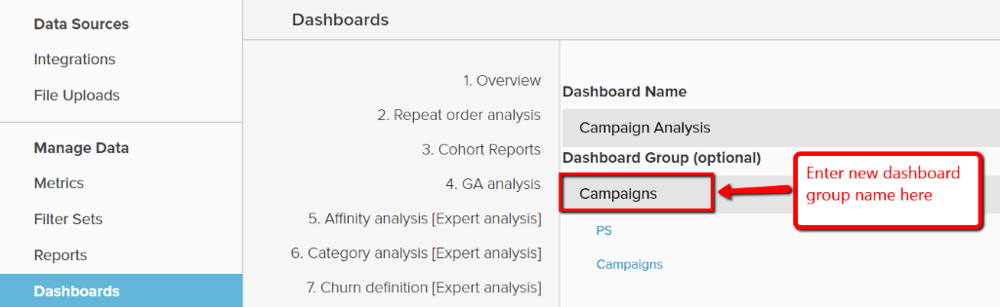

# Utilisation des groupes de tableaux de bord

Les groupes de tableaux de bord permettent une meilleure organisation des tableaux de bord. Le cas d’utilisation le plus courant consiste à regrouper des tableaux de bord similaires sous le même « groupe ». Par exemple, tous les tableaux de bord liés au marketing peuvent être regroupés sous un groupe de tableaux de bord « Marketing ».

Dans le menu déroulant de sélection du tableau de bord, les groupes de tableaux de bord s’affichent par ordre alphabétique, tous les tableaux de bord situés sous « Aucun groupe » s’affichant en dernier. Les tableaux de bord appartenant au même groupe sont affichés ensemble et par ordre alphabétique dans chaque groupe.

## Partage de groupes de tableaux de bord

Les groupes de tableaux de bord ne peuvent pas être directement partagés entre les utilisateurs. Lorsqu’un tableau de bord est partagé avec des utilisateurs, le groupe de tableaux de bord sous lequel il se trouve est automatiquement créé pour ces utilisateurs s’il n’existe pas. Si le groupe de tableaux de bord existe déjà, le tableau de bord est ajouté à la liste.

Lorsque le groupe d’un tableau de bord est modifié par son propriétaire, la modification est répercutée automatiquement pour tous les utilisateurs avec lesquels le tableau de bord a été partagé. Les utilisateurs ne peuvent pas modifier le groupe de tableaux de bord pour les tableaux de bord qui ne leur appartiennent pas.

## Créer des groupes de tableaux de bord

Les groupes de tableaux de bord peuvent être créés de deux manières :

1. Lors de la création d’un tableau de bord :

   

1. Lors de la modification du groupe d’un tableau de bord existant, à partir de la page `Manage Data > Dashboards` :

   1. Cliquez sur le tableau de bord pour lequel vous souhaitez créer le groupe.

   1. Sous `Dashboard Group (optional)`, le groupe de tableaux de bord actuel s’affiche.

   1. Pour créer un groupe, saisissez son nom, puis cliquez en dehors de la zone.

      

## Ajouter des tableaux de bord existants à des groupes existants

1. Sur la page `Manage Data > Dashboards`, sélectionnez le tableau de bord pour lequel le groupe doit être modifié.

1. Le texte situé sous `Dashboard Group (optional)` affiche le groupe de tableaux de bord actuel du tableau de bord.

1. Pour modifier le groupe du tableau de bord, choisissez un autre groupe dans la liste : dans ce cas, `PS`, `Campaigns`.

   

## Supprimer des groupes de tableaux de bord

Lorsqu’un groupe de tableaux de bord ne comporte aucun tableau de bord, il est automatiquement supprimé.
