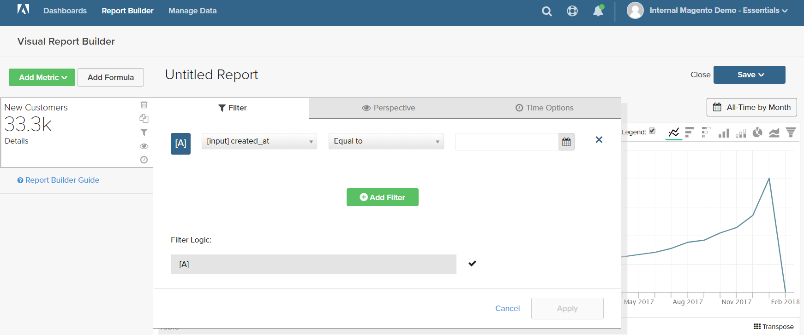

# Filtres

Un ou plusieurs filtres peuvent être ajoutés pour limiter les données utilisées pour produire un rapport. Chaque filtre est une expression qui comprend une colonne du tableau associé, un opérateur et une valeur. Par exemple, pour inclure uniquement les clients réguliers, vous pouvez créer un filtre qui inclut uniquement les clients qui ont passé plusieurs commandes. Plusieurs filtres peuvent être utilisés avec des opérateurs logiques `AND/OR` pour ajouter une logique au rapport.

>[!TIP]
>
>Un rapport peut contenir un maximum de 3 500 points de données. Pour réduire le nombre de points de données, utilisez un filtre afin de réduire la quantité de données utilisées pour générer le rapport.

[!DNL Adobe Commerce Intelligence] comprend une sélection de filtres que vous pouvez utiliser prêts à l’emploi ou modifier en fonction de vos besoins. Le nombre de filtres que vous pouvez créer n’est pas limité.

## Pour ajouter un filtre :

1. Dans le graphique, passez la souris sur chaque point de données.

   Dans ce rapport, chaque point de données affiche le nombre total de clients pour le mois.

1. Dans le panneau de gauche, cliquez sur l’icône Filtres () .

   

1. Cliquez sur **[!UICONTROL Add Filter]**.

   Les filtres sont numérotés par ordre alphabétique et le premier est `[A]`. Les deux premières parties du filtre sont des options de liste déroulante, et la troisième partie est une valeur.

   

   * Cliquez sur la première partie du filtre et choisissez la colonne que vous souhaitez utiliser comme objet de l&#39;expression.

     

   * Cliquez sur la deuxième partie du filtre et choisissez l&#39;opérateur .

     

   * Dans la troisième partie du filtre, saisissez la valeur nécessaire pour terminer l’expression.

     

   * Une fois le filtre terminé, cliquez sur **[!UICONTROL Apply]**.

     Le rapport inclut désormais uniquement les clients et clientes réguliers, et le nombre d’enregistrements de clients récupérés pour le rapport a été réduit de 33 000 à 12 600.

     <!--{: .zoom}-->

1. Dans la barre latérale, cliquez sur l’icône de perspective ().

   <!--{: .zoom}-->

1. Dans la liste des paramètres, choisissez `Cumulative`. Cliquez ensuite sur **[!UICONTROL Apply]**.

   

   La perspective `Cumulative` répartit le changement au fil du temps, plutôt que d’afficher les variations à la hausse et à la baisse pour chaque mois.

1. Saisissez un `Title` pour le rapport et cliquez dessus **[!UICONTROL Save]** tant que `Chart` de votre tableau de bord.

   
