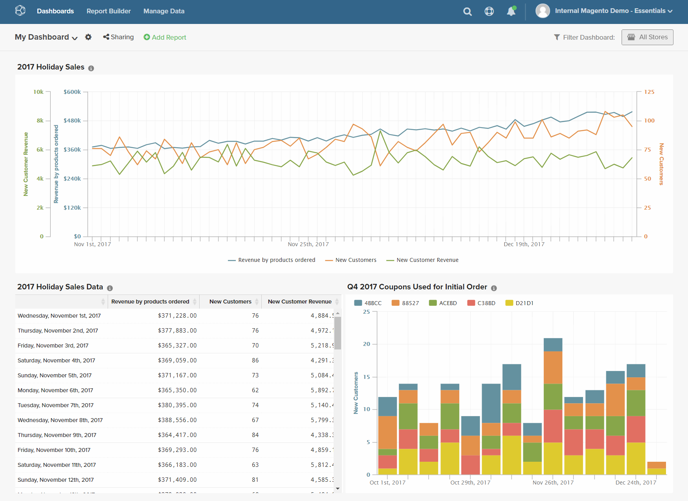
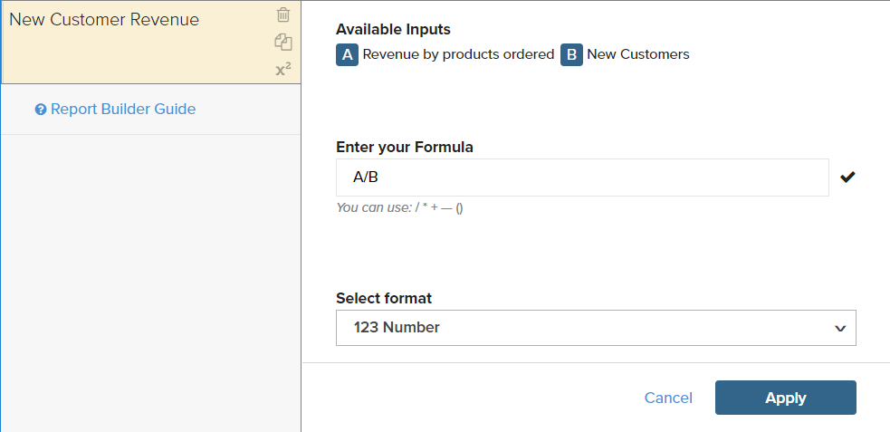
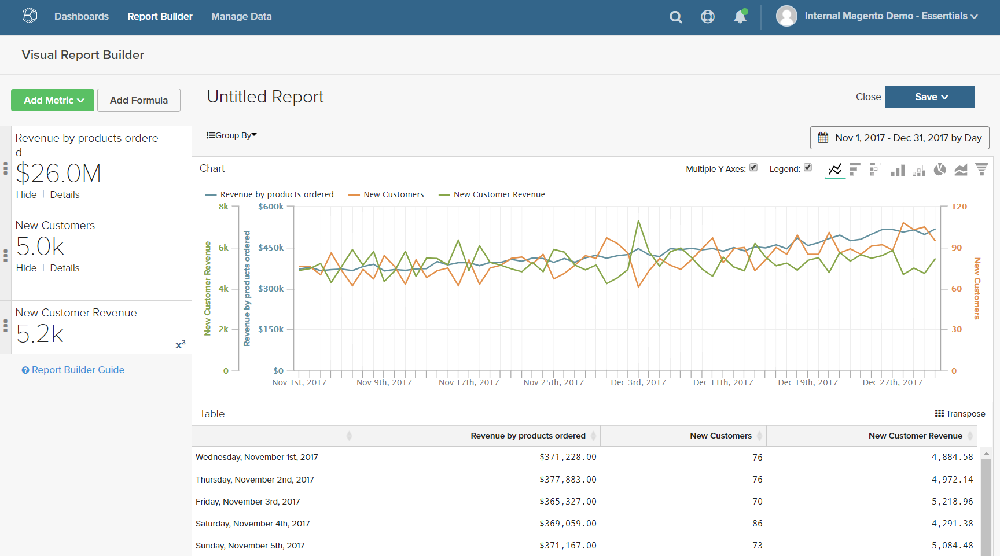

# Formules

Une formule combine plusieurs mesures et une logique mathématique pour répondre à une question. Par exemple, quelle part du chiffre d’affaires par produit pendant la saison des fêtes a été générée par de nouveaux clients ?

## Étape 1 : créer le rapport de base

1. Dans le menu, choisissez `Report Builder`.

1. Cliquez sur **[!UICONTROL Add Metric]** et sélectionnez la première mesure du rapport.

   Pour cet exemple, la mesure `Revenue by products ordered` est utilisée.

1. Cliquez à nouveau sur **[!UICONTROL Add Metric]** et sélectionnez la deuxième mesure du rapport.

   Pour cet exemple, la mesure `New Customers` est utilisée.

1. Dans la barre latérale, cliquez sur **[!UICONTROL Details]** pour afficher des informations sur chaque mesure.

   

1. Dans la barre latérale, cliquez sur le nom de chaque mesure pour ouvrir la page des paramètres dans un nouvel onglet du navigateur. Faites défiler la page vers le bas pour afficher chaque composant de la mesure, y compris la requête de mesure, le filtre et les dimensions.

   

1. Pour revenir à votre rapport, cliquez sur l&#39;onglet précédent du navigateur.

1. Dans le graphique, passez la souris sur quelques points de données de chaque ligne pour afficher les quantités associées à chaque mesure.

## Étape 2 : ajouter une formule

1. Dans la partie supérieure de la barre latérale, cliquez sur **[!UICONTROL Add Formula]**.

   La zone de formule affiche les mesures en tant qu’entrées disponibles `A` et `B`, et comprend une zone de saisie dans laquelle vous pouvez saisir la formule.

   Procédez comme suit :

   * Dans la zone de saisie `Enter your Formula`, saisissez `A/B`.

     Il divise le chiffre d’affaires par les produits commandés par le nombre de nouveaux clients.

   * Définissez `Select format` sur `123Number`.

   * Dans la barre latérale, remplacez `Untitled` par un nom pour la formule.

   

1. Cliquez ensuite sur **[!UICONTROL Apply]**.

   Le rapport comporte désormais une nouvelle ligne pour la formule, `New Customer Revenue`, et la barre latérale affiche le montant total du chiffre d’affaires généré par les nouveaux clients.

   

## Étape 3 : ajouter une période

1. Cliquez sur **[!UICONTROL Date Range]** dans le coin supérieur droit.

1. Dans l’onglet `Fixed Date Range` , procédez comme suit :

   * Dans les calendriers, choisissez la période.

     Pour cet exemple, la saison des fêtes va de `November 1` à `December 31`.

   * Sous `Select Time Interval`, choisissez `Day`.

     

   * Cliquez ensuite sur **[!UICONTROL Apply]**.

   Le rapport se limite désormais à la période des fêtes, avec un point de données pour chaque jour.

   

## Étape 4 : enregistrer le rapport

Au cours de cette étape, vous enregistrez le rapport sous la forme d’un graphique ainsi que d’un tableau.

1. Cliquez sur `Untitled Report` en haut de la page et saisissez un titre descriptif. Pour cet exemple, le titre du rapport est `2017 Holiday Sales`.

   Procédez ensuite comme suit :

   * Dans le coin supérieur droit, cliquez sur **[!UICONTROL Save]**.

   * Par `Type`, acceptez le paramètre de `Chart` par défaut.

   * Choisissez le `Dashboard` où le rapport doit être disponible.

   * Cliquez sur **[!UICONTROL Save to Dashboard]**.

1. Cliquez sur le titre du rapport et modifiez le nom. Pour cet exemple, le titre du rapport est remplacé par `2017 Holiday Sales Data`.

   Procédez ensuite comme suit :

   * Dans le coin supérieur droit, cliquez sur **[!UICONTROL Save a Copy]**.

   * Définissez `Type` sur `Table`.

   * Choisissez le `Dashboard` où le rapport doit être disponible.

   * Cliquez sur **[!UICONTROL Save a Copy to Dashboard]**.

1. Pour afficher les rapports dans votre tableau de bord, effectuez l’une des opérations suivantes :

   * Cliquez sur **[!UICONTROL Go to Dashboard]** dans le message en haut de la page.

   * Dans le menu, choisissez **[!UICONTROL Dashboards]**. Cliquez sur le nom du tableau de bord actuel pour afficher la liste. Cliquez ensuite sur le nom du tableau de bord dans lequel le rapport a été enregistré.
