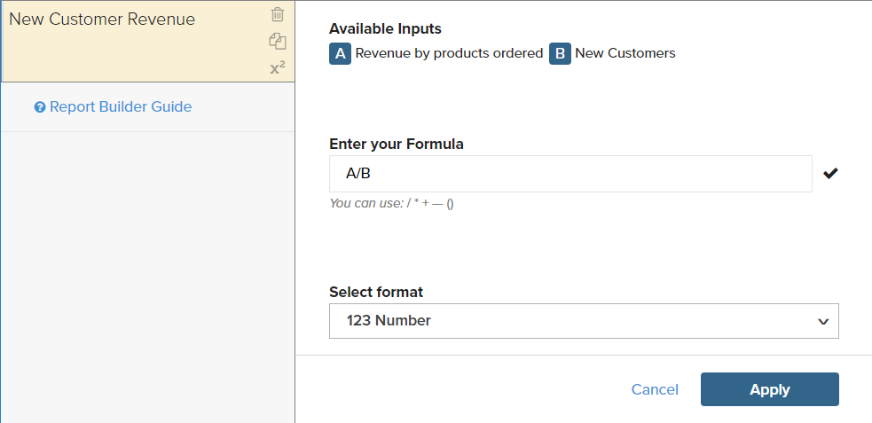

# Formules

Une formule combine plusieurs mesures et une logique mathématique pour répondre à une question. Par exemple, combien des recettes par produit pendant la période des fêtes ont été générées par les nouveaux clients ?

## Étape 1 : création du rapport de base

1. Dans le menu, choisissez `Report Builder`.

1. Cliquez sur **[!UICONTROL Add Metric]** et sélectionnez la première mesure du rapport.

   Pour cet exemple, la mesure `Revenue by products ordered` est utilisée.

1. Cliquez de nouveau sur **[!UICONTROL Add Metric]** et sélectionnez la seconde mesure pour le rapport.

   Pour cet exemple, la mesure `New Customers` est utilisée.

1. Dans la barre latérale, cliquez sur **[!UICONTROL Details]** pour afficher des informations sur chaque mesure.

   

1. Dans la barre latérale, cliquez sur le nom de chaque mesure pour ouvrir la page des paramètres dans un nouvel onglet du navigateur. Faites défiler l’écran vers le bas pour afficher chaque composant de la mesure, y compris la requête de mesure, le filtre et les dimensions.

   

1. Pour revenir à votre rapport, cliquez sur l&#39;onglet précédent du navigateur.

1. Dans le graphique, passez la souris sur quelques points de données de chaque ligne pour afficher les montants associés à chaque mesure.

## Etape 2 : Ajouter une formule

1. Dans la partie supérieure de la barre latérale, cliquez sur **[!UICONTROL Add Formula]**.

   La zone de formule affiche les mesures sous forme d’entrées disponibles `A` et `B`, et inclut une zone de saisie dans laquelle vous pouvez saisir la formule.

   Procédez comme suit :

   * Dans la zone de saisie `Enter your Formula`, saisissez `A/B`.

     Les recettes sont ainsi divisées par le nombre de produits commandés par le nombre de nouveaux clients.

   * Définissez `Select format` sur `123Number`.

   * Dans la barre latérale, remplacez `Untitled` par un nom pour la formule.

   

1. Une fois l’opération terminée, cliquez sur **[!UICONTROL Apply]**.

   Le rapport comporte désormais une nouvelle ligne pour la formule `New Customer Revenue` et la barre latérale affiche le montant total des recettes générées par les nouveaux clients.

   

## Étape 3 : Ajout d’une plage de dates

1. Cliquez sur **[!UICONTROL Date Range]** dans le coin supérieur droit.

1. Sur l’onglet `Fixed Date Range` , procédez comme suit :

   * Sur les calendriers, sélectionnez la période.

     Pour cet exemple, la saison des fêtes va de `November 1` à `December 31`.

   * Sous `Select Time Interval`, choisissez `Day`.

     

   * Une fois l’opération terminée, cliquez sur **[!UICONTROL Apply]**.

   Le rapport est désormais limité à la période des fêtes, avec un point de données pour chaque jour.

   

## Étape 4 : enregistrer le rapport

Au cours de cette étape, vous enregistrez le rapport sous forme de graphique et sous forme de tableau.

1. Cliquez sur `Untitled Report` en haut de la page et entrez un titre descriptif. Pour cet exemple, le titre du rapport est `2017 Holiday Sales`.

   Ensuite, procédez comme suit :

   * Dans le coin supérieur droit, cliquez sur **[!UICONTROL Save]**.

   * Pour `Type`, acceptez le paramètre `Chart` par défaut.

   * Sélectionnez l’ `Dashboard` où le rapport doit être disponible.

   * Cliquez sur **[!UICONTROL Save to Dashboard]**.

1. Cliquez sur le titre du rapport et modifiez son nom. Dans cet exemple, le titre du rapport est remplacé par `2017 Holiday Sales Data`.

   Ensuite, procédez comme suit :

   * Dans le coin supérieur droit, cliquez sur **[!UICONTROL Save a Copy]**.

   * Définissez `Type` sur `Table`.

   * Sélectionnez l’ `Dashboard` où le rapport doit être disponible.

   * Cliquez sur **[!UICONTROL Save a Copy to Dashboard]**.

1. Pour afficher les rapports dans votre tableau de bord, effectuez l’une des opérations suivantes :

   * Cliquez sur **[!UICONTROL Go to Dashboard]** dans le message en haut de la page.

   * Dans le menu, choisissez **[!UICONTROL Dashboards]**. Cliquez sur le nom du tableau de bord en cours pour afficher la liste. Cliquez ensuite sur le nom du tableau de bord dans lequel le rapport a été enregistré.
