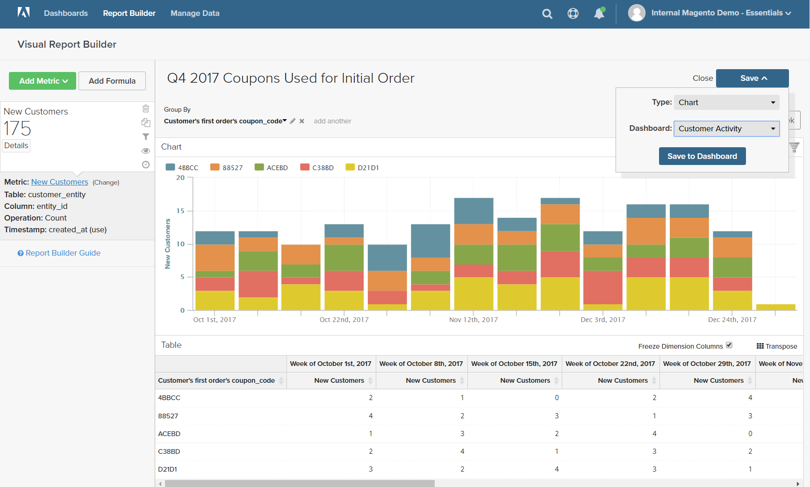

# [!DNL Visual Report Builder]

[!DNL Visual Report Builder] facilite la création de rapports rapides sur la base de mesures prédéfinies. Chaque mesure comprend une requête qui définit le jeu de données pour le rapport.

L’exemple suivant montre comment créer un rapport simple, regrouper les données selon une dimension supplémentaire, définir la date et l’intervalle, modifier le type de graphique et enregistrer le rapport dans un tableau de bord.

## Pour créer un rapport simple :

1. Dans le [!DNL Commerce Intelligence] , cliquez sur **[!UICONTROL Report Builder]**.

1. Sous [!UICONTROL Visual Report Builder], cliquez sur **[!UICONTROL Create Report]** et procédez comme suit :

   * Cliquez sur **[!UICONTROL Add Metric]**.

     Les mesures disponibles peuvent être répertoriées par ordre alphabétique ou par tableau.

     

   * Choisissez la [metric](../../data-user/reports/ess-manage-data-metrics.md) qui décrit le jeu de données à utiliser pour le rapport.

     La variable `New Customers` La mesure utilisée dans cet exemple comptabilise tous les clients et trie la liste par date d’inscription du client à un compte. Le rapport initial comprend un graphique linéaire simple, suivi du tableau de données.

     Le résumé sur la gauche affiche le nom de la mesure actuelle, suivi du résultat de tous les calculs sur les données de colonne spécifiées dans la mesure. Dans cet exemple, le résumé affiche le nombre total de clients.

     

1. Dans le graphique, passez la souris sur chaque point de données de la ligne. Chaque point de données indique le nombre total de nouveaux clients qui se sont inscrits au cours de ce mois.

1. Suivez ces instructions pour regrouper les données, modifier la période et le type de graphique.

   **`Group By`**

   La variable `Group By` contrôle vous permet d’ajouter plusieurs dimensions par groupe ou segment. Les Dimensions sont des colonnes du tableau qui peuvent être utilisées pour regrouper les données.

   * Sélectionnez l’une des dimensions disponibles dans la liste de `Group By` options.

     Pour cet exemple, le système a trouvé cinq codes de bon utilisés par les clients lors de leur première commande.

     

     La variable `Group By` Le détail répertorie chaque coupon utilisé par les clients. Les coupons utilisés pour passer la commande initiale sont marqués d’une case à cocher. Le graphique comporte désormais plusieurs lignes colorées représentant chaque coupon utilisé pour une première commande. La légende est codée par couleur pour correspondre à chaque ligne de données.

   * Cliquez sur **[!UICONTROL Apply]** pour fermer le Group By détail.

     

   * Passez la souris sur quelques points de données sur chaque ligne pour afficher le nombre de clients qui ont utilisé ce coupon lors du passage en première commande.

   * Le tableau de données comporte désormais une dimension d’ajout, avec une colonne pour chaque mois et une ligne pour chaque code de coupon.

     

   * Cliquez sur Transposer () dans le coin supérieur droit du tableau pour modifier l’orientation des données.

     L’axe des données est inversé et le tableau comporte désormais une colonne pour chaque code de coupon et une ligne pour chaque mois. Cette orientation peut être plus facile à lire.

     

   **`Date Range`**

   La variable `Date Range` Le contrôle affiche la période actuelle et les paramètres d’intervalle de temps. Il se trouve juste au-dessus du graphique à droite.

   * Cliquez sur le bouton `Date Range` control, qui dans cet exemple est défini sur `All-Time by Month`.

     

   * Apportez les modifications suivantes :

      * Pour effectuer un zoom avant afin d’obtenir une vue plus étroite, définissez la période sur `Last Full Quarter`.
      * Sous `Select Time Interval`, choisissez `Week`.
      * Lorsque vous avez terminé, cliquez sur **[!UICONTROL Save]**.

     Le rapport inclut désormais uniquement les données du dernier trimestre, par semaine.

     

   **Type de graphique**

   * Cliquez sur les contrôles dans le coin supérieur droit pour trouver le meilleur graphique pour les données.

     Certains types de graphique ne sont pas compatibles avec les données multidimensionnelles.

     | | |
     |-----|-----|
     |  | Graphique linéaire |
     |  | Barre horizontale |
     |  | Barre empilée horizontale |
     |  | Barre verticale |
     |  | Barre empilée verticale |
     |  | Diagramme |
     |  | Zone |
     |  | Entonnoir |

     {style="table-layout:auto"}

1. Pour attribuer au rapport un `title`, remplacez la fonction `Untitled Report` texte en haut de la page avec un titre descriptif.

1. Dans le coin supérieur droit, cliquez sur **[!UICONTROL Save]** et procédez comme suit :

   * Pour `Type`, acceptez le paramètre par défaut, `Chart`.

   * Choisissez la `Dashboard` où le rapport doit être disponible.

   * Cliquez sur **[!UICONTROL Save to Dashboard]**.

     

1. Pour afficher le graphique dans un tableau de bord, effectuez l’une des opérations suivantes :

   * Cliquez sur **[!UICONTROL Go to Dashboard]** dans le message en haut de la page.

   * Dans le menu, choisissez `Dashboards` et cliquez sur le nom du tableau de bord en cours pour afficher la liste. Cliquez ensuite sur le nom du tableau de bord dans lequel le rapport a été enregistré.

     
