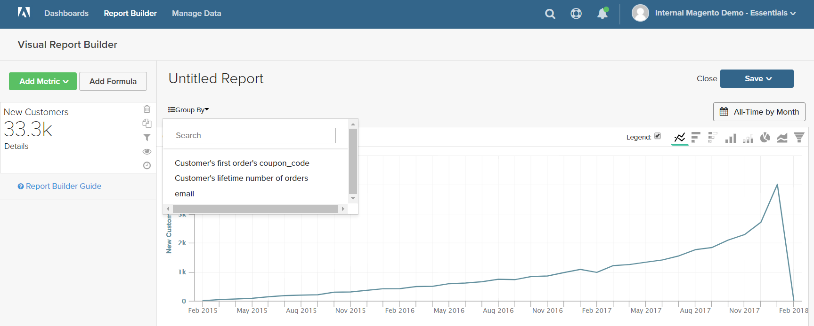

# [!DNL Visual Report Builder]

[!DNL Visual Report Builder] facilite la création de rapports rapides basés sur des mesures prédéfinies. Chaque mesure comprend une requête qui définit l’ensemble de données du rapport.

L&#39;exemple suivant montre comment créer un rapport simple, regrouper les données par une dimension supplémentaire, définir l&#39;intervalle de date et d&#39;heure, modifier le type de graphique et enregistrer le rapport dans un tableau de bord.

## Pour créer un rapport simple, procédez comme suit :

1. Dans le menu [!DNL Commerce Intelligence], cliquez sur **[!UICONTROL Report Builder]**.

1. Sous [!UICONTROL Visual Report Builder], cliquez sur **[!UICONTROL Create Report]** et procédez comme suit :

   * Cliquez sur **[!UICONTROL Add Metric]**.

     Les mesures disponibles peuvent être répertoriées par ordre alphabétique ou par tableau.

     

   * Sélectionnez la [mesure](../../data-user/reports/ess-manage-data-metrics.md) qui décrit le jeu de données à utiliser pour le rapport.

     La mesure `New Customers` utilisée dans cet exemple comptabilise tous les clients et trie la liste en fonction de la date à laquelle le client s’est inscrit à un compte. Le rapport initial comprend un graphique linéaire simple, suivi du tableau de données.

     Le résumé situé à gauche affiche le nom de la mesure actuelle, suivi du résultat des calculs des données de colonne spécifiées dans la mesure. Dans cet exemple, le résumé affiche le nombre total de clients.

     

1. Dans le graphique, passez la souris sur chaque point de données de la ligne. Chaque point de données affiche le nombre total de nouveaux clients qui se sont inscrits au cours de ce mois.

1. Suivez ces instructions pour regrouper les données, modifier la période et le type de graphique.

   **`Group By`**

   Le contrôle `Group By` vous permet d’ajouter plusieurs dimensions par groupe ou segment. Les dimensions sont des colonnes du tableau qui peuvent être utilisées pour regrouper les données.

   * Sélectionnez l’une des dimensions disponibles dans la liste des options de `Group By`.

     Pour cet exemple, le système a trouvé cinq codes de coupon qui ont été utilisés par les clients lors de leur première commande.

     

     Le détail `Group By` répertorie chaque coupon utilisé par les clients. Les coupons utilisés pour passer la commande initiale sont cochés avec une case à cocher. Le graphique comporte désormais plusieurs lignes colorées qui représentent chaque coupon utilisé pour une première commande. La légende est codée par couleur pour correspondre à chaque ligne de données.

   * Cliquez sur **[!UICONTROL Apply]** pour fermer le détail Regrouper par.

     

   * Passez la souris sur quelques points de données sur chaque ligne pour afficher le nombre de clients qui, au cours du mois, ont utilisé ce coupon lors de leur première commande.

   * Le tableau de données comporte désormais une dimension d’ajout, avec une colonne pour chaque mois et une ligne pour chaque code de coupon.

     

   * Cliquez sur le contrôle Transposer () dans le coin supérieur droit du tableau pour modifier l’orientation des données.

     L’axe des données est inversé et le tableau comporte désormais une colonne pour chaque code de coupon et une ligne pour chaque mois. Il se peut que vous trouviez cette orientation plus facile à lire.

     

   **`Date Range`**

   Le contrôle `Date Range` affiche les paramètres actuels de la période et de l’intervalle de temps et se trouve juste au-dessus du graphique à droite.

   * Cliquez sur le contrôle `Date Range` qui, dans cet exemple, est défini sur `All-Time by Month`.

     

   * Effectuez les modifications suivantes :

      * Pour effectuer un zoom avant pour une vue plus rapprochée, définissez la période sur `Last Full Quarter`.
      * Sous `Select Time Interval`, choisissez `Week`.
      * Cliquez ensuite sur **[!UICONTROL Save]**.

     Le rapport inclut désormais uniquement les données du dernier trimestre, par semaine.

     

   **Type de graphique**

   * Cliquez sur les contrôles dans le coin supérieur droit pour trouver le meilleur graphique pour les données.

     Certains types de graphiques ne sont pas compatibles avec les données multidimensionnelles.

     | | |
     |-----|-----|
     |  | Graphique linéaire |
     |  | Barre horizontale |
     |  | Barres empilées horizontales |
     |  | Barre verticale |
     |  | Barres empilées verticales |
     |  | Secteurs |
     |  | Zone |
     |  | Entonnoir |

     {style="table-layout:auto"}

1. Pour donner un `title` au rapport, remplacez le texte `Untitled Report` en haut de la page par un titre descriptif.

1. Dans le coin supérieur droit, cliquez sur **[!UICONTROL Save]** et procédez comme suit :

   * Par `Type`, acceptez le paramètre par défaut, `Chart`.

   * Choisissez le `Dashboard` où le rapport doit être disponible.

   * Cliquez sur **[!UICONTROL Save to Dashboard]**.

     

1. Pour afficher le graphique dans un tableau de bord, effectuez l’une des opérations suivantes :

   * Cliquez sur **[!UICONTROL Go to Dashboard]** dans le message en haut de la page.

   * Dans le menu, choisissez `Dashboards` et cliquez sur le nom du tableau de bord courant pour afficher la liste. Cliquez ensuite sur le nom du tableau de bord dans lequel le rapport a été enregistré.

     
