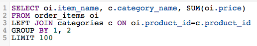

# Choisir un Report Builder

>[!NOTE]
>>Nécessite des [autorisations d’administrateur](../../administrator/user-management/user-management.md).

Maintenant que vous disposez d’un plus grand nombre d’options pour créer des analyses, il peut parfois être difficile de déterminer exactement la version du Report Builder qui correspond à vos besoins. Cette rubrique vous guide tout au long du choix de la meilleure manière de créer votre analyse.

## Quand dois-je utiliser le [!DNL SQL Report Builder] ? {#whensql}

Examinez quelques-unes des raisons les plus courantes pour lesquelles vous utiliseriez le [!DNL SQL Report Builder] au fil du [!DNL traditional Report Builder].

### Si vous souhaitez utiliser des fonctions spécifiques à [!DNL SQL]...

L’intérêt du [!DNL SQL Report Builder] réside en partie dans le fait qu’il permet d’utiliser des fonctions qui ne sont pas disponibles actuellement dans le gestionnaire Data Warehouse. Par le passé, un analyste a peut-être dû intervenir pour vous aider à réaliser pleinement votre vision.

Le [!DNL SQL Report Builder] prend en charge des fonctions telles que [`LISTAGG`](https://docs.aws.amazon.com/redshift/latest/dg/r_LISTAGG.html) et [`GETDATE`](https://docs.aws.amazon.com/redshift/latest/dg/r_GETDATE.html), que vous ne pouviez pas utiliser auparavant. Vous pouvez accéder au [`full list`](https://docs.aws.amazon.com/redshift/latest/dg/c_SQL_functions.html), mais d’autres fonctions spécifiques à SQL incluent :

* [`Bitwise aggregate` fonctions ](https://docs.aws.amazon.com/redshift/latest/dg/c_bitwise_aggregate_functions.html)
* [`CASE expression`](https://docs.aws.amazon.com/redshift/latest/dg/r_CASE_function.html)
* [`JSON_EXTRACT_PATH_TEXT`](https://docs.aws.amazon.com/redshift/latest/dg/JSON_EXTRACT_PATH_TEXT.html)
* [`LOG`](https://docs.aws.amazon.com/redshift/latest/dg/r_LOG.html)
* [`MONTHS_BETWEEN`](https://docs.aws.amazon.com/redshift/latest/dg/r_MONTHS_BETWEEN_function.html)
* [`REPLACE`](https://docs.aws.amazon.com/redshift/latest/dg/r_REPLACE.html)
* [`SQRT`](https://docs.aws.amazon.com/redshift/latest/dg/r_SQRT.html)
* [`concatenation` opérateur ](https://docs.aws.amazon.com/redshift/latest/dg/r_concat_op.html)

### Si vous voulez faire des tests...

Si vous souhaitez essayer différentes techniques et stratégies pour déterminer ce qui fonctionne le mieux pour votre analyse, vous pouvez utiliser l’[!DNL SQL Report Builder] . La création de colonnes dans Data Warehouse Manager prend du temps et les colonnes que vous créez à l’aide de DWM dépendent des cycles de mise à jour.

Au mieux, vous devez attendre un cycle de mise à jour avant de pouvoir utiliser votre colonne. Si vous réalisez que vous avez fait une erreur lors de la création de la colonne, vous devez attendre *deux* cycles : un pour remplir initialement la colonne, et un autre cycle pour que les révisions se propagent.

### Si vous utilisez une nouvelle colonne une seule fois...

Comme indiqué dans la section ci-dessus, la création d’une colonne dans le gestionnaire Data Warehouse prend du temps. Si vous ne prévoyez d&#39;utiliser qu&#39;une colonne que vous créez dans un seul rapport, Adobe vous suggère d&#39;utiliser le [!DNL SQL Report Builder] . Vous n’avez ainsi plus à attendre qu’un cycle de mise à jour soit terminé, ce qui vous permet de retourner au travail plus rapidement.

### Si vous utilisez des données qui ont une relation un-à-plusieurs...

Parfois, la structure de vos données peut faire du [!DNL SQL Report Builder] un choix plus efficace et plus logique pour créer votre analyse. La création de colonnes pour les relations de type « un à un » est simple dans Data Warehouse Manager, mais les choses peuvent devenir un peu confuses lorsque vous avez affaire à des relations de type « un à plusieurs ».

Supposons qu’un seul produit soit considéré comme faisant partie de plusieurs catégories de produits et que vous souhaitiez afficher le chiffre d’affaires associé à chaque catégorie de chaque produit. Tenter de créer cette relation à l’aide de la gestion des ressources numériques peut s’avérer fastidieux et difficile, mais l’écriture d’une requête [!DNL SQL] peut s’avérer un peu plus simple :

## Quand dois-je utiliser le Report Builder traditionnel ? {#whentraditionalrb}

Bien que le [!DNL SQL Report Builder] vous donne plus de contrôle et d’accès à des fonctionnalités auparavant indisponibles, il peut ne pas toujours s’agir du bon choix. Adobe vous invite également à tenir compte des points suivants au moment de choisir le type de Report Builder à utiliser.

### Si vous créez un rapport simple...

Si ce que vous souhaitez créer est simple, l’utilisation du Report Builder traditionnel peut être beaucoup plus rapide que l’écriture d’une requête [!DNL SQL] complète. Cela s’avère utile si des colonnes dont vous avez besoin pour créer l’analyse se trouvent déjà dans le gestionnaire Data Warehouse.

### Si vous partagez votre travail avec d&#39;autres utilisateurs...

Les utilisateurs de votre entreprise utilisent-ils/visualisent-ils cette analyse ? Selon la personne avec laquelle vous partagez votre travail, il peut être parfois préférable de respecter le Report Builder visuel. Les utilisateurs et utilisatrices peuvent rapidement consulter la définition dans le [!DNL Visual Report Builder] plutôt que de lire une requête [!DNL SQL] potentiellement longue.

Si certaines personnes ont besoin du rapport mais ne le connaissent pas, Adobe suggère d[!DNL SQL]utiliser la version originale de Report Builder. Cela leur facilite la tâche.

## Conclusion {#wrapup}

Les [!DNL SQL Report Builder] et les [!DNL Visual Report Builder] conviennent à un large éventail de cas d’utilisation. Cela dépend généralement de vos besoins d’analyse et des personnes qui consomment l’analyse.
