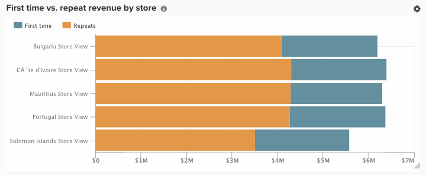

# Options de visualisation

La sélection de la visualisation appropriée pour un jeu de données donné est un élément essentiel du processus analytique. Chaque ensemble de données a une histoire à raconter, mais l’effet de cette histoire est accentué par son impact visuel et sa lisibilité.

Le [!DNL Commerce Intelligence] [!DNL Visual Report Builder] propose 12 options de visualisation distinctes, chacune ayant ses propres avantages et cas d’utilisation. Cette rubrique présente les différentes options de visualisation disponibles dans [!DNL Commerce Intelligence], y compris les configurations de rapport requises, le cas échéant, et un exemple de cas d’utilisation. Les visualisations suivantes sont disponibles dans [!DNL Commerce Intelligence] :

* `Scalar`
* `Table`
* `Line`
* `Bar`
* `Stacked Bar`
* `Column`
* `Stacked Column`
* `Pie`
* `Area`
* `Funnel`
* `Scatter plot`
* `Bubble`
* `Heatmap`

## `Scalar`

`Scalar` rapports s’affichent sous la forme d’une valeur numérique unique. Le plus souvent, il est utilisé pour afficher la valeur « en tout temps » d’une mesure clé telle que le chiffre d’affaires ou les commandes, ou pour comparer le chiffre d’affaires à ce jour par rapport au budget avec deux rapports scalaires distincts. Dans l’exemple ci-dessous, il s’agit simplement du nombre total de commandes pour l’intervalle de création de rapports donné :

Pour enregistrer un rapport sous forme de scalaire, configurez vos filtres et paramètres temporels, puis cliquez sur **[!UICONTROL Save]** ou **[!UICONTROL Update]** dans la section supérieure droite du rapport. Dans la liste déroulante `Type` , choisissez le nom Nombre : mesure pour enregistrer le rapport en tant que valeur affichée dans la barre latérale gauche.

**Conditions requises** :

* `Time interval` : `None`
* `Group by` : `None`
* Une seule mesure

## `Table`

Comme leur nom l’indique, les rapports `table` sont parfaits pour afficher des détails tabulaires. Lorsqu’il est nécessaire d’afficher de nombreux groupes par valeurs ou mesures dans un seul rapport, un tableau est souvent la meilleure solution. À titre d’exemple, vous trouverez ci-dessous un tableau des « Détails du client », présentant les commandes et les recettes regroupées par e-mail client :

Tout comme pour les rapports scalaires, vous pouvez enregistrer un rapport sous la forme d’un tableau en cliquant sur **[!UICONTROL Save]** ou **[!UICONTROL Update]** dans le Report Builder, puis en sélectionnant l’option Tableau dans la liste déroulante `Type`.

**Conditions requises:**

* Bien qu’il n’existe aucune exigence de configuration des rapports, il est important de noter que les tableaux sont limités à 3 500 lignes. Si votre jeu de données comprend plus de 3 500 lignes, vous devez soit filtrer les résultats pour réduire la portée, soit exporter les résultats vers `.csv` ou `Excel` pour afficher le jeu de données complet.

## `Line`

Les graphiques `Line` sont le choix idéal pour comparer les performances de cohortes de mesures similaires. Par exemple, en analysant le chiffre d’affaires de deux régions sur la même période ou en comparant la croissance des commandes exécutées d’une année sur l’autre, comme illustré ci-dessous :

Chaque mesure et formule ajoutée au rapport est représentée par sa propre ligne. Lors de la comparaison de mesures avec des unités et des échelles similaires, n’oubliez pas de cocher la case pour que `Multiple Y-Axes` affiche toutes les mesures à la même échelle.

Pour enregistrer un rapport sous la forme d’un graphique en courbes, définissez le `Type` de rapport sur `Chart`, puis sélectionnez la visualisation appropriée dans le Report Builder, comme illustré ci-dessous :

**Conditions requises:**

* Aucune

## `Bar`

Les graphiques `Bar` affichent vos données sous la forme d’une série de barres horizontales. Ils sont particulièrement adaptés pour afficher les performances globales d’un nombre limité de mesures ou pour regrouper les données par valeurs. Par exemple, un graphique à barres peut être utilisé pour comparer les recettes par magasin :

Chaque combinaison de mesures, de regroupements par et d’intervalles de temps distincte s’affiche dans sa propre barre. Si vous disposez de deux mesures avec une `group by`, contenant trois valeurs de `group by` distinctes, votre rapport affiche six barres distinctes.

Pour enregistrer un rapport sous la forme d’un graphique à barres, définissez le `Type` de rapport sur `Chart` et sélectionnez l’option `Bar` comme illustré ci-dessous :

**Conditions requises:**

* Aucune

## `Stacked Bar`

Les graphiques `Stacked bar` sont similaires à leurs frères de graphiques à barres, avec la possibilité supplémentaire d&#39;afficher la répartition proportionnelle de chaque barre. Le plus souvent, les graphiques à barres empilées sont configurés avec deux mesures ou plus et un seul regroupement par, de sorte que chaque barre représente un groupe unique par valeur qui est divisé entre ses constituants de mesure.

Par exemple, l’état ci-dessous comporte deux mesures de chiffre d’affaires identiques, l’une filtrée pour les premières commandes et l’autre pour les commandes répétées. Après avoir effectué un regroupement par magasin, vous pouvez voir la contribution totale au chiffre d’affaires de chaque magasin (représentée par la largeur totale de la barre) et la répartition du chiffre d’affaires de chaque magasin pour la première fois par rapport à la répétition.

Assurez-vous que la case `Multiple Y-Axes` n’est pas cochée lors de la configuration d’un rapport comme ci-dessus.

Pour enregistrer un rapport sous la forme d’un graphique à barres empilées, définissez le `Type` de rapport sur `Chart` et sélectionnez l’option Barres empilées dans Report Builder :

**Conditions requises:**

* Aucune

## `Column`

Les graphiques `Column` représentent chaque point de données sous la forme d’une colonne verticale et sont plus efficaces pour afficher les données de tendance temporelle que les graphiques à barres horizontaux. Chaque mesure unique et chaque groupe par combinaison sont représentés dans leur propre série de barres. Un rapport à colonnes est préférable pour les rapports comportant trois mesures ou moins ou une mesure avec un seul groupe en contenant 1 à 3 valeurs de regroupement.

Dans l’exemple ci-dessous, vous voyez deux mesures de chiffre d’affaires, l’une filtrée pour le premier chiffre d’affaires et l’autre pour le chiffre d’affaires renouvelé, avec une tendance dans le temps par mois :

Les rapports à colonnes peuvent être enregistrés en modifiant la `Type` du rapport sur `Chart` et en sélectionnant l’option de visualisation des colonnes :

**Conditions requises:**

* Aucune

## `Stacked Column`

`Stacked column` rapports sont presque identiques aux graphiques à colonnes, sauf que des colonnes similaires sont empilées les unes sur les autres de sorte que la hauteur totale représente la somme des valeurs. Les colonnes empilées sont à nouveau mieux visualisées avec un nombre limité de mesures ou de groupes.

En utilisant la même configuration de rapport que celle décrite dans la section `Column` ci-dessus, un rapport avec deux mesures de chiffre d’affaires (filtrées pour la première fois et répétées) ressemblerait à ce qui suit avec une visualisation de colonnes empilées :

Là encore, il est important que la case à cocher `Multiple Y-Axes` soit décochée lors de l’affichage de plusieurs mesures avec la visualisation des colonnes empilées.

Pour enregistrer un rapport en tant que colonne empilée, définissez le `Type` de rapport sur `Chart` et sélectionnez l’option `stacked column` :

**Conditions requises:**

* Aucune

## `Pie`

Les graphiques `Pie` conviennent mieux pour afficher une mesure unique avec un ou plusieurs groupes de garçons ou plusieurs mesures sans groupes de garçons. Dans les deux cas, l’intervalle de temps doit être défini sur aucun pour afficher les données dans un graphique en secteurs. Dans l’exemple ci-dessous, une mesure commandes uniques est Regrouper par nom de magasin pour afficher la répartition des commandes par magasin :

Pour enregistrer un rapport sous la forme d’un graphique en secteurs, définissez le `Type` de rapport sur `Chart` et sélectionnez l’option `pie` comme illustré ci-dessous :

**Conditions requises:**

* `Time interval` : `None`
* L’un des éléments suivants :
   * `Single metric with one or more group bys`
   * `Multiple metrics with no group bys`

## `Area`

Les graphiques à `Area` sont presque identiques aux graphiques à colonnes empilées, à la différence que les colonnes sont affichées en continu. Tout comme les colonnes empilées, il est préférable de visualiser les graphiques en aires avec un nombre limité de mesures ou de groupes.

En reprenant le même exemple de la section `stacked column` , le rapport ci-dessous montre le premier chiffre d’affaires par rapport au chiffre d’affaires répété avec la visualisation sous forme de graphique en aires :

Pour enregistrer un rapport en tant que graphique en aires, définissez la `Type` sur `Chart` et sélectionnez l’option Aires :

**Conditions requises:**

* Aucune

## `Funnel`

Les graphiques `Funnel` sont parfaits pour visualiser la conversion sur une séquence d’événements attendue. Vous pouvez par exemple analyser le chiffre d’affaires potentiel de votre entonnoir de ventes, du prospect à la vente conclue, ou mesurer la baisse des clients entre leur première et leur deuxième commande, leur deuxième et leur troisième commande, etc. Un exemple de ce dernier est illustré ci-dessous :

Dans un rapport d’entonnoir, la valeur relative d’une étape donnée de l’entonnoir est reflétée par la hauteur de l’étape. La configuration du rapport détermine l’ordre d’affichage des étapes. Il existe deux manières de configurer un rapport d’entonnoir :

* `Single metric with one group by` : - Ordre des étapes déterminé par le paramètre « Afficher le haut/bas » du groupe par. Par défaut, les étapes de l’entonnoir sont affichées dans l’ordre, de la plus grande à la plus petite valeur, mais vous pouvez également les trier par ordre alphabétique par nom de groupe.

* `Multiple metrics with no group by` : ordre des étapes déterminé par l’ordre dans lequel les mesures sont ajoutées au rapport.

Pour enregistrer un rapport sous la forme d’un graphique en entonnoir, définissez le `Type` de rapport sur `Chart` et sélectionnez la visualisation appropriée dans le Report Builder.

**Conditions requises:**

* `Time interval` : `None`
* L’un des éléments suivants :
   * `Single metric with one group by`
   * `Multiple metrics with no group by`

## `Scatter plot`

Un `scatter plot` est utilisé pour examiner la relation d’une mesure avec deux variables différentes afin que vous puissiez facilement identifier les corrélations et les valeurs aberrantes. Il est préférable d’utiliser ce type de visualisation uniquement avec les dimensions numériques. Essayez avec la mesure Commandes et les dimensions `Customer's lifetime number of coupons` et `Customer's lifetime revenue` pour voir en quoi l’utilisation des coupons est liée au chiffre d’affaires. Vous pouvez choisir entre un graphique de dispersion avec et sans courbe de tendance :

**Conditions requises:**

Option 1 :

* Deux `metrics`
* Un `group by`
* `Time interval` : `None`

Option 2 :

* Deux `metrics`
* Aucune `group by`
* Définir les `time interval`

## graphique `Bubble`

Un graphique `bubble` peut afficher jusqu’à quatre dimensions de données où les axes `X` et `Y` spécifient l’emplacement des bulles. L’axe `Z` correspond à la taille des bulles. En incluant deux groupes par, vous pouvez ajouter de la couleur aux bulles. Ce type de visualisation est particulièrement adapté lorsque vous souhaitez tracer plusieurs dimensions de données dans un seul graphique.

Par exemple, le graphique suivant montre le nombre de clients (taille de la bulle) regroupés par une source d’acquisition spécifique (couleur de la bulle) et par état (différentes bulles dans une couleur spécifique), par rapport au chiffre d’affaires total et aux commandes sur la durée de vie moyenne.

Le graphique suivant montre le nombre de clients (taille de la bulle) regroupés par source d’acquisition (couleur de la bulle) et état (différentes bulles dans une couleur spécifique), par rapport à la valeur de durée de vie moyenne et au chiffre d’affaires total.

**Conditions requises pour le graphique à bulles à série unique :**

Option 1

* Trois `metrics`
* Un `group by`
* `Time interval` : `None`

Option 2

* Trois `metrics`
* Aucune `group by`
* Définir les `time interval`

**Conditions requises pour le graphique à bulles multiséries :**

* Trois `metrics`
* Deux `group by`
* `Time interval` : `None`

## `Heatmap`

Utilisez `heatmaps` pour visualiser les zones réactives dans vos données. Par exemple, une carte thermique peut indiquer où vous obtenez régulièrement un volume plus élevé. La visualisation de ces données peut vous aider à ajuster vos niveaux d’inventaire pour vous assurer de répondre à la demande pendant ces périodes de pointe.

La carte thermique suivante affiche les commandes par jour de la semaine et par heure de la journée, sur plusieurs semaines.

<!--{: width="650"}-->

**Conditions requises:**

Option 1

* Un `metric`
* Deux `group by`
* `Time interval` : `None`

Option 2

* Un `metric`
* Un `group by`
* Définir les `time interval`
