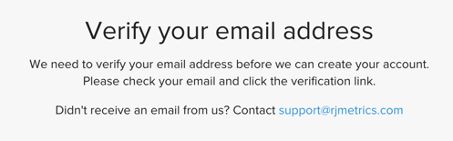
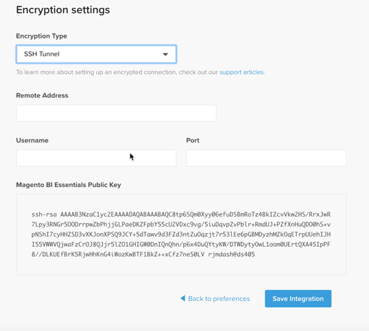

# Activez votre [!DNL MBI] Compte pour `Cloud Starter` Abonnements

Pour activer [!DNL MBI] pour `Cloud Starter` projets, créez d’abord une [!DNL MBI] , puis créez une `SSH` puis enfin connectez-vous à votre base de données Commerce. Voir [activation des abonnements on-premise](../getting-started/onpremise-activation.md).

>[!NOTE]
>
>Pour obtenir de l’aide sur l’activation [!DNL MBI] pour `Cloud Pro` pour les projets, contactez votre équipe de compte d’Adobe ou votre conseiller technique client.

1. Créez votre [!DNL MBI] Compte.

   - Accédez à [Connexion au compte Adobe Commerce](https://account.magento.com/customer/account/login)

   - Accédez à **[!UICONTROL My Account** > **My [!DNL MBI] Instances]**.

   - Cliquez sur **[!UICONTROL Create Instance]**. Si vous ne voyez pas ce bouton, contactez votre équipe de compte d’Adobe ou votre conseiller technique du client.

   - Sélectionnez votre `Cloud Starter` abonnement. Si vous avez uniquement une `cloud starter` abonnements, il s’agit de la sélection par défaut.

   - Cliquez sur **[!UICONTROL Continue]**.

   - Saisissez vos informations pour créer votre compte.

   

   - Accédez à votre boîte de réception et vérifiez votre adresse électronique.

   

   - Créez votre mot de passe.

   

   - Après avoir créé votre compte, vous pouvez ajouter des utilisateurs à votre nouveau compte. Vous pouvez désormais ajouter des administrateurs techniques pour réaliser les étapes suivantes.

   

1. Informations d’entrée sur votre magasin pour définir vos préférences.

   

   Rassemblez quelques informations avant de pouvoir connecter votre base de données pour la troisième étape du flux d’intégration. Vous pouvez effectuer les opérations suivantes : `Connect your database` dans l’étape 9.

1. Créer un [!DNL MBI] Utilisateur.

   - Créez un utilisateur dans votre [Compte Adobe Commerce](https://account.magento.com/customer/account/login).

   - _Pourquoi un nouvel utilisateur ?_ [!DNL MBI] nécessite qu’un utilisateur soit ajouté au projet pour récupérer en permanence de nouvelles données à transférer au [!DNL MBI] Data Warehouse. Cet utilisateur sert de connexion. L’ajout de cet utilisateur au projet est présenté à l’étape 4.

   - La raison d&#39;avoir un dédié [!DNL MBI] L’utilisateur doit empêcher l’utilisateur ajouté d’être désactivé ou supprimé par inadvertance et arrêter la fonction [!DNL MBI] connexion.

1. Ajoutez l’utilisateur nouvellement créé à l’environnement Principal du projet en tant que `Contributor`.

   

1. Obtenez votre [!DNL MBI] `SSH` clés.

   - Accédez au `Connect your database` de la [!DNL MBI] Configuration de l’interface utilisateur et faites défiler l’écran jusqu’à `Encryption settings`.

   - Pour le `Encryption Type` champ, choisissez `SSH Tunnel`.

   - Dans la liste déroulante, vous pouvez copier et coller le [!DNL MBI] `Public Key`.

   

1. Ajoutez la nouvelle [!DNL MBI] `Public key` au [!DNL MBI] utilisateur créé à l’étape 5.

   - Accédez à [votre compte Adobe Commerce cloud](https://account.magento.com/cloud/customer/login/). Connectez-vous avec les informations de connexion de votre compte pour le nouveau [!DNL MBI] utilisateur créé. Ensuite, accédez au `Account Settings` .

   - Faites défiler la page vers le bas et développez la liste déroulante pour `SSH` clés. Cliquez ensuite sur **[!UICONTROL Add a public key]**.

   

   - Ajoutez la variable [!DNL MBI] `SSH Public Key` du haut.

   

1. Fournir [!DNL MBI] Informations d’identification MySQL.

   - Mettez à jour votre `.magento/services.yaml`

   ```sql
   mysql:
       type: mysql:10.0
       disk: 2048
       configuration:
           schemas:
               - main
           endpoints:
               mysql:
                   default_schema: main
                   privileges:
                       main: admin
               mbi:
                   default_schema: main
                   privileges:
                       main: ro
   ```

   - Mettez à jour votre `.magento.app.yaml`

   ```sql
           relationships:
               database: "mysql:mysql"
               mbi: "mysql:mbi"
               redis: "redis:redis"
   ```

1. Obtenir des informations sur la connexion de votre base de données à [!DNL MBI].

   Exécuter
   `echo $MAGENTO_CLOUD_RELATIONSHIPS | base64 --decode | json_pp`

   pour obtenir des informations sur la connexion à votre base de données.

   Vous devriez recevoir des informations similaires à la sortie ci-dessous :

   ```json
           "mbi" : [
                 {
                    "scheme" : "mysql",
                    "rel" : "mbi",
                    "cluster" : "vfbfui4vmfez6-master-7rqtwti",
                    "query" : {
                       "is_master" : true
                    },
                    "ip" : "169.254.169.143",
                    "path" : "main",
                    "host" : "[!DNL MBI].internal",
                    "hostname" : "3m7xizydbomhnulyglx2ku4wpq.mysql.service._.magentosite.cloud",
                    "username" : "mbi",
                    "service" : "mysql",
                    "port" : 3306,
                    "password" : "[password]"
                 }
              ],
   ```

1. Connexion à votre base de données Commerce

   

   - `Integration Name`: [Choisissez un nom pour votre intégration.]

   - `Host`: `[!DNL MBI].internal`

   - `Port`: `3306`

   - `Username`: `mbi`

   - `Password`: [mot de passe d’entrée fourni dans la sortie pour l’étape 8.]

   - `Database Name`: `main`

   - `Table Prefixes`: [laisser vide s’il n’y a aucun préfixe de tableau]

1. Définissez les paramètres de fuseau horaire.

   

   - `Database`: `Timezone: UTC`

   - `Desired Timezone`: [Sélectionnez le fuseau horaire pour lequel vous souhaitez que vos données s’affichent.]

1. Obtenez des informations sur vos paramètres de chiffrement.

   - L’interface utilisateur du projet fournit une `SSH` Chaîne d’accès. Cette chaîne peut être utilisée pour collecter les informations nécessaires pour `Remote Address` et `Username` lors de la configuration de `Encryption` paramètres. Utilisez la variable `SSH Access` chaîne trouvée en cliquant sur le bouton d’accès au site sur votre branche Principal de l’interface utilisateur du projet et en recherchant votre `User Name` et `Remote Address` comme illustré ci-dessous.

   

   

1. Informations d’entrée pour votre `Encryption` paramètres

   

   **Entrées**

   - `Encryption Type`: `SSH Tunnel`

   - `Remote Address`: `ssh.us-3.magento.cloud`

   - `Username`: `vfbfui4vmfez6-master-7rqtwti--mymagento`

   - `Port`: `22`

1. Cliquez sur **[!UICONTROL Save Integration]**.

1. Vous êtes maintenant connecté à votre [!DNL MBI] compte .

1. Une fois que vous êtes connecté [!DNL MBI] dans votre base de données Commerce, contactez votre équipe de compte d’Adobe pour coordonner les étapes suivantes, telles que la configuration des intégrations et d’autres étapes de configuration.

1. Une fois la configuration terminée, vous pouvez [connexion](../getting-started/sign-in.md) à [!DNL MBI] compte .
